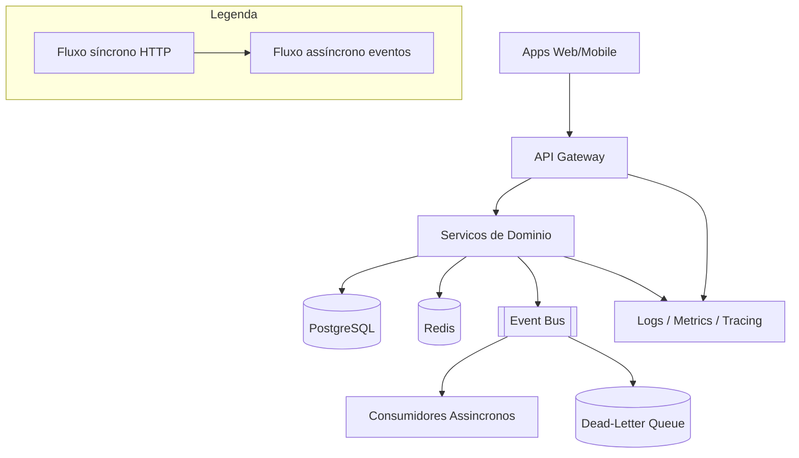

# System Design - Plataforma Transversal

> **Status:** Em progresso  
> **Fase:** 0  
> **Jornada:** Transversal  
> **Epico:** [RNF §2](../../epic-ifood-clone.md#2-requisitos-não-funcionais-rnf)  
> **Dependencias:** nenhuma (define padroes para todos os dominios)

## 1. Objetivo

Definir os padroes compartilhados da plataforma: API Gateway, mensageria (EDA), observabilidade, deploy e politicas de seguranca que todos os servicos seguem.

## 2. Escopo Funcional

### 2.1 MVP

- [ ] API Gateway com roteamento por dominio e validacao JWT local
- [ ] Event Bus (RabbitMQ) com schema versionado
- [ ] Dead-letter queue e politica de retry
- [ ] Correlation-id ponta a ponta
- [ ] Health checks e metricas basicas por servico
- [ ] RBAC base: `customer`, `restaurant_owner`, `courier`, `admin`

### 2.2 Pos-MVP

- [ ] Service mesh / mTLS entre servicos
- [ ] Feature flags centralizados
- [ ] Auto-scaling por metrica customizada
- [ ] Multi-region active-passive

## 3. Requisitos Nao Funcionais

- Disponibilidade alvo global: **99.99%** (Four Nines)
- Latencia de gateway: **< 20ms** overhead p95
- Busca/listagem (delegada ao dominio): **< 200ms** p95
- Mensageria: at-least-once com consumidores idempotentes

## 4. Contexto de Negocio

Sem padroes transversais, cada jornada reinventa autenticacao, eventos e monitoramento — aumentando custo de operacao e risco em picos (sexta a noite).

## 5. Arquitetura de Alto Nivel



Diagrama detalhado: [`./architecture.mermaid`](./architecture.mermaid)

## 6. Componentes

### 6.1 API Gateway

- [ ] Roteamento `/v1/{dominio}/...`
- [ ] Rate limit por IP, deviceId, userId
- [ ] Validacao JWT por chave publica (sem round-trip ao Auth)

#### 6.1.1 Matriz de decisoes do Gateway

| Criterio | Kong | AWS API Gateway | Custom (Node.js) |
|----------|------|-----------------|-------------------|
| Complexidade operacional | Media | Baixa (gerenciado) | Alta |
| Customizacao de middleware | Plugin ecosystem | Limitada | Total |
| Custo em alta escala | Fixo (infra propria) | Por request | Fixo (infra propria) |
| Performance (overhead p95) | ~5-10ms | ~10-20ms | ~2-5ms |
| Integracao com EDA | Plugin + declarativo | Service integration | Codigo manual |
| Observabilidade nativa | Prometheus + statsd | CloudWatch | Custom |

**Decisao MVP:** Kong (open-source) — equilibrio entre feature set, autonomia de configuracao e custo operacional previsivel. Migracao para AWS API Gateway avaliada quando o custo de operar Kong superar o custo de requests gerenciados.

### 6.2 Event Bus

- [ ] Envelope padrao: `eventId`, `eventType`, `schemaVersion`, `correlationId`
- [ ] Topicos por agregado: `user.*`, `order.*`, `delivery.*`

#### 6.2.1 Matriz de decisoes do Event Bus

| Criterio | RabbitMQ (MVP) | Kafka (escala) |
|----------|----------------|-----------------|
| Modelo | Exchange/Queue | Log particionado |
| Retencao de mensagens | Ate consumo + TTL | Configuravel (dias/semanas) |
| Replay de eventos | Nao suportado nativamente | Suportado por offset |
| Throughput | ~50k msg/s (1 node) | ~1M msg/s (cluster) |
| Complexidade operacional | Baixa-Media | Alta |
| Ordem de mensagens | Por exchange/queue bound | Por particao |
| Ecossistema cloud | RabbitMQ em container | MSK / Confluent / Upstash |

**Decisao MVP:** RabbitMQ — simplicidade operacional, baixa latencia, suficiente para o volume inicial de 2k RPS. Migracao para Kafka planejada quando o volume de eventos exigir retencao longa para replay e/ou throughput > 100k msg/s.

### 6.3 Observabilidade

- [ ] Logs estruturados JSON
- [ ] Tracing OpenTelemetry
- [ ] Alertas: 5xx, fila atrasada, latencia p95

## 7. Modelo de Dados

N/A — dominio de infraestrutura. Documentar apenas configuracoes e contratos de evento globais.

### 7.1 Tabelas de configuracao (compartilhadas)

#### 7.1.1 `service_registry`

| Coluna | Tipo | Notas |
|--------|------|-------|
| id | UUID | PK |
| service_name | VARCHAR(64) | unique, `auth-service`, `user-service` |
| base_url | VARCHAR(256) | URL interna do servico |
| health_endpoint | VARCHAR(128) | `/health` |
| health_status | VARCHAR(16) | `healthy`, `degraded`, `unhealthy` |
| last_health_check | TIMESTAMP | |
| schema_version | VARCHAR(16) | versao do contrato de API |
| created_at | TIMESTAMP | |
| updated_at | TIMESTAMP | |

#### 7.1.2 `rate_limit_rules`

| Coluna | Tipo | Notas |
|--------|------|-------|
| id | UUID | PK |
| route_pattern | VARCHAR(256) | `/v1/auth/login` suporta glob |
| limit_per_second | INT | |
| limit_per_minute | INT | |
| limit_per_hour | INT | |
| scope | VARCHAR(32) | `ip`, `user_id`, `device_id` |
| created_at | TIMESTAMP | |
| updated_at | TIMESTAMP | |

#### 7.1.3 `dead_letter_log`

| Coluna | Tipo | Notas |
|--------|------|-------|
| id | UUID | PK |
| event_id | UUID | FK para mensagem original |
| event_type | VARCHAR(64) | |
| source_service | VARCHAR(64) | |
| error_message | TEXT | |
| error_code | VARCHAR(32) | |
| retry_count | INT | |
| payload | JSONB | payload original do evento |
| failed_at | TIMESTAMP | |
| reprocessed_at | TIMESTAMP | null |
| status | VARCHAR(16) | `pending`, `reprocessed`, `dead` |

## 8. Fluxos Principais

### 8.1 Publicacao de evento com falha

1. Servico publica evento no Event Bus.
2. Consumidor tenta processar e falha.
3. Retry com backoff exponencial: `1s, 2s, 4s, 8s, 16s` (max 5 tentativas).
4. Apos esgotar retries, mensagem vai para DLQ.
5. Job de reprocessamento (cron schedule) tenta reprocessar a cada 30min.
6. Apos 3 reprocessamentos sem sucesso, status muda para `dead` e alerta operacional e disparado.
7. Operador pode inspecionar a DLQ via painel admin e reprocessar manualmente apos correcao.

### 8.2 Request completo com tracing

1. Cliente envia request para API Gateway.
2. Gateway gera `correlationId` (se ausente) e injeta no header `X-Correlation-Id`.
3. Gateway valida JWT localmente com cache de chave publica.
4. Gateway encaminha request ao servico de dominio, propagando `correlationId` e `spanId` (OpenTelemetry).
5. Servico processa, registra log estruturado com `correlationId` e `userId`.
6. Se necessario, publica evento no Event Bus com mesmo `correlationId`.
7. Resposta volta ao Gateway com header `X-Correlation-Id` e `X-Response-Time-Ms`.

### 8.3 Rate limiting em rota sensivel

1. Gateway recebe request para `/v1/auth/login`.
2. Gateway consulta regras de rate limit da rota.
3. Incrementa contador no Redis para a chave `rate_limit:{scope}:{key}:{window}`.
4. Se contador > limite, retorna `429 Too Many Requests` com header `Retry-After`.
5. Se dentro do limite, encaminha ao servico.
6. Resposta inclui headers: `X-RateLimit-Limit`, `X-RateLimit-Remaining`, `X-RateLimit-Reset`.

## 9. Contratos de API

### 9.1 Padrao de erro global

Toda resposta de erro deve seguir o schema:

```json
{
  "error": {
    "code": "VALIDATION_ERROR",
    "message": "Descricao legivel do erro",
    "details": [
      { "field": "email", "reason": "formato invalido" }
    ],
    "correlationId": "a8f4d9d1-6ce0-4c2b-9f2a-1d5d0e6f7f11",
    "timestamp": "2026-07-04T14:30:00Z"
  }
}
```

#### 9.1.1 Codigos de erro padrao

| Codigo | HTTP Status | Descricao |
|--------|-------------|-----------|
| `VALIDATION_ERROR` | 422 | Erro de validacao de entrada |
| `UNAUTHORIZED` | 401 | Token ausente, invalido ou expirado |
| `FORBIDDEN` | 403 | Sem permissao para o recurso |
| `NOT_FOUND` | 404 | Recurso nao encontrado |
| `CONFLICT` | 409 | Conflito de estado (ex: email ja existe) |
| `RATE_LIMITED` | 429 | Muitas requisicoes |
| `IDEMPOTENCY_REUSE` | 422 | Chave de idempotencia ja usada com body diferente |
| `DEPENDENCY_FAILURE` | 502 | Falha em servico interno |
| `TIMEOUT` | 504 | Tempo limite excedido |
| `INTERNAL_ERROR` | 500 | Erro interno nao categorizado |

### 9.2 Health check

```
GET /health
```

Resposta:
```json
{
  "status": "healthy",
  "service": "api-gateway",
  "version": "1.0.0",
  "checks": {
    "postgres": "healthy",
    "redis": "healthy",
    "event_bus": "degraded",
    "latency_p95_ms": 15
  },
  "uptime_seconds": 3600,
  "timestamp": "2026-07-04T14:30:00Z"
}
```

### 9.3 Ready check

```
GET /ready
```

Retorna 200 quando o servico esta pronto para receber trafego (dependencias resolvidas). Retorna 503 durante inicializacao.

### 9.4 Versionamento

- Prefixo `/v1` em todas as rotas de dominio.
- Breaking changes requerem nova versao (`/v2`).
- Versoes anteriores mantidas por no minimo 6 meses apos anuncio de deprecacao.
- Header `Sunset: <data>` em respostas de versoes depreciadas.

## 10. Contratos de Eventos

> **Nota:** Este documento e a fonte oficial (single source of truth) para o envelope de eventos. Todos os demais system designs devem referenciar esta secao em vez de redefinir o schema.

### 10.1 Envelope padrao

Todo evento publicado no Event Bus deve seguir este schema:

```json
{
  "eventId": "b1d6f3a5-3b92-4b84-bf3c-5d87f6a2f0d8",
  "eventType": "user.created",
  "schemaVersion": "1.0",
  "source": "auth-service",
  "occurredAt": "2026-07-04T14:30:00.000Z",
  "correlationId": "a8f4d9d1-6ce0-4c2b-9f2a-1d5d0e6f7f11",
  "idempotencyKey": "req_abc123",
  "payload": {}
}
```

#### 10.1.1 Campos do envelope

| Campo | Tipo | Obrigatorio | Descricao |
|-------|------|-------------|-----------|
| `eventId` | UUID | Sim | Identificador unico do evento (gerado pelo produtor) |
| `eventType` | String | Sim | Nome do evento no formato `dominio.acao` |
| `schemaVersion` | String | Sim | Versao do schema do payload. `1.0`, `1.1`, `2.0` |
| `source` | String | Sim | Nome do servico produtor (`auth-service`) |
| `occurredAt` | ISO 8601 | Sim | Timestamp de quando o evento ocorreu |
| `correlationId` | UUID | Sim | Id de correlacao ponta a ponta |
| `idempotencyKey` | String | Nao | Chave de idempotencia do request original (se aplicavel) |
| `payload` | Object | Sim | Dados especificos do evento |

### 10.2 Politica de versionamento de schema

- **Major version** (`1.x -> 2.0`): mudanca que quebra consumidores existentes (remocao de campo obrigatorio, mudanca de tipo).
  - Novo topico separado: `user.created.v2`
  - Consumidores migram em janela de 30 dias.
- **Minor version** (`1.0 -> 1.1`): adicao de campo opcional ao final do payload.
  - Mesmo topico, consumidores devem ignorar campos desconhecidos.
- Consumidores devem declarar `schemaVersion` minima que suportam no startup.
- DLQ registra eventos com schema incompativel para auditoria.

### 10.3 Topic naming

```
{dominio}.{entidade}.{acao}[.{version}]
```

Exemplos:
- `user.created`
- `order.status.changed`
- `delivery.location.updated.v2`

Topicos sao configurados como `topic` no RabbitMQ (exchange `topic`), permitindo que consumidores filtrem por padrao (ex: `user.*`).

### 10.4 Exemplos de eventos

#### 10.4.1 `user.created`

```json
{
  "eventId": "b1d6f3a5-3b92-4b84-bf3c-5d87f6a2f0d8",
  "eventType": "user.created",
  "schemaVersion": "1.0",
  "source": "auth-service",
  "occurredAt": "2026-07-04T14:30:00.000Z",
  "correlationId": "a8f4d9d1-6ce0-4c2b-9f2a-1d5d0e6f7f11",
  "idempotencyKey": "req_abc123",
  "payload": {
    "userId": "e5f3ef90-6f3a-4f5a-b7f3-7c8c4cd3f9aa",
    "email": "ana.souza@example.com",
    "fullName": "Ana Souza",
    "status": "pending_verification"
  }
}
```

#### 10.4.2 `order.status.changed`

```json
{
  "eventId": "c3d4e5f6-7a8b-9c0d-1e2f-3a4b5c6d7e8f",
  "eventType": "order.status.changed",
  "schemaVersion": "1.0",
  "source": "order-service",
  "occurredAt": "2026-07-04T14:35:00.000Z",
  "correlationId": "b2c3d4e5-f6a7-8b9c-0d1e-2f3a4b5c6d7e",
  "payload": {
    "orderId": "f7a8b9c0-d1e2-3f4a-5b6c-7d8e9f0a1b2c",
    "previousStatus": "pending_payment",
    "newStatus": "paid",
    "updatedAt": "2026-07-04T14:35:00.000Z"
  }
}
```

## 11. Seguranca

### 11.1 TLS e criptografia em transito

- TLS 1.3 obrigatorio entre todos os servicos (fim a fim).
- Certificados gerenciados por KMS / cert-manager com rotacao automatica a cada 90 dias.
- mTLS entre servicos (pos-MVP) — service mesh com Istio ou Linkerd.

### 11.2 Criptografia em repouso

- Dados sensiveis (PII, tokens, documentos) criptografados em nivel de aplicacao antes de persistir.
- Chaves gerenciadas por KMS (AWS KMS / GCP Cloud KMS / HashiCorp Vault).
- Rotacao de chaves: a cada 12 meses ou imediatamente em caso de comprometimento.
- Backups do banco criptografados com chave separada.

### 11.3 RBAC (Controlo de Acesso Baseado em Papéis)

| Role | Descricao | Permissoes tipicas |
|------|-----------|---------------------|
| `customer` | Cliente da plataforma | Proprio perfil, enderecos, pedidos, avaliacoes |
| `restaurant_owner` | Dono de restaurante | Cardapio proprio, pedidos recebidos, financeiro |
| `courier` | Entregador | Corridas atribuidas, rotas, confirmacao |
| `admin` | Operador da plataforma | Moderacao, cupons, dashboard global |

- Roles atribuidas por evento de dominio (`onboarding.approved`, `admin.granted`).
- Politica de menor privilegio: cada servico valida a role no JWT antes de autorizar.
- Admin requer MFA obrigatorio (TOTP via app autenticador).

### 11.4 Secrets management

- Secrets nunca em codigo fonte ou variaveis de ambiente do CI.
- HashiCorp Vault (MVP) ou AWS Secrets Manager.
- Rotacao automatica de secrets de banco a cada 90 dias.
- Auditoria de acesso a secrets.

### 11.5 Protecoes no Gateway

- Rate limit por rota sensivel (login: 10/min, register: 5/min, forgot-password: 3/min).
- Bloqueio progressivo de IP apos N violacoes de rate limit.
- Blacklist de IPs maliciosos em Redis com TTL de 24h.
- Headers de seguranca obrigatorios: `Strict-Transport-Security`, `X-Content-Type-Options`, `X-Frame-Options`.

### 11.6 Politica de menor privilegio entre servicos

- Cada servico possui uma identity separada (service account / JWT interno).
- Servicos so podem acessar os topicos do Event Bus e endpoints HTTP estritamente necessarios.
- Database: cada servico tem credencial propria com grants especificos (SELECT/INSERT/UPDATE por tabela).

## 12. Escalabilidade

### 12.1 Servicos stateless

- Todos os servicos de dominio sao stateless (sessao externalizada no Redis).
- Horizontal Pod Autoscaling (HPA) baseado em CPU e metricas customizadas (RPS por rota).
- Deploy em Kubernetes (EKS / GKE) com auto-scaling de nodes.

### 12.2 Particionamento do Event Bus

- Topic `user.*`: 1 exchange com 3 filas de consumo (Notification, Analytics, Search).
- Topic `order.*`: 1 exchange com 4 filas (Restaurant, Payment, Matching, Finance).
- Topic `delivery.*`: 1 exchange com 2 filas (Tracking, Rating).
- Para Kafka (pos-MVP): particoes por `userId` hash para garantir ordenacao por usuario.

### 12.3 Cache e indices

| Recurso | Estrategia | TTL |
|---------|------------|-----|
| Chave publica JWT | Cache local no Gateway | 1h |
| Regras de rate limit | Redis contadores com TTL da janela | 1min / 1h |
| Revogacao de token | Redis blacklist | TTL do access token |
| OTP | Redis | 5min |
| Cardapio ativo | Redis por `restaurant_id` | 5min ou invalidacao por evento |
| Consultas de busca | Redis (hot queries) | 2min |
| Geolocalizacao | Redis geohash grid | 1min |

### 12.4 Database

- PostgreSQL unico inicial com separacao logica por schema (`auth`, `user`, `order`, `delivery`).
- Read replica configurada desde o inicio para leituras de perfil e relatorios.
- Indices planejados por dominio (documentados em cada system design).
- Migracoes versionadas com rollback script.

### 12.5 Estimativa de capacidade inicial

| Recurso | Estimativa | Folga |
|---------|------------|-------|
| Usuarios | 1M | 3x (3M) |
| Pico RPS | 2k | 2x (4k) |
| Armazenamento PostgreSQL | 50GB | 2x (100GB) |
| Armazenamento Redis | 10GB | 2x (20GB) |
| Throughput Event Bus | 5k msg/s | 2x (10k msg/s) |

## 13. Observabilidade

### 13.1 Logs estruturados

Formato JSON obrigatorio em todos os servicos:

```json
{
  "timestamp": "2026-07-04T14:30:00.000Z",
  "level": "INFO",
  "service": "auth-service",
  "correlationId": "a8f4d9d1-6ce0-4c2b-9f2a-1d5d0e6f7f11",
  "userId": "e5f3ef90-6f3a-4f5a-b7f3-7c8c4cd3f9aa",
  "route": "POST /v1/auth/login",
  "method": "POST",
  "statusCode": 200,
  "latencyMs": 45,
  "message": "Login bem-sucedido",
  "metadata": {
    "attempt": 1,
    "deviceId": "device_abc"
  }
}
```

Campos obrigatorios em todo log: `timestamp`, `level`, `service`, `correlationId`, `message`.

### 13.2 Metricas

| Metrica | Tipo | Descricao | Dominio |
|---------|------|-----------|---------|
| `http_requests_total` | Counter | Total de requests por rota, metodo, status | Gateway |
| `http_request_duration_ms` | Histogram | Latencia p50/p95/p99 por rota | Gateway |
| `gateway_rate_limit_hits` | Counter | Requests bloqueados por rate limit | Gateway |
| `jwt_validation_duration_ms` | Histogram | Tempo de validacao JWT local | Gateway |
| `event_published_total` | Counter | Eventos publicados por tipo | Event Bus |
| `event_consumed_total` | Counter | Eventos consumidos por servico | Event Bus |
| `event_processing_duration_ms` | Histogram | Tempo de processamento por tipo de evento | Consumidores |
| `dlq_messages_total` | Counter | Mensagens enviadas para DLQ por origem | DLQ |
| `db_query_duration_ms` | Histogram | Latencia de queries por servico | Todos |
| `db_connections_active` | Gauge | Conexoes ativas no pool | Todos |
| `redis_hit_ratio` | Gauge | Taxa de acerto do cache | Todos |
| `service_health_status` | Gauge | 1 = healthy, 0 = unhealthy | Todos |

### 13.3 Tracing distribuido

- OpenTelemetry como padrao unico de instrumentacao.
- Propagacao de contexto via headers HTTP (W3C Trace Context).
- Exportadores: Jaeger (MVP) ou AWS X-Ray / GCP Cloud Trace.
- Amostragem: 100% para rotas criticas (login, register, checkout), 10% para as demais.
- Spans obrigatorios: `gateway.validate`, `service.handle`, `db.query`, `event.publish`, `event.consume`.

### 13.4 Dashboard unico (Grafana MVP)

Painel global com:

- **RPS por servico e rota** — grafico de series temporais
- **Latencia p50/p95/p99** — por endpoint
- **Taxa de erro (5xx, 4xx)** — porcentagem sobre total
- **Top 5 slow queries** — por servico
- **Lag do Event Bus** — mensagens nao processadas por fila
- **DLQ count** — total de mensagens na dead letter por origem
- **Health status** — todos os servicos em unico painel
- **Rate limit hits** — rotas mais impactadas

### 13.5 Alertas

| Alerta | Condicao | Severidade | Acao |
|--------|----------|------------|------|
| Alta taxa de 5xx | > 1% em 5min | P1 | Notificar equipe plantao |
| Latencia p95 acima do limite | > 200ms em 5min | P2 | Investigar query ou servico |
| DLQ acumulando | > 500 mensagens em 5min | P1 | Reprocessar ou corrigir consumidor |
| Servico unhealthy | Health check falha por 2min | P1 | Notificar equipe plantao |
| Rate limit elevado em login | > 100 bloqueios/min | P3 | Verificar possivel ataque |
| Fila do Event Bus atrasada | > 1000 mensagens acumuladas | P2 | Escalar consumidores |
| Certificado TLS expirando | < 7 dias | P2 | Renovar certificado |
| Conexoes de banco esgotando | > 80% do pool | P2 | Aumentar pool ou escalar |

## 14. Resiliencia

### 14.1 Timeouts

| Tipo de chamada | Timeout | Justificativa |
|-----------------|---------|---------------|
| Request HTTP sincrono (gateway → servico) | 5s | Tolerar degradacao moderada |
| Request HTTP sincrono (servico → servico) | 3s | Chamadas internas devem ser rapidas |
| Query PostgreSQL | 2s | Com indices, maioria < 50ms |
| Operacao Redis | 500ms | Operacao em memoria |
| Chamada a provider externo (email/SMS/geocoding) | 10s | Rede externa imprevisivel |
| Processamento de evento no consumidor | 30s | Mensagem complexa pode exigir I/O |

### 14.2 Retries com jitter

| Cenario | Tentativas | Intervalo | Jitter |
|---------|------------|-----------|--------|
| Falha em consumidor de evento | 5 | 1s, 2s, 4s, 8s, 16s | +/- 25% |
| Timeout em provider externo | 3 | 500ms, 1s, 2s | +/- 50ms |
| Conflito de concorrencia (409) | 3 | 200ms, 400ms, 800ms | +/- 50ms |
| Falha de conexao com banco | 3 | 100ms, 200ms, 400ms | +/- 20ms |

### 14.3 Circuit breaker

| Circuito | Threshold de falha | Janela | Tempo de half-open |
|----------|--------------------|--------|---------------------|
| Provider de email | 5 falhas | 60s | 30s |
| Provider de SMS | 5 falhas | 60s | 30s |
| Geocoding provider | 5 falhas | 60s | 30s |
| Gateway → Auth Service | 10 falhas | 30s | 10s |
| Gateway → User Service | 10 falhas | 30s | 10s |

### 14.4 Bulkhead (isolamento de recursos)

- Pool de conexoes HTTP separado por servico destino.
- Pool de conexoes de banco separado por tipo de operacao (leitura vs escrita).
- Thread pool separado para processamento de eventos e requests HTTP.

### 14.5 Graceful degradation

| Cenario | Acao |
|---------|------|
| Redis indisponivel | Rate limit usa fallback local (token bucket em memoria), OTP falha com erro |
| PostgreSQL indisponivel | Servicos retornam 503, health check marca como unhealthy |
| Event Bus indisponivel | Eventos enfileirados localmente em disco, publicados quando restabelecido |
| Elasticsearch (busca) indisponivel | Fallback para busca em PostgreSQL com indice GIN, sem ranking |
| Provider externo de email/SMS em falha | Circuit breaker abre, eventos na DLQ para reprocessamento |
| Cache de cardapio expirado | Consulta banco direto com latencia maior |

### 14.6 Idempotencia

- Endpoints de mutacao (register, create order, confirm payment) exigem header `Idempotency-Key`.
- Chave armazenada em Redis com TTL de 24h.
- Se mesma chave chega com body diferente → retorna `422 IDEMPOTENCY_REUSE`.
- Se mesma chave com mesmo body dentro do TTL → retorna resposta original (cached).
- Consumidores de eventos processam com base no `eventId` (duplicate detection).

## 15. Decisoes Arquiteturais (ADRs)

### ADR-001: Estrategia de Mensageria

| Campo | Valor |
|-------|-------|
| **Decisao** | RabbitMQ (MVP) com migracao planejada para Kafka |
| **Contexto** | Necessario suportar EDA com at-least-once, DLQ e baixa latencia |
| **Alternativas** | Kafka (mais complexo para MVP), SQS (vendor lock-in), Redis Stream (sem DLQ robusta) |
| **Consequencias** | Positivas: simplicidade operacional, baixa latencia, ecossistema maduro. Negativas: retencao limitada, replay de eventos requer ferramenta externa. Kafka postergado para quando houver necessidade de retencao longa e throughput > 100k msg/s. |
| **Status** | Aprovado |

### ADR-002: API Gateway

| Campo | Valor |
|-------|-------|
| **Decisao** | Kong Gateway (open-source) |
| **Contexto** | Necessario roteamento, rate limiting, validacao JWT e correlacao |
| **Alternativas** | AWS API Gateway (custo por request alto em escala), custom Node.js (maior esforco de manutencao) |
| **Consequencias** | Positivas: middleware declarativo (rate-limit, JWT, CORS), comunidade grande, plugins extensivos. Negativas: mais um componente para operar. Migracao futura para AWS API Gateway avaliada quando custo operacional > custo de requests. |
| **Status** | Aprovado |

### ADR-003: JWT Local Validation no Gateway

| Campo | Valor |
|-------|-------|
| **Decisao** | Gateway valida JWT localmente com cache de chave publica |
| **Contexto** | Evitar round-trip sincrono ao Auth Service em cada request reduz latencia e carga |
| **Alternativas** | Delegar validacao ao Auth Service (mais latencia, ponto de falha unico), stateless JWT sem revogacao (menos seguro) |
| **Consequencias** | Positivas: overhead < 5ms por request, Auth Service desacoplado do path critico. Negativas: revogacao de token requer blacklist no Redis consultada no gateway para tokens duvidosos. |
| **Status** | Aprovado |

### ADR-004: Postgres Unico Inicial vs Multiplos Bancos

| Campo | Valor |
|-------|-------|
| **Decisao** | Unica instancia fisica de PostgreSQL com separacao logica por schema |
| **Contexto** | Iniciar com 1M usuarios e 2k RPS, sem justificativa inicial para bancos separados |
| **Alternativas** | Banco por servico (maior complexidade operacional, latencia de rede entre servicos) |
| **Consequencias** | Positivas: operacao simples, backups centralizados, joins entre schemas possiveis. Negativas: contencao de recursos, risco de um dominio sobrecarregar o pool. Read replica desde o inicio para mitigar contencao de leitura. Separacao fisica reavaliada quando houver necessidade de isolamento de performance ou compliance. |
| **Status** | Aprovado |

### ADR-005: Eventos Assincronos para Integracoes Externas

| Campo | Valor |
|-------|-------|
| **Decisao** | Notificacoes (email/SMS), geocoding e analytics via eventos assincronos |
| **Contexto** | Providers externos tem latencia imprevisivel e podem falhar. Bloquear o fluxo de cadastro no envio de email aumentaria a latencia do endpoint para > 2s. |
| **Alternativas** | Chamada sincrona com timeout longo (bloqueia o request), batch processing noturno (delay muito grande) |
| **Consequencias** | Positivas: latencia de cadastro < 400ms, isolamento de falhas, retry via DLQ. Negativas: consistencia eventual (email de boas-vindas pode chegar com alguns segundos de atraso), complexidade adicional de monitoramento. |
| **Status** | Aprovado |

### ADR-006: Estrategia de Idempotencia

| Campo | Valor |
|-------|-------|
| **Decisao** | Header `Idempotency-Key` em endpoints de mutacao, com cache em Redis por 24h |
| **Contexto** | Garantir que duplicatas de request (retry do cliente, rede instavel) nao criem efeitos colaterais duplicados |
| **Alternativas** | Idempotencia baseada em estado (mais complexa para queries de verificacao), optimistic locking (nao protege contra duplicatas de rede) |
| **Consequencias** | Positivas: protecao simples e eficaz contra duplicatas. Negativas: consumo de Redis (chave por request), necessidade de tratar `IDEMPOTENCY_REUSE`. |
| **Status** | Aprovado |

## 16. Riscos e Mitigacoes

| Risco | Probabilidade | Impacto | Mitigacao |
|-------|---------------|---------|-----------|
| **Event storm em pico (sexta a noite)** | Alta | Medio | Backpressure no produtor, rate limit, fila com TTL, HPA em consumidores |
| **Provider externo de email/SMS fora do ar** | Media | Alto | Circuit breaker, fallback para provedor secundario, DLQ com reprocessamento |
| **Degradacao de performance do banco** | Media | Alto | Read replica, indices, query tuning, pool de conexoes separado |
| **Falha de seguranca (token vazado, PII exposta)** | Baixa | Critico | Revogacao em massa, KMS, mascaramento de PII em logs, auditoria |
| **Incompatibilidade de schema de evento entre servicos** | Media | Medio | Schema versionado, topicos separados por major version, testes de contrato |
| **Sobre-carga do Gateway em campanha** | Media | Alto | Rate limit por rota, auto-scaling horizontal, cache de JWK |
| **Perda de mensagem do Event Bus** | Baixa | Alto | Publisher confirm (RabbitMQ), filas persistentes, consumidores idempotentes |
| **Falta de padrao entre times de dominio** | Alta | Medio | Template obrigatorio de system design, ADRs revisados em arquitetura, linters de contrato |
| **Custo de infraestrutura acima do esperado** | Media | Medio | Dire direto de recursos, auto-scaling com limites maximos, tags de custo por servico |
| **Dependencia de unico provedor de nuvem** | Baixa | Alto | Design cloud-agnostic (containeres, PostgreSQL, Redis), multi-region planejado para pos-MVP |

### 16.1 Matriz de probabilidade x impacto

```
Impacto:  Baixo  Medio  Alto  Critico
Probabilidade
Alta      |       | Event Storm | Provider externo | 
Media     |       | Schema, Custo | Banco, Gateway | 
Baixa     |       |               | Perda mensagem | Falha seguranca, Vendor lock-in
```

## 17. Eventos Transversais (Agregados)

### 17.1 Topic `user.*`

| Evento | Produtor | Consumidores | Schema Version |
|--------|----------|--------------|----------------|
| `user.created` | Auth Service | Notification, Analytics, Search | 1.0 |
| `user.email.verified` | Auth Service | Notification, Analytics | 1.0 |
| `user.phone.verified` | Auth Service | Notification | 1.0 |
| `user.profile.updated` | User Service | Analytics, Search | 1.0 |
| `user.address.created` | Address Service | Geocoding, Analytics | 1.0 |
| `user.deleted` | User Service | Analytics, Notification, Auth | 1.0 |

### 17.2 Topic `onboarding.*`

| Evento | Produtor | Consumidores | Schema Version |
|--------|----------|--------------|----------------|
| `onboarding.submitted` | Onboarding Service | Moderation, Notification | 1.0 |
| `onboarding.approved` | Onboarding Service | Auth, Notification, Analytics, Menu | 1.0 |
| `onboarding.rejected` | Onboarding Service | Notification, Analytics | 1.0 |

### 17.3 Topic `menu.*`

| Evento | Produtor | Consumidores | Schema Version |
|--------|----------|--------------|----------------|
| `menu.published` | Menu Service | Search, Analytics | 1.0 |
| `menu.updated` | Menu Service | Search, Cache | 1.0 |
| `menu.item.unavailable` | Menu Service | Search, Cart | 1.0 |
| `restaurant.availability.changed` | Menu Service | Search, Notification | 1.0 |

### 17.4 Topic `coverage.*`

| Evento | Produtor | Consumidores | Schema Version |
|--------|----------|--------------|----------------|
| `coverage.checked` | Coverage Service | Analytics | 1.0 |
| `coverage.zone.updated` | Coverage Service | Cache, Search | 1.0 |

### 17.5 Topic `order.*`

| Evento | Produtor | Consumidores | Schema Version |
|--------|----------|--------------|----------------|
| `order.created` | Order Service | Payment, Analytics | 1.0 |
| `order.status.changed` | Order Service | Realtime, Notification, Analytics, Matching | 1.0 |
| `order.pickup.ready` | Order Service | Dispatch, Notification | 1.0 |
| `order.cancelled` | Order Service | Payment (refund), Notification, Analytics, Promotion | 1.0 |
| `order.stock.reservation.failed` | Order Service | Analytics | 1.0 |
| `cart.abandoned` | Cart Service | Analytics, Notification | 1.0 |

### 17.6 Topic `payment.*`

| Evento | Produtor | Consumidores | Schema Version |
|--------|----------|--------------|----------------|
| `payment.initiated` | Payment Service | Analytics | 1.0 |
| `payment.paid` | Payment Service | Order, Notification, Finance, Analytics | 1.0 |
| `payment.failed` | Payment Service | Order, Notification, Analytics | 1.0 |
| `payment.refunded` | Payment Service | Finance, Notification, Analytics | 1.0 |

### 17.7 Topic `delivery.*`

| Evento | Produtor | Consumidores | Schema Version |
|--------|----------|--------------|----------------|
| `delivery.offer.created` | Dispatch Service | Push Notification, Analytics | 1.0 |
| `delivery.offer.accepted` | Dispatch Service | Order, Notification, Tracking, Analytics | 1.0 |
| `delivery.offer.rejected` | Dispatch Service | Analytics, Dispatch (autoconsumo) | 1.0 |
| `delivery.offer.expired` | Dispatch Service | Analytics, Dispatch (autoconsumo) | 1.0 |
| `delivery.escalated` | Dispatch Service | Admin Panel, Analytics | 1.0 |
| `delivery.location.updated` | Tracking Service | Realtime, Analytics | 1.0 |
| `delivery.milestone.reached` | Tracking Service | Realtime, Notification, Analytics | 1.0 |
| `delivery.code.generated` | Delivery Verification | Realtime, Analytics | 1.0 |
| `delivery.completed` | Delivery Verification | Notification, Rating, Finance, Analytics | 1.0 |
| `delivery.confirmation.failed` | Delivery Verification | Analytics, Admin | 1.0 |
| `dispute.resolved` | Delivery Verification | Order, Finance | 1.0 |

### 17.8 Topic `rating.*`

| Evento | Produtor | Consumidores | Schema Version |
|--------|----------|--------------|----------------|
| `restaurant.rating.updated` | Rating Service | Search, Analytics | 1.0 |
| `courier.rating.updated` | Rating Service | Search, Dispatch, Analytics | 1.0 |

### 17.9 Topic `finance.*`

| Evento | Produtor | Consumidores | Schema Version |
|--------|----------|--------------|----------------|
| `ledger.entry.created` | Finance Service | Auditoria, Analytics | 1.0 |
| `payout.processed` | Finance Service | Notification, Analytics | 1.0 |

### 17.10 Topic `promotion.*`

| Evento | Produtor | Consumidores | Schema Version |
|--------|----------|--------------|----------------|
| `coupon.redeemed` | Promotion Service | Analytics, Finance | 1.0 |

## 18. Estrategia de Deploy (Documentacao)

### 18.1 Pipeline

- CI: GitHub Actions — lint, typecheck, testes unitarios, testes de integracao, build de imagem Docker.
- CD: ArgoCD (GitOps) para Kubernetes.
- Migracoes de banco: rodam como Job no Kubernetes antes do deploy dos servicos.
- Deploy canario para servicos criticos (Auth, Order, Payment): 10% do trafego por 5min, depois 100%.

### 18.2 Feature flags

- Flags centralizadas em config map ou Unleash (MVP: env vars + config file).
- Exemplos: `MFA_ENABLED`, `SOCIAL_LOGIN_ENABLED`, `NEW_CHECKOUT_FLOW`.
- Remocao de flags obsoletas documentada como tarefa de cleanup a cada release.

## 19. Glossario Transversal

| Termo | Definicao |
|-------|-----------|
| **Correlation ID** | Identificador unico propagado em toda requisicao para rastreamento ponta a ponta |
| **DLQ (Dead-Letter Queue)** | Fila onde mensagens sao movidas apos esgotarem tentativas de reprocessamento |
| **EDA (Event-Driven Architecture)** | Arquitetura onde servicos se comunicam atraves de eventos assincronos |
| **Event Bus** | Infraestrutura de mensageria que encaminha eventos entre produtores e consumidores |
| **HPA (Horizontal Pod Autoscaler)** | Mecanismo do Kubernetes que ajusta automaticamente o numero de replicas |
| **JWT (JSON Web Token)** | Token auto-contido com claims de autenticacao e autorizacao |
| **mTLS** | TLS mutuo onde cliente e servidor se autenticam mutuamente com certificados |
| **P95** | Percentil 95 — 95% das requisicoes tem latencia igual ou inferior a este valor |
| **Rate Limiting** | Controle de taxa de requisicoes para proteger servicos contra abuso |
| **RBAC** | Controle de acesso baseado em papeis (roles) |
| **Read Replica** | Copia do banco principal usada exclusivamente para consultas de leitura |
| **TTL (Time-To-Live)** | Tempo de vida de um dado em cache ou armazenamento temporario |

---

> **Documentos relacionados:** [Template de system design](../../templates/system-design-template.md) | [Roadmap](../../roadmap/ordem-das-jornadas.md) | [Epico iFood Clone](../../epic-ifood-clone.md)
