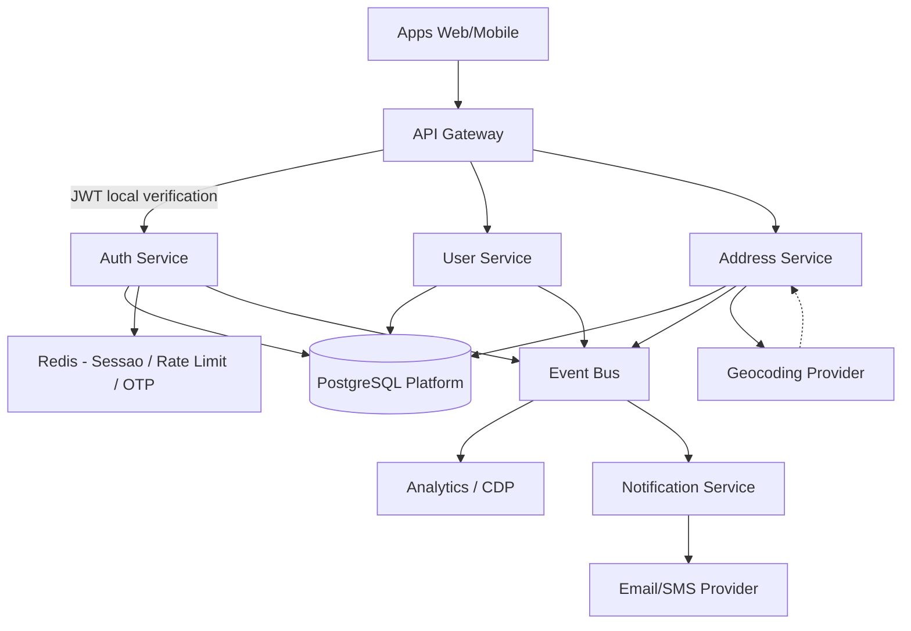

# System Design - Cadastro de Usuarios (FastFood estilo iFood)

> **Status:** Em progresso  
> **Fase:** 1
> **Jornada:** Identidade e usuarios  
> **Epico:** [1.1 Jornada do Cliente (App Mobile / Web)](../../epic-ifood-clone.md#11-jornada-do-cliente-app-mobile--web)
> **Dependencias:** nenhuma (define padroes para todos os dominios)

## 1. Objetivo
Projetar um sistema de cadastro e gestao de usuarios para uma plataforma de fastfood com alto volume de acessos, cobrindo:
- Criacao de conta
- Autenticacao
- Gestao de perfil
- Enderecos
- Preferencias
- Seguranca e conformidade (LGPD)
- Escalabilidade e observabilidade

## 2. Escopo Funcional
### 2.1 Funcionalidades no MVP
- Cadastro com email + senha
- Login com email + senha
- Confirmacao de email
- Recuperacao de senha
- CRUD de perfil do usuario
- CRUD de enderecos
- Cadastro de telefone e validacao OTP
- Aceite de termos e politica de privacidade

### 2.2 Funcionalidades pos-MVP
- Login social (Google, Apple)
- MFA (TOTP/SMS)
- Detecao de fraude de cadastro
- Perfil unificado multi-dispositivo
- Preferencias de notificacao (push/email/SMS)
- Segmentacao para campanhas

## 3. Requisitos Nao Funcionais
- Disponibilidade: 99.9% no dominio de identidade
- Latencia p95:
  - Cadastro: < 400 ms (sem contar envio de email)
  - Login: < 250 ms
  - Leitura de perfil: < 120 ms
- Escala inicial: 1M usuarios cadastrados
- Pico esperado: 2k RPS em eventos de campanha
- Seguranca: OWASP ASVS baseline + rate limit + protecao contra credential stuffing
- Compliance: LGPD (consentimento, minimizacao de dados, direito de exclusao)

## 4. Contexto de Negocio
No ecossistema de fastfood, o cadastro impacta diretamente conversao de primeiro pedido, retencao e personalizacao de ofertas. O design prioriza:
- Fluxo rapido de onboarding
- Integracao com checkout e fidelidade
- Confiabilidade em horarios de pico

## 5. Arquitetura de Alto Nivel
Arquitetura orientada a servicos com dominio de identidade separado.



### Diagramas
- [Arquitetura detalhada (Mermaid)](./architecture.mermaid)
- [Arquitetura detalhada (PNG)](./architecture.png) — exportar do Mermaid quando disponivel

## 6. Componentes
### 6.1 API Gateway
- Roteamento e autenticacao inicial
- Rate limiting por IP, deviceId e userId
- Correlation-id para rastreabilidade
- Validacao local de JWT por chave publica, sem chamada sincronica ao Auth Service em cada request

### 6.2 Auth Service
- Registro de credenciais
- Hash de senha (Argon2id)
- Emissao e renovacao de JWT/Refresh Token
- Fluxo de recuperacao de senha
- Verificacao de email e telefone
- Publicacao de eventos para envio assincrono de email e SMS

### 6.3 User Service
- Perfil basico: nome, data de nascimento opcional, genero opcional
- Preferencias de comunicacao
- Estado de consentimento LGPD

### 6.4 Address Service
- Enderecos do usuario
- Marcacao de endereco principal
- Validacao basica de CEP/logradouro
- Geocodificacao assincrona para latitude e longitude

### 6.5 Event Bus
- Publicacao de eventos de dominio:
  - user.created
  - user.email.verified
  - user.phone.verified
  - user.profile.updated
  - user.address.created

## 7. Sessoes e Invalidacao de Tokens
### 7.1 Estrategia de Sessao
- Access token JWT curto e auto-contido
- Refresh token rotativo armazenado com hash
- Redis usado para:
  - OTP temporario
  - lista de revogacao de tokens
  - controle de taxa por login e cadastro

### 7.2 Fluxo de Invalidacao
1. Usuario faz logout ou troca de senha.
2. O refresh token e revogado no banco e marcado no Redis.
3. O access token expira naturalmente em poucos minutos.
4. O gateway valida a assinatura do JWT localmente e consulta Redis apenas para tokens explicitamente revogados, quando necessario.

### 7.3 Regras de Seguranca
- Rotacao obrigatoria de refresh token a cada renovacao
- Revogacao em massa em caso de suspeita de comprometimento
- Revogacao de todos os tokens ao receber evento `user.deleted` — Auth Service escuta o evento e revoga todos os refresh tokens ativos do usuario
- TTL curto para OTP e desafios de verificacao
- Grace period de rotacao: ao renovar um refresh token, o token anterior deve permanecer valido por uma janela curta (sugestao: 30 segundos) para tolerar retransmissoes em redes instaveis.

## 8. Modelo de Dados (Simplificado)

### 8.1 Tabela users
- id (UUID, PK)
- email (varchar, unique, index)
- email_verified_at (timestamp null)
- phone (varchar null)
- phone_verified_at (timestamp null)
- password_hash (varchar)
- status (active, blocked, pending_verification)
- created_at, updated_at

### 8.2 Tabela user_profiles
- user_id (UUID, PK/FK users.id)
- full_name (varchar)
- birth_date (date null)
- marketing_opt_in (boolean)
- preferred_language (varchar)
- updated_at

### 8.3 Tabela user_addresses
- id (UUID, PK)
- user_id (UUID, FK)
- label (casa, trabalho, outro)
- zip_code
- street
- number
- complement
- neighborhood
- city
- state
- country
- latitude, longitude (null)
- is_default (boolean)
- created_at, updated_at

### 8.4 Tabela user_consents
- id (UUID, PK)
- user_id (UUID, FK)
- consent_type (terms, privacy_policy, marketing)
- version (varchar)
- accepted_at (timestamp)
- source (web, android, ios)

### 8.5 Tabela refresh_tokens
- id (UUID, PK)
- user_id (UUID, FK)
- token_hash
- device_id
- expires_at
- revoked_at (null)
- created_at

### 8.6 Estrategia de persistencia inicial
- Uma unica instancia fisica de PostgreSQL na fase inicial
- Separacao logica por schemas ou databases internos do mesmo cluster
- Evolucao para instancias fisicas separadas apenas quando houver justificativa de escala, isolamento ou compliance

Mesmo na fase inicial com instancia unica, recomenda-se configurar streaming replication para ao menos uma replica de leitura, garantindo failover manual e separacao de carga entre leituras de perfil e escritas de autenticacao. Backups automaticos com retencao minima de 7 dias devem estar ativos desde o dia 1.

### 8.7 Tabela user_devices
- id (UUID, PK)
- user_id (UUID, FK)
- device_id (varchar, unique por usuario)
- platform (ios, android, web)
- push_token (varchar null)
- last_seen_at (timestamp)
- created_at

## 9. Fluxos Principais
### 9.1 Cadastro
1. Cliente envia email, senha, nome e aceite de termos.
2. API valida payload e politicas de senha.
3. Auth Service cria credenciais e user base.
4. User Service cria perfil padrao.
5. Evento user.created e disparo assincrono de verificacao de email via Notification Service.
6. Retorno 201 com sessao inicial opcional (dependendo da regra).

Nota: Caso o User Service nao consiga criar o perfil na sequencia, o evento user.created deve ser reprocessado via dead-letter queue, garantindo que o estado do perfil seja criado de forma eventual e consistente sem rollback da credencial.

### 9.2 Login
1. Cliente envia email + senha.
2. Validacao de credenciais + status da conta.
3. Emissao de access token JWT curto e refresh token rotativo.
4. Registro de sessao/device e metadados de risco para seguranca.

### 9.3 Recuperacao de senha
1. Usuario solicita reset por email.
2. Gera token de uso unico com TTL curto.
3. Usuario define nova senha.
4. Revoga sessoes antigas opcionalmente.

### 9.4 Cadastro de endereco
1. Usuario envia endereco textual.
2. Address Service persiste o endereco e publica evento de criacao.
3. Um job assincrono consulta o provedor de geocoding.
4. Latitude e longitude sao atualizadas quando disponiveis.

### 9.5 Verificacao OTP de telefone
1. Usuario informa numero de telefone no perfil.
2. Auth Service gera OTP e publica evento para o Notification Service enviar via SMS.
3. OTP e armazenado no Redis com TTL curto.
4. Usuario envia o codigo recebido.
5. Auth Service valida o OTP, marca phone_verified_at e publica evento user.phone.verified.

## 10. Contratos de API (Resumo)
- POST /v1/auth/register
- POST /v1/auth/login
- POST /v1/auth/refresh
- POST /v1/auth/forgot-password
- POST /v1/auth/reset-password
- POST /v1/auth/logout - Revoga o refresh token da sessao ativa e invalida o access token.
- POST /v1/auth/verify-email
- GET /v1/users/me
- PATCH /v1/users/me
- GET /v1/users/me/addresses
- POST /v1/users/me/addresses
- PATCH /v1/users/me/addresses/{addressId}
- DELETE /v1/users/me/addresses/{addressId}

## 11. Contrato de Evento no Event Bus

> **Nota:** O envelope padrao dos eventos e definido pela **Plataforma Transversal** (documento 00). Este documento define apenas os **payloads especificos do dominio de identidade**. Consulte a [secao 10 do System Design 00](../00-plataforma-transversal/system-design.md#10-contratos-de-eventos) para o schema completo do envelope, politica de versionamento e topic naming.

### 11.1 Envelope (definido no documento 00)

O envelope base segue o schema definido em [00-plataforma-transversal, secao 10.1](../00-plataforma-transversal/system-design.md#101-envelope-padrao):

> **Nota sobre convenção:** Eventos usam **camelCase** nos nomes dos campos (`fullName`, `zipCode`). O banco de dados usa **snake_case** (`full_name`, `zip_code`). A conversao entre os dois formatos e feita na camada de serializacao de cada servico.


| Campo | Tipo | Obrigatorio | Descricao |
|-------|------|-------------|-----------|
| `eventId` | UUID | Sim | Identificador unico do evento |
| `eventType` | String | Sim | `user.created`, `user.phone.verified`, etc. |
| `schemaVersion` | String | Sim | Versao do schema do payload (`1.0`) |
| `source` | String | Sim | Servico produtor (`auth-service`, `user-service`) |
| `occurredAt` | ISO 8601 | Sim | Timestamp de quando o evento ocorreu |
| `correlationId` | UUID | Sim | Id de correlacao ponta a ponta |
| `idempotencyKey` | String | Nao | Chave de idempotencia do request original |
| `payload` | Object | Sim | Dados especificos do evento (definidos abaixo) |

### 11.2 Payloads do dominio de identidade

#### 11.2.1 `user.created`

```json
{
  "userId": "e5f3ef90-6f3a-4f5a-b7f3-7c8c4cd3f9aa",
  "email": "ana.souza@example.com",
  "fullName": "Ana Souza",
  "status": "pending_verification"
}
```

#### 11.2.2 `user.email.verified`

```json
{
  "userId": "e5f3ef90-6f3a-4f5a-b7f3-7c8c4cd3f9aa",
  "email": "ana.souza@example.com",
  "verifiedAt": "2026-07-04T14:35:00.000Z"
}
```

#### 11.2.3 `user.phone.verified`

```json
{
  "userId": "e5f3ef90-6f3a-4f5a-b7f3-7c8c4cd3f9aa",
  "phone": "+5511999999999",
  "verifiedAt": "2026-07-04T14:40:00.000Z"
}
```

#### 11.2.4 `user.profile.updated`

```json
{
  "userId": "e5f3ef90-6f3a-4f5a-b7f3-7c8c4cd3f9aa",
  "changedFields": ["fullName", "preferredLanguage"],
  "updatedAt": "2026-07-04T15:00:00.000Z"
}
```

#### 11.2.5 `user.address.created`

```json
{
  "addressId": "c2c4b3f8-7cc5-4d59-8c62-7f0c0a18d3d1",
  "userId": "e5f3ef90-6f3a-4f5a-b7f3-7c8c4cd3f9aa",
  "zipCode": "01001-000",
  "city": "Sao Paulo",
  "state": "SP",
  "latitude": -23.55052,
  "longitude": -46.63331,
  "isDefault": true
}
```

#### 11.2.6 `user.deleted`

```json
{
  "userId": "e5f3ef90-6f3a-4f5a-b7f3-7c8c4cd3f9aa",
  "deletedAt": "2026-07-04T16:00:00.000Z",
  "retentionUntil": "2026-08-04T16:00:00.000Z"
}
```

### 11.3 Eventos publicados pelo dominio de identidade

| Evento | Produtor | Consumidores | Quando |
|--------|----------|--------------|--------|
| `user.created` | Auth Service | Notification (email), Analytics, Search | Apos registro |
| `user.email.verified` | Auth Service | Notification, Analytics | Apos confirmacao de email |
| `user.phone.verified` | Auth Service | Notification | Apos validacao OTP |
| `user.profile.updated` | User Service | Analytics, Search | Apos alteracao de perfil |
| `user.address.created` | Address Service | Geocoding, Analytics | Apos cadastro de endereco |
| `user.deleted` | User Service | Analytics, Notification, Auth | Apos exclusao de conta |
```json
{
  "eventId": "b1d6f3a5-3b92-4b84-bf3c-5d87f6a2f0d8",
  "eventType": "user.address.created",
  "occurredAt": "2026-06-06T12:05:00Z",
  "source": "address-service",
  "schemaVersion": "1.0",
  "correlationId": "a8f4d9d1-6ce0-4c2b-9f2a-1d5d0e6f7f11",
  "payload": {
    "addressId": "c2c4b3f8-7cc5-4d59-8c62-7f0c0a18d3d1",
    "userId": "e5f3ef90-6f3a-4f5a-b7f3-7c8c4cd3f9aa",
    "zipCode": "01001-000",
    "city": "Sao Paulo",
    "state": "SP",
    "latitude": -23.55052,
    "longitude": -46.63331,
    "isDefault": true
  }
}
```

## 12. Seguranca
- Hash de senha: Argon2id com parametros revisados periodicamente
- Tokens:
  - Access token TTL curto (ex: 15 min)
  - Refresh token rotativo e revogavel
- Protecoes:
  - Rate limit por rota sensivel
  - CAPTCHA adaptativo em comportamento suspeito
  - Bloqueio progressivo por tentativas de login
  - Device fingerprint (sem coletar dados excessivos)
  - Resposta identica no forgot-password: o endpoint POST /v1/auth/forgot-password deve retornar o mesmo body e status HTTP independentemente de o e-mail existir ou nao, e deve aplicar constant-time response para evitar enumeracao de cadastros.
- Dados sensiveis:
  - Criptografia em repouso (KMS)
  - TLS fim a fim
  - Mascaramento de PII em logs

## 13. Privacidade e LGPD
- Base legal e consentimento versionado
- Endpoint de exportacao de dados do titular
- Endpoint de exclusao de conta (soft delete + janela de retencao)
- Trilha de auditoria para alteracoes criticas
- Politica de retencao para tokens, logs e dados inativos

## 14. Escalabilidade
- Escala horizontal de servicos stateless
- Redis para rate limit, cache de sessao e blacklist curta
- Banco com:
  - Indices em email, user_id, created_at
  - Alem dos indices simples em email, user_id e created_at, adicionar indices compostos para queries frequentes: (user_id, revoked_at) em refresh_tokens e (user_id, is_default) em user_addresses.
  - Read replicas para leitura de perfil (quando necessario)
- Processamento assincrono para email/SMS/eventos
- Backpressure no event bus e retries com dead-letter queue

## 15. Observabilidade
- Logs estruturados com requestId, userId (quando autenticado), route
- Metricas:
  - Taxa de cadastro
  - Conversao cadastro -> primeiro pedido
  - Falhas de login por causa
  - Tempo de resposta por endpoint
- Tracing distribuido entre gateway e servicos
- Alertas:
  - Aumento de 5xx
  - Pico de falhas de autenticacao
  - Atraso em fila de eventos

## 16. Resiliencia
- Timeouts e retries com jitter para dependencias externas (email/SMS)
- Circuit breaker para providers externos
- Fallback de envio de notificacao por provedor secundario
- Idempotencia em endpoints criticos (ex: registro)

## 17. Estrategia de Deploy
- CI/CD com validacao automatica (lint, testes, seguranca)
- Migracoes de banco versionadas e reversiveis
- Deploy canario para Auth Service
- Feature flags para rollout de MFA/social login

## 18. Testes Recomendados
- Unitarios: regras de senha, token, consentimento
- Integracao: endpoints de auth, perfil e endereco
- Contrato: schema de resposta e codigos de erro
- Carga: login/cadastro em horario de pico
- Seguranca: brute force, enumeracao de email, injecao, replay

## 19. Roadmap Tecnico
1. MVP de cadastro/login/perfil/endereco
2. Verificacao de telefone + anti-fraude basico
3. Login social + MFA opcional
4. Perfil de personalizacao para recomendacoes e CRM

## 20. Riscos e Mitigacoes
- Alto volume em campanhas: autoscaling + fila + cache
- Fraude em criacao de contas: rate limit, reputacao de IP, CAPTCHA adaptativo
- Dependencia de provedores externos: multi-provider e circuit breaker
- Vazamento de PII: minimo privilegio, criptografia e auditoria continua

## 21. Decisoes Arquiteturais Principais
- Separar Auth Service de User Service para reduzir acoplamento e facilitar escalabilidade.
- Validar JWT localmente no Gateway com chave publica, evitando round trips desnecessarios ao Auth Service.
- Manter uma unica instancia fisica de PostgreSQL no inicio com separacao logica por schema/database.
- Usar eventos de dominio para integracao com analytics, notificacao e geocoding sem travar o fluxo online.
- Manter dados de endereco em servico proprio para evolucao futura de logistica e cobertura de entrega.