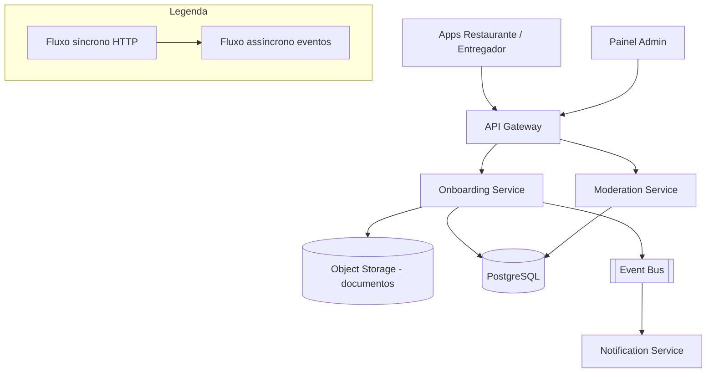

# System Design - Onboarding e Moderacao (Admin)

> **Status:** Em progresso  
> **Fase:** 1  
> **Jornada:** Admin  
> **Epico:** [Admin §1.4](../../epic-ifood-clone.md#14-painel-administrativo-interno-da-plataforma)  
> **Dependencias:** [01-identidade-usuarios](../01-identidade-usuarios/system-design.md), [00-plataforma-transversal](../00-plataforma-transversal/system-design.md)

## 1. Objetivo

Projetar o fluxo de entrada de **restaurantes** e **entregadores** na plataforma: envio de documentos, analise manual/automatica, aprovacao e atribuicao de papeis (RBAC).

## 2. Escopo Funcional

### 2.1 MVP

- [ ] Cadastro de solicitacao de restaurante (CNPJ, endereco, responsavel)
- [ ] Upload de documentos (contrato social, alvara, identidade)
- [ ] Fila de moderacao para analistas admin
- [ ] Estados: `pending` → `under_review` → `approved` | `rejected`
- [ ] Cadastro de entregador com CNH e veiculo
- [ ] Vinculo usuario ↔ papel (`restaurant_owner`, `courier`)
- [ ] Notificacao de resultado por email/push

### 2.2 Pos-MVP

- [ ] OCR/validacao automatica de documentos
- [ ] Score de risco e bloqueio preventivo
- [ ] Revalidacao periodica de documentos
- [ ] Onboarding self-service com video e checklist

## 3. Requisitos Nao Funcionais

- SLA de primeira analise: **< 48h** (negocio)
- Upload: arquivos ate **10MB**, armazenamento criptografado
- Auditoria: trilha imutavel de quem aprovou/rejeitou
- Disponibilidade do dominio: **99.9%** (alinhado com identidade)

## 4. Contexto de Negocio

Gate de qualidade do marketplace. Restaurante so publica cardapio apos `approved`. Entregador so recebe corridas apos `approved`. A experiencia de onboarding impacta diretamente a taxa de conversao de novos parceiros.

## 5. Arquitetura de Alto Nivel



Diagrama detalhado: [`./architecture.mermaid`](./architecture.mermaid)

## 6. Componentes

### 6.1 Onboarding Service

- CRUD de solicitacoes
- Upload presigned URL
- Validacao de dados cadastrais (CNPJ, CPF, formato de documentos)
- Publica `onboarding.submitted`, `onboarding.approved`, `onboarding.rejected`

### 6.2 Moderation Service

- Fila de trabalho para admins
- Comentarios internos e motivo de rejeicao
- Atualiza RBAC no Identity/Auth apos aprovacao
- Triggers de SLA (escalonamento se ultrapassar 48h)

## 7. Modelo de Dados

### 7.1 `onboarding_applications`

| Coluna | Tipo | Restricoes | Descricao |
|--------|------|------------|-----------|
| id | UUID | PK | Identificador unico |
| user_id | UUID | FK → users.id, NOT NULL | Usuario solicitante |
| type | VARCHAR(16) | NOT NULL, CHECK IN (`restaurant`, `courier`) | Tipo de solicitacao |
| status | VARCHAR(24) | NOT NULL, DEFAULT `pending` | `pending`, `under_review`, `approved`, `rejected` |
| submitted_at | TIMESTAMP | NOT NULL, DEFAULT NOW() | Data de submissao |
| reviewed_at | TIMESTAMP | NULL | Data da revisao |
| reviewer_id | UUID | FK → users.id, NULL | Admin que revisou |
| rejection_reason | VARCHAR(512) | NULL | Motivo padronizado de rejeicao |
| rejection_note | TEXT | NULL | Nota interna do revisor |
| resubmitted_from | UUID | FK → onboarding_applications.id, NULL | Vinculo com solicitacao anterior em caso de reenvio |
| metadata | JSONB | NULL | Dados adicionais (device, IP, etc.) |
| created_at | TIMESTAMP | NOT NULL, DEFAULT NOW() | |
| updated_at | TIMESTAMP | NOT NULL, DEFAULT NOW() | |

**Indices:**
- `(user_id)` — consultar solicitacoes do usuario
- `(status, submitted_at)` — fila de moderacao ordenada por data
- `(type, status)` — filtrar fila por tipo e estado

### 7.2 `application_documents`

| Coluna | Tipo | Restricoes | Descricao |
|--------|------|------------|-----------|
| id | UUID | PK | |
| application_id | UUID | FK → onboarding_applications.id, NOT NULL | Solicitacao vinculada |
| doc_type | VARCHAR(32) | NOT NULL | `cnpj_document`, `identity`, `license`, `vehicle_doc`, `contract` |
| storage_key | VARCHAR(256) | NOT NULL | Chave no Object Storage (S3) |
| original_filename | VARCHAR(256) | NOT NULL | Nome original do arquivo |
| mime_type | VARCHAR(64) | NOT NULL | `application/pdf`, `image/jpeg`, etc. |
| file_size_bytes | INT | NOT NULL | Tamanho do arquivo |
| checksum | VARCHAR(64) | NOT NULL | SHA-256 do arquivo para integridade |
| uploaded_at | TIMESTAMP | NOT NULL, DEFAULT NOW() | |

**Indices:**
- `(application_id)` — todos os documentos de uma solicitacao
- `(application_id, doc_type)` — unique, garantir um documento por tipo por solicitacao

### 7.3 `restaurant_profiles` (criado pos-aprovacao)

| Coluna | Tipo | Restricoes | Descricao |
|--------|------|------------|-----------|
| id | UUID | PK | |
| application_id | UUID | FK → onboarding_applications.id, NOT NULL, UNIQUE | Solicitacao de origem |
| owner_user_id | UUID | FK → users.id, NOT NULL | Dono do restaurante |
| legal_name | VARCHAR(256) | NOT NULL | Razao social |
| trading_name | VARCHAR(256) | NOT NULL | Nome fantasia |
| cnpj | VARCHAR(18) | NOT NULL, UNIQUE | CNPJ formatado |
| cpf_responsavel | VARCHAR(14) | NOT NULL | CPF do responsavel legal |
| address_id | UUID | FK → user_addresses.id | Endereco comercial |
| phone | VARCHAR(20) | NOT NULL | Telefone de contato |
| operating_hours_json | JSONB | NULL | Horarios de funcionamento por dia da semana |
| status | VARCHAR(16) | NOT NULL, DEFAULT `active` | `active`, `paused`, `blocked` |
| created_at | TIMESTAMP | NOT NULL, DEFAULT NOW() | |
| updated_at | TIMESTAMP | NOT NULL, DEFAULT NOW() | |

**Indices:**
- `(cnpj)` — busca exata, UNIQUE
- `(owner_user_id)` — consultar restaurantes do usuario
- `(status)` — listar restaurantes ativos/bloqueados

### 7.4 `courier_profiles` (criado pos-aprovacao)

| Coluna | Tipo | Restricoes | Descricao |
|--------|------|------------|-----------|
| id | UUID | PK | |
| application_id | UUID | FK → onboarding_applications.id, NOT NULL, UNIQUE | Solicitacao de origem |
| user_id | UUID | FK → users.id, NOT NULL | Entregador |
| vehicle_type | VARCHAR(16) | NOT NULL | `motorcycle`, `bicycle`, `car`, `scooter` |
| license_number | VARCHAR(32) | NOT NULL | Numero da CNH |
| license_expiry | DATE | NOT NULL | Data de validade da CNH |
| license_category | VARCHAR(8) | NOT NULL | `A`, `B`, `AB`, etc. |
| vehicle_plate | VARCHAR(10) | NULL | Placa do veiculo (se aplicavel) |
| vehicle_year | INT | NULL | Ano do veiculo |
| vehicle_color | VARCHAR(32) | NULL | Cor do veiculo |
| status | VARCHAR(16) | NOT NULL, DEFAULT `active` | `active`, `paused`, `blocked` |
| created_at | TIMESTAMP | NOT NULL, DEFAULT NOW() | |
| updated_at | TIMESTAMP | NOT NULL, DEFAULT NOW() | |

**Indices:**
- `(user_id)` — consultar perfil do entregador
- `(license_number)` — UNIQUE, evitar duplicidade de CNH
- `(status)` — listar entregadores ativos para matching

### 7.5 `moderation_audit_log`

| Coluna | Tipo | Restricoes | Descricao |
|--------|------|------------|-----------|
| id | UUID | PK | |
| application_id | UUID | FK → onboarding_applications.id, NOT NULL | |
| action | VARCHAR(32) | NOT NULL | `status_changed`, `comment_added`, `document_requested` |
| from_status | VARCHAR(24) | NULL | Estado anterior |
| to_status | VARCHAR(24) | NULL | Novo estado |
| reviewer_id | UUID | FK → users.id, NOT NULL | Admin que executou a acao |
| comment | TEXT | NULL | Nota interna |
| created_at | TIMESTAMP | NOT NULL, DEFAULT NOW() | |

**Indices:**
- `(application_id, created_at)` — historico cronologico de uma solicitacao
- `(reviewer_id)` — auditoria por admin

## 8. Fluxos Principais

### 8.1 Restaurante solicita entrada

1. Usuario autenticado envia dados (CNPJ, razao social, endereco) + documentos (contrato social, alvara, identidade do responsavel).
2. Onboarding Service valida payload (CNPJ com digito verificador, formato de arquivos).
3. Persiste `onboarding_applications` com status `pending`.
4. Para cada documento, faz upload via presigned URL para o Object Storage.
5. Publica `onboarding.submitted` no Event Bus.
6. Moderation Service consome o evento e coloca na fila `under_review`.
7. Admin ve na fila de moderacao, analisa documentos e dados.
8. Admin aprova → Onboarding Service cria `restaurant_profile`, atribui role `restaurant_owner` via Auth Service, publica `onboarding.approved`.
9. Notification Service consome `onboarding.approved` e envia email/push de boas-vindas.

### 8.2 Rejeicao com motivo

1. Admin registra motivo padronizado (ex: `document_invalid`, `cnpj_not_found`, `incomplete_info`) + nota livre.
2. Status muda para `rejected`, `rejection_reason` e `rejection_note` preenchidos.
3. Documentos retidos conforme politica de retencao (ver Secao 11).
4. Usuario e notificado com o motivo e instrucoes para reenvio.
5. Usuario pode reenviar nova solicitacao — os dados da solicitacao anterior sao copiados como template, e o campo `resubmitted_from` vincula a nova a anterior para auditoria.

### 8.3 Reenvio de solicitacao (apos rejeicao)

1. Usuario acessa solicitacao rejeitada e clica em \"Reenviar\".
2. Onboarding Service copia dados da solicitacao anterior para uma nova com status `pending`.
3. Campo `resubmitted_from` referencia a solicitacao original.
4. Usuario pode substituir documentos especificos ou adicionar novos.
5. Fluxo segue normalmente a partir do passo 2 do fluxo 8.1.
6. Admin moderador consegue ver o historico completo: solicitacao anterior, motivo de rejeicao e o que foi alterado.

### 8.4 SLA de moderacao — escalonamento

1. Job cron executa a cada 1h consultando solicitacoes em `under_review` com `submitted_at` > 24h.
2. Se ultrapassou 24h sem revisao → notificacao ao admin mais antigo da fila (prioridade baixa).
3. Se ultrapassou 48h (SLA) → escalonamento para supervisor admin via notificacao P2.
4. Se ultrapassou 72h → alerta P1 para equipe de operacoes.

## 9. Contratos de API

### 9.1 Padrao de erro

Segue o [padrao global definido na Plataforma Transversal](../00-plataforma-transversal/system-design.md#91-padrao-de-erro-global).

### 9.2 Endpoints do dominio de onboarding

#### `POST /v1/onboarding/restaurants`

Cria uma nova solicitacao de restaurante.

**Request body:**
```json
{
  "legalName": "Restaurante Exemplo Ltda",
  "tradingName": "Restaurante Exemplo",
  "cnpj": "12.345.678/0001-90",
  "cpfResponsavel": "123.456.789-00",
  "phone": "+5511999999999",
  "address": {
    "zipCode": "01001-000",
    "street": "Rua Exemplo",
    "number": "100",
    "complement": "Sala 1",
    "neighborhood": "Centro",
    "city": "Sao Paulo",
    "state": "SP"
  }
}
```

**Response (201):**
```json
{
  "applicationId": "uuid",
  "status": "pending",
  "submittedAt": "2026-07-04T14:30:00.000Z",
  "documentUploadUrl": "https://s3.region.amazonaws.com/...presigned...",
  "requiredDocuments": ["cnpj_document", "identity", "contract"]
}
```

#### `POST /v1/onboarding/couriers`

Cria uma nova solicitacao de entregador.

**Request body:**
```json
{
  "vehicleType": "motorcycle",
  "licenseNumber": "12345678901",
  "licenseExpiry": "2028-12-31",
  "licenseCategory": "A",
  "vehiclePlate": "ABC-1234",
  "vehicleYear": 2023,
  "vehicleColor": "Preto"
}
```

**Response (201):**
```json
{
  "applicationId": "uuid",
  "status": "pending",
  "submittedAt": "2026-07-04T14:30:00.000Z",
  "documentUploadUrl": "https://s3.region.amazonaws.com/...presigned...",
  "requiredDocuments": ["identity", "license", "vehicle_doc"]
}
```

#### `POST /v1/onboarding/applications/{id}/documents`

Faz upload de um documento para a solicitacao.

**Request:** Multipart form-data com o arquivo + campo `docType`.

**Response (201):**
```json
{
  "documentId": "uuid",
  "docType": "cnpj_document",
  "checksum": "sha256_hash",
  "uploadedAt": "2026-07-04T14:35:00.000Z"
}
```

#### `GET /v1/onboarding/applications/{id}`

Retorna o status da solicitacao e documentos enviados.

**Response (200):**
```json
{
  "applicationId": "uuid",
  "type": "restaurant",
  "status": "under_review",
  "submittedAt": "2026-07-04T14:30:00.000Z",
  "documents": [
    { "docType": "cnpj_document", "status": "uploaded", "uploadedAt": "..." }
  ],
  "rejectionReason": null,
  "rejectionNote": null
}
```

#### `GET /v1/admin/moderation/queue`

Fila de moderacao para admins. Paginada, com filtros.

**Query params:** `?status=under_review&type=restaurant&page=1&pageSize=20&sort=submitted_at:asc`

**Response (200):**
```json
{
  "items": [
    {
      "applicationId": "uuid",
      "type": "restaurant",
      "userName": "Joao Silva",
      "legalName": "Restaurante Exemplo Ltda",
      "cnpj": "12.345.678/0001-90",
      "status": "under_review",
      "submittedAt": "2026-07-04T14:30:00.000Z",
      "slaRemainingHours": 36
    }
  ],
  "total": 45,
  "page": 1,
  "pageSize": 20
}
```

#### `POST /v1/admin/moderation/applications/{id}/approve`

Aprova uma solicitacao.

**Request body:**
```json
{
  "note": "Documentacao completa e validada. CNPJ conferido na Receita Federal."
}
```

**Response (200):**
```json
{
  "applicationId": "uuid",
  "status": "approved",
  "reviewedAt": "2026-07-04T16:00:00.000Z",
  "roleAssigned": "restaurant_owner"
}
```

#### `POST /v1/admin/moderation/applications/{id}/reject`

Rejeita uma solicitacao.

**Request body:**
```json
{
  "reason": "document_invalid",
  "note": "O documento de identidade enviado esta ilegivel. Favor enviar foto com melhor resolucao."
}
```

**Response (200):**
```json
{
  "applicationId": "uuid",
  "status": "rejected",
  "rejectionReason": "document_invalid",
  "rejectionNote": "O documento de identidade enviado esta ilegivel...",
  "reviewedAt": "2026-07-04T16:00:00.000Z"
}
```

### 9.3 Health check

```
GET /health
```

Segue o [padrao definido no documento 00](../00-plataforma-transversal/system-design.md#92-health-check).

## 10. Contratos de Eventos

> **Nota:** O envelope padrao dos eventos e definido pela **Plataforma Transversal** (documento 00). Consulte a [secao 10 do System Design 00](../00-plataforma-transversal/system-design.md#10-contratos-de-eventos) para o schema completo do envelope, politica de versionamento e topic naming.

### 10.1 Eventos publicados pelo dominio de onboarding

#### 10.1.1 `onboarding.submitted`

Publicado quando uma nova solicitacao e criada.

**Payload:**
```json
{
  "applicationId": "a1b2c3d4-e5f6-7890-abcd-ef1234567890",
  "userId": "e5f3ef90-6f3a-4f5a-b7f3-7c8c4cd3f9aa",
  "type": "restaurant",
  "submittedAt": "2026-07-04T14:30:00.000Z",
  "legalName": "Restaurante Exemplo Ltda",
  "cnpj": "12.345.678/0001-90"
}
```

**Consumidores:** Moderation Service (fila de revisao), Notification (confirmacao de recebimento opcional).

#### 10.1.2 `onboarding.approved`

Publicado quando um admin aprova a solicitacao.

**Payload:**
```json
{
  "applicationId": "a1b2c3d4-e5f6-7890-abcd-ef1234567890",
  "userId": "e5f3ef90-6f3a-4f5a-b7f3-7c8c4cd3f9aa",
  "type": "restaurant",
  "approvedAt": "2026-07-04T16:00:00.000Z",
  "roleAssigned": "restaurant_owner",
  "profileId": "f7a8b9c0-d1e2-3f4a-5b6c-7d8e9f0a1b2c",
  "legalName": "Restaurante Exemplo Ltda"
}
```

**Consumidores:** Auth Service (atribuir role), Notification (boas-vindas), Analytics, Menu Service (habilitar criacao de cardapio).

#### 10.1.3 `onboarding.rejected`

Publicado quando um admin rejeita a solicitacao.

**Payload:**
```json
{
  "applicationId": "a1b2c3d4-e5f6-7890-abcd-ef1234567890",
  "userId": "e5f3ef90-6f3a-4f5a-b7f3-7c8c4cd3f9aa",
  "type": "restaurant",
  "rejectedAt": "2026-07-04T16:00:00.000Z",
  "rejectionReason": "document_invalid",
  "allowResubmission": true
}
```

**Consumidores:** Notification (motivo da rejeicao), Analytics.

### 10.2 Tabela de eventos do dominio

| Evento | Produtor | Consumidores | Schema Version |
|--------|----------|--------------|----------------|
| `onboarding.submitted` | Onboarding Service | Moderation, Notification | 1.0 |
| `onboarding.approved` | Onboarding Service | Auth, Notification, Analytics, Menu | 1.0 |
| `onboarding.rejected` | Onboarding Service | Notification, Analytics | 1.0 |

## 11. Seguranca

### 11.1 Documentos e Object Storage

- Documentos armazenados em bucket **privado** — sem acesso publico direto.
- Upload via **presigned URL** com TTL de 15 minutos — o servico nunca recebe o conteudo binario diretamente, apenas a referencia.
- URLs de download temporarias (presigned) com TTL de 1 hora para visualizacao no painel de moderacao.
- Criptografia em repouso no Object Storage (SSE-S3 / AES-256).
- Checksum SHA-256 validado no upload para garantir integridade.
- Tamanho maximo por arquivo: **10MB**. Formatos aceitos: PDF, JPEG, PNG.

### 11.2 Politica de retencao de documentos (LGPD)

| Cenario | Retencao | Acao apos prazo |
|---------|----------|-----------------|
| Solicitacao aprovada | 5 anos (prazo legal) | Exclusao automatica + soft delete no banco |
| Solicitacao rejeitada | 90 dias apos rejeicao | Exclusao automatica |
| Solicitacao com reenvio | Manter documento da solicitacao anterior ate 90 dias apos aprovacao da nova | Exclusao automatica |
| Usuario exclui conta | 30 dias para contestacao | Exclusao imediata de documentos |

### 11.3 Acesso e auditoria

- Acesso ao painel de moderacao requer **role `admin`** + **MFA obrigatorio** (TOTP).
- Toda acao de moderacao (aprovacao, rejeicao, comentario) e registrada em `moderation_audit_log` — trilha imutavel.
- Admins nao podem excluir ou alterar registros de auditoria.
- Logs de acesso a documentos (download, visualizacao) registrados com `adminId`, `applicationId` e timestamp.

### 11.4 Protecoes no Gateway

- Rate limit: `POST /v1/onboarding/*` — 3 requests/min por usuario (evitar submissao em massa).
- Rate limit: `POST /v1/admin/moderation/*` — 30 requests/min por admin.
- Validacao de CNPJ com digito verificador no backend (alem da validacao frontend).
- Uploads escaneados por antivirus (pos-MVP).

## 12. Escalabilidade

### 12.1 Servicos stateless

- Onboarding Service e Moderation Service sao stateless.
- HPA baseado em CPU e tamanho da fila de moderacao.

### 12.2 Cache

| Recurso | Estrategia | TTL |
|---------|------------|-----|
| Filas de moderacao | Paginacao direta no banco com indices | N/A (consulta ao vivo) |
| Documentos (imagens) | CDN (CloudFront / Cloud CDN) para visualizacao | 1h (presigned URL) |
| Dados de solicitacao | Cache local no Moderation Service | 5min |

### 12.3 Database

- Tabelas de onboarding no schema `onboarding` do PostgreSQL compartilhado.
- Indices compostos para queries frequentes (ver Secao 7).
- Particionamento futuro por `type` (restaurant vs courier) se volume > 100k solicitacoes/mes.

### 12.4 Estimativa de capacidade

| Recurso | Estimativa | Folga |
|---------|------------|-------|
| Solicitacoes por mes | 10k (5k restaurantes + 5k entregadores) | 3x (30k) |
| Documentos por solicitacao | 3 | 2x (6) |
| Armazenamento de documentos | 300 GB/ano (10MB x 3 docs x 10k solicitacoes) | 2x (600 GB) |
| Admins moderadores simultaneos | 10 | 2x (20) |

## 13. Observabilidade

### 13.1 Logs estruturados

Segue o [padrao do documento 00](../00-plataforma-transversal/system-design.md#131-logs-estruturados). Campos adicionais para este dominio:

- `applicationId` — id da solicitacao sendo processada
- `applicationType` — `restaurant` | `courier`
- `reviewerId` — admin que executou a acao

### 13.2 Metricas especificas do dominio

| Metrica | Tipo | Descricao |
|---------|------|-----------|
| `onboarding_applications_total` | Counter | Solicitacoes criadas por tipo e status |
| `onboarding_moderation_duration_hours` | Histogram | Tempo entre submissao e primeira revisao |
| `onboarding_approval_rate` | Gauge | Taxa de aprovacao (aprovados / total) |
| `onboarding_rejection_reasons_total` | Counter | Contagem por motivo de rejeicao |
| `onboarding_document_upload_total` | Counter | Uploads por tipo de documento |
| `onboarding_backlog` | Gauge | Total de solicitacoes aguardando revisao |
| `onboarding_sla_breaches_total` | Counter | Solicitacoes que excederam SLA de 48h |

### 13.3 Dashboard (Grafana)

Painel especifico do dominio de onboarding:

- **Backlog da fila** — grafico de solicitacoes `under_review` ao longo do tempo
- **Tempo medio de moderacao** — histograma por tipo (restaurant vs courier)
- **Taxa de aprovacao** — percentual diario/semanal
- **Motivos de rejeicao** — grafico de pizza/pareto
- **SLA breaches** — contagem de violacoes do SLA de 48h
- **Solicitacoes por admin** — distribuicao de revisoes por moderador

### 13.4 Alertas especificos

| Alerta | Condicao | Severidade | Acao |
|--------|----------|------------|------|
| Backlog alto | > 50 solicitacoes em `under_review` | P2 | Notificar coordenador de moderacao |
| SLA prestes a estourar | Solicitacao com > 40h em `under_review` | P2 | Notificar admin designado |
| SLA estourado | Solicitacao com > 48h em `under_review` | P1 | Escalonar para supervisor |
| Queda na taxa de aprovacao | < 50% nas ultimas 24h | P3 | Investigar possivel problema no fluxo |
| Pico de rejeicoes por mesmo motivo | > 10 rejeicoes/hora com mesmo `rejection_reason` | P3 | Possivel bug no upload ou validacao |

## 14. Resiliencia

### 14.1 Timeouts

| Tipo de chamada | Timeout | Justificativa |
|-----------------|---------|---------------|
| Upload via presigned URL | 30s | Upload direto ao S3, rede externa |
| Validacao de CNPJ em API externa (pos-MVP) | 5s | Receita Federal / API publica |
| Query PostgreSQL (fila de moderacao) | 2s | Com indices, < 100ms |
| Publicacao de evento | 3s | Event Bus local |

### 14.2 Retries com jitter

| Cenario | Tentativas | Intervalo | Jitter |
|---------|------------|-----------|--------|
| Publicacao de evento no Bus | 3 | 200ms, 400ms, 800ms | +/- 50ms |
| Atribuicao de role via Auth Service | 3 | 500ms, 1s, 2s | +/- 100ms |
| Notificacao ao usuario (se falhar) | 5 | 1s, 2s, 4s, 8s, 16s | +/- 25% |

### 14.3 Graceful degradation

| Cenario | Acao |
|---------|------|
| Object Storage (S3) indisponivel | Upload falha com erro 503, solicitacao nao criada sem documentos |
| Auth Service indisponivel na aprovacao | Evento `onboarding.approved` vai para DLQ, reprocessado quando Auth voltar |
| Notification Service indisponivel | Evento na DLQ, notificação enviada quando restabelecido |
| PostgreSQL indisponivel | Servico retorna 503, health check unhealthy |

### 14.4 Idempotencia

- `POST /v1/onboarding/restaurants` e `POST /v1/onboarding/couriers`: protegidos por `Idempotency-Key`.
- Upload de documento por `docType + applicationId`: se o mesmo tipo de documento ja existe, substitui o anterior (em vez de duplicar).
- Eventos de aprovacao/rejeicao: consumidores processam com base no `eventId` (duplicate detection).

## 15. Decisoes Arquiteturais (ADRs)

### ADR-001: Separacao entre Onboarding e Moderation Service

| Campo | Valor |
|-------|-------|
| **Decisao** | Onboarding (self-service) e Moderation (operacao interna) sao servicos separados |
| **Contexto** | Onboarding e usado por restaurantes/entregadores (alto volume, auto-servico). Moderacao e usado por admins (baixo volume, operacao interna). Cargas e requisitos de seguranca diferentes. |
| **Alternativas** | Servico unico (acoplaria responsabilidades, risco de impacto na moderacao se onboarding tiver pico) |
| **Consequencias** | Positivas: isolamento de falhas, cada servico escala independentemente. Negativas: maior complexidade de deploy e comunicacao via eventos entre eles. |
| **Status** | Aprovado |

### ADR-002: Upload via Presigned URL

| Campo | Valor |
|-------|-------|
| **Decisao** | Upload de documentos via presigned URL diretamente para Object Storage |
| **Contexto** | Documentos podem ter ate 10MB. Receber o binario no servico e repassar ao storage consumiria largura de banda e CPU desnecessarias. |
| **Alternativas** | Proxy no servico (mais simples para validacao, mas sobrecarrega o servico), upload chunked (mais complexo) |
| **Consequencias** | Positivas: servico nao gerencia binarios, reducao de latencia, escalabilidade horizontal. Negativas: validacao de tipo/tamanho precisa ser feita antes de gerar a URL. |
| **Status** | Aprovado |

### ADR-003: Aprovacao Dispara Evento, nao Chamada Sincrona

| Campo | Valor |
|-------|-------|
| **Decisao** | Ao aprovar, Onboarding Service publica `onboarding.approved`; Auth, Menu e Notification consomem assincronamente |
| **Contexto** | Aprovacao precisa: (1) atribuir role no Auth, (2) notificar usuario, (3) habilitar cardapio. Essas acoes nao precisam ser atomicas com a aprovacao. |
| **Alternativas** | Chamada sincrona para Auth/Menu/Notification (maior latencia, ponto de falha unico), saga distribuida (mais complexo) |
| **Consequencias** | Positivas: aprovacao e rapida (< 200ms), falhas em servicos downstream nao bloqueiam o fluxo. Negativas: consistencia eventual — pode levar alguns segundos ate o restaurante conseguir acessar o painel de cardapio. |
| **Status** | Aprovado |

### ADR-004: Reenvio com Vinculo a Solicitacao Anterior

| Campo | Valor |
|-------|-------|
| **Decisao** | Ao reenviar apos rejeicao, criar nova solicitacao vinculada a anterior via `resubmitted_from` |
| **Contexto** | Moderador precisa ver o historico completo: o que foi rejeitado, o que mudou. Rejeitar e criar do zero perderia esse contexto. |
| **Alternativas** | Reabrir a mesma solicitacao (mais simples, mas polui o historico de estados), permitir edicao direta (risco de alterar dados aprovados posteriormente) |
| **Consequencias** | Positivas: auditoria clara, moderador ve o diff entre solicitacoes. Negativas: mais registros no banco, logica de copia de dados. |
| **Status** | Aprovado |

## 16. Riscos e Mitigacoes

| Risco | Probabilidade | Impacto | Mitigacao |
|-------|---------------|---------|-----------|
| **Gargalo humano na moderacao** | Alta | Alto | SLA de 48h com escalonamento automatico, metricas de backlog em dashboard, pool de admins treinados |
| **Fraude documental (documentos falsos)** | Media | Critico | Checklist de verificacao manual, validacao de CNPJ em API da Receita, OCR pos-MVP |
| **Vazamento de documentos sensiveis** | Baixa | Critico | Bucket privado, presigned URL com TTL curto, logs de acesso, criptografia em repouso |
| **Perda de evento de aprovacao** | Baixa | Alto | Publisher confirm no RabbitMQ, DLQ com reprocessamento, job de reconciliação diario |
| **Solicitacao duplicada (mesmo CNH/CNPJ)** | Media | Medio | Indices UNIQUE em `cnpj` e `license_number`, validacao no backend |
| **Usuario desiste no meio do onboarding** | Alta | Baixo | Job de limpeza de solicitacoes `pending` com > 7 dias sem upload de documentos |
| **Alteracao de documento apos aprovacao** | Baixa | Medio | Documentos sao imutaveis apos upload; revalidacao periodica pos-MVP |

### 16.1 Matriz de probabilidade x impacto

```
Impacto:  Baixo      Medio       Alto        Critico
Probabilidade
Alta      | Desistencia |           | Gargalo    | 
Media     |             | Duplicatas |            | Fraude documental
Baixa     |             | Alt. doc   | Perda evento| Vazamento documentos
```

## 17. Topic `onboarding.*` no Event Bus

| Evento | Produtor | Consumidores | Schema Version |
|--------|----------|--------------|----------------|
| `onboarding.submitted` | Onboarding Service | Moderation, Notification | 1.0 |
| `onboarding.approved` | Onboarding Service | Auth, Notification, Analytics, Menu | 1.0 |
| `onboarding.rejected` | Onboarding Service | Notification, Analytics | 1.0 |

---

> **Documentos relacionados:** [Template de system design](../../templates/system-design-template.md) | [Roadmap](../../roadmap/ordem-das-jornadas.md) | [Epico iFood Clone](../../epic-ifood-clone.md) | [Plataforma Transversal](../00-plataforma-transversal/system-design.md)
