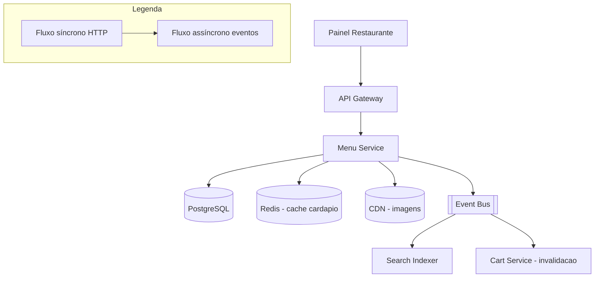

# System Design - Gestao de Cardapio (Restaurante)

> **Status:** Em progresso  
> **Fase:** 1  
> **Jornada:** Restaurante  
> **Epico:** [Restaurante §1.2 — Gestao de cardapio](../../epic-ifood-clone.md#12-jornada-do-restaurante-painel-web--gestor-de-pedidos)  
> **Dependencias:** [02-onboarding-admin](../02-onboarding-admin/system-design.md), [00-plataforma-transversal](../00-plataforma-transversal/system-design.md)

## 1. Objetivo

Permitir que restaurantes aprovados criem, editem e pausem produtos, categorias, precos e horarios — com propagacao em tempo real para busca e carrinho.

## 2. Escopo Funcional

### 2.1 MVP

- [ ] CRUD de categorias e produtos
- [ ] Adicionais/opcoes (ex: ponto da carne, borda recheada) com precos
- [ ] Pausa de item ou categoria (indisponivel)
- [ ] Horario de funcionamento por dia da semana
- [ ] Publicacao de cardapio (`published` / `draft`)
- [ ] Evento `menu.updated` para reindexacao

### 2.2 Pos-MVP

- [ ] Cardapio sazonal e combos
- [ ] Importacao em lote (CSV)
- [ ] Preview do cardapio no app cliente
- [ ] Controle de estoque por item (futuros campos em `menu_items`: `stock_count`, `low_stock_threshold`, `track_inventory`)
  - Nota: quando implementado, `menu_items` ganhara colunas de controle de estoque e a criacao de pedido precisara decrementar atomicamente.

## 3. Requisitos Nao Funcionais

- Propagacao de pausa: **< 5s** ate refletir na busca
- Consistencia: produto pausado nao pode ser adicionado ao carrinho
- Disponibilidade do dominio: **99.9%**
- Cache de cardapio ativo: < 10ms p95 para leitura

## 4. Contexto de Negocio

Cardapio e a vitrine do restaurante. Erros de preco ou item fantasma geram churn e chargeback. Um restaurante com cardapio desatualizado ou pausado incorretamente causa experiencia negativa imediata no cliente.

## 5. Arquitetura de Alto Nivel



Diagrama detalhado: [`./architecture.mermaid`](./architecture.mermaid)

## 6. Componentes

### 6.1 Menu Service

- Fonte da verdade do cardapio
- CRUD de categorias, itens, modificadores e horarios
- Validacao de regras de negocio (min/max modifiers, precos)
- Upload de imagens via presigned URL
- Publica eventos de alteracao no Event Bus

### 6.2 Search Indexer (consumidor)

- Consome `menu.updated`, `menu.item.unavailable`, `menu.published`
- Atualiza indice no Elasticsearch/OpenSearch
- Processa em batch para evitar sobrecarga

### 6.3 Cache Layer (Redis)

- Cardapio ativo em cache por `restaurant_id`
- Invalidacao por evento de alteracao
- TTL configravel (5 minutos ou invalidacao explicita)

## 7. Modelo de Dados

### 7.1 `menu_categories`

| Coluna | Tipo | Restricoes | Descricao |
|--------|------|------------|-----------|
| id | UUID | PK | |
| restaurant_id | UUID | FK → restaurant_profiles.id, NOT NULL | Restaurante dono da categoria |
| name | VARCHAR(128) | NOT NULL | Nome da categoria (ex: "Pizzas", "Bebidas") |
| description | VARCHAR(512) | NULL | Descricao opcional |
| sort_order | INT | NOT NULL, DEFAULT 0 | Ordem de exibicao |
| is_active | BOOLEAN | NOT NULL, DEFAULT TRUE | Se a categoria esta visivel |
| created_at | TIMESTAMP | NOT NULL, DEFAULT NOW() | |
| updated_at | TIMESTAMP | NOT NULL, DEFAULT NOW() | |

**Indices:**
- `(restaurant_id, sort_order)` — listar categorias ordenadas de um restaurante
- `(restaurant_id, is_active)` — filtrar apenas categorias ativas

### 7.2 `menu_items`

| Coluna | Tipo | Restricoes | Descricao |
|--------|------|------------|-----------|
| id | UUID | PK | |
| category_id | UUID | FK → menu_categories.id, NOT NULL | Categoria do item |
| name | VARCHAR(256) | NOT NULL | Nome do prato/produto |
| description | TEXT | NULL | Descricao detalhada |
| price_cents | INT | NOT NULL, CHECK >= 0 | Preco em centavos (ex: R$ 29,90 = 2990) |
| image_url | VARCHAR(512) | NULL | URL da imagem no CDN |
| is_available | BOOLEAN | NOT NULL, DEFAULT TRUE | Se esta disponivel para venda |
| preparation_time_seconds | INT | NULL, DEFAULT 0 | Tempo estimado de preparo |
| sort_order | INT | NOT NULL, DEFAULT 0 | Ordem dentro da categoria |
| created_at | TIMESTAMP | NOT NULL, DEFAULT NOW() | |
| updated_at | TIMESTAMP | NOT NULL, DEFAULT NOW() | |

**Indices:**
- `(category_id, sort_order)` — listar itens ordenados dentro da categoria
- `(category_id, is_available)` — filtrar disponiveis
- `(name)` — indice GIN para busca full-text (alternativa ao ES)

### 7.3 `menu_modifiers`

| Coluna | Tipo | Restricoes | Descricao |
|--------|------|------------|-----------|
| id | UUID | PK | |
| item_id | UUID | FK → menu_items.id, NOT NULL | Item ao qual o modifier pertence |
| name | VARCHAR(128) | NOT NULL | Ex: "Ponto da carne", "Borda" |
| min_selections | INT | NOT NULL, DEFAULT 0 | Minimo de opcoes que devem ser selecionadas |
| max_selections | INT | NOT NULL, DEFAULT 1 | Maximo de opcoes selecionaveis (0 = ilimitado) |
| is_required | BOOLEAN | NOT NULL, DEFAULT FALSE | Se o modifier e obrigatorio |
| sort_order | INT | NOT NULL, DEFAULT 0 | |
| created_at | TIMESTAMP | NOT NULL, DEFAULT NOW() | |
| updated_at | TIMESTAMP | NOT NULL, DEFAULT NOW() | |

**Indices:**
- `(item_id)` — todos os modifiers de um item

### 7.4 `menu_modifier_options`

| Coluna | Tipo | Restricoes | Descricao |
|--------|------|------------|-----------|
| id | UUID | PK | |
| modifier_id | UUID | FK → menu_modifiers.id, NOT NULL | Modifier ao qual a opcao pertence |
| name | VARCHAR(128) | NOT NULL | Ex: "Ao ponto", "Bem passado", "Com borda" |
| price_delta_cents | INT | NOT NULL, DEFAULT 0 | Acrescimo de preco em centavos |
| is_default | BOOLEAN | NOT NULL, DEFAULT FALSE | Se e a opcao pre-selecionada |
| is_available | BOOLEAN | NOT NULL, DEFAULT TRUE | |
| sort_order | INT | NOT NULL, DEFAULT 0 | |
| created_at | TIMESTAMP | NOT NULL, DEFAULT NOW() | |
| updated_at | TIMESTAMP | NOT NULL, DEFAULT NOW() | |

**Indices:**
- `(modifier_id)` — todas as opcoes de um modifier

### 7.5 `restaurant_schedules`

| Coluna | Tipo | Restricoes | Descricao |
|--------|------|------------|-----------|
| id | UUID | PK | |
| restaurant_id | UUID | FK → restaurant_profiles.id, NOT NULL | |
| day_of_week | SMALLINT | NOT NULL, CHECK 0-6 | 0=Domingo, 1=Segunda, ..., 6=Sabado |
| open_time | TIME | NOT NULL | Horario de abertura (ex: 11:00) |
| close_time | TIME | NOT NULL | Horario de fechamento (ex: 23:00) |
| is_closed | BOOLEAN | NOT NULL, DEFAULT FALSE | Se o restaurante nao funciona neste dia |

**Indices:**
- `(restaurant_id, day_of_week)` — UNIQUE, um schedule por dia
- `(restaurant_id)` — carregar schedule completo do restaurante

### 7.6 `menu_snapshots`

| Coluna | Tipo | Restricoes | Descricao |
|--------|------|------------|-----------|
| id | UUID | PK | |
| restaurant_id | UUID | FK → restaurant_profiles.id, NOT NULL | |
| version | INT | NOT NULL | Versao incremental do cardapio |
| snapshot | JSONB | NOT NULL | Cardapio completo serializado no momento da publicacao |
| published_at | TIMESTAMP | NOT NULL, DEFAULT NOW() | |
| created_at | TIMESTAMP | NOT NULL, DEFAULT NOW() | |

**Indices:**
- `(restaurant_id, version)` — historico de versoes publicadas

> **Nota sobre tamanho:** O campo `snapshot` (JSONB) pode atingir centenas de KB para restaurantes com muitos itens e modificadores. O PostgreSQL gerencia isso via TOAST (compression automática para valores > 2KB). Estimar < 1MB por snapshot como limite prático.

## 8. Fluxos Principais

### 8.1 Publicar cardapio

1. Restaurante acessa painel e cria/edita categorias, itens, modificadores e horarios.
2. Alteracoes sao salvas em `draft` — nao afetam o cardapio ativo.
3. Restaurante clica em "Publicar".
4. Menu Service valida: toda categoria tem ao menos 1 item? itens tem precos validos? horarios preenchidos?
5. Cria snapshot do cardapio em `menu_snapshots` com versionamento incremental.
6. Atualiza status do cardapio para `published`.
7. Invalida cache Redis.
8. Publica `menu.published` no Event Bus.
9. Search Indexer consome e reindexa o restaurante.

### 8.2 Pausar produto em tempo real

1. Restaurante marca item `is_available = false` no painel.
2. Menu Service persiste a alteracao no banco.
3. Invalida cache do cardapio do restaurante no Redis.
4. Publica `menu.item.unavailable` no Event Bus.
5. Search Indexer consome e marca item como indisponivel no indice (< 5s).
6. Cart Service escuta e remove o item de carrinhos ativos que o contenham (ver Secao 14.5).

### 8.3 Horario de funcionamento — restaurante fecha

1. Ao se aproximar do `close_time`, Menu Service marca restaurante como `closed` automaticamente.
2. Cardapio removido da busca (Search Indexer atualiza).
3. Clientes com carrinho ativo desse restaurante recebem notificacao de que o restaurante esta fechando.
4. Ao `open_time` do dia seguinte, restaurante volta a `open` automaticamente.
5. Evento `restaurant.availability.changed` publicado.

### 8.4 Concorrencia — dois admins editam simultaneamente

1. Admin A abre edicao do cardapio (versao 3 do snapshot).
2. Admin B abre edicao do cardapio (versao 3).
3. Admin A salva alteracoes → publica versao 4.
4. Admin B tenta publicar → Menu Service detecta que a base mudou (versao 4 != versao 3).
5. Menu Service rejeita com `409 CONFLICT` e retorna o cardapio atualizado.
6. Admin B precisa recarregar e resolver conflitos manualmente.

## 9. Contratos de API

### 9.1 Padrao de erro

Segue o [padrao global definido na Plataforma Transversal](../00-plataforma-transversal/system-design.md#91-padrao-de-erro-global).

### 9.2 Endpoints do dominio de cardapio

#### `GET /v1/restaurants/{id}/menu`

Retorna o cardapio publicado de um restaurante (para clientes).

**Response (200):**
```json
{
  "restaurantId": "uuid",
  "publishedVersion": 5,
  "isOpen": true,
  "categories": [
    {
      "id": "uuid",
      "name": "Pizzas",
      "description": null,
      "sortOrder": 1,
      "items": [
        {
          "id": "uuid",
          "name": "Pizza Margherita",
          "description": "Molho de tomate, mussarela, manjericao",
          "priceCents": 2990,
          "imageUrl": "https://cdn.example.com/pizza-margherita.jpg",
          "preparationTimeSeconds": 600,
          "isAvailable": true,
          "modifiers": [
            {
              "id": "uuid",
              "name": "Borda",
              "minSelections": 0,
              "maxSelections": 1,
              "isRequired": false,
              "options": [
                { "id": "uuid", "name": "Catupiry", "priceDeltaCents": 400, "isDefault": false },
                { "id": "uuid", "name": "Cheddar", "priceDeltaCents": 400, "isDefault": false }
              ]
            }
          ]
        }
      ]
    }
  ]
}
```

#### `GET /v1/restaurants/me/menu`

Retorna o cardapio do restaurante autenticado (inclui rascunho).

**Response (200):** Mesmo schema, mas com campo adicional `"status": "draft" | "published"`.

#### `POST /v1/restaurants/me/menu/categories`

Cria uma nova categoria.

**Request body:**
```json
{
  "name": "Bebidas",
  "description": "Refrigerantes e sucos",
  "sortOrder": 2
}
```

**Response (201):**
```json
{
  "id": "uuid",
  "name": "Bebidas",
  "description": "Refrigerantes e sucos",
  "sortOrder": 2,
  "isActive": true
}
```

#### `PATCH /v1/restaurants/me/menu/categories/{categoryId}`

Atualiza uma categoria (nome, ordem, ativar/desativar).

#### `DELETE /v1/restaurants/me/menu/categories/{categoryId}`

Remove uma categoria (so permite se vazia, sem itens).

#### `POST /v1/restaurants/me/menu/items`

Cria um novo item em uma categoria.

**Request body:**
```json
{
  "categoryId": "uuid",
  "name": "Pizza Calabresa",
  "description": "Mussarela, calabresa, cebola",
  "priceCents": 3290,
  "preparationTimeSeconds": 720,
  "sortOrder": 2,
  "modifiers": [
    {
      "name": "Ponto da carne",
      "minSelections": 1,
      "maxSelections": 1,
      "isRequired": true,
      "options": [
        { "name": "Ao ponto", "priceDeltaCents": 0, "isDefault": true },
        { "name": "Bem passado", "priceDeltaCents": 0 },
        { "name": "Mal passado", "priceDeltaCents": 0 }
      ]
    }
  ]
}
```

**Response (201):**
```json
{
  "id": "uuid",
  "name": "Pizza Calabresa",
  "priceCents": 3290,
  "isAvailable": true,
  "modifiers": [
    {
      "id": "modifier-uuid-1",
      "name": "Ponto da carne",
      "options": [
        { "id": "option-uuid-1", "name": "Ao ponto" },
        { "id": "option-uuid-2", "name": "Bem passado" },
        { "id": "option-uuid-3", "name": "Mal passado" }
      ]
    }
  ]
}
```

#### `PATCH /v1/restaurants/me/menu/items/{itemId}`

Atualiza dados do item (nome, preco, descricao, etc.). Requer republicacao para refletir no cardapio ativo.

#### `POST /v1/restaurants/me/menu/items/{itemId}/pause`

Alterna disponibilidade de um item (toggle). Efeito imediato, sem necessidade de publicacao.

#### `POST /v1/restaurants/me/menu/publish`

Publica o cardapio (promove draft para ativo).

**Response (200):**
```json
{
  "version": 6,
  "publishedAt": "2026-07-04T14:30:00.000Z",
  "changedItemsCount": 12
}
```

#### `PATCH /v1/restaurants/me/schedules`

Atualiza horarios de funcionamento.

**Request body:**
```json
{
  "schedules": [
    { "dayOfWeek": 1, "openTime": "11:00", "closeTime": "23:00", "isClosed": false },
    { "dayOfWeek": 6, "openTime": "11:00", "closeTime": "00:00", "isClosed": false },
    { "dayOfWeek": 0, "isClosed": true }
  ]
}
```

### 9.3 Upload de imagem

#### `POST /v1/restaurants/me/menu/items/{itemId}/image`

Gera presigned URL para upload de imagem do item. Substitui a imagem anterior, se houver.

**Response (201):**
```json
{
  "uploadUrl": "https://cdn.example.com/presigned/...?expires=900",
  "imageUrl": "https://cdn.example.com/items/uuid.jpg",
  "expiresInSeconds": 900
}
```

#### `DELETE /v1/restaurants/me/menu/items/{itemId}/image`

Remove a imagem de um item.

**Response (204):** Sem corpo. O campo `image_url` do item e setado para `null`.

### 9.4 Health check

Segue o [padrao definido no documento 00](../00-plataforma-transversal/system-design.md#92-health-check).

## 10. Contratos de Eventos

> **Nota:** O envelope padrao dos eventos e definido pela **Plataforma Transversal** (documento 00). Consulte a [secao 10 do System Design 00](../00-plataforma-transversal/system-design.md#10-contratos-de-eventos) para o schema completo do envelope, politica de versionamento e topic naming.

### 10.1 `menu.published`

Publicado quando o restaurante publica o cardapio (draft → ativo).

**Payload:**
```json
{
  "restaurantId": "a1b2c3d4-e5f6-7890-abcd-ef1234567890",
  "version": 6,
  "publishedAt": "2026-07-04T14:30:00.000Z",
  "changedItemsCount": 12
}
```

**Consumidores:** Search Indexer (reindexar), Analytics.

### 10.2 `menu.updated`

Publicado quando alteracoes incrementais sao feitas (ex: nome do item editado).

**Payload:**
```json
{
  "restaurantId": "a1b2c3d4-e5f6-7890-abcd-ef1234567890",
  "version": 6,
  "updatedAt": "2026-07-04T15:00:00.000Z",
  "changedFields": ["categories", "items"],
  "affectedItemIds": ["uuid1", "uuid2"]
}
```

**Consumidores:** Search Indexer (atualizacao parcial), Cache (invalidation).

### 10.3 `menu.item.unavailable`

Publicado quando um item e pausado/retomado em tempo real.

**Payload:**
```json
{
  "restaurantId": "a1b2c3d4-e5f6-7890-abcd-ef1234567890",
  "itemId": "f7a8b9c0-d1e2-3f4a-5b6c-7d8e9f0a1b2c",
  "isAvailable": false,
  "changedAt": "2026-07-04T15:05:00.000Z"
}
```

**Consumidores:** Search Indexer, Cart Service (remover de carrinhos ativos).

### 10.4 `restaurant.availability.changed`

Publicado quando o restaurante abre ou fecha (horario de funcionamento).

**Payload:**
```json
{
  "restaurantId": "a1b2c3d4-e5f6-7890-abcd-ef1234567890",
  "isOpen": false,
  "changedAt": "2026-07-04T23:00:00.000Z"
}
```

**Consumidores:** Search Indexer (remover/incluir dos resultados), Notification (avisar clientes com carrinho).

### 10.5 Tabela de eventos do dominio

| Evento | Produtor | Consumidores | Schema Version |
|--------|----------|--------------|----------------|
| `menu.published` | Menu Service | Search, Analytics | 1.0 |
| `menu.updated` | Menu Service | Search, Cache | 1.0 |
| `menu.item.unavailable` | Menu Service | Search, Cart | 1.0 |
| `restaurant.availability.changed` | Menu Service | Search, Notification | 1.0 |

## 11. Seguranca

### 11.1 RBAC especifico do dominio

| Role | Acesso ao cardapio |
|------|--------------------|
| `restaurant_owner` | CRUD completo do proprio cardapio |
| `admin` | Visualizar qualquer cardapio (suporte), sem permissao de edicao |
| `customer` | Apenas leitura via `GET /v1/restaurants/{id}/menu` |
| `courier` | Sem acesso ao cardapio |

- Toda rota `/v1/restaurants/me/*` valida que o usuario autenticado possui role `restaurant_owner`.
- O servico valida que o `restaurant_id` do token corresponde ao restaurante sendo editado.

### 11.2 Imagens

- Upload via **presigned URL** com TTL de 15 minutos.
- Imagens armazenadas em CDN com URLs publicas (conteudo nao sensivel).
- Validacao de tipo: apenas `image/jpeg`, `image/png`, `image/webp`.
- Tamanho maximo: **5MB** por imagem.
- Processamento pos-upload: redimensionamento automatico para `400x400` (thumb) e `1200x1200` (full).

### 11.3 Protecoes no Gateway

- Rate limit em `POST /v1/restaurants/me/menu/publish`: **10 requests/hora** por restaurante (evitar publicacoes acidentais em massa).
- Rate limit em `POST /v1/restaurants/me/menu/items/{itemId}/pause`: **30 requests/minuto**.
- Validacao de precos: `price_cents >= 0` e `price_cents <= 999999` (R$ 9.999,99 maximo).

## 12. Escalabilidade

### 12.1 Cache

| Recurso | Estrategia | TTL | Invalidação |
|---------|------------|-----|-------------|
| Cardapio publicado por `restaurant_id` | Redis hash com JSON serializado | 5min | Por evento `menu.published`, `menu.updated` |
| Cardapio do cliente (anonimo) | Redis + CDN edge cache | 5min | Cache purge por evento |
| Imagens de itens | CDN (CloudFront / Cloud CDN) | 24h (cache-control) | Invalidation por URL |
| Consultas de schedule | Redis por `restaurant_id` | 1min | |

### 12.2 Database

- Tabelas de cardapio no schema `menu` do PostgreSQL compartilhado.
- Indices planejados conforme Secao 7.
- Snapshot versionado: consultas ao cardapio ativo sempre leem da tabela `menu_snapshots` (versao mais recente) ou do cache.

### 12.3 Estrategia de leitura

- Clientes: leem cardapio do cache Redis → cache CDN → banco (cache-aside).
- Restaurante (painel): leem direto do banco (dados de draft + publicado).
- Cache warming apos publicacao: snapshot do cardapio publicado e carregado no Redis automaticamente.

### 12.4 Estimativa de capacidade

| Recurso | Estimativa | Folga |
|---------|------------|-------|
| Restaurantes ativos | 5k | 3x (15k) |
| Itens por restaurante | 50 (media) | 2x (100) |
| Leituras de cardapio (pico) | 10k RPS | 2x (20k) |
| Publicacoes por hora | 500 | 3x (1.5k) |
| Imagens armazenadas | 250k (5k rest × 50 itens) | 2x (500k) |

## 13. Observabilidade

### 13.1 Logs estruturados

Segue o [padrao do documento 00](../00-plataforma-transversal/system-design.md#131-logs-estruturados). Campos adicionais:

- `restaurantId` — id do restaurante
- `menuVersion` — versao do cardapio sendo acessada/editada

### 13.2 Metricas especificas do dominio

| Metrica | Tipo | Descricao |
|---------|------|-----------|
| `menu_requests_total` | Counter | Requests por endpoint e status |
| `menu_request_duration_ms` | Histogram | Latencia p50/p95/p99 por endpoint |
| `menu_publish_total` | Counter | Publicacoes de cardapio |
| `menu_item_pause_total` | Counter | Pausas/retomadas de item |
| `menu_cache_hit_ratio` | Gauge | Taxa de acerto do cache Redis |
| `menu_snapshot_version` | Gauge | Versao atual do cardapio por restaurante |
| `menu_items_total` | Gauge | Total de itens ativos na plataforma |

### 13.3 Dashboard (Grafana)

- **RPS por endpoint** — grafico de series temporais
- **Cache hit ratio** — taxa de acerto do cache Redis ao longo do tempo
- **Publicacoes por hora** — volume de `menu.published`
- **Itens pausados** — total de itens indisponiveis no momento
- **Top 10 restaurantes com mais itens** — distribuicao

### 13.4 Alertas especificos

| Alerta | Condicao | Severidade | Acao |
|--------|----------|------------|------|
| Queda no cache hit ratio | < 80% em 5min | P2 | Investigar causa da invalidacao excessiva |
| Pico de publicacoes | > 100 publicacoes/min | P2 | Possivel ataque ou bug no painel |
| Erro ao indexar no Search | > 5 falhas consecutivas | P2 | Verificar Search Indexer e DLQ |
| Cardapio inconsistente | Mesmo restaurante com versoes diferentes no cache e banco | P3 | Reprocessar cache warming |

## 14. Resiliencia

### 14.1 Timeouts

| Tipo de chamada | Timeout | Justificativa |
|-----------------|---------|---------------|
| Query PostgreSQL (leitura de cardapio) | 1s | Com cache, maioria < 10ms |
| Query PostgreSQL (escrita) | 3s | Snapshot pode ser grande |
| Operacao Redis | 300ms | Cache em memoria |
| Upload de imagem via presigned URL | 30s | CDN externo |

### 14.2 Retries com jitter

| Cenario | Tentativas | Intervalo | Jitter |
|---------|------------|-----------|--------|
| Publicacao de evento no Bus | 3 | 200ms, 400ms, 800ms | +/- 50ms |
| Invalidacao de cache Redis | 2 | 100ms, 200ms | +/- 20ms |

### 14.3 Graceful degradation

| Cenario | Acao |
|---------|------|
| Redis indisponivel | Leitura de cardapio vai direto ao banco (lentidao, mas funcional). Escrita continua normal. |
| Elasticsearch (busca) indisponivel | Cardapio permanece viavel via API REST do Menu Service. Cliente ainda consegue ver o cardapio. |
| CDN de imagens indisponivel | Items retornam sem `imageUrl` ou com URL de fallback. |
| Cache snapshot corrompido | Cache invalidado, leitura do banco na proxima request. |

### 14.4 Consistencia entre cache e banco

1. Toda alteracao no cardapio persiste no banco primeiro.
2. Apos persistencia bem-sucedida, cache e invalidado explicitamente.
3. Se a invalidacao do cache falhar, o TTL de 5min garante que o cache eventualmente reflita o banco.
4. Job de reconciliação (cron a cada 10min) compara versoes entre cache e `menu_snapshots` para detectar divergencias.

### 14.5 Remocao de item pausado de carrinhos ativos

1. Cart Service consome `menu.item.unavailable`.
2. Para cada carrinho ativo que contenha o item pausado:
   - Remove o item do carrinho (atualizacao atomica).
   - Se o carrinho ficar vazio, notifica o cliente via push.
3. A remocao e feita com idempotencia baseada no `eventId` — se o mesmo evento chegar duplicado, nao remove novamente.

### 14.6 Idempotencia

- `POST /v1/restaurants/me/menu/publish`: protegido por `Idempotency-Key` — mesma chave nao cria snapshot duplicado.
- Upload de imagem substitui imagem anterior do mesmo item (nao duplica).

## 15. Decisoes Arquiteturais (ADRs)

### ADR-001: Snapshot Versionado vs Leitura ao Vivo

| Campo | Valor |
|-------|-------|
| **Decisao** | Cardapio publicado e armazenado como snapshot versionado em `menu_snapshots` |
| **Contexto** | Clientes veem o cardapio no momento da publicacao. Alteracoes em draft nao devem afetar clientes ate que o restaurante publique explicitamente. |
| **Alternativas** | Leitura ao vivo do banco (mais simples, mas draft vazaria para clientes), cache com flag `is_draft` (risco de leak) |
| **Consequencias** | Positivas: isolamento claro entre draft e publicado, rollback possivel (voltar versao anterior). Negativas: armazenamento adicional (JSONB por versao), complexidade de invalidacao de cache. |
| **Status** | Aprovado |

### ADR-002: Propagacao de Pausa via Evento vs Chamada Sincrona

| Campo | Valor |
|-------|-------|
| **Decisao** | Pausa de item e propagada via evento assincrono para Search e Cart |
| **Contexto** | Requisito de propagacao em < 5s. Consistencia eventual e aceitavel (4.9s de tolerancia). |
| **Alternativas** | Chamada sincrona para Search + Cart (maior latencia no painel do restaurante), polling (delay maior) |
| **Consequencias** | Positivas: painel responde rapido (< 200ms), servicos downstream desacoplados. Negativas: janela de inconsistencia de ate 5s onde item pausado ainda aparece na busca. |
| **Status** | Aprovado |

### ADR-003: Cache Redis + CDN para Cardapio

| Campo | Valor |
|-------|-------|
| **Decisao** | Cardapio publicado cacheado em Redis (por `restaurant_id`) + CDN edge para alta escala |
| **Contexto** | Pico de 10k RPS em leituras de cardapio. Banco nao sustentaria essa carga sem replica. |
| **Alternativas** | So Redis (CDN reduziria ainda mais a carga no Redis), so banco com read replica (mais lento) |
| **Consequencias** | Positivas: latencia < 5ms para clientes, banco protegido. Negativas: complexidade de invalidacao, custo de CDN. |
| **Status** | Aprovado |

### ADR-004: Preco em Centavos (Inteiro)

| Campo | Valor |
|-------|-------|
| **Decisao** | Todos os precos armazenados como `price_cents` (inteiro), nunca como `float` ou `decimal` |
| **Contexto** | Erro de arredondamento em precos pode causar chargeback e insatisfacao. |
| **Alternativas** | DECIMAL(10,2) no banco (preciso, mas mais custoso computacionalmente), FLOAT (impreciso) |
| **Consequencias** | Positivas: sem erro de arredondamento, operacoes aritmeticas exatas, facil de serializar para API. Negativas: conversao para exibicao (dividir por 100). |
| **Status** | Aprovado |

## 16. Riscos e Mitigacoes

| Risco | Probabilidade | Impacto | Mitigacao |
|-------|---------------|---------|-----------|
| **Item pausado ainda aparece na busca** | Media | Alto | Evento assincrono com SLA de 5s, job de reconciliação, fallback de validacao no carrinho |
| **Preco errado publicado** | Media | Alto | Validacao no backend, revisao visual no painel antes de publicar, possibilidade de pausa rapida |
| **Concorrencia de edicao (dois admins)** | Media | Medio | Controle de versao (optimistic locking), retorno 409 com cardapio atualizado |
| **Cache servindo dado antigo** | Baixa | Medio | TTL curto (5min), invalidacao por evento, job de reconciliação |
| **Perda de evento de publicacao** | Baixa | Alto | Retry com DLQ, job de reconciliação que compara versoes entre cache e banco |
| **Imagem ofensiva ou inadequada** | Baixa | Medio | Moderacao pos-publicacao com denuncia, remocao via pausa do item |
| **Restaurante publica cardapio incompleto** | Media | Medio | Validacao na publicacao: categorias obrigatorias, preco em todos itens, horarios preenchidos |

### 16.1 Matriz de probabilidade x impacto

```
Impacto:  Baixo      Medio       Alto        Critico
Probabilidade
Alta      |           |            |            |
Media     |           | Concorrencia| Preco,     |
          |           | Publ. incompl| Busca    |
Baixa     | Imagem    | Cache antigo| Perda evento|
```

---

> **Documentos relacionados:** [Template de system design](../../templates/system-design-template.md) | [Roadmap](../../roadmap/ordem-das-jornadas.md) | [Epico iFood Clone](../../epic-ifood-clone.md) | [Plataforma Transversal](../00-plataforma-transversal/system-design.md)
