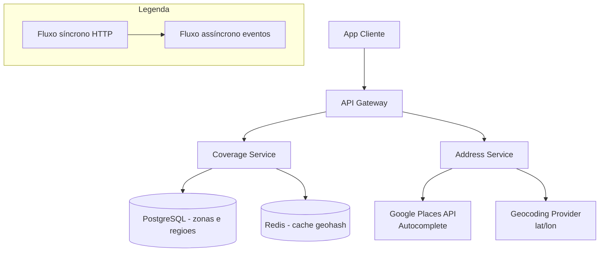

# System Design - Geolocalizacao e Cobertura de Entrega

> **Status:** Em progresso  
> **Fase:** 2  
> **Jornada:** Cliente  
> **Epico:** [Cliente §1.1 — Geolocalizacao](../../epic-ifood-clone.md#11-jornada-do-cliente-app-mobile--web)  
> **Dependencias:** [01-identidade-usuarios](../01-identidade-usuarios/system-design.md), [02-onboarding-admin](../02-onboarding-admin/system-design.md), [00-plataforma-transversal](../00-plataforma-transversal/system-design.md)

## 1. Objetivo

Determinar onde o cliente pode pedir: GPS automatico, busca preditiva (Google Places), zonas de cobertura e calculo de distancia para frete.

## 2. Escopo Funcional

### 2.1 MVP

- [ ] Leitura de GPS com fallback manual
- [ ] Autocomplete de endereco (Places API)
- [ ] Geocodificacao e persistencia (reuso Address Service)
- [ ] Verificacao: restaurante atende o endereco? (raio ou poligono)
- [ ] Lista de restaurantes disponiveis por coordenada
- [ ] Calculo de frete base por zona/regiao

### 2.2 Pos-MVP

- [ ] Multiplos enderecos com deteccao de mudanca de local
- [ ] Cobertura dinamica por demanda (surge zones)
- [ ] Cache de reverse geocoding
- [ ] Sugestao de enderecos frequentes

## 3. Requisitos Nao Funcionais

- Resposta de cobertura: **< 200ms** p95
- Atualizacao de localizacao entregador: **3-5s** (dominio 10)
- Disponibilidade do dominio: **99.9%**
- Precisao de geocoding: nivel de endereco (rua + numero)

## 4. Contexto de Negocio

A cobertura de entrega e o primeiro filtro que o cliente encontra. Se o sistema disser que nao atende o endereco errado, o cliente abandona. A experiencia de digitar o endereco com autocomplete impacta diretamente a conversao.

## 5. Arquitetura de Alto Nivel



Diagrama detalhado: [`./architecture.mermaid`](./architecture.mermaid)

## 6. Componentes

### 6.1 Coverage Service

- Recebe coordenada do cliente e retorna restaurantes elegiveis
- Gerencia zonas de cobertura (poligonos por restaurante ou regiao)
- Calcula frete base por zona
- Cache em Redis por geohash para alta performance
- Publica evento `coverage.checked` para analytics

### 6.2 Address Service (reutilizado do dominio de identidade)

- Geocodificacao: converte endereco textual em coordenadas
- Autocomplete: integracao com Google Places API
- Reverse geocoding: coordenada → endereco legivel

### 6.3 Cache Layer (Redis)

- Grid de geohash com precisao nivel 6 (~1km²)
- Cache de zonas de cobertura por restaurante
- Cache de resultados de autocomplete (termos frequentes)

## 7. Modelo de Dados

### 7.1 `delivery_zones`

| Coluna | Tipo | Restricoes | Descricao |
|--------|------|------------|-----------|
| id | UUID | PK | |
| restaurant_id | UUID | FK → restaurant_profiles.id, NULL | Restaurante (NULL se for zona da plataforma) |
| zone_type | VARCHAR(16) | NOT NULL | `radius` (raio) ou `polygon` (poligono) |
| geometry | GEOMETRY | NOT NULL | PostGIS geometry: POINT (radius) ou POLYGON |
| radius_km | DECIMAL(5,2) | NULL (se zone_type = radius) | Raio de cobertura em km |
| base_fee_cents | INT | NOT NULL, DEFAULT 0 | Frete base para a zona |
| additional_fee_per_km_cents | INT | NOT NULL, DEFAULT 0 | Acrescimo por km alem do raio base |
| min_order_cents | INT | NULL | Pedido minimo para esta zona |
| is_active | BOOLEAN | NOT NULL, DEFAULT TRUE | |
| created_at | TIMESTAMP | NOT NULL, DEFAULT NOW() | |
| updated_at | TIMESTAMP | NOT NULL, DEFAULT NOW() | |

**Indices:**
- `(restaurant_id)` — zonas de um restaurante
- `(zone_type, is_active)` — filtrar por tipo
- `geometry` — **indice GiST** obrigatorio para queries espaciais (ST_Contains, ST_DWithin)

### 7.2 `platform_regions`

| Coluna | Tipo | Restricoes | Descricao |
|--------|------|------------|-----------|
| id | UUID | PK | |
| name | VARCHAR(128) | NOT NULL | Nome da regiao (ex: "Zona Sul SP") |
| geometry | GEOMETRY(POLYGON) | NOT NULL | Poligono da regiao no mapa |
| is_active | BOOLEAN | NOT NULL, DEFAULT TRUE | |
| created_at | TIMESTAMP | NOT NULL, DEFAULT NOW() | |

**Indices:**
- `(name)` — busca por nome
- `geometry` — indice GiST

### 7.3 `coverage_cache` (cache de fallback no banco)

> **Nota:** Esta tabela e um cache de fallback para quando o Redis estiver indisponivel. O cache primario fica no Redis (secao 12.1). Em operacao normal, esta tabela e populada por um job de warming e consultada apenas em degradacao.

| Coluna | Tipo | Restricoes | Descricao |
|--------|------|------------|-----------|
| geohash | VARCHAR(16) | PK | Geohash com precisao 6 (~1km²) |
| restaurant_ids | UUID[] | NOT NULL | Array de restaurantes que atendem esta regiao |
| platform_region_id | UUID | FK → platform_regions.id, NULL | Regiao plataforma (se aplicavel) |
| base_fee_cents | INT | NOT NULL | Frete base (menor valor entre restaurantes) |
| cached_at | TIMESTAMP | NOT NULL, DEFAULT NOW() | |
| expires_at | TIMESTAMP | NOT NULL | TTL do cache |

### 7.4 `address_geocoding_cache`

| Coluna | Tipo | Restricoes | Descricao |
|--------|------|------------|-----------|
| id | UUID | PK | |
| address_hash | VARCHAR(64) | NOT NULL, UNIQUE | Hash SHA-256 do endereco textual |
| latitude | DECIMAL(10,7) | NOT NULL | |
| longitude | DECIMAL(10,7) | NOT NULL | |
| formatted_address | VARCHAR(512) | NULL | Endereco formatado pelo provider |
| place_id | VARCHAR(256) | NULL | Google Place ID (se aplicavel) |
| provider | VARCHAR(32) | NOT NULL | `google_maps`, `here`, `openstreetmap` |
| cached_at | TIMESTAMP | NOT NULL, DEFAULT NOW() | |
| expires_at | TIMESTAMP | NOT NULL | TTL de 30 dias |

**Indices:**
- `(address_hash)` — UNIQUE, consulta exata por hash

### 7.5 `delivery_fee_tiers`

| Coluna | Tipo | Restricoes | Descricao |
|--------|------|------------|-----------|
| id | UUID | PK | |
| restaurant_id | UUID | FK → restaurant_profiles.id, NOT NULL | |
| zone_id | UUID | FK → delivery_zones.id, NULL | Zona especifica (NULL = regra global do restaurante) |
| min_distance_km | DECIMAL(5,2) | NOT NULL, DEFAULT 0 | Distancia minima para esta faixa |
| max_distance_km | DECIMAL(5,2) | NOT NULL | Distancia maxima para esta faixa |
| fee_cents | INT | NOT NULL | Frete para esta faixa |
| created_at | TIMESTAMP | NOT NULL, DEFAULT NOW() | |

**Indices:**
- `(restaurant_id, min_distance_km)` — consulta por faixa de distancia

> **Nota sobre nomenclatura:** Esta tabela (`delivery_fee_tiers`) define faixas de taxa de entrega baseadas em **distancia linear** (min_distance_km, max_distance_km). O dominio de Promocoes (design 15) possui uma tabela `delivery_fee_rules` com regras baseadas em **polígonos GeoJSON** e vigencia temporal. As duas tabelas sao complementares e residem em schemas diferentes do PostgreSQL.

## 8. Fluxos Principais

### 8.1 Cliente abre app com GPS

1. App cliente obtem coordenada via GPS (ou ultima localizacao conhecida).
2. App envia `GET /v1/coverage/restaurants?lat=-23.5505&lon=-46.6333`.
3. Coverage Service calcula geohash da coordenada (precisao 6).
4. Consulta `coverage_cache` no Redis pela chave `coverage:{geohash}`.
5. Se cache hit: retorna restaurantes e frete base imediatamente.
6. Se cache miss: consulta PostgreSQL com query espacial (ST_DWithin + ST_Contains).
7. Popula cache com resultado e TTL de 5 minutos.
8. Retorna lista de restaurantes ordenada por distancia.

### 8.2 Cliente digita endereco manualmente

1. Cliente comeca a digitar o endereco.
2. App envia `GET /v1/places/autocomplete?q=Rua Augusta, 1500`.
3. Coverage Service delega ao Address Service, que consulta Google Places API.
4. Resultados sao cacheados no Redis por termo (TTL: 1 hora).
5. Cliente seleciona um endereco.
6. App envia `GET /v1/coverage/restaurants?lat=-23.5555&lon=-46.6555` com a coordenada selecionada.
7. Coverage Service calcula cobertura normalmente (fluxo 8.1).

### 8.3 Verificacao de cobertura durante o fluxo de pedido

1. Cliente esta no carrinho e altera o endereco de entrega.
2. Cart Service consulta Coverage Service para validar se o restaurante ainda atende o novo endereco.
3. Se nao atende: avisa cliente que o restaurante nao entrega no novo endereco e sugere trocar de restaurante.
4. Se atende: recalcula frete e atualiza total do carrinho.

### 8.4 Atualizacao de zona de cobertura (admin)

1. Admin adiciona/edita zona de cobertura no painel (poligono ou raio).
2. Coverage Service persiste a alteracao em `delivery_zones`.
3. Coverage Service invalida entradas do cache `coverage_cache` afetadas pelo geohash da zona.
4. Publica evento `coverage.zone.updated`.
5. Cache e repovoado na proxima consulta (lazy loading).

## 9. Contratos de API

### 9.1 Padrao de erro

Segue o [padrao global definido na Plataforma Transversal](../00-plataforma-transversal/system-design.md#91-padrao-de-erro-global).

### 9.2 Endpoints do dominio de cobertura

#### `GET /v1/coverage/restaurants?lat=&lon=`

Retorna restaurantes que atendem a coordenada.

**Query params:**
- `lat` (DECIMAL, obrigatorio) — Latitude (-23.5505)
- `lon` (DECIMAL, obrigatorio) — Longitude (-46.6333)
- `page` (INT, opcional, default 1)
- `pageSize` (INT, opcional, default 20)

**Response (200):**
```json
{
  "latitude": -23.5505,
  "longitude": -46.6333,
  "geohash": "6gyf4bf",
  "restaurants": [
    {
      "restaurantId": "uuid",
      "name": "Pizza Prime",
      "distanceKm": 1.5,
      "deliveryFeeCents": 500,
      "estimatedMinutes": 30,
      "isOpen": true,
      "averageRating": 4.5,
      "category": "Pizzaria"
    }
  ],
  "total": 12,
  "page": 1,
  "pageSize": 20
}
```

#### `GET /v1/places/autocomplete?q=`

Autocomplete de endereco via Google Places (ou provider configurado).

**Query params:**
- `q` (STRING, obrigatorio) — Termo de busca (min 3 caracteres)
- `lat` (DECIMAL, opcional) — Latitude para bias de resultados
- `lon` (DECIMAL, opcional) — Longitude para bias de resultados

**Response (200):**
```json
{
  "predictions": [
    {
      "placeId": "ChIJ...",
      "description": "Rua Augusta, 1500 - Consolação, São Paulo - SP",
      "mainText": "Rua Augusta, 1500",
      "secondaryText": "Consolação, São Paulo - SP",
      "latitude": -23.5555,
      "longitude": -46.6555
    }
  ]
}
```

#### `POST /v1/coverage/validate`

Valida se um restaurante atende um endereco (usado pelo Cart Service).

**Request body:**
```json
{
  "restaurantId": "uuid",
  "latitude": -23.5505,
  "longitude": -46.6333
}
```

**Response (200):**
```json
{
  "isCovered": true,
  "distanceKm": 2.3,
  "deliveryFeeCents": 700,
  "estimatedMinutes": 35,
  "zoneId": "uuid"
}
```

#### `GET /v1/admin/zones`

Lista zonas de cobertura (admin).

**Query params:** `?restaurantId=uuid&zoneType=radius`

#### `POST /v1/admin/zones`

Cria nova zona de cobertura.

**Request body (radius):**
```json
{
  "restaurantId": "uuid",
  "zoneType": "radius",
  "latitude": -23.5505,
  "longitude": -46.6333,
  "radiusKm": 5.0,
  "baseFeeCents": 500,
  "additionalFeePerKmCents": 100,
  "minOrderCents": 1500
}
```

**Response (201):** `{ "id": "uuid", "zoneType": "radius", "isActive": true }`

### 9.3 Health check

Segue o [padrao definido no documento 00](../00-plataforma-transversal/system-design.md#92-health-check).

## 10. Contratos de Eventos

> **Nota:** O envelope padrao dos eventos e definido pela **Plataforma Transversal** (documento 00). Consulte a [secao 10 do System Design 00](../00-plataforma-transversal/system-design.md#10-contratos-de-eventos) para o schema completo do envelope, politica de versionamento e topic naming.

### 10.1 `coverage.checked`

Publicado quando um cliente verifica cobertura (para analytics).

**Payload:**
```json
{
  "userId": "e5f3ef90-6f3a-4f5a-b7f3-7c8c4cd3f9aa",
  "latitude": -23.5505,
  "longitude": -46.6333,
  "geohash": "6gyf4bf",
  "resultCount": 12,
  "cacheHit": true,
  "checkedAt": "2026-07-04T14:30:00.000Z"
}
```

**Consumidores:** Analytics.

### 10.2 `coverage.zone.updated`

Publicado quando uma zona de cobertura e criada, editada ou removida.

**Payload:**
```json
{
  "zoneId": "a1b2c3d4-e5f6-7890-abcd-ef1234567890",
  "restaurantId": "uuid",
  "action": "created",
  "changedAt": "2026-07-04T14:30:00.000Z",
  "affectedGeohashes": ["6gyf4bf", "6gyf4bg", "6gyf4bh"]
}
```

**Consumidores:** Cache (invalidation for affected geohashes), Search Indexer.

### 10.3 Eventos consumidos de outros dominios

Além dos eventos que produz, o Coverage Service consome:

| Evento | Produtor (Design) | Impacto no Coverage Service |
|--------|-------------------|-----------------------------|
| `restaurant.availability.changed` | Menu Service (03) | Atualizar cache de cobertura: restaurante fechado não aparece na lista de disponiveis |

### 10.4 Tabela de eventos do dominio

| Evento | Produtor | Consumidores | Schema Version |
|--------|----------|--------------|----------------|
| `coverage.checked` | Coverage Service | Analytics | 1.0 |
| `coverage.zone.updated` | Coverage Service | Cache, Search | 1.0 |

## 11. Seguranca

### 11.1 Privacidade de localizacao (LGPD)

- Coordenadas do cliente **nunca** sao persistidas em banco fora do contexto de endereco salvo pelo usuario.
- Logs de consulta de cobertura retem `geohash` (precisao 6, ~1km²), nunca lat/lon exato.
- TTL do cache de geocoding: 30 dias. Apos esse periodo, o hash do endereco e a coordenada sao removidos.
- Endpoint de exportacao LGPD: inclui enderecos salvos, exclui historico de consultas de cobertura.

### 11.2 Dependencia de provedor externo

- Google Places API requer **API key** com restricao de HTTP referrer e IP.
- Geocoding provider deve ter **fallback** configurado (ex: OpenStreetMap Nominatim como secundario).
- Chaves gerenciadas via KMS/Vault, nunca em codigo fonte.

### 11.3 Protecoes no Gateway

- Rate limit em `GET /v1/places/autocomplete`: **30 requests/min** por usuario (evitar abuso da Google Places API, que tem custo por request).
- Rate limit em `GET /v1/coverage/restaurants`: **60 requests/min** por usuario.
- Validacao de coordenadas: latitude entre -90 e 90, longitude entre -180 e 180.

## 12. Escalabilidade

### 12.1 Cache

| Recurso | Estrategia | TTL | Invalidação |
|---------|------------|-----|-------------|
| Cobertura por geohash | Redis hash `coverage:{geohash}` | 5min | Por evento `coverage.zone.updated` |
| Autocomplete de endereco | Redis por termo de busca | 1h | TTL expira |
| Geocoding (address → lat/lon) | PostgreSQL (`address_geocoding_cache`) | 30 dias | Expurgo por job cron |
| Zonas de cobertura | Redis hash `zone:{restaurant_id}` | 10min | Por evento `coverage.zone.updated` |

### 12.2 PostgreSQL e PostGIS

> **Requisito:** A extensao **PostGIS** deve estar instalada no PostgreSQL. Sem ela, os tipos `GEOMETRY` e as funcoes `ST_DWithin`, `ST_Contains`, `ST_MakePoint` nao estarao disponiveis.

- Indice **GiST** em `delivery_zones.geometry` obrigatorio para queries espaciais.
- Query de cobertura: `ST_DWithin(geometry, ST_MakePoint(lon, lat)::geography, radius_meters)`.
- Particionamento futuro de `coverage_cache` por geohash prefix (ex: primeiro caractere).

### 12.3 Estrategia de fallback

1. **Cache hit (Redis)**: resposta em < 5ms.
2. **Cache miss**: query espacial no PostgreSQL com PostGIS (< 100ms com indices GiST).
3. **PostgreSQL indisponivel**: retornar lista vazia com status `degraded` (cliente ve mensagem "tente novamente").
4. **Google Places indisponivel**: fallback para busca textual simples sem autocomplete.

### 12.4 Estimativa de capacidade

| Recurso | Estimativa | Folga |
|---------|------------|-------|
| Consultas de cobertura (pico) | 5k RPS | 2x (10k) |
| Zonas de cobertura | 5k (1 por restaurante) | 3x (15k) |
| Geohashes unicos em cache | 10k (cidade grande) | 3x (30k) |
| Consultas de autocomplete (pico) | 500 RPS | 2x (1k) |
| Cache de geocoding | 500k entradas | 2x (1M) |

## 13. Observabilidade

### 13.1 Logs estruturados

Segue o [padrao do documento 00](../00-plataforma-transversal/system-design.md#131-logs-estruturados). Campos adicionais:

- `geohash` — geohash da consulta (nunca lat/lon bruto)
- `cacheHit` — true/false para monitoramento do cache
- `provider` — google_maps, here, openstreetmap (para tracking de dependencia externa)

### 13.2 Metricas especificas do dominio

| Metrica | Tipo | Descricao |
|---------|------|-----------|
| `coverage_requests_total` | Counter | Consultas de cobertura por resultado (covered/not_covered) |
| `coverage_request_duration_ms` | Histogram | Latencia p50/p95/p99 da consulta de cobertura |
| `coverage_cache_hit_ratio` | Gauge | Taxa de acerto do cache de cobertura |
| `places_autocomplete_requests_total` | Counter | Consultas de autocomplete |
| `places_autocomplete_duration_ms` | Histogram | Latencia do Google Places API |
| `geocoding_requests_total` | Counter | Requests de geocoding por provider |
| `geocoding_fallback_total` | Counter | Vezes que o fallback de geocoding foi acionado |
| `coverage_zones_total` | Gauge | Total de zonas ativas por tipo |

### 13.3 Dashboard (Grafana)

- **Cobertura — RPS e latencia** — desempenho do endpoint principal
- **Cache hit ratio** — grafico de acerto do cache de cobertura
- **Google Places — latencia e erros** — monitoramento de dependencia externa
- **Zonas ativas** — total de zonas por tipo (radius vs polygon)
- **Fallback count** — quando o provider secundario foi acionado

### 13.4 Alertas especificos

| Alerta | Condicao | Severidade | Acao |
|--------|----------|------------|------|
| Cache hit ratio baixo | < 70% em 5min | P2 | Investigar causa — TTL muito curto? zonas mudando com frequencia? |
| Google Places com alta latencia | p95 > 1s em 5min | P2 | Verificar quota da API key, considerar fallback |
| Google Places com erros | > 5% de erro em 5min | P2 | Ativar fallback automaticamente, notificar equipe |
| Coverage Service lentidao | p95 > 500ms em 5min | P2 | Verificar queries espaciais, indices GiST, carga do banco |
| Fallback de geocoding acionado | > 10 fallbacks/min | P3 | Provider primario pode estar degradado |

## 14. Resiliencia

### 14.1 Timeouts

| Tipo de chamada | Timeout | Justificativa |
|-----------------|---------|---------------|
| Query PostgreSQL com PostGIS | 2s | Com indice GiST, maioria < 50ms |
| Operacao Redis | 300ms | Cache em memoria |
| Google Places API | 3s | API externa com latencia variavel |
| Geocoding provider | 5s | Provider externo |

### 14.2 Retries com jitter

| Cenario | Tentativas | Intervalo | Jitter |
|---------|------------|-----------|--------|
| Google Places API timeout | 2 | 500ms, 1s | +/- 100ms |
| Geocoding provider falha | 2 | 500ms, 1s | +/- 100ms |
| Apos falha do provider primario | 1 | Imediato (fallback) | N/A |

### 14.3 Circuit breaker

| Circuito | Threshold de falha | Janela | Tempo de half-open |
|----------|--------------------|--------|---------------------|
| Google Places API | 5 falhas | 60s | 30s |
| Geocoding provider primario | 5 falhas | 60s | 30s |

### 14.4 Graceful degradation

| Cenario | Acao |
|---------|------|
| Redis indisponivel | Coverage Service consulta PostgreSQL diretamente (lentidao, mas funcional) |
| PostgreSQL indisponivel | Retorna erro 503 com mensagem "servico temporariamente indisponivel" |
| Google Places API em falha | Desativa autocomplete, cliente digita endereco manualmente |
| Ambos providers de geocoding em falha | Coverage Service usa fallback para coordenada aproximada por CEP |

### 14.5 Consistencia do cache de cobertura

1. Zona de cobertura e alterada no banco.
2. Evento `coverage.zone.updated` e publicado com os geohashes afetados.
3. Cache Coverage Service escuta o evento e invalida as entradas `coverage:{geohash}` correspondentes.
4. Proxima consulta para aquele geohash resulta em cache miss → repovoa do banco.
5. Se o evento for perdido, TTL de 5min garante consistencia eventual.

## 15. Decisoes Arquiteturais (ADRs)

### ADR-001: Geohash para Cache de Cobertura

| Campo | Valor |
|-------|-------|
| **Decisao** | Cache de cobertura baseado em geohash com precisao 6 (~1km²) |
| **Contexto** | Consultar PostGIS a cada request tem latencia > 50ms. Precisao de 1km e aceitavel para determinar se um restaurante atende a regiao. |
| **Alternativas** | PostGIS em toda request (mais preciso, mas mais lento), grade de lat/lon fixa (menos flexivel que geohash) |
| **Consequencias** | Positivas: latencia < 5ms no cache hit, cobertura de todo o planeta com hierarquia de precisao. Negativas: consultas em bordas de geohash podem retornar resultados ligeiramente diferentes (resolvido com overlap nas zonas). |
| **Status** | Aprovado |

### ADR-002: Google Places com Fallback para Busca Textual

| Campo | Valor |
|-------|-------|
| **Decisao** | Autocomplete via Google Places API com fallback para busca textual simples |
| **Contexto** | Google Places tem custo por request e pode ficar indisponivel. Sem autocomplete, a experiencia de digitar endereco e muito pior. |
| **Alternativas** | So Google Places (sem fallback, experiencia quebrada se API cair), OpenStreetMap Nominatim (gratuito, mas menos preciso no Brasil) |
| **Consequencias** | Positivas: autocomplete de alta qualidade no dia a dia, fallback funcional em caso de falha. Negativas: custo operacional da Google Places, complexidade de manter dois providers. |
| **Status** | Aprovado |

### ADR-003: Zonas de Cobertura como Poligonos e Raios

| Campo | Valor |
|-------|-------|
| **Decisao** | Suportar dois tipos de zona: `radius` (raio a partir de ponto) e `polygon` (poligono arbitrario) |
| **Contexto** | Restaurantes menores usam raio simples. Redes e regioes administrativas precisam de poligonos personalizados. |
| **Alternativas** | Apenas raio (simples, mas limitado para zonas irregulares), apenas poligono (flexivel, mas complexo para restaurantes pequenos) |
| **Consequencias** | Positivas: atende tanto restaurantes simples quanto redes. Negativas: duas estrategias de calculo de cobertura para manter e testar. |
| **Status** | Aprovado |

### ADR-004: Frete Calculado por Zona, nao por Distancia Linear

| Campo | Valor |
|-------|-------|
| **Decisao** | Frete calculado com base em faixas de distancia dentro da zona de cobertura, nao por distancia linear pura |
| **Contexto** | Distancia linear (haversine) nao reflete a distancia real de entrega (ruas, transito). Mas calcular rota real para cada consulta de cobertura seria muito lento. |
| **Alternativas** | Distancia linear pura (simples, mas frete irrealista em zonas com geografia complexa), calculo de rota em tempo real (muito lento para 5k RPS) |
| **Consequencias** | Positivas: frete previsivel para o cliente, rapido de calcular. Negativas: frete aproximado, pode ser maior ou menor que a distancia real. Faixas configuradas pelo restaurante no painel admin. |
| **Status** | Aprovado |

## 16. Riscos e Mitigacoes

| Risco | Probabilidade | Impacto | Mitigacao |
|-------|---------------|---------|-----------|
| **Google Places com alta latencia/erro** | Media | Alto | Circuit breaker, fallback para busca textual, cache de termos frequentes |
| **Cache de cobertura servindo dados desatualizados** | Media | Medio | TTL curto (5min), invalidacao por evento, lazy refresh |
| **Query espacial lenta sem indice GiST** | Baixa | Critico | Migracao com indice obrigatorio, monitoramento de query performance |
| **Vazamento de coordenadas do cliente** | Baixa | Critico | Log apenas com geohash, nunca lat/lon bruto, criptografia em repouso |
| **Custo elevado da Google Places API** | Media | Medio | Rate limit por usuario, cache agressivo, monitoramento de quota |
| **Zona de cobertura mal configurada (restaurante nao entrega)** | Media | Alto | Validacao no painel admin, mapa de preview da zona, aprovacao antes de ativar |
| **Cliente em borda de geohash** | Baixa | Baixo | Overlap de zonas, consultar geohashes vizinhos em caso duvidoso |

### 16.1 Matriz de probabilidade x impacto

```
Impacto:  Baixo      Medio       Alto        Critico
Probabilidade
Alta      |           |            |            |
Media     |           | Cache desat.| Google Pl. | 
          |           | Config.    | Custo API  |
          |           | errada     |            |
Baixa     | Borda     |            |            | Vazamento, 
          | geohash   |            |            | Query lenta
```

---

> **Documentos relacionados:** [Template de system design](../../templates/system-design-template.md) | [Roadmap](../../roadmap/ordem-das-jornadas.md) | [Epico iFood Clone](../../epic-ifood-clone.md) | [Plataforma Transversal](../00-plataforma-transversal/system-design.md)
