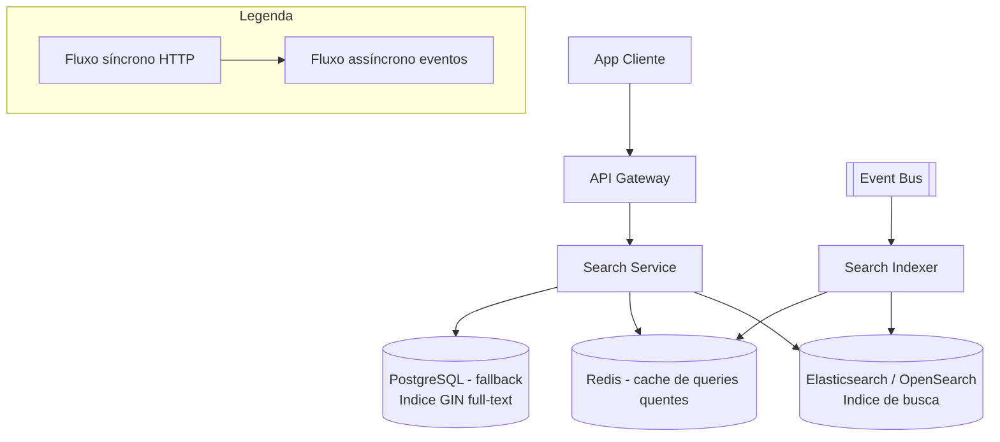

# System Design - Busca e Filtros

> **Status:** Em progresso  
> **Fase:** 2  
> **Jornada:** Cliente  
> **Epico:** [Cliente §1.1 — Busca e filtros](../../epic-ifood-clone.md#11-jornada-do-cliente-app-mobile--web)  
> **Dependencias:** [03-gestao-cardapio](../03-gestao-cardapio/system-design.md), [04-geolocalizacao-cobertura](../04-geolocalizacao-cobertura/system-design.md), [00-plataforma-transversal](../00-plataforma-transversal/system-design.md)

## 1. Objetivo

Busca por nome de prato, restaurante e categoria com filtros (taxa de entrega, tempo estimado, frete gratis) em **< 200ms** p95.

## 2. Escopo Funcional

### 2.1 MVP

- [ ] Busca full-text: restaurante, item, categoria
- [ ] Filtros: categoria culinaria, frete gratis, tempo estimado, nota media
- [ ] Ordenacao: relevancia, distancia, avaliacao, tempo
- [ ] Paginacao cursor-based
- [ ] Indexacao assincrona via `menu.updated`, `menu.item.unavailable`, `menu.published`
- [ ] Sugestoes de busca (autocomplete)

### 2.2 Pos-MVP

- [ ] Busca fonetica e sinonimos
- [ ] Personalizacao por historico
- [ ] Busca por imagem (foto do prato)

## 3. Requisitos Nao Funcionais

- Latencia p95: **< 200ms** (requisito global do epico)
- Indexacao apos mudanca de cardapio: **< 30s**
- Disponibilidade do dominio: **99.9%**
- Consistencia: indices eventualmente consistentes com a fonte da verdade (Menu Service)

## 4. Contexto de Negocio

Busca e a principal forma de descoberta na plataforma. Mais de 70% dos pedidos comecam com uma busca. Uma busca lenta ou com resultados irrelevantes impacta diretamente a taxa de conversao.

## 5. Arquitetura de Alto Nivel



Diagrama detalhado: [`./architecture.mermaid`](./architecture.mermaid)

## 6. Componentes

### 6.1 Search Service

- Recebe query do cliente, aplica filtros e retorna resultados paginados
- Orquestra multicamada: cache → Elasticsearch → fallback PostgreSQL
- Aplica regras de ranking (relevancia, distancia, avaliacao)
- Retorna facetas para refinamento (categorias, faixas de preco, etc.)

### 6.2 Search Indexer (consumidor de eventos)

- Consome eventos do dominio de cardapio, cobertura e avaliacoes
- Atualiza o indice no Elasticsearch/OpenSearch
- Invalida cache de queries quentes no Redis
- Processa em batch com debounce para evitar sobrecarga em picos

### 6.3 Elasticsearch / OpenSearch

- Indice principal de busca
- Documentos denormalizados para consulta rapida
- Sharding por `restaurant_id` para performance geografica

## 7. Modelo de Dados (Indice de Busca)

### 7.1 Documento `restaurant_search_doc`

Documento unico no Elasticsearch contendo todo o necessario para busca e filtro:

| Campo | Tipo | Descricao | Usado para |
|-------|------|-----------|------------|
| `restaurant_id` | keyword | ID do restaurante | Agrupamento |
| `name` | text + keyword | Nome do restaurante | Busca full-text + ordenacao |
| `description` | text | Descricao do restaurante | Busca full-text |
| `categories` | nested | `[{ id, name, items: [{ id, name, description, price_cents, is_available }] }]` | Busca por item e categoria |
| `item_names` | text[] | Array de nomes de itens para busca | Busca full-text simplificada |
| `cuisine_type` | keyword | Tipo de culinaria | Filtro de categoria |
| `avg_rating` | float | Nota media (0-5) | Filtro e ordenacao |
| `review_count` | int | Total de avaliacoes | Ordenacao (peso) |
| `delivery_fee_cents` | int | Frete base do restaurante | Filtro (frete gratis) |
| `min_order_cents` | int | Pedido minimo | Filtro |
| `base_preparation_time_seconds` | int | Tempo base de preparo do restaurante (sem considerar distancia) | Ordenacao (fixo) |
| `location` | geo_point | `{ lat, lon }` do restaurante | Filtro geografico + ordenacao por distancia |
| `is_open` | boolean | Se esta aberto no momento | Filtro padrao (somente abertos) |
| `is_accepting_orders` | boolean | Se esta aceitando pedidos | Filtro padrao |
| `last_menu_version` | int | Versao do cardapio indexada | Controle de consistencia |

### 7.2 Mapeamento Elasticsearch

```json
{
  "mappings": {
    "properties": {
      "restaurant_id": { "type": "keyword" },
      "name": {
        "type": "text",
        "fields": { "keyword": { "type": "keyword" } },
        "analyzer": "brazilian"
      },
      "description": { "type": "text", "analyzer": "brazilian" },
      "categories": {
        "type": "nested",
        "properties": {
          "id": { "type": "keyword" },
          "name": { "type": "text", "analyzer": "brazilian" },
          "items": {
            "type": "nested",
            "properties": {
              "id": { "type": "keyword" },
              "name": { "type": "text", "analyzer": "brazilian" },
              "description": { "type": "text", "analyzer": "brazilian" },
              "price_cents": { "type": "integer" },
              "is_available": { "type": "boolean" }
            }
          }
        }
      },
      "item_names": { "type": "text", "analyzer": "brazilian" },
      "cuisine_type": { "type": "keyword" },
      "avg_rating": { "type": "float" },
      "review_count": { "type": "integer" },
      "delivery_fee_cents": { "type": "integer" },
      "min_order_cents": { "type": "integer" },
      "estimated_minutes": { "type": "integer" },
      "location": { "type": "geo_point" },
      "is_open": { "type": "boolean" },
      "is_accepting_orders": { "type": "boolean" },
      "last_menu_version": { "type": "integer" }
    }
  },
  "settings": {
    "number_of_shards": 3,
    "number_of_replicas": 1,
    "analysis": {
      "analyzer": {
        "brazilian": {
          "type": "brazilian"
        }
      }
    }
  }
}
```

### 7.3 Indice de sugestoes (autocomplete)

```json
{
  "mappings": {
    "properties": {
      "suggest": {
        "type": "completion",
        "analyzer": "brazilian",
        "contexts": [
          { "name": "cuisine_type", "type": "category", "path": "cuisine_type" }
        ]
      },
      "restaurant_id": { "type": "keyword" }
    }
  }
}
```

### 7.4 Cache de queries quentes (Redis)

- Chave: `search:query:{hash_da_query}`
- Valor: JSON com resultados paginados (ate pagina 3)
- TTL: 2 minutos
- Invalidacao: ao receber `menu.updated` ou `menu.published`

## 8. Fluxos Principais

### 8.1 Busca com filtros

1. Cliente envia `GET /v1/search/restaurants?q=pizza&lat=-23.5505&lon=-46.6333&sort=relevance&filters=freeDelivery,openNow`.
2. Search Service calcula hash da query e verifica cache Redis.
3. Se cache hit: retorna resultados imediatamente (< 5ms).
4. Se cache miss: monta query Elasticsearch com:
   - **Filtro geografico**: `geo_distance` com raio de 20km (vindo do Coverage Service).
   - **Filtro de disponibilidade**: `is_open: true` e `is_accepting_orders: true`.
   - **Busca full-text**: query multi-match em `name`, `description`, `item_names` e `categories.items.name`.
   - **Filtro frete gratis**: `delivery_fee_cents: 0`.
5. Aplica boosting:
   - `avg_rating` > 4.0 → boost 1.2
   - `is_open: true` → boost 1.5
6. Ordena por score de relevancia (ou distancia, se `sort=distance`).
7. Retorna pagina com metadados de facetas (categorias encontradas, faixa de precos, etc.).
8. Popula cache Redis com TTL de 2 minutos.

### 8.2 Autocomplete / Sugestoes

1. Cliente digita "piz" no campo de busca.
2. App envia `GET /v1/search/suggestions?q=piz&lat=-23.5505&lon=-46.6333`.
3. Search Service consulta Elasticsearch com `suggest` completion suggester.
4. Retorna sugestoes: "Pizza", "Pizzaria", "Pizza Prime", "Pizza Hut".
5. Cache no Redis por termo (TTL: 5 minutos).

### 8.3 Indexacao apos publicacao de cardapio

1. Restaurante publica cardapio → Menu Service publica `menu.published`.
2. Search Indexer consome o evento.
3. Indexer monta o documento `restaurant_search_doc` completo com dados do Menu Service e Coverage Service.
4. Indexa/substitui o documento no Elasticsearch.
5. Invalida entradas de cache no Redis que contenham o `restaurant_id`.
6. Tempo total do evento ate indexacao: **< 30s**.

### 8.4 Degradacao graceful — Elasticsearch indisponivel

1. Search Service detecta que Elasticsearch esta retornando erros (timeout, connection refused).
2. Ativa modo degradado: consulta PostgreSQL com indice GIN full-text.
3. PostgreSQL nao tem suporte a geo_distance, entao o filtro geografico e feito em aplicacao.
4. Ranking usa apenas `avg_rating` e `delivery_fee_cents` (sem relevancia full-text).
5. Cache Redis continua operacional (se disponivel).
6. Quando Elasticsearch recuperar, Indexer repopula indices e Search Service volta ao normal.

## 9. Contratos de API

### 9.1 Padrao de erro

Segue o [padrao global definido na Plataforma Transversal](../00-plataforma-transversal/system-design.md#91-padrao-de-erro-global).

### 9.2 Endpoints do dominio de busca

#### `GET /v1/search/restaurants?q=&lat=&lon=`

Busca full-text de restaurantes e pratos.

**Query params:**
- `q` (STRING, obrigatorio) — Termo de busca (min 1 caractere)
- `lat` (DECIMAL, obrigatorio) — Latitude do cliente
- `lon` (DECIMAL, obrigatorio) — Longitude do cliente
- `filters` (STRING, opcional) — Filtros separados por virgula: `freeDelivery`, `openNow`, `rating:[4-5]`, `maxFee:1000`, `cuisine:pizza`
- `sort` (STRING, opcional, default `relevance`) — `relevance`, `distance`, `rating`, `deliveryTime`
- `cursor` (STRING, opcional) — Cursor para paginacao (base64 encoded)
- `pageSize` (INT, opcional, default 20)

**Response (200):**
```json
{
  "results": [
    {
      "restaurantId": "uuid",
      "name": "Pizza Prime",
      "description": "A melhor pizza da regiao",
      "cuisineType": "pizzaria",
      "avgRating": 4.5,
      "reviewCount": 328,
      "deliveryFeeCents": 0,
      "minOrderCents": 1500,
      "estimatedMinutes": 35,
      "distanceKm": 1.5,
      "isOpen": true,
      "matchedItems": [
        { "name": "Pizza Margherita", "priceCents": 2990 },
        { "name": "Pizza Calabresa", "priceCents": 3290 }
      ]
    }
  ],
  "facets": {
    "cuisineTypes": [
      { "value": "pizzaria", "count": 12 },
      { "value": "japonesa", "count": 8 },
      { "value": "brasileira", "count": 15 }
    ],
    "priceRange": { "min": 0, "max": 5000 },
    "maxDeliveryFee": 1500
  },
  "metadata": {
    "totalResults": 42,
    "pageSize": 20,
    "nextCursor": "base64encodedcursor",
    "queryProcessingTimeMs": 45,
    "cacheHit": false
  }
}
```

#### `GET /v1/search/suggestions?q=&lat=&lon=`

Sugestoes de busca para autocomplete.

**Query params:**
- `q` (STRING, obrigatorio) — Termo parcial (min 2 caracteres)
- `lat` (DECIMAL, opcional) — Latitude para bias
- `lon` (DECIMAL, opcional) — Longitude para bias

**Response (200):**
```json
{
  "suggestions": [
    { "text": "Pizza", "type": "cuisine", "resultCount": 42 },
    { "text": "Pizza Prime", "type": "restaurant", "restaurantId": "uuid" },
    { "text": "Pizza Margherita", "type": "item", "restaurantId": "uuid" }
  ],
  "queryProcessingTimeMs": 12
}
```

### 9.3 Health check

Segue o [padrao definido no documento 00](../00-plataforma-transversal/system-design.md#92-health-check).

## 10. Contratos de Eventos

> **Nota:** O envelope padrao dos eventos e definido pela **Plataforma Transversal** (documento 00). Consulte a [secao 10 do System Design 00](../00-plataforma-transversal/system-design.md#10-contratos-de-eventos) para o schema completo do envelope, politica de versionamento e topic naming.

### 10.1 Eventos consumidos pelo Search Indexer

| Evento | Produtor (Design) | Acao no Indexer |
|--------|-------------------|-----------------|
| `menu.published` | Menu Service (03) | Reindexar restaurante completo (busca + sugestoes) |
| `menu.updated` | Menu Service (03) | Atualizar campos alterados do restaurante no indice |
| `menu.item.unavailable` | Menu Service (03) | Atualizar `is_available` do item no indice |
| `restaurant.availability.changed` | Menu Service (03) | Atualizar `is_open` no indice |
| `coverage.zone.updated` | Coverage Service (04) | Reindexar restaurantes afetados pela zona (consulta ao Coverage Service para resolver `restaurant_ids` a partir dos geohashes) |
| `restaurant.rating.updated` | Rating Service (13) | Atualizar `avg_rating` e `review_count` no indice |

### 10.2 Tabela de eventos do dominio

O Search Service e puramente consumidor — nao publica eventos de dominio. Excecao: eventos de analytics internos (nao fazem parte do Event Bus).

## 11. Seguranca

### 11.1 Acesso aos indices

- Elasticsearch em rede interna, sem exposicao publica.
- Apenas Search Service tem acesso ao Elasticsearch (politica de menor privilegio).
- Queries de busca sao parametrizadas (nunca concatenacao de strings) — prevencao de injection na query DSL.

### 11.2 Privacidade

- Resultados de busca nao expoem dados sensiveis (apenas nome, descricao, preco, nota).
- Endereco do restaurante e exposto apenas como distancia (km), nunca endereco completo.
- Cache de queries no Redis nao retem dados de usuario (apenas termos de busca anonimos).

### 11.3 Protecoes no Gateway

- Rate limit em `GET /v1/search/restaurants`: **60 requests/min** por usuario.
- Rate limit em `GET /v1/search/suggestions`: **120 requests/min** por usuario.
- Tamanho maximo da query: **200 caracteres** (evitar abuso com queries enormes).
- Timeout de busca: **500ms** (elasticsearch) + **200ms** (fallback PG).

## 12. Escalabilidade

### 12.1 Cache

| Recurso | Estrategia | TTL | Invalidacao |
|---------|------------|-----|-------------|
| Queries de busca (paginas 1-3) | Redis hash `search:query:{hash}` | 2min | Por evento de cardapio/cobertura |
| Sugestoes de autocomplete | Redis `search:suggest:{termo}` | 5min | Por publicacao de cardapio |
| Documentos de restaurante | Cache local no Search Service (LRU) | 1min | |

### 12.2 Elasticsearch

- **3 shards primarios**, 1 replica cada — distribuicao por `restaurant_id`.
- Refresh interval: **5s** (padrao) — indexacoes em batch sao visiveis em ate 5s.
- Translog: `async` e `512MB` para performance de indexacao.
- Circuit breaker de indices: 95% de memoria utilizada → queries sao rejeitadas com 429.

### 12.3 Fallback PostgreSQL

- Indice **GIN** com `pg_trgm` para busca full-text quando Elasticsearch estiver indisponivel.
- Tabela `restaurant_search_fallback` espelhando o documento do ES.
- Populada pelo mesmo Search Indexer que alimenta o ES.
- Sem geo_distance — filtro geografico feito em aplicacao.

### 12.4 Estrategia de paginacao cursor-based

- Cursor codifica: `sort`, `last_value`, `restaurant_id` (para desempate).
- Exemplo: `base64({ "sort": "relevance", "lastScore": 4.5, "lastId": "uuid" })`.
- Evita problemas de paginacao profunda do Elasticsearch (`from + size` limitado a 10k).

### 12.5 Estimativa de capacidade

| Recurso | Estimativa | Folga |
|---------|------------|-------|
| Buscas por segundo (pico) | 2k RPS | 2x (4k) |
| Documentos no indice | 5k (restaurantes) | 3x (15k) |
| Tamanho do indice | ~500MB | 2x (1GB) |
| Queries cacheadas no Redis | 10k entradas | 2x (20k) |
| Sugestoes cacheadas | 5k entradas | 2x (10k) |

## 13. Observabilidade

### 13.1 Logs estruturados

Segue o [padrao do documento 00](../00-plataforma-transversal/system-design.md#131-logs-estruturados). Campos adicionais:

- `query` — termo de busca (anonimizado)
- `resultCount` — total de resultados
- `queryDurationMs` — tempo de processamento
- `cacheHit` — true/false
- `tier` — `cache` | `elasticsearch` | `fallback_pg`

### 13.2 Metricas especificas do dominio

| Metrica | Tipo | Descricao |
|---------|------|-----------|
| `search_requests_total` | Counter | Buscas por termo e filtros |
| `search_request_duration_ms` | Histogram | Latencia p50/p95/p99 da busca |
| `search_cache_hit_ratio` | Gauge | Taxa de acerto do cache de queries |
| `search_suggest_requests_total` | Counter | Requests de autocomplete |
| `search_zero_results_total` | Counter | Buscas sem resultados |
| `search_fallback_active` | Gauge | 1 se fallback PostgreSQL ativo, 0 se ES normal |
| `search_index_lag_seconds` | Gauge | Diferenca entre ultimo evento indexado e agora |
| `search_indexer_events_total` | Counter | Eventos processados pelo Indexer por tipo |
| `search_es_circuit_breaker_hits` | Counter | Vezes que o CB do ES foi acionado |

### 13.3 Dashboard (Grafana)

- **Buscas — RPS e latencia** — desempenho por segundo
- **Cache hit ratio** — efetividade do cache de queries
- **Termos mais buscados** — ranking de queries (anonimizadas)
- **Zero results rate** — porcentagem de buscas sem resultados
- **Fallback status** — indicador de degradacao (ES vs PG)
- **Index lag** — atraso da indexacao em segundos
- **Top 5 slow queries** — queries com maior latencia no ES

### 13.4 Alertas especificos

| Alerta | Condicao | Severidade | Acao |
|--------|----------|------------|------|
| Lantencia de busca acima do limite | p95 > 500ms em 5min | P1 | Investigar ES, cache ou query lenta |
| Cache hit ratio baixo | < 50% em 5min | P2 | TTL muito curto? muitas invalidacoes? |
| Zero results rate alto | > 20% em 5min | P2 | Possivel problema no indexador |
| Fallback PostgreSQL ativo | Modo degradado > 2min | P1 | ES indisponivel — notificar equipe |
| Index lag alto | > 5min sem indexar | P2 | Indexador pode estar travado ou morto |
| ES circuit breaker acionado | Qualquer ocorrencia | P1 | ES sobrecarregado — escalar ou otimizar |

## 14. Resiliencia

### 14.1 Timeouts

| Tipo de chamada | Timeout | Justificativa |
|-----------------|---------|---------------|
| Query Elasticsearch | 500ms | SLA de < 200ms p95, timeout folgado |
| Query PostgreSQL (fallback) | 1s | Indice GIN e mais lento que ES |
| Operacao Redis | 100ms | Cache de alta velocidade |

### 14.2 Retries com jitter

| Cenario | Tentativas | Intervalo | Jitter |
|---------|------------|-----------|--------|
| Timeout no Elasticsearch | 1 | Imediato (fallback para PG) | N/A |
| Falha de indexacao no ES | 3 | 500ms, 1s, 2s | +/- 100ms |

### 14.3 Circuit breaker

| Circuito | Threshold de falha | Janela | Tempo de half-open |
|----------|--------------------|--------|---------------------|
| Elasticsearch | 5 falhas | 30s | 10s |

### 14.4 Graceful degradation

| Cenario | Acao |
|---------|------|
| Elasticsearch indisponivel | Fallback para PostgreSQL com indice GIN (sem geo, sem ranking full-text) |
| Redis indisponivel | Cache desativado, todas as queries vao para ES |
| Elasticsearch + PostgreSQL indisponiveis | Retornar erro 503 |
| Indexador parado de funcionar | Busca continua funcionando com dados existentes no indice (apenas desatualizados) |

### 14.5 Consistencia eventual do indice

1. Menu Service publica `menu.published`.
2. Search Indexer consome e indexa no ES.
3. Se o indexador falhar, evento vai para DLQ com retry.
4. Enquanto nao indexado, o restaurante aparece com dados antigos (versao anterior do cardapio).
5. Job de reconciliação (cron a cada 10min) compara `last_menu_version` no ES com a versao atual no Menu Service.
6. Discrepancias sao reindexadas automaticamente.
7. SLA de indexacao: **< 30s** em operacao normal, **< 5min** em caso de retry.

## 15. Decisoes Arquiteturais (ADRs)

### ADR-001: Elasticsearch como Indice Primario, PostgreSQL como Fallback

| Campo | Valor |
|-------|-------|
| **Decisao** | Elasticsearch como indice primario de busca com fallback para PostgreSQL (indice GIN + pg_trgm) |
| **Contexto** | Requisito de < 200ms p95 com busca full-text, geo_distance e filtros combinados. PostgreSQL nao tem geo_distance nativo. |
| **Alternativas** | Apenas Elasticsearch (sem fallback, single point of failure), apenas PostgreSQL (lento para geo + full-text), Algolia (SaaS, vendor lock-in) |
| **Consequencias** | Positivas: performance excelente, geo + full-text + aggregations, fallback funcional. Negativas: operar Elasticsearch adiciona complexidade, custo de infra. PostgreSQL como fallback tem funcionalidade reduzida (sem geo). |
| **Status** | Aprovado |

### ADR-002: Documento Unico Denormalizado vs Joins no ES

| Campo | Valor |
|-------|-------|
| **Decisao** | Documento unico `restaurant_search_doc` com categorias e itens aninhados (nested) |
| **Contexto** | Busca por nome de item precisa retornar o restaurante. Joins em tempo real no Elasticsearch (has_child, has_parent) sao lentos. |
| **Alternativas** | Parent/child mapping (mais lento, mas sem duplicacao de dados), dois indices separados com join no Search Service (mais complexo) |
| **Consequencias** | Positivas: busca rapida com um unico shard hit, nested queries para filtrar por item. Negativas: documento grande, reindexacao completa quando qualquer item muda. |
| **Status** | Aprovado |

### ADR-003: Cache de Queries para Hot Queries

| Campo | Valor |
|-------|-------|
| **Decisao** | Cache de queries frequentes em Redis com TTL de 2 minutos |
| **Contexto** | Muitos usuarios buscam os mesmos termos (\"pizza\", \"esfiha\", \"japones\"). Cache reduz carga no ES e latencia. |
| **Alternativas** | Sem cache (ES aguenta, mas latencia maior), cache no Elasticsearch (shard query cache, menos controle) |
| **Consequencias** | Positivas: queries populares em < 5ms, reducao de carga no ES. Negativas: invalidacao complexa (qualquer mudanca no cardapio invalida o cache), clientes podem ver resultados ligeiramente desatualizados (ate 2min). |
| **Status** | Aprovado |

### ADR-004: Paginacao Cursor-based em vez de Offset-based

| Campo | Valor |
|-------|-------|
| **Decisao** | Paginacao via cursor (search_after no ES) em vez de page/offset |
| **Contexto** | ES limita `from + size` a 10k documentos. Offset-based incentiva paginacao profunda, que e cara e limitada. |
| **Alternativas** | Offset-based (simples, mas limitado a 10k resultados e caro em paginas profundas), scroll API (para exportacao, nao para UI) |
| **Consequencias** | Positivas: sem limite de profundidade, performatico, consistente mesmo com dados mudando entre paginas. Negativas: nao permite pular para pagina X (apenas \"proxima\"), cursor precisa ser decodificado. |
| **Status** | Aprovado |

## 16. Riscos e Mitigacoes

| Risco | Probabilidade | Impacto | Mitigacao |
|-------|---------------|---------|-----------|
| **Elasticsearch indisponivel** | Media | Critico | Fallback para PostgreSQL com indice GIN, circuit breaker, auto-recovery |
| **Index lag alto (cardapio desatualizado na busca)** | Media | Alto | Job de reconciliação a cada 10min, DLQ com retry, alerta de lag > 5min |
| **Query lenta no ES (sem indice)** | Baixa | Alto | Monitoramento de slow queries, analise de `_expensive` no ES, DBA review |
| **Cache servindo resultados desatualizados** | Media | Medio | TTL curto (2min), invalidacao por evento, cache warming pos-indexacao |
| **Abuso de busca (scraping)** | Media | Medio | Rate limit por usuario, bloqueio de IP apos N violacoes, CAPTCHA adaptativo |
| **Buscas sem resultados frustrando usuarios** | Alta | Medio | Sugestoes de correcao ("voce quis dizer..."), exibir categorias populares como fallback |

### 16.1 Matriz de probabilidade x impacto

```
Impacto:  Baixo      Medio       Alto        Critico
Probabilidade
Alta      |           | Zero res. |            |
Media     |           | Cache des.| Index lag  | ES indisponivel
          |           | Abuso     |            |
Baixa     |           |           | Query lenta| 
```

---

> **Documentos relacionados:** [Template de system design](../../templates/system-design-template.md) | [Roadmap](../../roadmap/ordem-das-jornadas.md) | [Epico iFood Clone](../../epic-ifood-clone.md) | [Plataforma Transversal](../00-plataforma-transversal/system-design.md)
