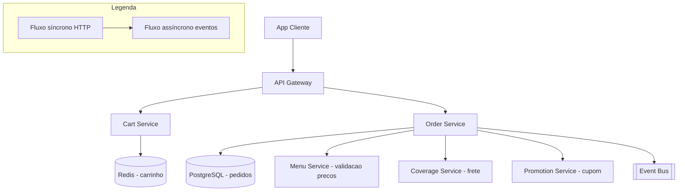

# System Design - Carrinho e Criacao de Pedido

> **Status:** Em progresso  
> **Fase:** 2  
> **Jornada:** Cliente  
> **Epico:** [Cliente §1.1 — Carrinho dinamico](../../epic-ifood-clone.md#11-jornada-do-cliente-app-mobile--web)  
> **Dependencias:** [03-gestao-cardapio](../03-gestao-cardapio/system-design.md), [04-geolocalizacao-cobertura](../04-geolocalizacao-cobertura/system-design.md), [05-busca-filtros](../05-busca-filtros/system-design.md), [00-plataforma-transversal](../00-plataforma-transversal/system-design.md)

## 1. Objetivo

Carrinho com **um restaurante por vez**, personalizacao de adicionais, calculo de subtotal/frete e criacao atomica do pedido com lock de estoque.

## 2. Escopo Funcional

### 2.1 MVP

- [ ] Carrinho por usuario (Redis)
- [ ] Regra: trocar restaurante limpa carrinho
- [ ] Validacao de adicionais (min/max, obrigatorios)
- [ ] Snapshot de precos no momento do pedido
- [ ] Lock de estoque atomico
- [ ] Criacao de pedido `draft` → `pending_payment`
- [ ] Calculo de subtotal, frete e total
- [ ] Aplicacao de cupom de desconto

### 2.2 Pos-MVP

- [ ] Carrinho abandonado e remarketing
- [ ] Split de pedido (nao previsto no epico — avaliar)
- [ ] Sugestao de itens complementares no carrinho

## 3. Requisitos Nao Funcionais

- Isolamento transacional no ultimo item em estoque
- Idempotencia em `POST /orders` com `Idempotency-Key`
- TTL do carrinho: **60 minutos** sem atividade
- Disponibilidade do dominio: **99.9%**

## 4. Contexto de Negocio

O carrinho e o ponto de conversao mais critico do funil. Qualquer erro de preco, item indisponivel ou falha no checkout resulta em abandono e perda de receita. A experiencia deve ser rapida e confiavel.

## 5. Arquitetura de Alto Nivel



Diagrama detalhado: [`./architecture.mermaid`](./architecture.mermaid)

## 6. Componentes

### 6.1 Cart Service

- Gerencia carrinho do usuario em Redis
- Valida regras: um restaurante por carrinho
- Calcula subtotal em tempo real
- TTL de 60 minutos sem atividade
- Publica evento `cart.abandoned` (pos-MVP)

### 6.2 Order Service

- Cria pedido a partir do carrinho
- Valida precos atuais no Menu Service (snapshot)
- Valida cobertura e frete no Coverage Service
- Aplica cupom via Promotion Service
- Executa lock de estoque atomico
- Publica `order.created` no Event Bus

## 7. Modelo de Dados

### 7.1 `carts` (Redis)

Chave: `cart:{user_id}` — Hash do Redis.

| Campo | Tipo | Descricao |
|-------|------|-----------|
| `user_id` | String | ID do usuario (parte da chave) |
| `restaurant_id` | String | ID do restaurante |
| `restaurant_name` | String | Nome do restaurante (para exibicao) |
| `created_at` | TIMESTAMP ISO | Quando o carrinho foi criado |
| `updated_at` | TIMESTAMP ISO | Ultima modificacao |
| `expires_at` | TIMESTAMP ISO | TTL (created_at + 60min) |
| `promotion_code` | String | Codigo de cupom aplicado (opcional) |
| `promotion_discount_cents` | Integer | Desconto do cupom em centavos |

#### Itens do carrinho (Redis Set)

Chave: `cart:{user_id}:items` — Lista de JSON strings.

```json
{
  "itemId": "uuid",
  "categoryId": "uuid",
  "name": "Pizza Margherita",
  "quantity": 2,
  "unitPriceCents": 2990,
  "modifiers": [
    {
      "modifierId": "uuid",
      "optionId": "uuid",
      "name": "Borda Catupiry",
      "priceDeltaCents": 400
    }
  ],
  "totalPriceCents": 6780,
  "notes": "sem cebola, por favor"
}
```

### 7.2 `orders` (PostgreSQL)

| Coluna | Tipo | Restricoes | Descricao |
|--------|------|------------|-----------|
| id | UUID | PK | |
| user_id | UUID | FK → users.id, NOT NULL | Cliente |
| restaurant_id | UUID | FK → restaurant_profiles.id, NOT NULL | |
| status | VARCHAR(24) | NOT NULL, DEFAULT `draft` | `draft`, `pending_payment`, `paid`, `preparing`, `ready_for_pickup`, `dispatched`, `delivered`, `cancelled` |
| subtotal_cents | INT | NOT NULL | Soma dos itens sem frete/desconto |
| delivery_fee_cents | INT | NOT NULL, DEFAULT 0 | |
| discount_cents | INT | NOT NULL, DEFAULT 0 | Desconto de cupom |
| total_cents | INT | NOT NULL | subtotal + frete - desconto |
| promotion_code | VARCHAR(32) | NULL | Cupom aplicado |
| delivery_latitude | DECIMAL(10,7) | NULL | Coordenada de entrega |
| delivery_longitude | DECIMAL(10,7) | NULL | |
| delivery_address_snapshot | JSONB | NULL | Endereco completo no momento do pedido |
| estimated_minutes | INT | NULL | Tempo estimado total |
| idempotency_key | VARCHAR(64) | UNIQUE, NULL | Para protecao contra duplicatas |
| created_at | TIMESTAMP | NOT NULL, DEFAULT NOW() | |
| updated_at | TIMESTAMP | NOT NULL, DEFAULT NOW() | |

**Indices:**
- `(user_id, created_at)` — historico de pedidos do usuario
- `(restaurant_id, status)` — fila de pedidos do restaurante
- `(idempotency_key)` — UNIQUE, protecao de duplicatas
- `(status, created_at)` — fila geral por estado

### 7.3 `order_items` (PostgreSQL)

| Coluna | Tipo | Restricoes | Descricao |
|--------|------|------------|-----------|
| id | UUID | PK | |
| order_id | UUID | FK → orders.id, NOT NULL | |
| item_id | UUID | FK → menu_items.id | ID do item no momento da compra |
| name | VARCHAR(256) | NOT NULL | Snapshot do nome |
| quantity | INT | NOT NULL, CHECK > 0 | |
| unit_price_cents | INT | NOT NULL | Snapshot do preco unitario |
| modifiers_snapshot | JSONB | NULL | Snapshot dos modifiers selecionados |
| total_price_cents | INT | NOT NULL | quantity * unit_price_cents + modifiers |
| notes | VARCHAR(512) | NULL | Observacoes do cliente |

**Indices:**
- `(order_id)` — todos os itens de um pedido

### 7.4 `inventory_reservations` (PostgreSQL)

| Coluna | Tipo | Restricoes | Descricao |
|--------|------|------------|-----------|
| id | UUID | PK | |
| item_id | UUID | FK → menu_items.id, NOT NULL | |
| order_id | UUID | FK → orders.id, NOT NULL | |
| quantity | INT | NOT NULL, CHECK > 0 | Quantidade reservada |
| status | VARCHAR(16) | NOT NULL, DEFAULT `active` | `active`, `confirmed`, `expired`, `released` |
| expires_at | TIMESTAMP | NOT NULL | TTL de 30 minutos |
| created_at | TIMESTAMP | NOT NULL, DEFAULT NOW() | |

**Indices:**
- `(item_id, status)` — estoque disponivel por item
- `(order_id)` — reservas de um pedido
- `(status, expires_at)` — job de expiracao de reservas

## 8. Fluxos Principais

### 8.1 Adicionar item ao carrinho

1. Cliente seleciona item com modifiers no app.
2. App envia `POST /v1/cart/items` com `{ itemId, quantity, modifiers }`.
3. Cart Service verifica se ja existe carrinho para o usuario.
4. Se existe e o `restaurant_id` for diferente → erro: "Carrinho ja contem itens de outro restaurante. Deseja limpar?"
5. Se existe e mesmo restaurante → adiciona item.
6. Se nao existe → cria carrinho novo no Redis com TTL de 60min.
7. Valida modifiers (min/max, obrigatorios) contra o Menu Service.
8. Calcula `totalPriceCents` do item (unitPrice * quantity + modifiers deltas).
9. Atualiza `expires_at` para +60min a partir de agora.
10. Retorna carrinho atualizado.

### 8.2 Checkout com lock de estoque

1. Cliente confirma carrinho e envia `POST /v1/orders` com `Idempotency-Key`.
2. Order Service le carrinho do Redis.
3. **Validacao 1**: consulta Menu Service para confirmar precos atuais e disponibilidade de cada item.
   - Se preco mudou → atualiza carrinho e informa cliente.
   - Se item ficou indisponivel → remove do carrinho e informa cliente.
4. **Validacao 2**: consulta Coverage Service para confirmar cobertura e calcular frete.
5. **Validacao 3**: se cupom aplicado, valida com Promotion Service.
6. Inicia transacao PostgreSQL:
   a. Tenta reservar estoque em `inventory_reservations` (lock otimista via `SELECT ... FOR UPDATE`).
   b. Se estoque insuficiente → rollback, retorna `409 CONFLICT`.
   c. Cria `orders` com status `pending_payment`.
   d. Cria `order_items` com snapshot de precos e modifiers.
   e. Remove carrinho do Redis.
7. Publica `order.created` no Event Bus.
8. Retorna `201 Created` com detalhes do pedido e status `pending_payment`.

### 8.3 Compensacao por pagamento falhou / expirado

1. Pedido em `pending_payment` aguarda pagamento.
2. Se pagamento nao confirmado apos 30 minutos:
   - Job cron `expire_pending_payments` executa a cada 5 minutos.
   - Para pedidos com `created_at > 30min` e `status = pending_payment`:
     a. Muda status para `cancelled`.
     b. Libera reservas de estoque (`inventory_reservations.status = 'released'`).
     c. Publica `order.cancelled` com motivo `payment_timeout`.
3. Se webhook de pagamento chegar apos o cancelamento → rejeitar com `409 CONFLICT`.

### 8.4 Carrinho expirado (abandono)

1. Job cron `expire_carts` executa a cada 10 minutos.
2. Varre Redis por chaves `cart:*` com `expires_at` vencido.
3. Remove carrinhos expirados do Redis.
4. Se houve items no carrinho (nao estava vazio) → publica evento `cart.abandoned` para analytics.

## 9. Contratos de API

### 9.1 Padrao de erro

Segue o [padrao global definido na Plataforma Transversal](../00-plataforma-transversal/system-design.md#91-padrao-de-erro-global).

### 9.2 Endpoints do dominio de carrinho e pedido

#### `GET /v1/cart`

Retorna o carrinho atual do usuario autenticado.

**Response (200):**
```json
{
  "restaurantId": "uuid",
  "restaurantName": "Pizza Prime",
  "items": [
    {
      "itemId": "uuid",
      "name": "Pizza Margherita",
      "quantity": 2,
      "unitPriceCents": 2990,
      "modifiers": [
        { "name": "Borda Catupiry", "priceDeltaCents": 400 }
      ],
      "totalPriceCents": 6780,
      "notes": "sem cebola"
    }
  ],
  "subtotalCents": 6780,
  "deliveryFeeCents": 500,
  "discountCents": 0,
  "totalCents": 7280,
  "promotionCode": null,
  "expiresAt": "2026-07-04T15:30:00.000Z"
}
```

**Response (204):** Carrinho vazio — sem conteudo.

#### `POST /v1/cart/items`

Adiciona item ao carrinho. Se carrinho de outro restaurante existir, retorna erro.

**Request body:**
```json
{
  "itemId": "uuid",
  "categoryId": "uuid",
  "quantity": 2,
  "modifiers": [
    { "modifierId": "uuid", "optionId": "uuid" }
  ],
  "notes": "sem cebola, por favor"
}
```

**Response (200):** Carrinho atualizado (mesmo schema do `GET /v1/cart`).

**Response (409):**
```json
{
  "error": {
    "code": "CONFLICT",
    "message": "Carrinho ja contem itens de outro restaurante (Pizza Prime). Deseja limpar e comecar novo?",
    "conflictingRestaurantId": "uuid",
    "conflictingRestaurantName": "Pizza Prime"
  }
}
```

#### `DELETE /v1/cart/items/{itemId}`

Remove item do carrinho.

**Response (204):** Sem conteudo.

#### `DELETE /v1/cart`

Limpa todo o carrinho (trocar de restaurante: chamar este endpoint primeiro, depois adicionar itens do novo restaurante).

**Response (204):** Sem conteudo.

#### `POST /v1/orders`

Cria pedido a partir do carrinho.

**Headers:** `Idempotency-Key: req_abc123`

**Request body:**
```json
{
  "promotionCode": "PIZZA10"
}
```

**Response (201):**
```json
{
  "orderId": "uuid",
  "status": "pending_payment",
  "restaurantId": "uuid",
  "restaurantName": "Pizza Prime",
  "items": [
    {
      "name": "Pizza Margherita",
      "quantity": 2,
      "unitPriceCents": 2990,
      "modifiers": [ "Borda Catupiry" ],
      "totalPriceCents": 6780
    }
  ],
  "subtotalCents": 6780,
  "deliveryFeeCents": 500,
  "discountCents": 500,
  "totalCents": 6780,
  "promotionCode": "PIZZA10",
  "promotionDiscountCents": 500,
  "estimatedMinutes": 35,
  "createdAt": "2026-07-04T14:30:00.000Z",
  "paymentDeadline": "2026-07-04T15:00:00.000Z"
}
```

**Response (409):**
```json
{
  "error": {
    "code": "CONFLICT",
    "message": "Item 'Pizza Margherita' esta indisponivel no momento.",
    "unavailableItems": [
      { "itemId": "uuid", "name": "Pizza Margherita" }
    ]
  }
}
```

#### `GET /v1/orders/{orderId}`

Retorna detalhes do pedido.

### 9.3 Health check

Segue o [padrao definido no documento 00](../00-plataforma-transversal/system-design.md#92-health-check).

## 10. Contratos de Eventos

> **Nota:** O envelope padrao dos eventos e definido pela **Plataforma Transversal** (documento 00). Consulte a [secao 10 do System Design 00](../00-plataforma-transversal/system-design.md#10-contratos-de-eventos) para o schema completo do envelope, politica de versionamento e topic naming.

### 10.1 `order.created`

Publicado quando um pedido e criado com sucesso (status `pending_payment`).

**Payload:**
```json
{
  "orderId": "f7a8b9c0-d1e2-3f4a-5b6c-7d8e9f0a1b2c",
  "userId": "e5f3ef90-6f3a-4f5a-b7f3-7c8c4cd3f9aa",
  "restaurantId": "a1b2c3d4-e5f6-7890-abcd-ef1234567890",
  "totalCents": 6780,
  "status": "pending_payment",
  "createdAt": "2026-07-04T14:30:00.000Z"
}
```

**Consumidores:** Payment Service (iniciar fluxo de pagamento), Analytics.

### 10.2 `order.stock.reservation.failed`

Publicado quando o lock de estoque falha.

**Payload:**
```json
{
  "orderId": "f7a8b9c0-d1e2-3f4a-5b6c-7d8e9f0a1b2c",
  "itemId": "uuid",
  "itemName": "Pizza Margherita",
  "requestedQuantity": 2,
  "availableQuantity": 0
}
```

**Consumidores:** Analytics (monitorar itens com estoque insuficiente).

### 10.3 `order.cancelled`

Publicado quando um pedido e cancelado (por timeout, pelo cliente ou pelo restaurante).

**Payload:**
```json
{
  "orderId": "f7a8b9c0-d1e2-3f4a-5b6c-7d8e9f0a1b2c",
  "reason": "payment_timeout",
  "cancelledAt": "2026-07-04T15:00:00.000Z"
}
```

**Consumidores:** Payment Service (estornar se pago), Notification, Analytics.

### 10.4 `cart.abandoned`

Publicado quando um carrinho expira (pos-MVP para remarketing).

**Payload:**
```json
{
  "userId": "e5f3ef90-6f3a-4f5a-b7f3-7c8c4cd3f9aa",
  "restaurantId": "a1b2c3d4-e5f6-7890-abcd-ef1234567890",
  "itemCount": 3,
  "totalCents": 7280,
  "abandonedAt": "2026-07-04T15:30:00.000Z"
}
```

**Consumidores:** Analytics, Notification (remarketing — pos-MVP).

### 10.5 Tabela de eventos do dominio

| Evento | Produtor | Consumidores | Schema Version |
|--------|----------|--------------|----------------|
| `order.created` | Order Service | Payment, Analytics | 1.0 |
| `order.stock.reservation.failed` | Order Service | Analytics | 1.0 |
| `order.cancelled` | Order Service | Payment, Notification, Analytics | 1.0 |
| `cart.abandoned` | Cart Service | Analytics, Notification | 1.0 |

## 11. Seguranca

### 11.1 Acesso e autenticacao

- Todos os endpoints de carrinho e pedido exigem usuario autenticado (JWT valido).
- Usuario so pode acessar **proprio** carrinho e **proprios** pedidos — validacao por `user_id` do token.
- Admin pode visualizar qualquer pedido (suporte), mas nao criar/modificar.

### 11.2 Protecao no Gateway

- Rate limit em `POST /v1/orders`: **5 requests/min** por usuario (evitar criacao acidental em massa).
- Rate limit em `POST /v1/cart/items`: **30 requests/min** por usuario.
- `Idempotency-Key` obrigatoria em `POST /v1/orders` — chave armazenada em Redis com TTL de 24h.

### 11.3 Integridade de precos

- Precos no carrinho sao sempre validados contra o Menu Service no momento do checkout.
- Snapshot de precos em `order_items` e imutavel apos criacao do pedido.
- Se o preco mudar entre adicionar ao carrinho e checkout, o cliente e informado e o carrinho atualizado.

## 12. Escalabilidade

### 12.1 Cache

| Recurso | Estrategia | TTL |
|---------|------------|-----|
| Carrinho do usuario | Redis hash `cart:{user_id}` | 60 minutos (renovado a cada acao) |
| Itens do carrinho | Redis list `cart:{user_id}:items` | Mesmo TTL do carrinho |
| Chave de idempotencia | Redis `idempotency:{key}` | 24h |
| Precos de itens (consulta) | Cache local no Cart Service | 30s |

### 12.2 Database

- Tabelas de pedido no schema `order` do PostgreSQL compartilhado.
- Indices conforme Secao 7.
- `inventory_reservations` com TTL gerenciado por job cron + indice em `(status, expires_at)`.

### 12.3 Lock de estoque

- Usando `SELECT ... FOR UPDATE` na linha de `inventory_reservations` para lock otimista.
- Transacao curta (< 500ms esperada).
- Se o lock exceder 2s, rollback e retorna timeout.
- Job `expire_inventory_reservations` executa a cada 5 minutos liberando reservas expiradas.

### 12.4 Estimativa de capacidade

| Recurso | Estimativa | Folga |
|---------|------------|-------|
| Pedidos por segundo (pico) | 500/s | 2x (1k/s) |
| Carrinhos ativos no Redis | 50k | 3x (150k) |
| Linhas em `order_items` | 2k/s (media 4 itens/pedido) | 2x |
| Reservas de estoque ativas | 1k (30min TTL) | 3x |

## 13. Observabilidade

### 13.1 Logs estruturados

Segue o [padrao do documento 00](../00-plataforma-transversal/system-design.md#131-logs-estruturados). Campos adicionais:

- `orderId` — ID do pedido
- `cartSize` — numero de itens no carrinho
- `checkoutDurationMs` — tempo total do checkout
- `stockConflict` — true se houve conflito de estoque

### 13.2 Metricas especificas do dominio

| Metrica | Tipo | Descricao |
|---------|------|-----------|
| `cart_items_added_total` | Counter | Itens adicionados ao carrinho |
| `cart_abandoned_total` | Counter | Carrinhos expirados |
| `cart_checkout_started_total` | Counter | Checkouts iniciados |
| `cart_checkout_completed_total` | Counter | Pedidos criados com sucesso |
| `cart_conversion_rate` | Gauge | Taxa de conversao carrinho → pedido |
| `orders_created_total` | Counter | Pedidos criados por status inicial |
| `orders_stock_conflict_total` | Counter | Checkouts com conflito de estoque |
| `orders_checkout_duration_ms` | Histogram | Tempo total do checkout |
| `cart_active_count` | Gauge | Carrinhos ativos no momento |

### 13.3 Dashboard (Grafana)

- **Conversao carrinho → pedido** — funil: carrinhos criados → checkouts → pedidos
- **Carrinhos ativos** — total ao longo do tempo
- **Checkout duration** — histograma de latencia
- **Estoque — conflitos** — taxa de conflito vs total de pedidos
- **Motivos de cancelamento** — distribuicao por razao (timeout, cliente, restaurante)
- **Valor medio do pedido** — ticket medio em centavos

### 13.4 Alertas especificos

| Alerta | Condicao | Severidade | Acao |
|--------|----------|------------|------|
| Queda na conversao carrinho → pedido | < 50% em 30min | P2 | Investigar possivel bug no checkout |
| Alta taxa de conflito de estoque | > 10% dos checkouts | P2 | Verificar Menu Service e reservas |
| Checkout lento | p95 > 3s em 5min | P2 | Investigar validacoes ou banco |
| Pico de cancelamentos | > 20% dos pedidos cancelados em 5min | P2 | Possivel problema no pagamento |
| Carrinhos expirados sem conversao | > 1000 abandonos/hora | P3 | Analisar funil de conversao |

## 14. Resiliencia

### 14.1 Timeouts

| Tipo de chamada | Timeout | Justificativa |
|-----------------|---------|---------------|
| Consulta Menu Service (precos) | 2s | Validacao externa |
| Consulta Coverage Service (frete) | 2s | Validacao externa |
| Transacao PostgreSQL (checkout) | 3s | Lock de estoque + inserts |
| Operacao Redis | 200ms | Carrinho em memoria |

### 14.2 Retries com jitter

| Cenario | Tentativas | Intervalo | Jitter |
|---------|------------|-----------|--------|
| Consulta de precos no Menu Service | 2 | 200ms, 400ms | +/- 50ms |
| Publicacao de evento no Bus | 3 | 200ms, 400ms, 800ms | +/- 50ms |

### 14.3 Graceful degradation

| Cenario | Acao |
|---------|------|
| Redis indisponivel | Carrinho nao pode ser gerenciado (erro temporario). Pedidos existentes continuam viaveis no PG. |
| Menu Service indisponivel no checkout | Checkout falha com erro 502 — cliente tenta novamente. |
| Coverage Service indisponivel | Usar ultimo frete conhecido do cache ou falhar checkout. |
| PostgreSQL indisponivel | Checkout falha, pedidos nao podem ser criados. |

### 14.4 Compensacao de estoque

1. Reserva de estoque criada com `expires_at = NOW() + 30min`.
2. Job `expire_inventory_reservations` executa a cada 5min:
   - Busca reservas com `status = 'active' AND expires_at < NOW()`.
   - Muda status para `expired`.
3. Se pagamento confirmado apos reserva expirada:
   - Pedido vai para `paid`, mas estoque precisa ser revalidado.
   - Se item foi vendido para outro cliente, restaurante e notificado.
4. Se pedido cancelado: libera reserva (status = `released`) imediatamente.

### 14.5 Idempotencia

- `POST /v1/orders` exige header `Idempotency-Key`.
- Chave armazenada em Redis com TTL de 24h.
- Se mesma chave chegar com mesmo body → retorna pedido original (cached).
- Se mesma chave com body diferente → `422 IDEMPOTENCY_REUSE`.
- Consumidores de `order.created` processam com base no `eventId`.

## 15. Decisoes Arquiteturais (ADRs)

### ADR-001: Carrinho no Redis, Pedido no PostgreSQL

| Campo | Valor |
|-------|-------|
| **Decisao** | Carrinho armazenado em Redis (volatil, TTL); Pedido armazenado em PostgreSQL (persistente, transacional) |
| **Contexto** | Carrinho e temporario por natureza (TTL de 60min). Pedido precisa de garantias transacionais (ACID) para estoque e faturamento. |
| **Alternativas** | Carrinho no PostgreSQL (mais lento, sem TTL nativo), ambos no Redis (perda de dados se Redis falhar) |
| **Consequencias** | Positivas: carrinho rapido (< 5ms), Redis ideal para TTL, pedido com ACID. Negativas: dois armazenamentos para gerenciar, perda de carrinho se Redis falhar (aceitavel — e temporario). |
| **Status** | Aprovado |

### ADR-002: Lock de Estoque Otimista com SELECT FOR UPDATE

| Campo | Valor |
|-------|-------|
| **Decisao** | Lock de estoque via `SELECT ... FOR UPDATE` na tabela `inventory_reservations` |
| **Contexto** | Duas pessoas nao podem comprar o ultimo item simultaneamente. Transacao curta esperada (< 500ms). |
| **Alternativas** | Lock pessimista (mais lento, bloqueia outras operacoes), fila de checkout (serializa, mas adiciona latencia), optimistic locking com versao (pode perder ambos) |
| **Consequencias** | Positivas: isolamento transacional, deadlock detection do PostgreSQL, simples de implementar. Negativas: transacoes longas podem escalar, requer conexao unica por checkout. |
| **Status** | Aprovado |

### ADR-003: Snapshot de Precos no Pedido

| Campo | Valor |
|-------|-------|
| **Decisao** | Precos e modifiers copiados (snapshot) para `order_items` no momento do checkout |
| **Contexto** | Preco do cardapio pode mudar apos o pedido. O valor cobrado deve ser o do momento da compra. |
| **Alternativas** | Referencia viva ao cardapio (se preco mudar, pedido antigo reflete preco novo — errado), versionamento de cardapio (mais complexo) |
| **Consequencias** | Positivas: faturamento correto, independencia entre pedido e cardapio futuro. Negativas: duplicacao de dados, pedido nao reflete mudancas de cardapio (deliberado). |
| **Status** | Aprovado |

### ADR-004: Compensacao de Estoque por Job Cron

| Campo | Valor |
|-------|-------|
| **Decisao** | Reservas de estoque expiradas sao liberadas por job cron a cada 5 minutos |
| **Contexto** | Se o pagamento nao for confirmado em 30min, o estoque precisa ser liberado para outros clientes. |
| **Alternativas** | TTL nativo do Redis (estoque no Redis, mas perde consistencia transacional), evento de timeout (mais complexo, mas mais rapido) |
| **Consequencias** | Positivas: simples, confiavel, mesma logica para expiracao de pedidos. Negativas: janela de ate 5min entre expiracao e liberacao efetiva. Aceitavel para o volume. |
| **Status** | Aprovado |

## 16. Riscos e Mitigacoes

| Risco | Probabilidade | Impacto | Mitigacao |
|-------|---------------|---------|-----------|
| **Dois clientes compram o ultimo item simultaneamente** | Baixa | Alto | Lock otimista (SELECT FOR UPDATE), rollback com 409, fila de checkout se necessario |
| **Preco do cardapio muda entre carrinho e checkout** | Media | Medio | Validacao no momento do checkout, atualizacao do carrinho com aviso ao cliente |
| **Redis falha e perde carrinhos ativos** | Baixa | Medio | Carrinho e temporario (max 60min). Cliente recria. Pedidos ja criados estao no PG. |
| **Job de expiracao de reservas nao executa** | Baixa | Alto | Monitoramento de lag do job, alerta se > 10min sem execucao, fallback manual |
| **Cliente cria pedido duplicado (rede instavel)** | Media | Medio | Idempotency-Key obrigatoria, cache em Redis por 24h |
| **Item fica indisponivel apos adicionar ao carrinho** | Media | Alto | Validacao no checkout + evento `menu.item.unavailable` + remocao de carrinhos (design 03, secao 14.5) |

### 16.1 Matriz de probabilidade x impacto

```
Impacto:  Baixo      Medio       Alto        Critico
Probabilidade
Alta      |           |            |            |
Media     |           | Preco muda | Indisponiv.|
          |           | Duplicata  |            |
Baixa     | Redis     |            | Concorrencia| Job cron para
          | falha     |            | estoque    |
```

---

> **Documentos relacionados:** [Template de system design](../../templates/system-design-template.md) | [Roadmap](../../roadmap/ordem-das-jornadas.md) | [Epico iFood Clone](../../epic-ifood-clone.md) | [Plataforma Transversal](../00-plataforma-transversal/system-design.md)
