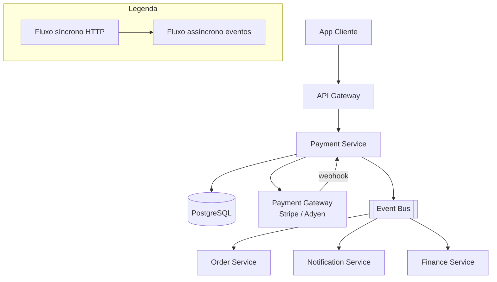

# System Design - Pagamentos e Checkout

> **Status:** Em progresso  
> **Fase:** 3  
> **Jornada:** Cliente  
> **Epico:** [Cliente §1.1 — Checkout e pagamento](../../epic-ifood-clone.md#11-jornada-do-cliente-app-mobile--web)  
> **Dependencias:** [06-carrinho-pedido](../06-carrinho-pedido/system-design.md), [00-plataforma-transversal](../00-plataforma-transversal/system-design.md)

## 1. Objetivo

Integrar Pix, cartao tokenizado e vale-refeicao com conformidade PCI-DSS; confirmar pagamento e liberar pedido para o restaurante.

## 2. Escopo Funcional

### 2.1 MVP

- [ ] Pix com QR dinamico e webhook de confirmacao
- [ ] Cartao com tokenizacao no gateway (sem PAN no backend)
- [ ] Vale-refeicao via parceiro autorizado
- [ ] Estados: `pending_payment` → `paid` | `failed` | `expired`
- [ ] Reembolso parcial/total (admin)

### 2.2 Pos-MVP

- [ ] Carteira interna / cashback
- [ ] Split de pagamento marketplace
- [ ] Antifraude com score

## 3. Requisitos Nao Funcionais

- PCI-DSS: nunca persistir PAN/CVV
- Webhook de gateway: processamento idempotente
- Timeout Pix: expirar pedido e liberar estoque em 30 minutos
- Disponibilidade do dominio: **99.9%**

## 4. Contexto de Negocio

Pagamento e o ultimo passo antes do restaurante comecar a preparar o pedido. Uma falha aqui significa perda de receita. Pix e o metodo mais popular no Brasil, seguido por cartao de credito e vale-refeicao.

## 5. Arquitetura de Alto Nivel



Diagrama detalhado: [`./architecture.mermaid`](./architecture.mermaid)

## 6. Componentes

### 6.1 Payment Service

- Inicia cobrancas no Payment Gateway (Stripe / Adyen)
- Gerencia tokens de cartao (sem nunca ver PAN)
- Processa webhooks de confirmacao com idempotencia
- Publica eventos de mudanca de status
- Gerencia reembolsos parciais/totais

### 6.2 Payment Gateway (externo)

- Stripe ou Adyen como provedor principal
- Responsavel pela tokenizacao segura de cartoes
- Processa Pix com QR dinamico
- Envia webhooks para confirmacao de pagamento

## 7. Modelo de Dados

### 7.1 `payments`

| Coluna | Tipo | Restricoes | Descricao |
|--------|------|------------|-----------|
| id | UUID | PK | |
| order_id | UUID | FK → orders.id, NOT NULL | |
| method | VARCHAR(24) | NOT NULL | `pix`, `credit_card`, `meal_voucher` |
| amount_cents | INT | NOT NULL | Valor total em centavos |
| status | VARCHAR(24) | NOT NULL, DEFAULT `pending` | `pending`, `paid`, `failed`, `expired`, `refunded`, `partially_refunded` |
| gateway | VARCHAR(32) | NOT NULL | `stripe`, `adyen` |
| gateway_payment_id | VARCHAR(128) | NULL | ID da transacao no gateway |
| gateway_response | JSONB | NULL | Resposta completa do gateway (sem PAN/CVV) |
| pix_qr_code | TEXT | NULL | QR code em base64 (apenas Pix) |
| pix_qr_text | VARCHAR(256) | NULL | Copia e cola do Pix |
| pix_expires_at | TIMESTAMP | NULL | Validade do QR Pix |
| refunded_cents | INT | NOT NULL, DEFAULT 0 | Total reembolsado |
| created_at | TIMESTAMP | NOT NULL, DEFAULT NOW() | |
| updated_at | TIMESTAMP | NOT NULL, DEFAULT NOW() | |

**Indices:**
- `(order_id)` — pagamento de um pedido
- `(gateway_payment_id)` — consulta por referencia do gateway
- `(status, created_at)` — fila de pagamentos pendentes

### 7.2 `payment_tokens`

| Coluna | Tipo | Restricoes | Descricao |
|--------|------|------------|-----------|
| id | UUID | PK | |
| user_id | UUID | FK → users.id, NOT NULL | |
| gateway | VARCHAR(32) | NOT NULL | `stripe`, `adyen` |
| gateway_token | VARCHAR(128) | NOT NULL | Token do gateway (ex: `card_xxx` no Stripe) |
| brand | VARCHAR(32) | NOT NULL | `visa`, `mastercard`, `amex`, `elo` |
| last4 | VARCHAR(4) | NOT NULL | Ultimos 4 digitos do cartao |
| cardholder_name | VARCHAR(128) | NULL | Nome do titular do cartao (PCI-DSS permite armazenar) |
| exp_month | SMALLINT | NOT NULL | Mes de expiracao |
| exp_year | SMALLINT | NOT NULL | Ano de expiracao |
| is_default | BOOLEAN | NOT NULL, DEFAULT FALSE | |
| is_active | BOOLEAN | NOT NULL, DEFAULT TRUE | |
| created_at | TIMESTAMP | NOT NULL, DEFAULT NOW() | |

**Indices:**
- `(user_id, is_active)` — cartoes ativos do usuario
- `(gateway_token)` — UNIQUE
- `(user_id) WHERE is_default = TRUE` — UNIQUE partial, garante apenas um cartao padrao por usuario

### 7.3 `payment_webhooks`

| Coluna | Tipo | Restricoes | Descricao |
|--------|------|------------|-----------|
| id | UUID | PK | |
| idempotency_key | VARCHAR(128) | NOT NULL, UNIQUE | Chave de idempotencia do webhook |
| gateway | VARCHAR(32) | NOT NULL | `stripe`, `adyen` |
| event_type | VARCHAR(64) | NOT NULL | `payment_intent.succeeded`, `payment_intent.failed` |
| payload_hash | VARCHAR(64) | NOT NULL | SHA-256 do payload recebido |
| raw_payload | JSONB | NOT NULL | Payload original do webhook (campos sensiveis como BIN do cartao removidos/mascarados antes de persistir) |
| processed_at | TIMESTAMP | NOT NULL, DEFAULT NOW() | |

**Indices:**
- `(idempotency_key)` — UNIQUE, garantia de processamento unico

### 7.4 `refunds`

| Coluna | Tipo | Restricoes | Descricao |
|--------|------|------------|-----------|
| id | UUID | PK | |
| payment_id | UUID | FK → payments.id, NOT NULL | |
| amount_cents | INT | NOT NULL | Valor reembolsado |
| reason | VARCHAR(128) | NULL | Motivo do reembolso |
| gateway_refund_id | VARCHAR(128) | NULL | ID do reembolso no gateway |
| created_by | UUID | FK → users.id, NOT NULL | Admin que executou |
| created_at | TIMESTAMP | NOT NULL, DEFAULT NOW() | |

**Indices:**
- `(payment_id)` — reembolsos de um pagamento

## 8. Fluxos Principais

### 8.1 Pagamento com Pix

1. Cliente confirma checkout → Order Service cria pedido com status `pending_payment`.
2. App envia `POST /v1/orders/{orderId}/payments` com `{ "method": "pix" }`.
3. Payment Service cria intencao de pagamento no gateway:
   - Gera QR code dinamico com valor e descricao do pedido.
   - Gateway retorna `pix_qr_code` (base64) e `pix_qr_text` (copia-cola).
   - Gateway define `expires_at` (30 minutos).
4. Payment Service persiste `payments` com status `pending`.
5. Retorna QR code e `expires_at` para o app.
6. Cliente paga via app do banco (escaneia QR ou copia-cola).
7. Gateway envia webhook `payment_intent.succeeded` para `POST /v1/webhooks/payments/{provider}`.
8. Payment Service valida idempotencia (chave `webhook_{id}`).
9. Atualiza `payments.status` para `paid`.
10. Publica `payment.paid` no Event Bus.
11. Order Service consome e muda pedido para `paid`.
12. Restaurante comeca a preparar o pedido.

### 8.2 Pagamento com cartao tokenizado

1. Cliente seleciona cartao salvo ou digita novos dados.
2. Frontend envia dados do cartao **diretamente para o gateway** (Stripe Elements / Adyen Drop-in) — o backend nunca ve o numero completo.
3. Gateway retorna `token` (ex: `card_xxx` no Stripe).
4. App envia `POST /v1/orders/{orderId}/payments` com `{ "method": "credit_card", "token": "card_xxx" }`.
5. Payment Service usa o token para cobrar o valor no gateway.
6. Gateway responde sucesso ou falha.
7. Se sucesso: atualiza pagamento como `paid`, publica `payment.paid`.
8. Se falha: atualiza como `failed`, publica `payment.failed` com motivo.

### 8.3 Webhook de pagamento

1. Gateway envia webhook HTTP para `POST /v1/webhooks/payments/{provider}`.
2. Payment Service valida assinatura HMAC do webhook (configurada no gateway).
3. Extrai `idempotency_key` do header `Idempotency-Key` ou do `event_id` do gateway.
4. Verifica se chave ja foi processada (`payment_webhooks.idempotency_key`).
5. Se ja processado: retorna `200 OK` sem processar novamente.
6. Se novo: persiste em `payment_webhooks`, processa o evento.
7. Atualiza `payments.status` conforme evento.
8. Publica evento de dominio correspondente.

### 8.4 Reembolso (admin)

1. Admin acessa pedido pago no painel e solicita reembolso parcial ou total.
2. Payment Service valida: valor do reembolso <= `amount_cents - refunded_cents`.
3. Chama API de reembolso no gateway.
4. Gateway processa e retorna `gateway_refund_id`.
5. Persiste em `refunds`, atualiza `payments.refunded_cents` e `status` (se total).
6. Publica `payment.refunded`.
7. Order Service consome e registra no historico do pedido.

## 9. Contratos de API

### 9.1 Padrao de erro

Segue o [padrao global definido na Plataforma Transversal](../00-plataforma-transversal/system-design.md#91-padrao-de-erro-global).

### 9.2 Endpoints do dominio de pagamentos

#### `POST /v1/orders/{orderId}/payments`

Inicia um pagamento para o pedido.

**Request body:**
```json
{
  "method": "pix",
  "token": null
}
```

**Response (200) — Pix:**
```json
{
  "paymentId": "uuid",
  "method": "pix",
  "status": "pending",
  "amountCents": 6780,
  "pixQrCode": "base64...",
  "pixQrText": "000201010212261...",
  "expiresAt": "2026-07-04T15:00:00.000Z"
}
```

**Request body (cartao):**
```json
{
  "method": "credit_card",
  "token": "card_1ABC123...",
  "saveToken": true
}
```

**Response (200) — Cartao:**
```json
{
  "paymentId": "uuid",
  "method": "credit_card",
  "status": "paid",
  "amountCents": 6780,
  "cardLast4": "4242",
  "cardBrand": "visa"
}
```

#### `GET /v1/orders/{orderId}/payments/status`

Consulta o status do pagamento.

**Response (200):**
```json
{
  "paymentId": "uuid",
  "status": "paid",
  "method": "pix",
  "amountCents": 6780,
  "paidAt": "2026-07-04T14:35:00.000Z"
}
```

#### `POST /v1/webhooks/payments/{provider}`

Webhook do gateway de pagamento.

**Headers:** `Idempotency-Key`, `X-Webhook-Signature` (HMAC).

**Response (200):**
```json
{ "status": "processed" }
```

#### `POST /v1/admin/orders/{orderId}/refund`

Solicita reembolso (admin).

**Request body:**
```json
{
  "amountCents": 6780,
  "reason": "Cliente solicitou cancelamento"
}
```

**Response (200):**
```json
{
  "refundId": "uuid",
  "paymentId": "uuid",
  "amountCents": 6780,
  "status": "refunded",
  "gatewayRefundId": "ref_xxx"
}
```

#### `GET /v1/payments/methods`

Retorna metodos de pagamento salvos do usuario.

**Response (200):**
```json
{
  "cards": [
    {
      "tokenId": "uuid",
      "brand": "visa",
      "last4": "4242",
      "expMonth": 12,
      "expYear": 2028,
      "isDefault": true
    }
  ]
}
```

### 9.3 Health check

Segue o [padrao definido no documento 00](../00-plataforma-transversal/system-design.md#92-health-check).

## 10. Contratos de Eventos

> **Nota:** O envelope padrao dos eventos e definido pela **Plataforma Transversal** (documento 00). Consulte a [secao 10 do System Design 00](../00-plataforma-transversal/system-design.md#10-contratos-de-eventos) para o schema completo do envelope, politica de versionamento e topic naming.

### 10.1 `payment.initiated`

Publicado quando um pagamento e iniciado (QR Pix gerado ou cobranca de cartao enviada).

**Payload:**
```json
{
  "paymentId": "uuid",
  "orderId": "f7a8b9c0...",
  "method": "pix",
  "amountCents": 6780,
  "initiatedAt": "2026-07-04T14:30:00.000Z"
}
```

**Consumidores:** Analytics.

### 10.2 `payment.paid`

Publicado quando o pagamento e confirmado (webhook ou resposta sincrona).

**Payload:**
```json
{
  "paymentId": "uuid",
  "orderId": "f7a8b9c0...",
  "method": "pix",
  "amountCents": 6780,
  "gateway": "stripe",
  "paidAt": "2026-07-04T14:35:00.000Z"
}
```

**Consumidores:** Order Service (mudar status para `paid`), Notification, Finance, Analytics.

### 10.3 `payment.failed`

Publicado quando o pagamento falha.

**Payload:**
```json
{
  "paymentId": "uuid",
  "orderId": "f7a8b9c0...",
  "method": "credit_card",
  "amountCents": 6780,
  "failureReason": "card_declined",
  "failureMessage": "Cartao recusado. Tente outro cartao ou forma de pagamento.",
  "failedAt": "2026-07-04T14:30:00.000Z"
}
```

**Consumidores:** Order Service (manter `pending_payment` para nova tentativa), Notification, Analytics.

### 10.4 `payment.refunded`

Publicado quando um reembolso e processado.

**Payload:**
```json
{
  "paymentId": "uuid",
  "orderId": "f7a8b9c0...",
  "refundAmountCents": 6780,
  "reason": "Cliente solicitou cancelamento",
  "refundedAt": "2026-07-04T16:00:00.000Z"
}
```

**Consumidores:** Finance, Notification, Analytics.

### 10.5 Tabela de eventos do dominio

| Evento | Produtor | Consumidores | Schema Version |
|--------|----------|--------------|----------------|
| `payment.initiated` | Payment Service | Analytics | 1.0 |
| `payment.paid` | Payment Service | Order, Notification, Finance, Analytics | 1.0 |
| `payment.failed` | Payment Service | Order, Notification, Analytics | 1.0 |
| `payment.refunded` | Payment Service | Finance, Notification, Analytics | 1.0 |

## 11. Seguranca

### 11.1 PCI-DSS

- **Nunca** armazenar PAN (numero completo do cartao), CVV ou dados de trilha magnetica.
- Apenas `last4`, `brand`, `exp_month`, `exp_year` sao persistidos (campos seguros por PCI-DSS).
- Tokenizacao realizada **pelo gateway** (Stripe Elements / Adyen Drop-in). O backend nunca recebe o PAN.
- Comunicacao com gateway via TLS 1.3.
- Logs de pagamento mascarados: nunca conter PAN, CVV ou token bruto.

### 11.2 Webhook security

- Todo webhook validado por **assinatura HMAC** (header `X-Webhook-Signature`).
- Chave HMAC configurada no gateway e no Payment Service (via Vault/KMS).
- IPs dos gateways conhecidos e validados (whitelist opcional).
- Webhooks processados com idempotencia obrigatoria.

### 11.3 Protecoes no Gateway

- Rate limit em `POST /v1/orders/{id}/payments`: **3 requests/min** por usuario (evitar multiplas cobrancas).
- Rate limit em `POST /v1/admin/orders/{id}/refund`: **10 requests/hora** por admin.
- Validacao de valor: `amount_cents` deve ser > 0 e <= 999999.

### 11.4 LGPD em dados de pagamento

- Dados de pagamento (tokens, last4) retidos enquanto o usuario tiver conta ativa.
- Apos exclusao de conta: tokens sao desativados (não removidos — gateway pode exigir retencao fiscal).
- Registros de `payment_webhooks` retidos por 5 anos (obrigacao fiscal).
- Exportacao de dados: inclui ultimos 4 digitos e bandeira, nunca token ou PAN.

## 12. Escalabilidade

### 12.1 Cache

| Recurso | Estrategia | TTL |
|---------|------------|-----|
| Webhook idempotency key | PostgreSQL (`payment_webhooks`) | Permanente (auditoria) |
| Status do pagamento | Cache local (consulta ao PG em < 50ms) | 30s |
| Metodos de pagamento do usuario | Redis `payment_methods:{user_id}` | 10min |

### 12.2 Database

- Tabelas de pagamento no schema `payment` do PostgreSQL compartilhado.
- Indices conforme Secao 7.
- `payment_webhooks` pode crescer rapidamente — particionamento por mes apos 6 meses de operacao.

### 12.3 Estrategia de reconciliacao

- Job cron diario (3am) que reconcilia pagamentos `paid` no banco com extrato do gateway.
- Discrepancias sao registradas em `payment_discrepancies` para revisao manual.
- Alerta se discrepancia > 10 pedidos ou > R$ 1.000.

### 12.4 Estimativa de capacidade

| Recurso | Estimativa | Folga |
|---------|------------|-------|
| Pagamentos por dia | 50k | 2x (100k) |
| Webhooks por dia (pico) | 200k (cartao + Pix) | 2x (400k) |
| Tokens de cartao ativos | 100k | 2x (200k) |
| Reembolsos por mes | 2k (4% dos pedidos) | 2x (4k) |

## 13. Observabilidade

### 13.1 Logs estruturados

Segue o [padrao do documento 00](../00-plataforma-transversal/system-design.md#131-logs-estruturados). Campos adicionais:

- `paymentId` — ID do pagamento
- `orderId` — ID do pedido
- `method` — pix, credit_card, meal_voucher
- `gateway` — stripe, adyen
- `webhookEvent` — tipo do evento recebido

### 13.2 Metricas especificas do dominio

| Metrica | Tipo | Descricao |
|---------|------|-----------|
| `payments_total` | Counter | Pagamentos por metodo e status |
| `payment_duration_seconds` | Histogram | Tempo entre criacao e confirmacao |
| `payment_gateway_duration_ms` | Histogram | Latencia de chamada ao gateway |
| `payment_webhooks_total` | Counter | Webhooks recebidos por tipo |
| `payment_webhook_duration_ms` | Histogram | Tempo de processamento de webhook |
| `payment_refunds_total` | Counter | Reembolsos por motivo |
| `payment_failure_reasons_total` | Counter | Motivos de falha por metodo |
| `payment_reconciliation_discrepancies` | Gauge | Discrepancias encontradas na reconciliacao |

### 13.3 Dashboard (Grafana)

- **Pagamentos por metodo** — volume diario por metodo (Pix, cartao, VR)
- **Taxa de sucesso** — porcentagem de pagamentos `paid` vs `failed`
- **Tempo ate confirmacao** — histograma (Pix: segundos, Cartao: milissegundos)
- **Webhooks por segundo** — volume de webhooks ao longo do dia
- **Motivos de falha** — pareto dos motivos (card_declined, expired, etc.)
- **Reembolsos** — total diario e valor reembolsado

### 13.4 Alertas especificos

| Alerta | Condicao | Severidade | Acao |
|--------|----------|------------|------|
| Alta taxa de falha de pagamento | > 10% em 5min | P1 | Gateway pode estar com problemas |
| Gateway com latencia alta | p95 > 5s em 5min | P2 | Possivel degradacao do provedor |
| Webhook nao processado apos 5min | Pagamento `pending` ha > 5min sem webhook | P2 | Webhook pode ter sido perdido |
| Discrepancia na reconciliacao | > 5 discrepancias | P2 | Investigar possivel bug ou fraude |
| Pico de reembolsos | > 20 reembolsos/hora | P2 | Possivel fraude ou insatisfacao |
| Certificado TLS do gateway expirando | < 7 dias | P2 | Renovar certificado |

## 14. Resiliencia

### 14.1 Timeouts

| Tipo de chamada | Timeout | Justificativa |
|-----------------|---------|---------------|
| Criacao de cobranca no gateway | 10s | API externa |
| Webhook de confirmacao | 5s | Processamento interno < 1s |
| Reembolso no gateway | 10s | API externa |
| Query PostgreSQL | 1s | | 

### 14.2 Retries com jitter

| Cenario | Tentativas | Intervalo | Jitter |
|---------|------------|-----------|--------|
| Criacao de cobranca no gateway | 3 | 500ms, 1s, 2s | +/- 100ms |
| Webhook falha de processamento | 3 | 200ms, 400ms, 800ms | +/- 50ms |
| Reembolso no gateway | 3 | 1s, 2s, 4s | +/- 200ms |

### 14.3 Circuit breaker

| Circuito | Threshold de falha | Janela | Tempo de half-open |
|----------|--------------------|--------|---------------------|
| Payment Gateway (Stripe/Adyen) | 10 falhas | 60s | 30s |

### 14.4 Graceful degradation

| Cenario | Acao |
|---------|------|
| Gateway indisponivel | Pagamentos falham com erro 502. Cliente tenta novamente mais tarde. Pix com QR ja gerado continua viavel. |
| Webhook perdido | Job de polling a cada 5min consulta status de pagamentos `pending` com > 2min de idade. |
| Webhook atrasado | Se pagamento ja expirou, rejeitar webhook com 409. Cliente precisa gerar novo pagamento. |
| Falha ao publicar evento | Evento vai para DLQ. Order Service pode ficar desatualizado ate reprocessamento. |

### 14.5 Idempotencia de webhook

1. Webhook chega com header `Idempotency-Key` ou `event_id` do gateway.
2. Payment Service verifica `payment_webhooks.idempotency_key`.
3. Se ja existe: retorna 200 com status anterior sem reprocessar.
4. Se nao existe: persiste e processa normalmente.
5. Se o mesmo webhook chegar durante processamento (concorrencia): UNIQUE constraint no banco garante que apenas um processa.

## 15. Decisoes Arquiteturais (ADRs)

### ADR-001: Tokenizacao no Gateway, NUNCA no Backend

| Campo | Valor |
|-------|-------|
| **Decisao** | Tokenizacao de cartao realizada exclusivamente pelo gateway (Stripe Elements / Adyen Drop-in). Backend nunca recebe PAN. |
| **Contexto** | PCI-DSS exige que sistemas que armazenam, processam ou transmitem PAN sigam controles rigorosos. Manter o backend fora do escopo PCI reduz drasticamente a complexidade de compliance. |
| **Alternativas** | Tokenizacao propria (escopo PCI completo), proxy de pagamento (backend ve PAN masked, ainda em escopo) |
| **Consequencias** | Positivas: backend fora do escopo PCI, sem necessidade de QSA, tokenizacao gerida pelo gateway. Negativas: dependencia do gateway para tokenizacao, frontend precisa integrar SDK do gateway. |
| **Status** | Aprovado |

### ADR-002: Webhook como Mecanismo Primario, Polling como Fallback

| Campo | Valor |
|-------|-------|
| **Decisao** | Confirmacao de pagamento via webhook (primario) com job de polling como fallback |
| **Contexto** | Webhooks podem ser perdidos (rede, timeout). Pix leva segundos para confirmar, mas alguns bancos demoram mais. |
| **Alternativas** | So webhook (risco de perda), so polling (lento, alto custo de API), webhook + polling (complexidade, mas confiavel) |
| **Consequencias** | Positivas: confirmacao rapida via webhook (< 1s), fallback confiavel via polling (5min). Negativas: job de polling adiciona custo de API calls ao gateway. |
| **Status** | Aprovado |

### ADR-003: Idempotencia de Webhook via UNIQUE Constraint

| Campo | Valor |
|-------|-------|
| **Decisao** | Idempotencia de webhook garantida por UNIQUE constraint em `payment_webhooks.idempotency_key` |
| **Contexto** | Gateway pode enviar o mesmo webhook multiplas vezes (retry por rede). Processar duplicado atualizaria o pagamento incorretamente. |
| **Alternativas** | Redis lock (pode perder lock se Redis falhar), "já processado" check em aplicacao (race condition) |
| **Consequencias** | Positivas: garantia forte de idempotencia, sem race condition, sem dependencia de Redis. Negativas: write no banco mesmo para webhooks duplicados (mas UNIQUE constraint barra o insert). |
| **Status** | Aprovado |

### ADR-004: Gateway Unico (MVP) com Provedor Secundario Planejado

| Campo | Valor |
|-------|-------|
| **Decisao** | Stripe como gateway unico no MVP. Adyen como alternativa avaliada para pos-MVP (melhor suporte a vale-refeicao no Brasil). |
| **Contexto** | Stripe tem boa cobertura de Pix e cartao no Brasil, SDK maduro e documentacao extensa. Adyen tem suporte nativo a vale-refeicao (Ticket, Sodexo). |
| **Alternativas** | Multi-gateway desde o inicio (mais complexidade operacional), apenas Adyen (menos documentacao em portugues) |
| **Consequencias** | Positivas: Stripe e simples de integrar, suporte a Pix via Stripe Treasury. Negativas: no futuro, pode ser necessario Adyen para vale-refeicao, exigindo abstracao de gateway (estrutura de `PaymentGatewayInterface`). |
| **Status** | Aprovado |

## 16. Riscos e Mitigacoes

| Risco | Probabilidade | Impacto | Mitigacao |
|-------|---------------|---------|-----------|
| **Gateway indisponivel** | Media | Critico | Circuit breaker, mensagem amigavel para cliente tentar mais tarde, fallback para outro gateway (pos-MVP) |
| **Webhook perdido** | Baixa | Alto | Job de polling a cada 5min, alerta se pagamento `pending` > 10min |
| **Chargeback** | Baixa | Medio | Registro de evidencias (logs, status do pedido), politica de contestacao, provisionamento de reserva |
| **Duplicata de pagamento (webhook duplicado)** | Media | Medio | UNIQUE constraint + idempotencia |
| **Token de cartao expirado** | Media | Baixo | Validacao de `exp_year`/`exp_month` antes de usar, notificacao para atualizar |
| **Fraude com cartao** | Baixa | Critico | Score de antifraude (pos-MVP), 3DS sempre que possivel, revisao manual de pagamentos suspeitos |
| **Pix expira e cliente paga apos expiracao** | Baixa | Medio | Webhook rejeitado (pagamento apos expiracao), cliente precisa gerar novo QR |

### 16.1 Matriz de probabilidade x impacto

```
Impacto:  Baixo      Medio       Alto        Critico
Probabilidade
Alta      |           |            |            |
Media     | Token     | Duplicata  | Gateway    |
          | expirado  | webhook    | indisponiv.|
Baixa     |           | Chargeback | Webhook    | Fraude
          |           | Pix pos-exp| perdido    |
```

---

> **Documentos relacionados:** [Template de system design](../../templates/system-design-template.md) | [Roadmap](../../roadmap/ordem-das-jornadas.md) | [Epico iFood Clone](../../epic-ifood-clone.md) | [Plataforma Transversal](../00-plataforma-transversal/system-design.md)
