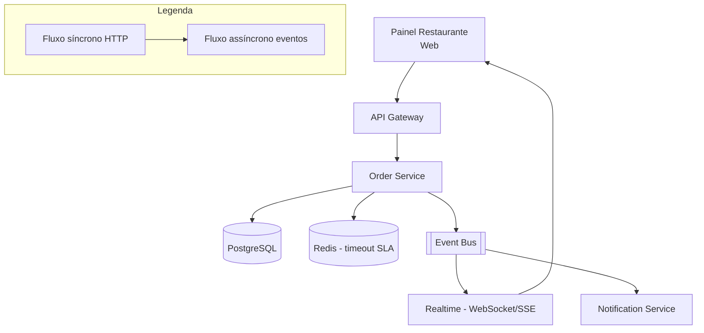

# System Design - Gerenciamento de Pedidos (Restaurante)

> **Status:** Em progresso  
> **Fase:** 3  
> **Jornada:** Restaurante  
> **Epico:** [Restaurante §1.2 — Gerenciamento de pedidos](../../epic-ifood-clone.md#12-jornada-do-restaurante-painel-web--gestor-de-pedidos)  
> **Dependencias:** [07-pagamentos](../07-pagamentos/system-design.md), [06-carrinho-pedido](../06-carrinho-pedido/system-design.md), [00-plataforma-transversal](../00-plataforma-transversal/system-design.md)

## 1. Objetivo

Maquina de estados do pedido no painel do restaurante: **Pendente → Em Preparo → Pronto para Coleta → Despachado**, com notificacoes em tempo real, auditoria de transicoes e controle de SLA.

## 2. Escopo Funcional

### 2.1 MVP

- [ ] Lista de pedidos ativos por restaurante
- [ ] Transicoes validadas por role `restaurant_owner`
- [ ] Timer de SLA por estado
- [ ] Push/som no painel ao novo pedido
- [ ] Cancelamento com politica (antes do preparo)

### 2.2 Pos-MVP

- [ ] Impressao automatica (integracao POS)
- [ ] Preparo em paralelo por estacao (cozinha/bar)

## 3. Requisitos Nao Funcionais

- Notificacao de novo pedido: **< 3s** apos `payment.paid`
- Consistencia: transicoes invalidas retornam 409
- Disponibilidade do dominio: **99.9%**
- SLA de preparo: **30 minutos** (configuravel por restaurante), com alerta ao ultrapassar

## 4. Contexto de Negocio

O gerenciamento de pedidos e o coracao operacional do restaurante. Um pedido que atrasa ou transita para o estado errado causa insatisfacao do cliente, perda de vendas e penalidades na plataforma.

## 5. Arquitetura de Alto Nivel



Diagrama detalhado: [`./architecture.mermaid`](./architecture.mermaid)

## 6. Componentes

### 6.1 Order Service (estados)

- Gerencia a maquina de estados do pedido
- Valida transicoes por role e regras de negocio
- Registra auditoria de cada transicao
- Gerencia timeouts de SLA via Redis
- Publica `order.status.changed`

### 6.2 Realtime Service (WebSocket)

- Mantem conexoes WebSocket abertas com os paineis dos restaurantes
- Encaminha `order.status.changed` em tempo real
- Canal separado por `restaurant_id`

### 6.3 SLA Monitor

- Job cron que verifica pedidos em `preparing` ha mais de 30min
- Alerta o restaurante via notificacao
- Escalona para admin se exceder 45min

## 7. Modelo de Dados

### 7.1 `order_status_history` (auditoria)

| Coluna | Tipo | Restricoes | Descricao |
|--------|------|------------|-----------|
| id | UUID | PK | |
| order_id | UUID | FK → orders.id, NOT NULL | |
| from_status | VARCHAR(24) | NULL | Estado anterior (NULL = criacao) |
| to_status | VARCHAR(24) | NOT NULL | Novo estado |
| changed_by | UUID | FK → users.id, NOT NULL | Quem executou a transicao (usuario ou sistema) |
| changed_by_role | VARCHAR(24) | NOT NULL | `restaurant_owner`, `system`, `admin`, `customer` |
| reason | VARCHAR(256) | NULL | Motivo (obrigatorio para cancelamentos) |
| elapsed_seconds | INT | NULL | Tempo gasto no estado anterior |
| created_at | TIMESTAMP | NOT NULL, DEFAULT NOW() | |

**Indices:**
- `(order_id, created_at)` — historico cronologico de um pedido
- `(changed_by)` — auditoria por ator
- `(to_status, created_at)` — metricas de SLA por estado

### 7.2 `order_sla_config`

| Coluna | Tipo | Restricoes | Descricao |
|--------|------|------------|-----------|
| id | UUID | PK | |
| restaurant_id | UUID | FK → restaurant_profiles.id, NOT NULL, UNIQUE | |
| preparation_timeout_minutes | INT | NOT NULL, DEFAULT 30 | Tempo maximo em `preparing` |
| pickup_timeout_minutes | INT | NOT NULL, DEFAULT 15 | Tempo maximo em `ready_for_pickup` |
| auto_cancel_after_minutes | INT | NOT NULL, DEFAULT 60 | Cancelamento automatico se nao sair de `pending` |
| created_at | TIMESTAMP | NOT NULL, DEFAULT NOW() | |
| updated_at | TIMESTAMP | NOT NULL, DEFAULT NOW() | |

**Indices:**
- `(restaurant_id)` — UNIQUE

### 7.3 `order_timeout_tracking` (Redis)

Chave: `order_timeout:{order_id}:{status}` — Hash com TTL.

| Campo | Descricao |
|-------|-----------|
| `entered_at` | Timestamp ISO de quando entrou no estado |
| `timeout_at` | Timestamp ISO de quando o timeout expira |
| `sla_minutes` | SLA configurado para este estado |
| `notified_at` | Timestamp da ultima notificacao de SLA |

TTL: `sla_minutes + 5min` (tempo suficiente para alertar e escalonar).

## 8. Fluxos Principais

### 8.1 Maquina de estados completa

```
                    ┌──────────┐
                    │  draft   │ (criado no checkout)
                    └────┬─────┘
                         │ pagamento confirmado
                    ┌────▼─────┐
              ┌─────│  pending │◄──── pagamento falhou (retorna)
              │     └────┬─────┘
              │          │ restaurante inicia preparo
              │     ┌────▼──────┐
              │     │ preparing │
              │     └────┬──────┘
              │          │ restaurante finaliza preparo
              │     ┌───────────┐
              │     │ready_for  │
              │     │_pickup    │
              │     └────┬──────┘
              │          │ matching + entregador coleta
              │     ┌───────────┐
              │     │dispatched │
              │     └────┬──────┘
              │          │ entregador confirma entrega
              │     ┌───────────┐
              │     │ delivered │
              │     └───────────┘
              │
              │     ┌───────────┐
              └─────│ cancelled │ (qualquer estado, com regras)
                    └───────────┘
```

**Regras de cancelamento:**
- `draft`, `pending`: cliente, restaurante ou admin podem cancelar (reembolso integral se pago).
- `preparing`: apenas restaurante ou admin (reembolso integral ao cliente, restaurante nao recebe).
- `ready_for_pickup`, `dispatched`: apenas admin (casos excepcionais).
- `delivered`: nao pode ser cancelado (apenas reembolso via payment service).

### 8.2 Novo pedido pago

**Pre-condicao:** Order Service (estados) ja consumiu `order.created` do fluxo de checkout e criou o registro do pedido em estado `draft`.

1. Payment Service publica `payment.paid`.
2. Order Service (estados) consome o evento.
3. Valida: pedido existe, status atual e `draft`.
4. Transiciona para `pending`.
5. Registra auditoria em `order_status_history` com `changed_by_role = 'system'`.
6. Inicia timer de SLA no Redis para `pending` → `preparing` (auto_cancel_after_minutes).
7. Publica `order.status.changed`.
8. Realtime Service encaminha para o painel do restaurante via WebSocket.
9. Painel do restaurante emite som/push notification.

### 8.3 Restaurante avanca preparo

1. Restaurante clica \"Iniciar Preparo\" no painel.
2. `POST /v1/orders/{id}/transitions` body: `{ "to": "preparing" }`.
3. Order Service valida:
   - Token JWT tem role `restaurant_owner`.
   - `restaurant_id` do token corresponde ao `restaurant_id` do pedido.
   - Transicao `pending` → `preparing` e valida.
4. Atualiza `orders.status` para `preparing`.
5. Registra auditoria com `changed_by_role = 'restaurant_owner'` e `elapsed_seconds` (tempo em pending).
6. Remove timer de `pending`, inicia timer de `preparing` (preparation_timeout_minutes).
7. Publica `order.status.changed`.
8. Realtime encaminha para o painel e para o app do cliente.

### 8.4 SLA excedido — timeout automatico

1. Job `check_order_sla` executa a cada 2 minutos.
2. Varre Redis por chaves `order_timeout:*` com `timeout_at < NOW()`.
3. Para cada timeout encontrado:
   - Se `preparing` e `timeout_at` excedido:
     a. Publica notificacao para o restaurante (\"Pedido atrasado!\").
     b. Se exceder 45min (1.5x SLA), escalona para admin.
   - Se `pending` e `auto_cancel_after_minutes` excedido:
     a. Cancela automaticamente com motivo `auto_cancel_pending_timeout`.
     b. Publica `order.status.changed` com `to_status = 'cancelled'`.
     c. Publica `order.cancelled` para Payment Service (reembolso).

## 9. Contratos de API

### 9.1 Padrao de erro

Segue o [padrao global definido na Plataforma Transversal](../00-plataforma-transversal/system-design.md#91-padrao-de-erro-global).

### 9.2 Endpoints do dominio de estados do pedido

#### `GET /v1/restaurants/me/orders?status=`

Lista pedidos do restaurante autenticado.

**Query params:**
- `status` (STRING, opcional) — Filtrar por status: `active` (pending + preparing + ready_for_pickup), `completed` (dispatched + delivered), `cancelled`
- `page` (INT, opcional, default 1)
- `pageSize` (INT, opcional, default 20)

**Response (200):**
```json
{
  "orders": [
    {
      "orderId": "uuid",
      "status": "preparing",
      "customerName": "Ana Souza",
      "items": [
        { "name": "Pizza Margherita", "quantity": 2 },
        { "name": "Coca-Cola 2L", "quantity": 1 }
      ],
      "totalCents": 6780,
      "sla": {
        "enteredAt": "2026-07-04T14:30:00.000Z",
        "timeoutAt": "2026-07-04T15:00:00.000Z",
        "elapsedPercent": 45
      },
      "createdAt": "2026-07-04T14:28:00.000Z"
    }
  ],
  "total": 5,
  "page": 1,
  "pageSize": 20
}
```

#### `POST /v1/orders/{orderId}/transitions`

Executa uma transicao de estado.

**Request body:**
```json
{
  "to": "preparing",
  "reason": null
}
```

**Response (200):**
```json
{
  "orderId": "uuid",
  "fromStatus": "pending",
  "toStatus": "preparing",
  "elapsedSeconds": 120,
  "timestamp": "2026-07-04T14:30:00.000Z"
}
```

**Response (409) — transicao invalida:**
```json
{
  "error": {
    "code": "CONFLICT",
    "message": "Transicao de 'pending' para 'dispatched' nao permitida.",
    "allowedTransitions": ["preparing", "cancelled"]
  }
}
```

#### `POST /v1/orders/{orderId}/cancel`

Solicita cancelamento do pedido.

**Request body:**
```json
{
  "reason": "Cliente solicitou cancelamento",
  "cancelledBy": "customer"
}
```

**Response (200):**
```json
{
  "orderId": "uuid",
  "status": "cancelled",
  "cancelledAt": "2026-07-04T14:30:00.000Z",
  "refundStatus": "pending"
}
```

#### `GET /v1/restaurants/me/orders/{orderId}/timeline`

Retorna o historico completo de transicoes do pedido.

**Response (200):**
```json
{
  "orderId": "uuid",
  "timeline": [
    { "from": null, "to": "draft", "by": "customer", "at": "2026-07-04T14:28:00.000Z" },
    { "from": "draft", "to": "pending", "by": "system", "at": "2026-07-04T14:28:30.000Z" },
    { "from": "pending", "to": "preparing", "by": "restaurant_owner", "at": "2026-07-04T14:30:00.000Z", "elapsedSeconds": 90 }
  ]
}
```

### 9.3 Health check

Segue o [padrao definido no documento 00](../00-plataforma-transversal/system-design.md#92-health-check).

## 10. Contratos de Eventos

> **Nota:** O envelope padrao dos eventos e definido pela **Plataforma Transversal** (documento 00). Consulte a [secao 10 do System Design 00](../00-plataforma-transversal/system-design.md#10-contratos-de-eventos) para o schema completo do envelope, politica de versionamento e topic naming.

### 10.1 `order.status.changed`

Publicado quando um pedido muda de estado.

**Payload:**
```json
{
  "orderId": "f7a8b9c0-...",
  "restaurantId": "a1b2c3d4-...",
  "fromStatus": "pending",
  "toStatus": "preparing",
  "changedBy": "restaurant_owner",
  "changedByUserId": "uuid",
  "elapsedSeconds": 120,
  "changedAt": "2026-07-04T14:30:00.000Z"
}
```

**Consumidores:** Realtime (WebSocket), Notification (push para cliente), Analytics, Matching Service (se `ready_for_pickup`).

### 10.2 `order.pickup.ready`

Publicado especificamente quando o pedido fica pronto (dispara matching).

**Payload:**
```json
{
  "orderId": "f7a8b9c0-...",
  "restaurantId": "a1b2c3d4-...",
  "restaurantLatitude": -23.5505,
  "restaurantLongitude": -46.6333,
  "readyAt": "2026-07-04T14:45:00.000Z",
  "preparationTimeSeconds": 900
}
```

**Consumidores:** Dispatch Service (matching), Notification (push para cliente).

### 10.3 `order.cancelled`

Publicado quando um pedido e cancelado em qualquer estado viavel.

**Payload:**
```json
{
  "orderId": "f7a8b9c0-...",
  "restaurantId": "a1b2c3d4-...",
  "reason": "Cliente solicitou cancelamento",
  "cancelledBy": "customer",
  "fromStatus": "pending",
  "refundRequired": true,
  "cancelledAt": "2026-07-04T14:30:00.000Z"
}
```

**Consumidores:** Payment Service (reembolso), Notification (push para cliente/restaurante), Analytics.

### 10.4 Eventos consumidos de outros dominios

| Evento | Produtor (dominio) | Acao no Order Service |
|--------|---------------------|-----------------------|
| `order.created` | Carrinho e Pedido (06) | Criar registro do pedido em estado `draft` |
| `payment.paid` | Pagamentos (07) | Transicionar de `draft` para `pending` |
| `payment.failed` | Pagamentos (07) | Manter em `draft` ou cancelar apos expiracao |
| `delivery.offer.accepted` | Matching (09) | Transicionar de `ready_for_pickup` para `dispatched`, vincular `courier_id` ao pedido |
| `delivery.completed` | Confirmacao (12) | Transicionar para `delivered`, registrar `delivered_at` |

### 10.5 Tabela de eventos publicados do dominio

| Evento | Produtor | Consumidores | Schema Version |
|--------|----------|--------------|----------------|
| `order.status.changed` | Order Service | Realtime, Notification, Analytics, Matching | 1.0 |
| `order.pickup.ready` | Order Service | Dispatch, Notification | 1.0 |
| `order.cancelled` | Order Service | Payment (reembolso), Notification, Analytics | 1.0 |

## 11. Seguranca

### 11.1 RBAC especifico

| Role | Acoes permitidas |
|------|------------------|
| `restaurant_owner` | Visualizar pedidos do proprio restaurante, avancar estados (`pending` → `preparing` → `ready_for_pickup`), cancelar (regras) |
| `customer` | Visualizar propio pedido, cancelar (apenas `draft` e `pending`) |
| `admin` | Visualizar qualquer pedido, cancelar qualquer estado, reverter transicoes (casos excepcionais) |
| `courier` | Visualizar pedido atribuido |

- Toda rota `/v1/restaurants/me/*` valida que `restaurant_id` do token corresponde ao restaurante.
- Transicoes de estado validam que o ator tem permissao para aquela transicao especifica.

### 11.2 Auditoria

- Toda transicao registrada em `order_status_history` — trilha imutavel.
- `changed_by` e `changed_by_role` permitem rastrear exatamente quem fez o que.
- `reason` obrigatorio para cancelamentos.
- Logs de auditoria retidos por 5 anos.

### 11.3 Protecoes no Gateway

- Rate limit em `POST /v1/orders/{id}/transitions`: **30 requests/min** por restaurante.
- Rate limit em `POST /v1/orders/{id}/cancel`: **5 requests/min** por usuario.

## 12. Escalabilidade

### 12.1 Cache

| Recurso | Estrategia | TTL |
|---------|------------|-----|
| Timeout de SLA por pedido | Redis `order_timeout:{order_id}:{status}` | SLA + 5min |
| Lista de pedidos ativos (painel) | Cache local no Order Service | 30s |
| WebSocket connections | Gerenciadas pelo Realtime Service | Duracao da conexao |

### 12.2 Database

- Tabelas no schema `order` do PostgreSQL compartilhado.
- `order_status_history` pode crescer rapidamente — particionamento por mes.
- Indices conforme Secao 7.

### 12.3 WebSocket connections

- Uma conexao WebSocket por painel de restaurante.
- Estimativa: 5k conexoes simultaneas (5k restaurantes abertos no pico).
- Escalabilidade horizontal: sessions roteadas por `restaurant_id` hash.

### 12.4 Estimativa de capacidade

| Recurso | Estimativa | Folga |
|---------|------------|-------|
| Transicoes de estado por segundo (pico) | 500/s | 2x (1k/s) |
| Linhas em `order_status_history` por dia | 500k (10 transicoes × 50k pedidos) | 2x (1M) |
| Conexoes WebSocket simultaneas | 5k | 2x (10k) |
| Timeouts ativos no Redis | 50k | 3x (150k) |

## 13. Observabilidade

### 13.1 Logs estruturados

Segue o [padrao do documento 00](../00-plataforma-transversal/system-design.md#131-logs-estruturados). Campos adicionais:

- `orderId` — ID do pedido
- `fromStatus`, `toStatus` — transicao
- `elapsedSeconds` — tempo no estado anterior
- `changedBy` — ator da transicao

### 13.2 Metricas especificas do dominio

| Metrica | Tipo | Descricao |
|---------|------|-----------|
| `order_transitions_total` | Counter | Transicoes por `from_status` → `to_status` |
| `order_preparation_duration_seconds` | Histogram | Tempo em `preparing` (p50/p95/p99) |
| `order_pending_to_preparing_seconds` | Histogram | Tempo que o restaurante leva para aceitar |
| `order_sla_breaches_total` | Counter | Vezes que o SLA foi excedido |
| `order_cancel_reasons_total` | Counter | Cancelamentos por motivo |
| `order_active_count` | Gauge | Pedidos ativos por status |
| `order_ws_connections_total` | Gauge | Conexoes WebSocket ativas |

### 13.3 Dashboard (Grafana)

- **Pedidos ativos** — distribuicao por status ao longo do tempo
- **Tempo medio de preparo** — histograma por restaurante
- **SLA breaches** — contagem de violacoes por hora
- **Cancelamentos** — distribuicao por motivo e ator
- **Tempo ate aceite** — quanto tempo o restaurante leva para iniciar o preparo
- **Conexoes WebSocket** — total de connections simultaneas

### 13.4 Alertas especificos

| Alerta | Condicao | Severidade | Acao |
|--------|----------|------------|------|
| SLA de preparo excedido | Pedido em `preparing` > 30min | P2 | Notificar restaurante |
| SLA critico de preparo | Pedido em `preparing` > 45min | P1 | Escalonar para admin |
| Pedido cancelado automaticamente | Cancelamento por timeout | P2 | Verificar se restaurante esta operacional |
| Alta taxa de cancelamento | > 10% dos pedidos cancelados em 30min | P2 | Investigar possivel problema |
| Queda de conexoes WebSocket | > 20% desconexoes em 5min | P2 | Verificar Realtime Service |

## 14. Resiliencia

### 14.1 Timeouts

| Tipo de chamada | Timeout | Justificativa |
|-----------------|---------|---------------|
| Transicao de estado (PG write) | 1s | Escrita simples |
| Query de lista de pedidos | 2s | Com indices, < 100ms |
| Publicacao de evento | 3s | Event Bus |
| WebSocket send | 2s | Push para painel |

### 14.2 Retries com jitter

| Cenario | Tentativas | Intervalo | Jitter |
|---------|------------|-----------|--------|
| Publicacao de evento | 3 | 200ms, 400ms, 800ms | +/- 50ms |
| Notificacao de SLA (se falhar) | 3 | 1s, 2s, 4s | +/- 200ms |

### 14.3 Graceful degradation

| Cenario | Acao |
|---------|------|
| WebSocket indisponivel | Painel do restaurante faz polling a cada 5s como fallback |
| Redis indisponivel | Timeouts de SLA nao sao monitorados (job cron falha silenciosamente, alerta operacional acionado) |
| PostgreSQL indisponivel | Transicoes de estado falham, pedidos mantem ultimo status conhecido |
| Event Bus indisponivel | Realtime ainda funciona via WebSocket (publicacao direta), eventos sao enfileirados para publicacao posterior |

### 14.4 Consistencia de transicoes

1. Transicao de estado e sempre persistida no PostgreSQL primeiro (source of truth).
2. Apos persistencia bem-sucedida, evento e publicado no Event Bus.
3. Realtime Service consome o evento e encaminha via WebSocket.
4. Se a publicacao do evento falhar, o estado ja esta persistido — o job de reconciliação (cron 5min) detecta discrepancias e republica eventos perdidos.

### 14.5 Idempotencia

- `POST /v1/orders/{id}/transitions`: protegido por `Idempotency-Key`.
- Mesma chave com mesmo body → retorna resposta original.
- Consumidores de `order.status.changed` processam com base no `eventId`.

## 15. Decisoes Arquiteturais (ADRs)

### ADR-001: Orquestrador de Estados vs Maquina de Estados Declarativa

| Campo | Valor |
|-------|-------|
| **Decisao** | Maquina de estados declarativa (tabela de transicoes validas) em vez de orquestrador imperativo |
| **Contexto** | Regras de transicao podem mudar (ex: permitir cancelamento apos preparo). Orquestrador imperativo exigiria codigo novo para cada regra. |
| **Alternativas** | State machine via código (mais rigido), workflow engine (mais complexo) |
| **Consequencias** | Positivas: adicionar nova transicao e configuracao, nao codigo. Negativas: validacao precisa ser robusta para evitar estados invalidos. |
| **Status** | Aprovado |

### ADR-002: SLA Monitorado via Redis em vez de Banco

| Campo | Valor |
|-------|-------|
| **Decisao** | Timeouts de SLA armazenados em Redis (hash com TTL), verificados por job cron |
| **Contexto** | SLA de preparo de 30min. Job cron a cada 2min consulta Redis para expirados. |
| **Alternativas** | Job cron consultando PostgreSQL (mais lento, carga desnecessaria no banco), eventos agendados (mais complexo) |
| **Consequencias** | Positivas: Redis e ideal para TTL, consulta rapida, sem carga no PG. Negativas: se Redis falhar, timeouts nao sao monitorados (graceful degradation). |
| **Status** | Aprovado |

### ADR-003: WebSocket como Canal Primario, Polling como Fallback

| Campo | Valor |
|-------|-------|
| **Decisao** | Notificacao de novos pedidos via WebSocket (primario) com polling HTTP a cada 5s como fallback |
| **Contexto** | Requisito de < 3s apos `payment.paid` ate notificacao no painel. Polling a cada 3s seria viavel mas custoso. |
| **Alternativas** | Apenas polling (mais simples, mas menos responsivo), SSE (unidirecional, cliente precisa abrir conexao) |
| **Consequencias** | Positivas: latencia < 1s para notificacao, fallback funcional. Negativas: gerenciamento de conexoes WebSocket (5k simultaneas), reconexao. |
| **Status** | Aprovado |

### ADR-004: Auditoria Imutavel em Tabela Separada

| Campo | Valor |
|-------|-------|
| **Decisao** | Historico de transicoes armazenado em `order_status_history` (append-only, sem UPDATE ou DELETE) |
| **Contexto** | Auditoria precisa ser imutavel para conformidade e resolucao de disputas. |
| **Alternativas** | Historico em JSONB dentro da tabela `orders` (mais simples, mas sem indexacao), logs de aplicacao (volateis, sem garantia de retencao) |
| **Consequencias** | Positivas: auditoria confiavel, indexavel, retencao por 5 anos. Negativas: write extra por transicao, crescimento da tabela (~500k linhas/dia). |
| **Status** | Aprovado |

## 16. Riscos e Mitigacoes

| Risco | Probabilidade | Impacto | Mitigacao |
|-------|---------------|---------|-----------|
| **Restaurante nao aceita pedido (deixa em `pending`)** | Media | Alto | Timeout automatico (auto_cancel), notificacao de SLA, escalonamento para admin |
| **Restaurante marca como pronto mas entregador nao aparece** | Media | Medio | SLA de `ready_for_pickup` (15min), notificacao para admin, repriorizacao de matching |
| **Transicao invalida por bug ou ataque** | Baixa | Alto | Maquina de estados declarativa + validacao no backend, transicoes invalidas retornam 409 |
| **WebSocket cai e restaurante perde pedido novo** | Media | Alto | Polling de fallback (5s), job de reconciliacao, notificacao push |
| **Redis falha e timeouts de SLA sao perdidos** | Baixa | Medio | Alerta operacional se Redis cair, job cron usa dados do PG como fallback |
| **Cancelamento indevido por admin** | Baixa | Medio | Auditoria em `order_status_history`, politica de two-person rule para reembolsos > R$ 500 |

### 16.1 Matriz de probabilidade x impacto

```
Impacto:  Baixo      Medio       Alto        Critico
Probabilidade
Alta      |           | Pronto sem | Restaur.   |
          |           | entregador | nao aceita |
Media     |           | Redis falha| WebSocket  |
          |           |            | cai        |
Baixa     |           | Cancel.    | Transicao  |
          |           | indevido   | invalida   |
```

---

> **Documentos relacionados:** [Template de system design](../../templates/system-design-template.md) | [Roadmap](../../roadmap/ordem-das-jornadas.md) | [Epico iFood Clone](../../epic-ifood-clone.md) | [Plataforma Transversal](../00-plataforma-transversal/system-design.md)
