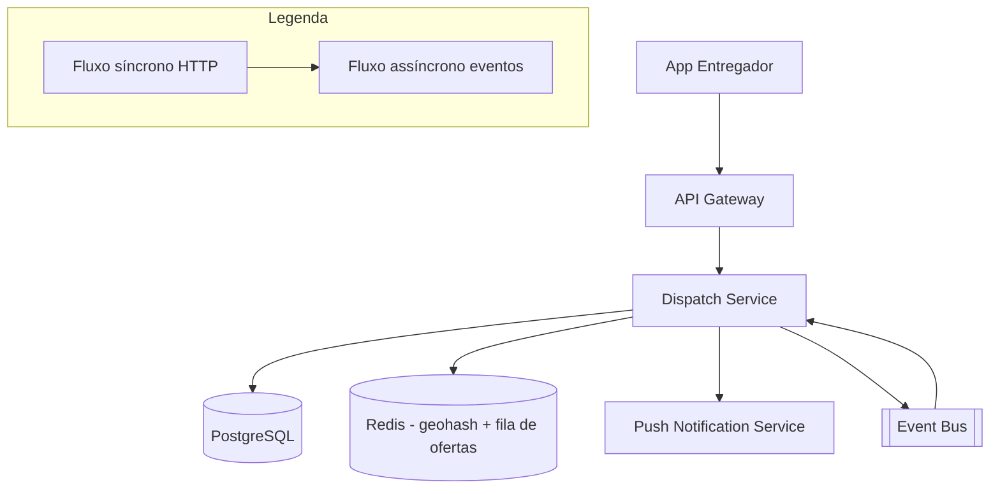

# System Design - Matching e Aceite de Corridas

> **Status:** Em progresso  
> **Fase:** 4  
> **Jornada:** Entregador  
> **Epico:** [Entregador §1.3 — Aceite de corridas](../../epic-ifood-clone.md#13-jornada-do-entregador-app-mobile)  
> **Dependencias:** [08-estados-pedido-restaurante](../08-estados-pedido-restaurante/system-design.md), [04-geolocalizacao-cobertura](../04-geolocalizacao-cobertura/system-design.md), [00-plataforma-transversal](../00-plataforma-transversal/system-design.md)

## 1. Objetivo

Ofertar pedidos `ready_for_pickup` a entregadores proximos com janela de aceite/rejeicao em segundos, garantindo que exatamente um entregador seja vinculado ao pedido (aceite atomico) e que pedidos recusados ou expirados sejam re-ofertados ate encontrar um entregador ou escalonar para admin.

## 2. Escopo Funcional

### 2.1 MVP

- [ ] Entregador online/offline (toggle no app)
- [ ] Atualizacao de localizacao em tempo real (3-5s)
- [ ] Matching por proximidade (geohash + haversine)
- [ ] Oferta com timeout de 30s (visivel no app do entregador)
- [ ] Aceitar → vincula `courier_id` ao pedido atomicamente
- [ ] Rejeitar → oferta proximo candidato
- [ ] Escalonamento se ninguem aceita apos N tentativas
- [ ] Notificacao push ao entregador sobre novas ofertas

### 2.2 Pos-MVP

- [ ] Batch de entregas na mesma regiao (multi-pedido)
- [ ] Prioridade por rating do entregador, taxa de aceite, distancia
- [ ] Surge pricing para entregadores (demanda > oferta)
- [ ] Cancelamento de corrida pelo entregador apos aceite
- [ ] Alocacao manual por admin

## 3. Requisitos Nao Funcionais

- Tempo ate primeira oferta: **< 10s** apos `order.pickup.ready`
- Localizacao do entregador atualizada a cada **3-5s**
- Aceite atomico: conflitos de concorrencia resolvidos com optimistic lock
- Cobertura de matching: 95% dos pedidos aceitos em ate 3 tentativas
- Disponibilidade do dominio: **99.9%**

## 4. Contexto de Negocio

O matching e o ponto critico entre o pedido pronto no restaurante e a coleta pelo entregador. Um matching lento ou mal-sucedido gera:
- Comida esfriando (experiencia do cliente)
- Restaurante ocioso aguardando coleta (ineficiencia operacional)
- Cancelamento de pedidos apos timeout de `ready_for_pickup`
- Perda de receita para plataforma, restaurante e entregador

A concorrencia no aceite (N entregadores recebem a mesma oferta, o primeiro que confirmar vence) exige controle atomico no Redis para evitar vinculo duplicado.

## 5. Arquitetura de Alto Nivel



Diagrama detalhado: [`./architecture.mermaid`](./architecture.mermaid)

## 6. Componentes

### 6.1 Dispatch Service

- Gerencia o ciclo de vida das ofertas: criacao, envio, aceite, rejeicao, expiracao
- Mantem grid de geohash no Redis com posicoes dos entregadores online
- Executa o algoritmo de matching: seleciona os N entregadores mais proximos
- Garante aceite atomico com Lua script ou transacao Redis
- Gerencia a fila de escalonamento para pedidos nao aceitos
- Publica eventos de oferta, aceite, rejeicao e expiracao

### 6.2 Push Notification Service

- Envia notificacao push para o app do entregador ao criar nova oferta
- Inclui dados da oferta no payload (origem, distancia estimada, valor)
- Mensagem silenciosa que acorda o app para exibir a oferta

### 6.3 Escalation Monitor

- Job cron que verifica pedidos na `escalation_queue` ha mais de 5min
- Re-tenta matching com raio expandido (1.5x, 2x, 3x)
- Apos 3 tentativas sem sucesso, escalona para admin via alerta P1
- Admin pode alocar manualmente ou cancelar o pedido

## 7. Modelo de Dados

### 7.1 `courier_sessions`

| Coluna | Tipo | Restricoes | Descricao |
|--------|------|------------|-----------|
| id | UUID | PK | |
| courier_id | UUID | FK → users.id, NOT NULL, UNIQUE | Apenas uma sessao ativa por entregador |
| is_online | BOOLEAN | NOT NULL, DEFAULT false | Online = disponivel para receber ofertas |
| current_geohash | VARCHAR(12) | NULL | Geohash da ultima localizacao conhecida |
| last_lat | DECIMAL(10,7) | NULL | Ultima latitude |
| last_lon | DECIMAL(10,7) | NULL | Ultima longitude |
| status | VARCHAR(16) | NOT NULL, DEFAULT 'offline' | `online`, `offline`, `busy` (em corrida), `paused` |
| current_delivery_id | UUID | NULL, FK → delivery_assignments.id | Corrida atual (se `busy`) |
| battery_level | SMALLINT | NULL | Nivel de bateria (0-100) |
| updated_at | TIMESTAMP | NOT NULL, DEFAULT NOW() | |
| created_at | TIMESTAMP | NOT NULL, DEFAULT NOW() | |

**Indices:**
- `(courier_id)` — UNIQUE (garante uma sessao por entregador)
- `(is_online, current_geohash)` — busca de entregadores online por regiao
- `(status, updated_at)` — entregadores ociosos vs ocupados

### 7.2 `delivery_offers`

| Coluna | Tipo | Restricoes | Descricao |
|--------|------|------------|-----------|
| id | UUID | PK | |
| order_id | UUID | FK → orders.id, NOT NULL | |
| courier_id | UUID | FK → users.id, NOT NULL | Entregador que recebeu a oferta |
| attempt | SMALLINT | NOT NULL, DEFAULT 1 | Numero da tentativa (1, 2, 3...) |
| status | VARCHAR(16) | NOT NULL, DEFAULT 'pending' | `pending`, `accepted`, `rejected`, `expired`, `timed_out` |
| expires_at | TIMESTAMP | NOT NULL | Timestamp de expiracao (created_at + 30s) |
| responded_at | TIMESTAMP | NULL | Quando o entregador respondeu |
| rejection_reason | VARCHAR(64) | NULL | `too_far`, `busy`, `low_fare`, `other` |
| created_at | TIMESTAMP | NOT NULL, DEFAULT NOW() | |

**Indices:**
- `(courier_id, status, created_at)` — ofertas pendentes/respondidas de um entregador
- `(order_id, attempt)` — tentativas por pedido
- `(status, expires_at)` — ofertas expiradas para job de cleanup

### 7.3 `delivery_assignments`

| Coluna | Tipo | Restricoes | Descricao |
|--------|------|------------|-----------|
| id | UUID | PK | |
| order_id | UUID | FK → orders.id, NOT NULL, UNIQUE | Um pedido so pode ter uma atribuicao ativa |
| courier_id | UUID | FK → users.id, NOT NULL | |
| offer_id | UUID | FK → delivery_offers.id, NOT NULL | Oferta que originou a atribuicao |
| status | VARCHAR(16) | NOT NULL, DEFAULT 'assigned' | `assigned`, `picked_up`, `completed`, `cancelled` |
| assigned_at | TIMESTAMP | NOT NULL, DEFAULT NOW() | |
| picked_up_at | TIMESTAMP | NULL | Quando o entregador coletou o pedido |
| completed_at | TIMESTAMP | NULL | Quando a entrega foi finalizada |
| cancelled_at | TIMESTAMP | NULL | Se foi cancelado |
| cancellation_reason | VARCHAR(128) | NULL | |

**Indices:**
- `(order_id)` — UNIQUE
- `(courier_id, status)` — corridas ativas do entregador
- `(status, assigned_at)` — metricas de tempo ate coleta

### 7.4 `escalation_queue`

| Coluna | Tipo | Restricoes | Descricao |
|--------|------|------------|-----------|
| id | UUID | PK | |
| order_id | UUID | FK → orders.id, NOT NULL, UNIQUE | |
| attempts | SMALLINT | NOT NULL, DEFAULT 0 | Numero de tentativas de matching |
| last_attempt_at | TIMESTAMP | NULL | Ultima tentativa |
| escalated_at | TIMESTAMP | NOT NULL, DEFAULT NOW() | Quando entrou na fila |
| status | VARCHAR(16) | NOT NULL, DEFAULT 'pending' | `pending`, `reassigned`, `resolved`, `cancelled` |
| resolved_by | UUID | NULL, FK → users.id | Admin que resolveu |
| resolved_at | TIMESTAMP | NULL | |
| notes | TEXT | NULL | Observacoes do admin |

**Indices:**
- `(status, escalated_at)` — priorizacao dos mais antigos

### 7.5 `courier_availability_history` (auditoria)

| Coluna | Tipo | Restricoes | Descricao |
|--------|------|------------|-----------|
| id | UUID | PK | |
| courier_id | UUID | FK → users.id, NOT NULL | |
| previous_status | VARCHAR(16) | NOT NULL | `online`, `offline`, `busy`, `paused` |
| new_status | VARCHAR(16) | NOT NULL | |
| reason | VARCHAR(64) | NULL | `manual_toggle`, `delivery_accepted`, `delivery_completed`, `app_background`, `battery_low` |
| geohash | VARCHAR(12) | NULL | Localizacao no momento da mudanca |
| created_at | TIMESTAMP | NOT NULL, DEFAULT NOW() | |

**Indices:**
- `(courier_id, created_at)` — historico de disponibilidade

### 7.6 Dados em Redis (tempo real)

#### Posicoes dos entregadores

**Estrutura:** `GEOADD courier:positions {lon} {lat} {courier_id}`

- Chave: `courier:positions`
- Tipo: Redis Geoset
- TTL: N/A (dados volateis, reconstruidos em 3-5s)
- Permite buscar por raio: `GEORADIUS courier:positions {lon} {lat} {radius} km`

#### Track de ofertas ativas

**Estrutura:** String com TTL

- Chave: `offer:lock:{order_id}`
- Valor: `{offer_id}:{courier_id}`
- TTL: 30s (mesmo tempo da oferta)
- Impede que dois eventos de matching criem ofertas para o mesmo pedido simultaneamente

#### Contador de tentativas de matching

**Estrutura:** String com TTL

- Chave: `match:attempts:{order_id}`
- Valor: numero de tentativas (INT)
- TTL: 15min (tempo maximo para matching)

## 8. Fluxos Principais

### 8.1 Entregador online/offline

1. Entregador abre o app e clica "Ficar Online" ou o app volta ao foreground.
2. `POST /v1/couriers/me/status` body: `{ "online": true }`.
3. Dispatch Service:
   - Valida JWT com role `courier`.
   - Verifica se entregador tem perfil aprovado e documentacao em dia.
   - Atualiza `courier_sessions.is_online = true`, `status = 'online'`.
   - Registra auditoria em `courier_availability_history`.
4. Entregador comeca a enviar localizacao a cada 3-5s (`POST /v1/couriers/me/location`).
5. Dispatch Service atualiza `courier:positions` (Geoset Redis) e `courier_sessions.current_geohash`.

### 8.2 Oferta por proximidade (ao receber `order.pickup.ready`)

1. Dispatch Service consome `order.pickup.ready` do Event Bus.
2. Cria `offer:lock:{order_id}` no Redis com TTL de 30s (impede matching duplicado).
3. Recupera coordenadas do restaurante do payload do evento.
4. Busca entregadores online no raio via `GEORADIUS courier:positions {restaurantLon} {restaurantLat} 3 km`.
5. Filtra entregadores que:
   - Nao estao `busy` (em outra corrida).
   - Nao receberam oferta para este pedido nas ultimas tentativas.
   - Tem bateria > 10%.
6. Ordena por proximidade + taxa de aceite historica (quanto menor a taxa, menor a prioridade).
7. Seleciona os **5 entregadores mais viaveis** para a primeira tentativa.
8. Para cada entregador selecionado:
   a. Cria `delivery_offers` com `status = 'pending'` e `expires_at = NOW() + 30s`.
   b. Envia notificacao push com dados da oferta (restaurante, distancia, valor estimado).
9. Se < 5 entregadores encontrados no raio de 3km, prossegue com os encontrados. O raio expande **entre tentativas** conforme ADR-004 (tentativa 1 = 3km, tentativa 2 = 5km, tentativa 3 = 8km).
10. Se nenhum entregador encontrado, insere na `escalation_queue` imediatamente.
11. Inicia timer de expiracao da oferta (job ou Redis TTL).

**Nota:** O valor estimado do frete (`estimatedFareCents`) e obtido do [Coverage Service](../04-geolocalizacao-cobertura/system-design.md#92-endpoints-do-dominio-de-cobertura) com base na distancia linear e na zona de cobertura. O endereco do cliente (`dropoffLat/Lon`) e buscado do Order Service via chamada interna ao consumir o evento `order.pickup.ready`.

### 8.3 Aceite atomico e vinculacao

1. Entregador recebe push, abre oferta no app e clica "Aceitar".
2. App envia `POST /v1/delivery-offers/{offerId}/accept`.
3. Dispatch Service executa o aceite atomico:
   a. Redis **Lua script** (atomico):
      - Verifica se `offer:lock:{order_id}` ainda existe.
      - Verifica se `delivery:assigned:{order_id}` ja existe (outro entregador ja aceitou).
      - Se ambos nao existirem, cria `delivery:assigned:{order_id}` com TTL de 5min.
   b. Se o lock ja estiver ocupado (outro entregador aceitou primeiro):
      - Retorna **409 Conflict** com mensagem "Oferta ja foi aceita por outro entregador".
      - Atualiza `delivery_offers.status = 'timed_out'` para este entregador.
   c. Se o aceite for bem-sucedido:
      - Atualiza `delivery_offers.status = 'accepted'` e `responded_at = NOW()`.
      - Cria `delivery_assignments` com `order_id`, `courier_id`, `offer_id`.
      - Remove `offer:lock:{order_id}` do Redis.
      - Atualiza `courier_sessions.status = 'busy'`, vincula `current_delivery_id` e define `busy_timeout_at = NOW() + 30min`.
      - Remove entregador do Geoset `courier:positions`.
      - Publica `delivery.offer.accepted`.
4. App do entregador exibe tela de "Corrida Confirmada" com dados do pedido e rota ate o restaurante.

### 8.4 Rejeicao e proximo candidato

1. Entregador recebe push e clica "Rejeitar".
2. App envia `POST /v1/delivery-offers/{offerId}/reject` com `reason` opcional.
3. Dispatch Service:
   a. Atualiza `delivery_offers.status = 'rejected'` e `rejection_reason`.
   b. Publica `delivery.offer.rejected`.
   c. Recupera `attempt` atual da oferta (1, 2 ou 3).
4. Se `attempt < 3`:
   a. Busca o **proximo candidato** na lista ordenada de entregadores viaveis.
   b. Cria nova oferta com `attempt + 1` e envia push.
5. Se `attempt >= 3` ou nao ha mais candidatos no raio:
   a. Insere pedido na `escalation_queue`.
   b. Publica `delivery.escalated`.
6. Expande raio gradativamente: tentativa 1 = 3km, tentativa 2 = 5km, tentativa 3 = 8km.

### 8.5 Timeout de oferta (30s)

1. Job `check_offer_timeout` executa a cada 10 segundos.
2. Busca ofertas com `status = 'pending'` e `expires_at < NOW()`.
3. Para cada oferta expirada:
   a. Atualiza `delivery_offers.status = 'expired'`.
   b. Publica `delivery.offer.expired`.
   c. Recupera `attempt` e verifica se ha mais candidatos para tentar.
4. Se todas as ofertas da tentativa expiraram sem aceite:
   a. Remove `offer:lock:{order_id}` do Redis.
   b. Avanca para proxima tentativa (raio expandido) ou insere na escalation queue.

## 9. Contratos de API

### 9.1 Padrao de erro

Segue o [padrao global definido na Plataforma Transversal](../00-plataforma-transversal/system-design.md#91-padrao-de-erro-global).

### 9.2 Endpoints do dominio de dispatch

#### `POST /v1/couriers/me/status`

Ativa ou desativa a disponibilidade do entregador para receber ofertas.

**Request body:**
```json
{
  "online": true,
  "reason": "manual_toggle"
}
```

**Response (200):**
```json
{
  "courierId": "uuid",
  "status": "online",
  "since": "2026-07-04T14:00:00.000Z",
  "pendingOffers": 0
}
```

**Errors:**
- `422` — Perfil de entregador incompleto ou documentacao pendente.

#### `POST /v1/couriers/me/location`

Atualiza a localizacao do entregador. Chamado a cada 3-5s pelo app em foreground.

**Request body:**
```json
{
  "lat": -23.5505,
  "lon": -46.6333,
  "accuracy": 15,
  "batteryLevel": 85
}
```

**Response (204):** Sem conteudo.

#### `GET /v1/couriers/me/offers?status=`

Lista ofertas recebidas pelo entregador autenticado.

**Query params:**
- `status` (STRING, opcional) — `pending`, `accepted`, `rejected`, `expired`

**Response (200):**
```json
{
  "offers": [
    {
      "offerId": "uuid",
      "orderId": "uuid",
      "restaurantName": "Pizza Express",
      "restaurantAddress": "Rua Augusta, 500",
      "distanceKm": 1.2,
      "estimatedFareCents": 800,
      "estimatedRoute": {
        "pickupLat": -23.5505,
        "pickupLon": -46.6333,
        "dropoffLat": -23.5612,
        "dropoffLon": -46.6558
      },
      "expiresAt": "2026-07-04T14:30:30.000Z",
      "createdAt": "2026-07-04T14:30:00.000Z"
    }
  ]
}
```

#### `POST /v1/delivery-offers/{offerId}/accept`

Aceita uma oferta de entrega. Execucao atomica — primeiro que chamar este endpoint vence.

**Response (200):**
```json
{
  "offerId": "uuid",
  "orderId": "uuid",
  "assignmentId": "uuid",
  "status": "accepted",
  "restaurant": {
    "name": "Pizza Express",
    "address": "Rua Augusta, 500",
    "lat": -23.5505,
    "lon": -46.6333
  },
  "customer": {
    "name": "Ana Souza",
    "address": "Av. Paulista, 1000",
    "lat": -23.5612,
    "lon": -46.6558
  },
  "items": [
    { "name": "Pizza Margherita", "quantity": 1 }
  ],
  "acceptedAt": "2026-07-04T14:30:05.000Z"
}
```

**Response (409) — oferta ja aceita por outro:**
```json
{
  "error": {
    "code": "CONFLICT",
    "message": "Oferta ja foi aceita por outro entregador.",
    "details": [{ "reason": "offer_already_assigned" }],
    "correlationId": "...",
    "timestamp": "2026-07-04T14:30:05.000Z"
  }
}
```

**Response (410) — oferta expirada:**
```json
{
  "error": {
    "code": "GONE",
    "message": "Oferta expirou. Aguarde nova oferta.",
    "correlationId": "...",
    "timestamp": "2026-07-04T14:30:35.000Z"
  }
}
```

#### `POST /v1/delivery-offers/{offerId}/reject`

Rejeita uma oferta de entrega.

**Request body:**
```json
{
  "reason": "too_far"
}
```

**Response (200):**
```json
{
  "offerId": "uuid",
  "status": "rejected",
  "nextOfferEta": "Em ate 30s voce pode receber uma nova oferta."
}
```

#### `GET /v1/admin/escalation/queue`

Lista pedidos na fila de escalonamento (admin).

**Query params:**
- `status` (STRING, opcional) — `pending`, `resolved`, `cancelled`
- `page` (INT, opcional, default 1)

**Response (200):**
```json
{
  "queue": [
    {
      "orderId": "uuid",
      "restaurantName": "Pizza Express",
      "attempts": 3,
      "escalatedAt": "2026-07-04T14:35:00.000Z",
      "lastAttemptAt": "2026-07-04T14:34:00.000Z",
      "coverageRadiusKm": 8,
      "availableCouriersNearby": 0
    }
  ],
  "total": 2,
  "page": 1
}
```

### 9.3 Health check

Segue o [padrao definido no documento 00](../00-plataforma-transversal/system-design.md#92-health-check).

## 10. Contratos de Eventos

> **Nota:** O envelope padrao dos eventos e definido pela **Plataforma Transversal** (documento 00). Consulte a [secao 10 do System Design 00](../00-plataforma-transversal/system-design.md#10-contratos-de-eventos) para o schema completo do envelope, politica de versionamento e topic naming.

### 10.1 Eventos publicados pelo Dispatch Service

#### `delivery.offer.created`

Publicado quando uma nova oferta de entrega e criada para um entregador.

**Payload:**
```json
{
  "offerId": "d1e2f3a4-5b6c-7d8e-9f0a-1b2c3d4e5f6a",
  "orderId": "f7a8b9c0-...",
  "courierId": "a1b2c3d4-...",
  "restaurantId": "b2c3d4e5-...",
  "attempt": 1,
  "expiresAt": "2026-07-04T14:30:30.000Z",
  "createdAt": "2026-07-04T14:30:00.000Z"
}
```

**Consumidores:** Push Notification (enviar push ao entregador), Analytics.

#### `delivery.offer.accepted`

Publicado quando um entregador aceita a oferta com sucesso.

**Payload:**
```json
{
  "offerId": "d1e2f3a4-...",
  "orderId": "f7a8b9c0-...",
  "courierId": "a1b2c3d4-...",
  "assignmentId": "e5f6a7b8-...",
  "acceptedAt": "2026-07-04T14:30:05.000Z",
  "responseTimeSeconds": 5
}
```

**Consumidores:** Order Service (atualizar status para `dispatched`), Notification (push para cliente "entregador a caminho"), Tracking, Analytics.

#### `delivery.offer.rejected`

Publicado quando um entregador rejeita a oferta.

**Payload:**
```json
{
  "offerId": "d1e2f3a4-...",
  "orderId": "f7a8b9c0-...",
  "courierId": "a1b2c3d4-...",
  "reason": "too_far",
  "attempt": 1,
  "respondedAt": "2026-07-04T14:30:08.000Z"
}
```

**Consumidores:** Analytics (taxa de aceite), Dispatch Service (proximo candidato).

#### `delivery.offer.expired`

Publicado quando uma oferta expira sem resposta.

**Payload:**
```json
{
  "offerId": "d1e2f3a4-...",
  "orderId": "f7a8b9c0-...",
  "courierId": "a1b2c3d4-...",
  "attempt": 1,
  "expiredAt": "2026-07-04T14:30:30.000Z"
}
```

**Consumidores:** Dispatch Service (proxima tentativa se houver), Analytics.

#### `delivery.escalated`

Publicado quando um pedido e escalado para admin apos esgotar tentativas de matching.

**Payload:**
```json
{
  "orderId": "f7a8b9c0-...",
  "restaurantId": "a1b2c3d4-...",
  "attempts": 3,
  "maxRadiusKm": 8,
  "escalatedAt": "2026-07-04T14:35:00.000Z"
}
```

**Consumidores:** Admin Panel (notificar admin), Analytics.

### 10.2 Eventos consumidos de outros dominios

| Evento | Produtor (dominio) | Acao no Dispatch Service |
|--------|---------------------|--------------------------|
| `order.pickup.ready` | Estados do Pedido (08) | Iniciar matching: selecionar entregadores, criar ofertas |
| `order.status.changed` | Estados do Pedido (08) | Se `toStatus = 'cancelled'`, cancelar ofertas pendentes do pedido e remover da escalation queue |
| `delivery.offer.rejected` | Dispatch Service | Proximo candidato (autoconsumo) |
| `delivery.offer.expired` | Dispatch Service | Proxima tentativa ou escalonamento (autoconsumo) |

### 10.3 Tabela de eventos publicados do dominio

| Evento | Produtor | Consumidores | Schema Version |
|--------|----------|--------------|----------------|
| `delivery.offer.created` | Dispatch Service | Push Notification, Analytics | 1.0 |
| `delivery.offer.accepted` | Dispatch Service | Order Service, Notification, Tracking, Analytics | 1.0 |
| `delivery.offer.rejected` | Dispatch Service | Analytics, Dispatch (autoconsumo) | 1.0 |
| `delivery.offer.expired` | Dispatch Service | Analytics, Dispatch (autoconsumo) | 1.0 |
| `delivery.escalated` | Dispatch Service | Admin Panel, Analytics | 1.0 |

## 11. Seguranca

### 11.1 RBAC especifico

| Role | Acoes permitidas |
|------|------------------|
| `courier` | Gerenciar propria disponibilidade (online/offline), enviar localizacao, listar/aceitar/rejeitar proprias ofertas |
| `courier` (em corrida) | Nao recebe novas ofertas (status `busy`) |
| `admin` | Visualizar fila de escalonamento, alocar manualmente entregador a pedido, cancelar corrida |
| `admin` | Visualizar metricas de matching e taxa de aceite de entregadores |

- Toda rota `/v1/couriers/me/*` valida que `courier_id` do token corresponde ao usuario autenticado.
- `POST /v1/delivery-offers/{id}/accept` valida que a oferta pertence ao entregador autenticado.
- Aceite atomico bloqueia duplicatas em nivel de Redis (Lua script) — nao depende apenas de validacao JWT.

### 11.2 Protecao de localizacao (LGPD)

- Localizacao do entregador armazenada apenas no Redis (volatil, sem persistencia).
- `courier_availability_history` registra apenas geohash (precisao de ~150m), nunca lat/lon brutos.
- Logs de aplicacao nunca registram lat/lon brutos — apenas geohash.
- Dados de localizacao retidos no maximo 30 dias em auditoria.
- Entregador pode solicitar exportacao dos seus dados de localizacao via endpoint de privacidade.

### 11.3 Protecoes no Gateway

- Rate limit em `POST /v1/couriers/me/location`: **120 requests/min** por entregador (1 a cada 0.5s).
- Rate limit em `POST /v1/delivery-offers/{id}/accept`: **10 requests/min** por entregador.
- Rate limit em `POST /v1/couriers/me/status`: **10 requests/min** por entregador.

## 12. Escalabilidade

### 12.1 Cache e dados em tempo real

| Recurso | Estrategia | TTL |
|---------|------------|-----|
| Posicoes dos entregadores | Redis Geoset `courier:positions` | Enquanto online (TTL renovado a cada location update) |
| Lock de matching por pedido | Redis String `offer:lock:{order_id}` | 30s (duracao da oferta) |
| Lock de aceite | Redis String `delivery:assigned:{order_id}` | 5min (ate confirmacao do Order Service) |
| Contador de tentativas | Redis String `match:attempts:{order_id}` | 15min |
| Sessao do entregador (online/offline) | Cache local + Redis | 30s |

### 12.2 Database

- Tabelas no schema `dispatch` do PostgreSQL compartilhado.
- `delivery_offers` e `delivery_assignments` — alto volume de escritas (potencialmente 1 oferta por segundo no pico).
- `courier_availability_history` — particionamento por mes.
- `escalation_queue` — volume baixo, sem necessidade de particionamento.

### 12.3 Grid de geohash

- O Redis Geoset `courier:positions` gerencia ate **10k entregadores online simultaneos**.
- `GEORADIUS` e uma operacao O(log N) — eficiente para buscas por raio.
- Para alta escala (50k+ entregadores), migrar para grade de geohash com sharding por regiao (ex: `courier:positions:{geohash_prefix}`).

### 12.4 Estimativa de capacidade

| Recurso | Estimativa | Folga |
|---------|------------|-------|
| Entregadores online simultaneos (pico) | 5k | 2x (10k) |
| Ofertas criadas por segundo (pico) | 15/s (5 ofertas × 3 pedidos simultaneos) | 2x (30/s) |
| Atualizacoes de localizacao por segundo | 1.5k (5k × 1 a cada 3.3s) | 2x (3k/s) |
| Linhas em `delivery_offers` por dia | 150k (15/s × 3h pico + 10h off-peak) | 2x (300k) |
| Linhas em `delivery_assignments` por dia | 50k | 2x (100k) |
| Linhas em `courier_availability_history` por dia | 100k | 2x (200k) |

## 13. Observabilidade

### 13.1 Logs estruturados

Segue o [padrao do documento 00](../00-plataforma-transversal/system-design.md#131-logs-estruturados). Campos adicionais:

- `orderId` — ID do pedido sendo matchado
- `offerId` — ID da oferta
- `courierId` — ID do entregador
- `attempt` — numero da tentativa de matching
- `radiusKm` — raio de busca utilizado

### 13.2 Metricas especificas do dominio

| Metrica | Tipo | Descricao |
|---------|------|-----------|
| `dispatch_offers_created_total` | Counter | Ofertas criadas (tag: `attempt`) |
| `dispatch_offers_accepted_total` | Counter | Ofertas aceitas |
| `dispatch_offers_rejected_total` | Counter | Ofertas rejeitadas por motivo |
| `dispatch_offers_expired_total` | Counter | Ofertas expiradas |
| `dispatch_acceptance_rate` | Gauge | Taxa de aceite por periodo (aceitas / criadas) |
| `dispatch_first_offer_time_seconds` | Histogram | Tempo entre `order.pickup.ready` e primeira oferta |
| `dispatch_match_time_seconds` | Histogram | Tempo ate matching bem-sucedido (p50/p95/p99) |
| `dispatch_attempts_to_match` | Histogram | Numero de tentativas ate matching |
| `dispatch_couriers_online` | Gauge | Entregadores online no momento |
| `dispatch_couriers_busy` | Gauge | Entregadores em corrida |
| `dispatch_escalated_total` | Counter | Pedidos escalados para admin |
| `dispatch_georadius_duration_ms` | Histogram | Tempo de busca `GEORADIUS` no Redis |

### 13.3 Dashboard (Grafana)

- **Entregadores online vs busy** — gauge ao longo do tempo
- **Taxa de aceite** — porcentagem por hora
- **Tempo ate matching** — histograma com p50/p95/p99
- **Tentativas por matching** — distribuicao (1, 2, 3+)
- **Ofertas criadas vs aceitas** — stacked area chart
- **Motivos de rejeicao** — pie chart
- **Fila de escalonamento** — contagem de pedidos nao matchados
- **Raio de cobertura** — mapa de calor de entregadores online por regiao

### 13.4 Alertas especificos

| Alerta | Condicao | Severidade | Acao |
|--------|----------|------------|------|
| Tempo de matching acima do tolerado | p95 match_time > 30s em 5min | P1 | Verificar Redis, expandir raio, notificar admin |
| Sem entregadores online em regiao | Nenhum courier online em zona de cobertura | P2 | Notificar operacao, considerar incentivos |
| Taxa de aceite baixa | < 50% em 30min | P2 | Investigar motivo (tarifa baixa? raio pequeno?) |
| Escalonamento elevado | > 10 pedidos na escalation queue | P2 | Verificar disponibilidade de entregadores |
| Redis Geoset inconsistente | `courier:positions` count diverge de `courier_sessions` online | P2 | Job de reconciliação |

## 14. Resiliencia

### 14.1 Timeouts

| Tipo de chamada | Timeout | Justificativa |
|-----------------|---------|---------------|
| Busca GEORADIUS no Redis | 200ms | Operacao O(log N) em memoria |
| Escrita de oferta (PG) | 1s | Insert simples |
| Publicacao de evento | 3s | Event Bus |
| Push notification | 2s | Provider externo |

### 14.2 Retries com jitter

| Cenario | Tentativas | Intervalo | Jitter |
|---------|------------|-----------|--------|
| Publicacao de evento | 3 | 200ms, 400ms, 800ms | +/- 50ms |
| Busca GEORADIUS se Redis falhar | 3 | 100ms, 200ms, 400ms | +/- 20ms |
| Push notification | 3 | 500ms, 1s, 2s | +/- 100ms |

### 14.3 Circuit breaker

| Circuito | Threshold de falha | Janela | Tempo de half-open |
|----------|--------------------|--------|---------------------|
| Push Notification | 10 falhas | 60s | 30s |
| Redis Geoset | 5 falhas | 30s | 10s |

### 14.4 Graceful degradation

| Cenario | Acao |
|---------|------|
| Redis indisponivel | Matching por proximidade via PostgreSQL com haversine (mais lento, sem tempo real). Posicoes dos entregadores lidas da tabela `courier_sessions` com cache de 5s. |
| Redis Geoset corrupto | Job de reconciliação a cada 5min recalcula `courier:positions` a partir de `courier_sessions` onde `is_online = true` e `updated_at > NOW() - 30s`. |
| Push notification falha | Oferta ainda aparece na lista de ofertas pendentes do app (`GET /v1/couriers/me/offers`) com polling a cada 10s. |
| PostgreSQL indisponivel | Matching continua via Redis apenas. Escrita de ofertas e atribuicoes falha com erro. Ofertas sao mantidas em buffer no Redis até o PG ser restabelecido. |
| Event Bus indisponivel | Aceite atomico via Redis continua funcionando normalmente (independente do Event Bus). Atualizacao no PG tambem funciona. Eventos downstream (delivery.offer.accepted, etc.) sao enfileirados para publicacao posterior quando o Event Bus for restabelecido. |

### 14.5 Aceite atomico

O aceite atomico e a operacao mais critica do dominio. Implementacao:

1. Cliente envia `POST /v1/delivery-offers/{id}/accept`.
2. Dispatch Service executa **Lua script** no Redis:
   ```
   -- Verifica se ja foi atribuido
   if redis.call('EXISTS', 'delivery:assigned:' .. orderId) == 1 then
     return { status = 'conflict' }
   end
   -- Verifica se o lock da oferta ainda existe
   if redis.call('EXISTS', 'offer:lock:' .. orderId) == 0 then
     return { status = 'expired' }
   end
   -- Cria lock de atribuicao
   redis.call('SET', 'delivery:assigned:' .. orderId, offerId .. ':' .. courierId, 'EX', 300)
   return { status = 'accepted' }
   ```
3. Se `conflict` → retorna 409 para o cliente.
4. Se `expired` → retorna 410 para o cliente.
5. Se `accepted` → persiste no PG e publica eventos.

### 14.6 Job de reconciliação de matching

- Job cron `reconcile_matching` executa a cada 5 minutos.
- Verifica ofertas `pending` ha mais de 60s (stuck).
- Verifica `delivery:assigned:*` no Redis sem `delivery_assignments` correspondente no PG.
- Verifica `delivery_assignments` sem oferta correspondente no Redis.
- Corrige inconsistencias e registra alerta se necessario.

### 14.7 Idempotencia

- `POST /v1/couriers/me/location`: idempotente por natureza (ultimo valor vence).
- `POST /v1/delivery-offers/{id}/accept`: protegido pelo lock atomico no Redis — mesma oferta nao pode ser aceita duas vezes.
- `POST /v1/couriers/me/status`: idempotente (chamar `online = true` duas vezes resulta no mesmo estado).

## 15. Decisoes Arquiteturais (ADRs)

### ADR-001: Matching por Proximidade via Redis Geoset

| Campo | Valor |
|-------|-------|
| **Decisao** | Posicoes dos entregadores armazenadas em Redis Geoset com busca `GEORADIUS` |
| **Contexto** | Atualizacao de localizacao a cada 3-5s exige escrita de alta frequencia (1.5k writes/s). Busca por raio precisa ser < 200ms para matching em tempo real. |
| **Alternativas** | PostgreSQL com extensao PostGIS (escrita muito mais lenta, nao adequado para 1.5k writes/s), Elasticsearch (overhead desnecessario), Grid de geohash em memoria propria (mais complexo) |
| **Consequencias** | Positivas: escrita O(1), busca O(log N), baixa latencia, TTL nativo. Negativas: se Redis falhar, perde-se as posicoes em tempo real (fallback para PG). |
| **Status** | Aprovado |

### ADR-002: Aceite Atomico com Lua Script no Redis

| Campo | Valor |
|-------|-------|
| **Decisao** | Lock de concorrencia implementado como Lua script atomico no Redis em vez de lock distribuido (Redlock) ou transacao no banco |
| **Contexto** | Multiplos entregadores recebem a mesma oferta. O primeiro que aceitar deve vencer atomicamente sem condicao de corrida. |
| **Alternativas** | `SELECT ... FOR UPDATE` no PostgreSQL (mais lento, maior latencia), Redlock (mais complexo, overhead de quorum), Optimistic locking com versao no PG (pode gerar mais conflitos) |
| **Consequencias** | Positivas: latencia < 5ms para o lock, atomico por design, simples de implementar. Negativas: dependencia do Redis para a correcao do matching (fallback precisa ser implementado para caso de falha do Redis). |
| **Status** | Aprovado |

### ADR-003: Timeout de Oferta de 30s com Job de Cleanup

| Campo | Valor |
|-------|-------|
| **Decisao** | Ofertas expiram em 30s (configuravel), com job cron a cada 10s limpando ofertas expiradas e avancando para proximo candidato |
| **Contexto** | Janela de aceite precisa ser curta o suficiente para nao atrasar o pedido, mas longa o suficiente para o entregador reagir. |
| **Alternativas** | TTL do Redis para expirar ofertas automaticamente (Redis nao publica evento de expiracao de forma confiavel para acionar logica de negocio), Kafka Streams windowing (mais complexo para MVP) |
| **Consequencias** | Positivas: job simples, flexivel (configuravel), expiracao registrada no PG para auditoria. Negativas: janela de ate 10s entre expiracao real e deteccao pelo job. Aceitavel vs tempo total de matching (< 10s target). |
| **Status** | Aprovado |

### ADR-004: Raio de Matching Progressivo

| Campo | Valor |
|-------|-------|
| **Decisao** | Raio de busca expande gradativamente: tentativa 1 = 3km, tentativa 2 = 5km, tentativa 3 = 8km. Apos 3 tentativas sem sucesso, pedido vai para escalation queue. |
| **Contexto** | Comecar com raio pequeno (entregador mais proximo = menor tempo de deslocamento) e expandir apenas se necessario. |
| **Alternativas** | Raio fixo de 5km (pode perder entregadores proximos em zonas densas, ou nao encontrar ninguem em zonas remotas), Busca sem limite de raio (pode ofertar a entregadores muito distantes, aumentando tempo de espera do cliente) |
| **Consequencias** | Positivas: balance entre tempo de deslocamento e chance de matching. Negativas: pedidos em zonas remotas podem exigir raios maiores (8km) ou escalonamento. Configuravel por zona de cobertura. |
| **Status** | Aprovado |

### ADR-005: Fila de Ofertas em PG com Cache Redis vs Apenas Redis

| Campo | Valor |
|-------|-------|
| **Decisao** | Ofertas persistidas em PostgreSQL (source of truth) com cache Redis para estado ativo das ofertas pendentes |
| **Contexto** | Ofertas podem ser perdidas se apenas Redis for usado e ele falhar. PG garante durabilidade, Redis garante performance para matching. |
| **Alternativas** | Apenas Redis (mais rapido, mas risco de perda), apenas PG (garantia total, mas matching mais lento) |
| **Consequencias** | Positivas: durabilidade dos dados, matching rapido via Redis, recuperacao via job de reconciliacao. Negativas: complexidade de manter dois stores sincronizados, latencia adicional da escrita no PG (~10ms extra). |
| **Status** | Aprovado |

## 16. Riscos e Mitigacoes

| Risco | Probabilidade | Impacto | Mitigacao |
|-------|---------------|---------|-----------|
| **Concorrencia no aceite — dois entregadores aceitam a mesma oferta simultaneamente** | Media | Alto | Lua script atomico no Redis garante que apenas um vence. O perdedor recebe 409. |
| **Redis cai e posicoes dos entregadores sao perdidas** | Baixa | Alto | Fallback para busca em PostgreSQL com haversine (mais lento, mas funcional). Job de reconciliação. |
| **Nenhum entregador disponivel na regiao** | Media | Alto | Raio progressivo (3km → 5km → 8km), escalation queue com alerta para admin, notificacao para cliente do atraso. |
| **Push notification nao chega ao entregador** | Media | Medio | App faz polling da lista de ofertas (`GET /v1/couriers/me/offers`) a cada 10s como fallback. |
| **Entregador fica online mas nao atualiza localizacao** | Media | Baixo | Timeout de 60s sem atualizacao → status muda para `offline` automaticamente. Job de stale sessions. |
| **Taxa de rejeicao alta (entregadores nao aceitando ofertas)** | Media | Alto | Investigar motivo (tarifa baixa? distancia longa?). Surge pricing (pos-MVP). Notificar admin se > 50% em 30min. |
| **Oferta expira mas job de cleanup atrasa** | Baixa | Medio | Job executa a cada 10s — janela maxima de 10s entre expiracao e deteccao. Aceitavel vs tempo de matching target de < 10s. |
| **Sobrecarga do Redis com 1.5k writes/s de localizacao** | Baixa | Medio | Redis 7+ suporta > 100k ops/s. Cluster mode se necessario. TTL de 30s nos Geoset members. |

### 16.1 Matriz de probabilidade x impacto

```
Impacto:  Baixo      Medio       Alto        Critico
Probabilidade
Alta      |           |            |            |
          |           |            |            |
Media     | Stale loc | Push fail  | Concor.,  |
          |           |            | Sem entre.|
          |           |            | Rejeicao  |
Baixa     |           | Job atraso,| Redis cai |
          |           | Redis sobr.|            |
```

---

> **Documentos relacionados:** [Template de system design](../../templates/system-design-template.md) | [Roadmap](../../roadmap/ordem-das-jornadas.md) | [Epico iFood Clone](../../epic-ifood-clone.md) | [Plataforma Transversal](../00-plataforma-transversal/system-design.md)
