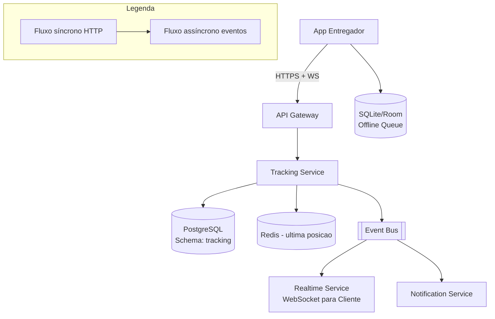

# System Design - Roteirizacao e Localizacao do Entregador

> **Status:** Em progresso  
> **Fase:** 4  
> **Jornada:** Entregador  
> **Epico:** [Entregador §1.3 — Roteirizacao](../../epic-ifood-clone.md#13-jornada-do-entregador-app-mobile) + [RNF offline-first](../../epic-ifood-clone.md#2-requisitos-não-funcionais-rnf)  
> **Dependencias:** [09-matching-entregador](../09-matching-entregador/system-design.md), [00-plataforma-transversal](../00-plataforma-transversal/system-design.md)

## 1. Objetivo

Prover navegacao turn-by-turn para o entregador (restaurante → cliente), ingerir pings de localizacao a cada 3-5s para rastreamento em tempo real, registrar marcos da corrida (`heading_to_restaurant`, `at_restaurant`, `heading_to_customer`, `arrived`) e garantir que o app funcione offline com fila de sync.

## 2. Escopo Funcional

### 2.1 MVP

- [ ] Deep link para Google Maps / Waze com coordenadas de destino
- [ ] Ingestao de pings de localizacao (3-5s) com suporte a batch offline
- [ ] Marcos da corrida: `heading_to_restaurant` → `at_restaurant` → `heading_to_customer` → `arrived`
- [ ] Rastreamento em tempo real para o cliente (WebSocket)
- [ ] Cache local offline: enderecos, rota, codigo de confirmacao
- [ ] Sync ao reconectar (fila de pings + milestones)
- [ ] Visualizacao de rota no mapa (restaurante e destino do cliente)

### 2.2 Pos-MVP

- [ ] ETA dinamico com traffic API (Google Maps Distance Matrix)
- [ ] Geofence automatico: detectar chegada ao restaurante/cliente sem acao do entregador
- [ ] Rota otimizada para multiplas entregas (batch)
- [ ] Alerta de desvio de rota para o cliente

## 3. Requisitos Nao Funcionais

- Ping interval: **3-5s** quando em corrida ativa, **10-15s** quando online sem corrida (economia de bateria)
- Armazenamento offline: suportar ate **30min de pings** em fila local (~360 pings)
- Sync batch: enviar pings acumulados em lote de no maximo **60 pings** por request
- Latencia de rastreamento para o cliente: **< 5s** entre o ping do entregador e a atualizacao no app do cliente
- Bateria: nao exceder **10% de consumo adicional** em 1h de corrida
- Disponibilidade do dominio: **99.9%**

## 4. Contexto de Negocio

A roteirizacao e o rastreamento sao a interface mais visivel da experiencia de entrega:

- **Cliente:** quer saber onde esta o entregador e quando vai chegar. Uma posicao desatualizada ou incorreta gera ansiedade e suporte.
- **Entregador:** precisa de navegacao clara para otimizar rotas e evitar multas/atrasos. Um app que funciona offline em areas de sinal fraco e essencial.
- **Plataforma:** dados de localizacao alimentam metricas de SLA, otimizacao de matching e disputas de cobranca.

O desafio tecnico e ingerir ~1.5k writes/s de localizacao, processar em tempo real para o cliente e ainda lidar com perda de sinal, economia de bateria e privacidade (LGPD).

## 5. Arquitetura de Alto Nivel



Diagrama detalhado: [`./architecture.mermaid`](./architecture.mermaid)

## 6. Componentes

### 6.1 Tracking Service

- Recebe pings de localizacao do app do entregador (individual ou batch)
- Mantem a ultima posicao conhecida em Redis (`tracking:position:{delivery_id}`)
- Persiste historico de pings em PostgreSQL para auditoria e analytics
- Processa milestones de corrida e valida transicoes validas
- Publica `delivery.location.updated` e `delivery.milestone.reached`
- Gerencia cache de rotas e enderecos

### 6.2 Realtime Service (WebSocket)

- Mantem conexoes WebSocket com o app do cliente
- Consome `delivery.location.updated` e `delivery.milestone.reached`
- Encaminha atualizacoes para o cliente em tempo real
- Canal separado por `order_id` / `delivery_id`

### 6.3 Offline Sync Manager (App)

- Gerencia fila local no SQLite/Room
- Acumula pings e eventos offline
- Reenvia em batch na reconexao
- Prioriza envio de milestones sobre pings

## 7. Modelo de Dados

### 7.1 `delivery_tracking` (PG)

| Coluna | Tipo | Restricoes | Descricao |
|--------|------|------------|-----------|
| id | UUID | PK | |
| delivery_id | UUID | FK → delivery_assignments.id, NOT NULL, UNIQUE | |
| courier_id | UUID | FK → users.id, NOT NULL | |
| order_id | UUID | FK → orders.id, NOT NULL | |
| current_milestone | VARCHAR(24) | NOT NULL, DEFAULT 'heading_to_restaurant' | `heading_to_restaurant`, `at_restaurant`, `heading_to_customer`, `arrived` |
| last_lat | DECIMAL(10,7) | NULL | Ultima latitude conhecida |
| last_lon | DECIMAL(10,7) | NULL | Ultima longitude conhecida |
| last_geohash | VARCHAR(12) | NULL | Geohash da ultima posicao (precisao ~150m) |
| started_at | TIMESTAMP | NOT NULL | Quando a corrida comecou (aceite) |
| picked_up_at | TIMESTAMP | NULL | Quando o entregador coletou o pedido |
| arrived_at | TIMESTAMP | NULL | Quando o entregador chegou ao cliente |
| completed_at | TIMESTAMP | NULL | Quando a entrega foi confirmada |
| estimated_eta | TIMESTAMP | NULL | ETA calculado (pos-MVP com traffic API) |
| updated_at | TIMESTAMP | NOT NULL, DEFAULT NOW() | |

**Indices:**
- `(delivery_id)` — UNIQUE
- `(courier_id, current_milestone)` — corridas ativas por entregador
- `(current_milestone, updated_at)` — metricas de tempo por etapa
- `(order_id)` — para consumo do cliente

> **Nota sobre precisao do geohash:** `last_geohash` usa VARCHAR(12) para acomodar diferentes niveis de precisao. O nivel utilizado e de 5-6 caracteres (~150m de precisao), alinhado com a politica de privacidade da secao 11.2. O tamanho maior do campo e para flexibilidade futura, caso a precisao precise ser ajustada por zona ou regulacao.

### 7.2 `location_pings` (PG - particionada por mes)

| Coluna | Tipo | Restricoes | Descricao |
|--------|------|------------|-----------|
| id | UUID | PK | |
| delivery_id | UUID | FK → delivery_assignments.id, NOT NULL | |
| courier_id | UUID | FK → users.id, NOT NULL | |
| lat | DECIMAL(10,7) | NOT NULL | |
| lon | DECIMAL(10,7) | NOT NULL | |
| accuracy | SMALLINT | NULL | Precisao em metros |
| geohash | VARCHAR(12) | NOT NULL | Geohash para queries espaciais (sem expor lat/lon bruto) |
| battery_level | SMALLINT | NULL | Nivel de bateria no momento |
| recorded_at | TIMESTAMP | NOT NULL | Timestamp do dispositivo (pode ser diferente do server) |
| ingested_at | TIMESTAMP | NOT NULL, DEFAULT NOW() | Timestamp de ingestao no servidor |
| source | VARCHAR(16) | NOT NULL, DEFAULT 'realtime' | `realtime`, `offline_batch`, `reconciliation` |

**Indices:**
- `(delivery_id, recorded_at)` — timeline de um pedido
- `(courier_id, recorded_at)` — trajeto de um entregador
- `(geohash, recorded_at)` — analise espacial
- `(recorded_at)` — para queries temporais e cleanup

**Particionamento:** Por mes (`recorded_at`), com retention de 90 dias. Apos 90 dias, dados sao agregados em `courier_daily_tracks` e deletados.

### 7.3 `delivery_milestones` (PG)

| Coluna | Tipo | Restricoes | Descricao |
|--------|------|------------|-----------|
| id | UUID | PK | |
| delivery_id | UUID | FK → delivery_assignments.id, NOT NULL | |
| courier_id | UUID | FK → users.id, NOT NULL | |
| milestone | VARCHAR(24) | NOT NULL | `heading_to_restaurant`, `at_restaurant`, `heading_to_customer`, `arrived` |
| lat | DECIMAL(10,7) | NULL | Posicao no momento do marco |
| lon | DECIMAL(10,7) | NULL | |
| geohash | VARCHAR(12) | NULL | |
| source | VARCHAR(16) | NOT NULL, DEFAULT 'manual' | `manual` (entregador clicou), `geofence` (auto, pos-MVP), `offline_batch` |
| created_at | TIMESTAMP | NOT NULL, DEFAULT NOW() | |

**Indices:**
- `(delivery_id, created_at)` — timeline de milestones
- `(courier_id, milestone, created_at)` — metricas por entregador

### 7.4 `delivery_routes` (PG)

| Coluna | Tipo | Restricoes | Descricao |
|--------|------|------------|-----------|
| id | UUID | PK | |
| delivery_id | UUID | FK → delivery_assignments.id, NOT NULL, UNIQUE | |
| pickup_address | VARCHAR(256) | NOT NULL | Endereco do restaurante |
| pickup_lat | DECIMAL(10,7) | NOT NULL | |
| pickup_lon | DECIMAL(10,7) | NOT NULL | |
| dropoff_address | VARCHAR(256) | NOT NULL | Endereco do cliente |
| dropoff_lat | DECIMAL(10,7) | NOT NULL | |
| dropoff_lon | DECIMAL(10,7) | NOT NULL | |
| polyline_encoded | TEXT | NULL | Rota codificada (Google Maps polyline) |
| distance_km | DECIMAL(8,2) | NULL | Distancia total estimada |
| estimated_duration_minutes | INT | NULL | Duracao estimada |
| cached_at | TIMESTAMP | NOT NULL, DEFAULT NOW() | |
| expires_at | TIMESTAMP | NOT NULL | Cache valido por 1h |

**Indices:**
- `(delivery_id)` — UNIQUE

### 7.5 `courier_daily_tracks` (agregacao - retention 1 ano)

| Coluna | Tipo | Restricoes | Descricao |
|--------|------|------------|-----------|
| id | UUID | PK | |
| courier_id | UUID | FK → users.id, NOT NULL | |
| date | DATE | NOT NULL | |
| total_deliveries | INT | NOT NULL, DEFAULT 0 | |
| total_distance_km | DECIMAL(10,2) | NOT NULL, DEFAULT 0 | |
| total_active_minutes | INT | NOT NULL, DEFAULT 0 | |
| geohashes_visited | TEXT[] | NULL | Lista de geohashes onde o entregador esteve |
| created_at | TIMESTAMP | NOT NULL, DEFAULT NOW() | |

**Indices:**
- `(courier_id, date)` — UNIQUE

### 7.6 Dados em Redis (tempo real)

#### Ultima posicao da corrida

- Chave: `tracking:position:{delivery_id}`
- Tipo: Hash
- Campos: `lat`, `lon`, `geohash`, `accuracy`, `battery`, `milestone`, `updated_at`
- TTL: 5min (renovado a cada ping)

#### Posicao simplificada para cliente

- Chave: `tracking:client:{order_id}`
- Tipo: Hash
- Campos: `lat`, `lon`, `milestone`, `updated_at`
- TTL: 5min

### 7.7 Dados no dispositivo (SQLite/Room - app entregador)

#### Offline queue

| Tabela | Descricao | TTL |
|--------|-----------|-----|
| `pending_pings` | Pings nao enviados (lat, lon, recorded_at) | Ate sync |
| `pending_milestones` | Milestones nao enviados | Ate sync |
| `cached_routes` | Rotas cacheadas (pickup → dropoff) | 24h |
| `cached_addresses` | Enderecos de entregas recentes | 7 dias |
| `delivery_code` | Codigo de confirmacao da entrega | Ate entrega |

## 8. Fluxos Principais

### 8.1 Estados da corrida (milestones)

```
                    ┌──────────────────────┐
                    │  heading_to_         │  Entregador aceitou corrida,
                    │  restaurant          │  navegando ate o restaurante
                    └──────────┬───────────┘
                               │ entregador chega ao restaurante
                    ┌──────────▼───────────┐
                    │     at_restaurant    │  Entregador no local,
                    │                      │  aguardando/coletando pedido
                    └──────────┬───────────┘
                               │ entregador coleta o pedido
                    ┌──────────▼───────────┐
                    │  heading_to_         │  Navegando ate o cliente
                    │  customer            │
                    └──────────┬───────────┘
                               │ entregador chega ao cliente
                    ┌──────────▼───────────┐
                    │      arrived         │  Entregador chegou, pronto
                    │                      │  para confirmar entrega
                    └──────────────────────┘
```

**Regras de transicao:**
- `heading_to_restaurant` → `at_restaurant`: entregador clica "Cheguei" OU geofence (pos-MVP).
- `at_restaurant` → `heading_to_customer`: entregador clica "Coletado" apos receber o pedido.
- `heading_to_customer` → `arrived`: entregador clica "Cheguei" OU geofence (pos-MVP).
- Transicoes apenas para frente (nao permite voltar).
- Se o entregador esta ha mais de 10min em `heading_to_restaurant` sem chegar, job de alerta e acionado.

### 8.2 Ping de localizacao em tempo real

1. App do entregador esta em foreground com corrida ativa.
2. A cada 3-5s, app coleta `lat`, `lon`, `accuracy`, `batteryLevel` do GPS.
3. App tenta enviar `POST /v1/deliveries/{deliveryId}/location`.
4. **Cenario A (online):**
   a. Tracking Service recebe o ping.
   b. Atualiza `tracking:position:{delivery_id}` no Redis.
   c. Atualiza `tracking:client:{order_id}` no Redis (posicao simplificada).
   d. Persiste em `location_pings` (async, batch de 10 pings).
   e. Publica `delivery.location.updated` (rate-limited a cada 3s).
5. **Cenario B (offline):**
   a. App detecta falha de rede.
   b. Armazena ping em `pending_pings` no SQLite.
   c. Quando a rede for restabelecida, envia batch com todos os pings acumulados (max 60 por request).
   d. Tracking Service processa o batch e reconcilia no Redis (ultimo valor vence).

### 8.3 Registro de milestone

1. Entregador chega ao restaurante e clica "Cheguei" no app.
2. App envia `POST /v1/deliveries/{deliveryId}/milestones` body: `{ "milestone": "at_restaurant" }`.
3. Tracking Service:
   a. Valida transicao: `current_milestone` deve ser `heading_to_restaurant`.
   b. Se invalida → retorna 409 com `allowedTransitions`.
   c. Atualiza `delivery_tracking.current_milestone`.
   d. Registra em `delivery_milestones`.
   e. Atualiza Redis `tracking:position:{delivery_id}.milestone`.
   f. Atualiza `tracking:client:{order_id}.milestone`.
   g. Publica `delivery.milestone.reached`.
4. Realtime Service consome o evento e encaminha para o app do cliente.
5. Cliente ve atualizacao: "Entregador chegou ao restaurante!"
6. Se `milestone = 'arrived'`, Notification Service envia push para o cliente: "Entregador chegou!"

### 8.4 Rastreamento do cliente (WebSocket)

1. Cliente abre a tela de acompanhamento do pedido.
2. App do cliente conecta via WebSocket no canal `tracking:{order_id}`.
3. Realtime Service busca posicao atual em `tracking:client:{order_id}` e envia estado inicial.
4. A cada `delivery.location.updated`, Realtime Service encaminha para o canal:
   ```json
   { "lat": -23.5505, "lon": -46.6333, "milestone": "heading_to_customer", "updatedAt": "..." }
   ```
5. A cada `delivery.milestone.reached`, Realtime Service encaminha o milestone completo.
6. Cliente ve o marcador se movendo no mapa em tempo real.

### 8.5 Offline sync e reconciliacao

1. App detecta perda de conectividade (NetworkCallback do Android / NWPathMonitor do iOS).
2. Inicia modo offline:
   - Pings continuam sendo coletados e armazenados em `pending_pings`.
   - Milestones sao armazenados em `pending_milestones`.
   - Rota e enderecos ja estao em `cached_routes` e `cached_addresses`.
3. App monitora conectividade.
4. Ao restabelecer conexão:
   a. Envia `POST /v1/deliveries/{deliveryId}/location` com batch de pings.
   b. Envia `POST /v1/deliveries/{deliveryId}/milestones` com batch de milestones.
   c. Limpa a fila local apos confirmacao do servidor (HTTP 200/204).
5. Tracking Service processa batch:
   - Pings: insere em lote, atualiza Redis com ultimo valor.
   - Milestones: valida transicoes (ignora duplicatas via idempotencia), persiste e publica eventos.
6. Job de reconciliacao `reconcile_offline_pings` (cron 30min):
   - Detecta delivery_tracking sem atualizacao ha mais de 15min.
   - Verifica se ha pings offline pendentes no app.
   - Se sim, envia push notification para o entregador solicitar sync manual.

## 9. Contratos de API

### 9.1 Padrao de erro

Segue o [padrao global definido na Plataforma Transversal](../00-plataforma-transversal/system-design.md#91-padrao-de-erro-global).

### 9.2 Endpoints do dominio de tracking

#### `POST /v1/deliveries/{deliveryId}/location`

Envia um ou mais pings de localizacao. Suporta batch para offline sync.

**Request body (simples):**
```json
{
  "lat": -23.5505,
  "lon": -46.6333,
  "accuracy": 15,
  "batteryLevel": 85,
  "recordedAt": "2026-07-04T14:30:05.000Z"
}
```

**Request body (batch):**
```json
{
  "pings": [
    { "lat": -23.5505, "lon": -46.6333, "accuracy": 15, "batteryLevel": 85, "recordedAt": "2026-07-04T14:29:00.000Z" },
    { "lat": -23.5510, "lon": -46.6338, "accuracy": 12, "batteryLevel": 85, "recordedAt": "2026-07-04T14:29:05.000Z" },
    { "lat": -23.5515, "lon": -46.6342, "accuracy": 10, "batteryLevel": 84, "recordedAt": "2026-07-04T14:29:10.000Z" }
  ],
  "source": "offline_batch"
}
```

**Response (204):** Sem conteudo.

**Response (422) — batch muito grande:**
```json
{
  "error": {
    "code": "VALIDATION_ERROR",
    "message": "Batch excede o limite de 60 pings.",
    "details": [{ "field": "pings", "reason": "maximo 60 pings por request" }],
    "correlationId": "...",
    "timestamp": "..."
  }
}
```

#### `POST /v1/deliveries/{deliveryId}/milestones`

Registra um marco da corrida.

**Request body (simples):**
```json
{
  "milestone": "at_restaurant",
  "lat": -23.5505,
  "lon": -46.6333,
  "source": "manual"
}
```

**Request body (batch):**
```json
{
  "milestones": [
    { "milestone": "at_restaurant", "lat": -23.5505, "lon": -46.6333, "recordedAt": "2026-07-04T14:35:00.000Z" },
    { "milestone": "heading_to_customer", "lat": -23.5510, "lon": -46.6340, "recordedAt": "2026-07-04T14:36:00.000Z" }
  ],
  "source": "offline_batch"
}
```

**Response (200):**
```json
{
  "deliveryId": "uuid",
  "milestone": "at_restaurant",
  "previousMilestone": "heading_to_restaurant",
  "changedAt": "2026-07-04T14:35:00.000Z"
}
```

**Response (409) — transicao invalida:**
```json
{
  "error": {
    "code": "CONFLICT",
    "message": "Transicao de 'at_restaurant' para 'heading_to_restaurant' nao permitida.",
    "details": [{ "reason": "milestone_already_passed", "allowedTransitions": ["heading_to_customer"] }],
    "correlationId": "...",
    "timestamp": "..."
  }
}
```

#### `GET /v1/deliveries/{deliveryId}/route`

Retorna a rota cacheada para o entregador.

**Response (200):**
```json
{
  "deliveryId": "uuid",
  "pickup": {
    "name": "Pizza Express",
    "address": "Rua Augusta, 500",
    "lat": -23.5505,
    "lon": -46.6333
  },
  "dropoff": {
    "name": "Ana Souza",
    "address": "Av. Paulista, 1000",
    "lat": -23.5612,
    "lon": -46.6558
  },
  "polylineEncoded": "abc123...",
  "distanceKm": 2.3,
  "estimatedDurationMinutes": 12,
  "deepLink": {
    "googleMaps": "https://www.google.com/maps/dir/?api=1&origin=-23.5505,-46.6333&destination=-23.5612,-46.6558",
    "waze": "https://waze.com/ul?ll=-23.5612,-46.6558&navigate=yes"
  },
  "cachedAt": "2026-07-04T14:30:00.000Z"
}
```

#### `GET /v1/clients/orders/{orderId}/tracking`

Retorna a posicao atual do entregador para o cliente.

**Response (200):**
```json
{
  "orderId": "uuid",
  "courier": {
    "name": "Carlos Entregador",
    "photo": "https://..."
  },
  "position": {
    "lat": -23.5550,
    "lon": -46.6400,
    "updatedAt": "2026-07-04T14:40:00.000Z"
  },
  "milestone": "heading_to_customer",
  "milestoneChangedAt": "2026-07-04T14:36:00.000Z",
  "estimatedArrival": "2026-07-04T14:50:00.000Z",
  "routePolyline": "abc123..."
}
```

> **Nota:** O campo `estimatedArrival` sera `null` no MVP, pois depende da integracao com Google Maps Distance Matrix (traffic API) prevista para pos-MVP. Enquanto isso, o ETA mostrado ao cliente e calculado no app com base na distancia linear × velocidade media.

#### `WS /v1/clients/orders/{orderId}/tracking`

Conexao WebSocket para receber atualizacoes em tempo real.

**Mensagem inicial (servidor → cliente):**
```json
{
  "type": "state",
  "position": { "lat": -23.5550, "lon": -46.6400 },
  "milestone": "heading_to_customer",
  "estimatedArrival": "2026-07-04T14:50:00.000Z"
}
```

**Mensagens de atualizacao (servidor → cliente):**
```json
{
  "type": "position_update",
  "lat": -23.5560,
  "lon": -46.6410,
  "updatedAt": "2026-07-04T14:40:05.000Z"
}
```

```json
{
  "type": "milestone_reached",
  "milestone": "arrived",
  "message": "Entregador chegou!",
  "changedAt": "2026-07-04T14:48:00.000Z"
}
```

#### `GET /v1/admin/deliveries/{deliveryId}/track`

Retorna o tracking completo de uma entrega para auditoria/admin.

**Response (200):**
```json
{
  "deliveryId": "uuid",
  "courierId": "uuid",
  "milestones": [
    { "milestone": "heading_to_restaurant", "at": "2026-07-04T14:30:00.000Z", "source": "system" },
    { "milestone": "at_restaurant", "at": "2026-07-04T14:35:00.000Z", "source": "manual" },
    { "milestone": "heading_to_customer", "at": "2026-07-04T14:36:00.000Z", "source": "manual" },
    { "milestone": "arrived", "at": "2026-07-04T14:48:00.000Z", "source": "manual" }
  ],
  "route": {
    "pickup": { "lat": -23.5505, "lon": -46.6333 },
    "dropoff": { "lat": -23.5612, "lon": -46.6558 },
    "distanceKm": 2.3
  },
  "pingCount": 156,
  "offlinePeriods": [
    { "from": "2026-07-04T14:32:00.000Z", "to": "2026-07-04T14:34:30.000Z", "durationSeconds": 150 }
  ],
  "totalActiveSeconds": 1080
}
```

### 9.3 Health check

Segue o [padrao definido no documento 00](../00-plataforma-transversal/system-design.md#92-health-check).

## 10. Contratos de Eventos

> **Nota:** O envelope padrao dos eventos e definido pela **Plataforma Transversal** (documento 00). Consulte a [secao 10 do System Design 00](../00-plataforma-transversal/system-design.md#10-contratos-de-eventos) para o schema completo do envelope, politica de versionamento e topic naming.

### 10.1 Eventos publicados pelo Tracking Service

#### `delivery.location.updated`

Publicado a cada atualizacao de posicao (rate-limited a cada 3s por entregador).

**Payload:**
```json
{
  "deliveryId": "a1b2c3d4-...",
  "orderId": "e5f6a7b8-...",
  "courierId": "b2c3d4e5-...",
  "lat": -23.5550,
  "lon": -46.6400,
  "geohash": "6gyf8b",
  "accuracy": 15,
  "milestone": "heading_to_customer",
  "updatedAt": "2026-07-04T14:40:05.000Z"
}
```

**Consumidores:** Realtime Service (WebSocket para cliente), Analytics.

#### `delivery.milestone.reached`

Publicado quando um milestone e registrado.

**Payload:**
```json
{
  "deliveryId": "a1b2c3d4-...",
  "orderId": "e5f6a7b8-...",
  "courierId": "b2c3d4e5-...",
  "milestone": "at_restaurant",
  "previousMilestone": "heading_to_restaurant",
  "lat": -23.5505,
  "lon": -46.6333,
  "source": "manual",
  "elapsedSeconds": 300,
  "changedAt": "2026-07-04T14:35:00.000Z"
}
```

**Consumidores:** Realtime Service (WebSocket), Notification Service (push para cliente), Analytics.

### 10.2 Eventos consumidos de outros dominios

| Evento | Produtor (dominio) | Acao no Tracking Service |
|--------|---------------------|--------------------------|
| `delivery.offer.accepted` | Matching (09) | Criar registro em `delivery_tracking` com milestone inicial `heading_to_restaurant`, buscar enderecos e criar `delivery_routes` |
| `order.status.changed` | Estados (08) | Se `toStatus = 'cancelled'`, finalizar tracking da entrega |

### 10.3 Tabela de eventos publicados do dominio

| Evento | Produtor | Consumidores | Schema Version |
|--------|----------|--------------|----------------|
| `delivery.location.updated` | Tracking Service | Realtime, Analytics | 1.0 |
| `delivery.milestone.reached` | Tracking Service | Realtime, Notification, Analytics | 1.0 |

## 11. Seguranca

### 11.1 RBAC especifico

| Role | Acoes permitidas |
|------|------------------|
| `courier` | Enviar localizacao e milestones das proprias entregas, visualizar propria rota |
| `customer` | Visualizar tracking do seu pedido (anonimizado, sem dados do entregador) |
| `admin` | Visualizar tracking completo de qualquer entrega, auditoria de trajeto |

- `POST /v1/deliveries/{deliveryId}/location`: valida que `courier_id` do token corresponde ao entregador atribuido a essa delivery.
- `GET /v1/clients/orders/{orderId}/tracking`: valida que `customer_id` do token corresponde ao dono do pedido.
- Nome do entregador e foto sao retornados apenas para o cliente do pedido, nunca para outros usuarios.

### 11.2 Protecao de localizacao (LGPD)

- `location_pings` armazena lat/lon brutos apenas para processamento interno e auditoria.
- `delivery_tracking.last_lat`/`last_lon` nunca expostos em logs — apenas geohash (precisao ~150m).
- Logs de aplicacao registram apenas `geohash`, nunca coordenadas brutas.
- Para o cliente: `GET /v1/clients/orders/{orderId}/tracking` retorna lat/lon com precisao reduzida (arredondado para 3 casas decimais, ~100m de precisao).
- Retencao: `location_pings` retido por 90 dias. `courier_daily_tracks` retido por 1 ano.
- Entregador pode solicitar exportacao dos seus dados de localizacao. Pode solicitar exclusao apos 90 dias.
- Milestones nunca expoem endereco completo do cliente ao entregador — apenas coordenadas e nome.

### 11.3 Protecoes no Gateway

- Rate limit em `POST /v1/deliveries/{deliveryId}/location`: **120 requests/min** por entregador (individual), **10 requests/min** (batch).
- Rate limit em `POST /v1/deliveries/{deliveryId}/milestones`: **30 requests/min** por entregador.
- Rate limit em `GET /v1/clients/orders/{orderId}/tracking`: **60 requests/min** por cliente (polling).
- WebSocket connections: limitadas a **2 conexoes simultaneas** por cliente.

## 12. Escalabilidade

### 12.1 Cache e dados em tempo real

| Recurso | Estrategia | TTL |
|---------|------------|-----|
| Ultima posicao da corrida | Redis Hash `tracking:position:{delivery_id}` | 5min (renovado a cada ping) |
| Posicao simplificada do cliente | Redis Hash `tracking:client:{order_id}` | 5min |
| Rota cacheada | PostgreSQL `delivery_routes` + cache local no app | 1h |
| Enderecos cacheados (app) | SQLite `cached_addresses` | 7 dias |

### 12.2 Database

- `location_pings` e a tabela de maior volume: ~1.5k writes/s no pico, ~130M linhas/dia.
- Particionamento obrigatorio por mes (`recorded_at`).
- Writers: batch de 10 pings a cada 30s para reduzir carga de PG (escrita em lote, nao individual).
- Read replica para consultas de auditoria e analytics.
- `location_pings` sem atualizacoes (append-only) — sem lock de escrita.

### 12.3 Estimativa de capacidade

| Recurso | Estimativa | Folga |
|---------|------------|-------|
| Pings por segundo (pico) | 1.5k/s (5k entregadores × 1 ping a cada 3.3s) | 2x (3k/s) |
| Batch writes no PG | 30 writes/s (1500 pings / 50 por batch) | 2x (60/s) |
| Publicacao de eventos de localizacao | 300 msg/s (rate-limited a cada 3s) | 2x (600/s) |
| Linhas em `location_pings` por mes | 3.9B (130M/dia × 30 dias) | — (retention 90 dias) |
| Conexoes WebSocket de cliente | 5k simultaneas | 2x (10k) |
| Rotas cacheadas | 50k/dia | 2x (100k) |

**Nota:** 3.9B linhas/mes em `location_pings` justifica o uso de um banco de series temporais (TimescaleDB, InfluxDB) em vez de PostgreSQL puro para pos-MVP. Para MVP, PG particionado por mes e suficiente, com cleanup automatico apos 90 dias.

### 12.4 Estrategia de batch para pings

- App envia pings individuais quando online (simples, baixa latencia).
- Tracking Service acumula pings em buffer em memoria (ou Redis) e persiste em batch de 50 a cada 30s.
- Offline sync usa batch de ate 60 pings por request.
- `source` field distingue `realtime` de `offline_batch` para metricas de latencia.

## 13. Observabilidade

### 13.1 Logs estruturados

Segue o [padrao do documento 00](../00-plataforma-transversal/system-design.md#131-logs-estruturados). Campos adicionais:

- `deliveryId` — ID da entrega
- `courierId` — ID do entregador
- `milestone` — milestone atual
- `geohash` — localizacao aproximada (nunca lat/lon bruto)
- `ingestionLag` — diferenca entre `recorded_at` e `ingested_at` (ms)
- `batchSize` — numero de pings no batch

### 13.2 Metricas especificas do dominio

| Metrica | Tipo | Descricao |
|---------|------|-----------|
| `tracking_pings_ingested_total` | Counter | Pings ingeridos (tag: `source`) |
| `tracking_pings_ingestion_lag_ms` | Histogram | Lag entre recorded_at e ingested_at |
| `tracking_pings_batch_size` | Histogram | Tamanho do batch de pings |
| `tracking_milestones_total` | Counter | Milestones registrados (tag: `milestone`) |
| `tracking_milestone_duration_seconds` | Histogram | Tempo entre milestones (p50/p95/p99) |
| `tracking_active_deliveries` | Gauge | Entregas em andamento com tracking ativo |
| `tracking_offline_periods_total` | Counter | Periodos offline detectados |
| `tracking_ws_connections` | Gauge | Conexoes WebSocket de cliente ativas |
| `tracking_ws_messages_sent_total` | Counter | Mensagens enviadas via WebSocket |
| `tracking_location_updated_events` | Counter | Eventos `delivery.location.updated` publicados |
| `tracking_route_cache_hit_ratio` | Gauge | Taxa de acerto do cache de rotas |

### 13.3 Dashboard (Grafana)

- **Pings ingeridos** — taxa por segundo (realtime vs offline)
- **Lag de ingestao** — histograma p50/p95
- **Milestones** — funil de conversao por etapa (quantos chegaram em cada milestone)
- **Tempo medio por milestone** — tempo entre milestones (p95)
- **Entregas ativas** — gauge ao longo do tempo
- **Periodos offline** — contagem e duracao media
- **Conexoes WebSocket** — total de conexoes de clientes
- **Cache de rotas** — hit ratio

### 13.4 Alertas especificos

| Alerta | Condicao | Severidade | Acao |
|--------|----------|------------|------|
| Lag de ingestao elevado | p95 ingestion_lag > 30s em 5min | P2 | Verificar batch writer, Redis, fila de eventos |
| Milestone travado | delivery em `heading_to_restaurant` > 20min | P2 | Notificar entregador, verificar rota |
| Sem pings por periodo prolongado | delivery ativa sem pings > 5min | P2 | Verificar conectividade do entregador, enviar push |
| Conexoes WebSocket caindo | > 20% desconexoes em 5min | P2 | Verificar Realtime Service |
| Volume de pings anormal | > 2x do volume esperado em 5min | P3 | Possivel ataque ou bug no app |

## 14. Resiliencia

### 14.1 Timeouts

| Tipo de chamada | Timeout | Justificativa |
|-----------------|---------|---------------|
| Ingestao de ping (Redis write) | 200ms | Operacao em memoria |
| Batch write no PG | 2s | Insert em lote |
| Publicacao de evento de localizacao | 3s | Event Bus |
| Consulta de rota | 2s | Com cache, < 100ms |
| WebSocket send | 2s | Push para cliente |

### 14.2 Retries com jitter

| Cenario | Tentativas | Intervalo | Jitter |
|---------|------------|-----------|--------|
| Batch write no PG | 3 | 200ms, 400ms, 800ms | +/- 50ms |
| Publicacao de evento | 3 | 200ms, 400ms, 800ms | +/- 50ms |
| WebSocket send (se falhar) | 2 | 100ms, 200ms | +/- 20ms |

### 14.3 Circuit breaker

| Circuito | Threshold de falha | Janela | Tempo de half-open |
|----------|--------------------|--------|---------------------|
| Batch write PG | 10 falhas consecutivas | 60s | 30s |
| Publicacao de evento | 10 falhas | 60s | 30s |

### 14.4 Graceful degradation

| Cenario | Acao |
|---------|------|
| Redis indisponivel | Ultima posicao lida do PostgreSQL (delivery_tracking). Sem dados em tempo real até o Redis ser restabelecido. |
| PostgreSQL indisponivel | Pings sao mantidos apenas no Redis até o PG ser restabelecido. Batch writer falha com retry. Dados podem ser perdidos se Redis cair antes do flush. |
| Event Bus indisponivel | Eventos de localizacao e milestones sao enfileirados para publicacao posterior. WebSocket ainda pode ser usado via poll do Redis. |
| WebSocket do cliente cai | Cliente faz polling HTTP `GET /v1/clients/orders/{orderId}/tracking` a cada 5s como fallback. |
| App do entregador offline | Pings e milestones armazenados localmente, enviados em batch ao reconectar. Funcionalidades de navegacao continuam (rota cacheada). |
| GPS desligado ou sem sinal | App usa ultima posicao conhecida e marca ping com `accuracy` baixa. Tracking Service alerta se ficar > 2min sem atualizacao precisa. |

### 14.5 Consistencia de tracking

1. Ping e recebido pelo Tracking Service.
2. Redis e atualizado primeiro (baixa latencia para cliente).
3. PG e atualizado em batch a cada 30s (consistencia eventual).
4. Se o servidor cair entre os passos 2 e 3, a ultima posicao e perdida mas o dado esta seguro no app para reenvio.
5. O `recorded_at` (timestamp do dispositivo) e o campo de autoridade para ordenacao — nao o `ingested_at`.

### 14.6 Idempotencia

- Pings: idempotentes por natureza (ultimo valor vence). O `recorded_at` e usado para descartar pings mais antigos que o ultimo processado.
- Milestones: protegidos por chave unica `(delivery_id, milestone)`. Milestones duplicados sao ignorados (segunda chamada retorna 200 com o registro existente).
- Offline batch: cada ping no batch tem `recorded_at` unico. O servidor ordena por `recorded_at` e ignora pings ja processados com base no `recorded_at` mais recente conhecido.

## 15. Decisoes Arquiteturais (ADRs)

### ADR-001: Redis para Posicao em Tempo Real, PG para Persistencia

| Campo | Valor |
|-------|-------|
| **Decisao** | Ultima posicao mantida em Redis (Hash com TTL de 5min). Historico persistido em PostgreSQL particionado por mes com batch write a cada 30s. |
| **Contexto** | 1.5k writes/s de ping. Cliente precisa da posicao em < 5s. PG nao suporta 1.5k writes/s individuais sem impacto em outros dominios. |
| **Alternativas** | Apenas Redis (risco de perda), apenas PG (nao suporta throughput sem impacto), TimescaleDB (mais complexo para MVP) |
| **Consequencias** | Positivas: Redis para baixa latencia, PG para durabilidade e auditoria. Negativas: complexidade de manter dois stores, janela de 30s de perda potencial se Redis cair antes do batch. |
| **Status** | Aprovado |

### ADR-002: App Offline-First com Fila Local

| Campo | Valor |
|-------|-------|
| **Decisao** | App armazena pings e milestones em SQLite local e reenvia em batch ao restabelecer conexão |
| **Contexto** | Entregadores operam em areas com sinal intermitente. Perder pings significa falha de rastreamento para o cliente. |
| **Alternativas** | Apenas online (perde dados com queda de rede), keepalive permanente (consome bateria), enviar via SMS (custo alto) |
| **Consequencias** | Positivas: rastreamento continuo mesmo offline, sem perda de dados. Negativas: complexidade adicional no app (fila, sync, reconciliação), consumo de armazenamento local (max 360 pings). |
| **Status** | Aprovado |

### ADR-003: Milestones Manuais (MVP) vs Geofence (Pos-MVP)

| Campo | Valor |
|-------|-------|
| **Decisao** | Milestones registrados manualmente pelo entregador no MVP, com geofence automatico planejado para pos-MVP |
| **Contexto** | Geofence requer configuracao de raio por restaurante/cliente, tratamento de falsos positivos (entregador passou perto mas nao era o destino) e maior complexidade de implementacao. |
| **Alternativas** | Apenas geofence (mais preciso mas complexo), apenas manual (simples, depende da acao do entregador) |
| **Consequencias** | Positivas: MVP rapido, entregador ja esta com o app aberto para navegacao. Negativas: entregador pode esquecer de marcar, gerando metricas imprecisas. Geofence automatiza e remove a friccao no pos-MVP. |
| **Status** | Aprovado |

### ADR-004: Batch Write vs Individual Write no PG

| Campo | Valor |
|-------|-------|
| **Decisao** | Pings acumulados em buffer em memoria por 30s e persistidos em batch de 50 inserts, em vez de insert individual por ping |
| **Contexto** | 1.5k writes/s individuais no PG sobrecarregariam o banco compartilhado. Batch reduz writes para ~30/s. |
| **Alternativas** | Insert individual (1.5k/s, sobrecarrega PG), Kafka entre Tracking Service e PG (mais complexo, maior latencia) |
| **Consequencias** | Positivas: reducao de 98% nos writes do PG, suficiente para MVP. Negativas: perda de ate 30s de dados se o servidor cair antes do flush. Aceitavel vs ganho de performance. |
| **Status** | Aprovado |

### ADR-005: WebSocket para Cliente, Polling como Fallback

| Campo | Valor |
|-------|-------|
| **Decisao** | Atualizacoes de tracking para o cliente via WebSocket (primario) com polling HTTP a cada 5s como fallback |
| **Contexto** | Requisito de latencia < 5s entre ping do entregador e atualizacao no cliente. Polling a cada 3s seria viavel mas custoso (60 requests/min por cliente). |
| **Alternativas** | Apenas polling (mais simples, maior custo de requests), SSE (unidirecional, cliente precisa reconectar), apenas WebSocket (perde atualizacoes se desconectar) |
| **Consequencias** | Positivas: latencia < 1s para atualizacao no cliente, fallback funcional, custo de requests reduzido. Negativas: gerenciamento de 5k conexoes WebSocket simultaneas, implementacao de reconexao. |
| **Status** | Aprovado |

## 16. Riscos e Mitigacoes

| Risco | Probabilidade | Impacto | Mitigacao |
|-------|---------------|---------|-----------|
| **Volume de pings sobrecarrega o banco** | Media | Alto | Batch write a cada 30s, particionamento por mes, TimescaleDB (pos-MVP) |
| **Redis cai e ultima posicao e perdida** | Baixa | Alto | Fallback para leitura do PG, job de reconciliacao |
| **App offline por periodo prolongado e perde pings** | Media | Medio | Fila local com limite de 30min (~360 pings). Push notification para solicitar sync. |
| **Entregador nao marca milestones manualmente** | Media | Medio | Notificacao push lembrando de marcar chegada. Geofence (pos-MVP). Job detecta entregador parado no local. |
| **GPS do dispositivo impreciso** | Alta | Baixo | Campo `accuracy` permite filtrar pings ruins. Algoritmo de smoothing (media movel) no cliente. |
| **Cliente WebSocket desconecta e perde atualizacoes** | Media | Medio | Polling HTTP como fallback a cada 5s. Reconexao automatica do WebSocket. |
| **Consumo de bateria do app de entregador** | Alta | Medio | Reduzir frequencia de ping para 10-15s quando em background. Usar fused location provider (Android) / significant change (iOS). |
| **Vazamento de dados de localizacao (LGPD)** | Baixa | Critico | Geohash em logs, nunca lat/lon. `tracking:client` com precisao reduzida. Retencao de 90 dias. |

### 16.1 Matriz de probabilidade x impacto

```
Impacto:  Baixo      Medio       Alto        Critico
Probabilidade
Alta      | GPS impre| App off.  | Volume     |
          | ciso     | prolong.  | pings PG   |
          | Bateria  |           |            |
Media     |           | Milestone | Redis cair |
          |           | manual    |            |
          |           | WS descon.|            |
Baixa     |           |           |            | Vazamento
          |           |           |            | LGPD
```

---

> **Documentos relacionados:** [Template de system design](../../templates/system-design-template.md) | [Roadmap](../../roadmap/ordem-das-jornadas.md) | [Epico iFood Clone](../../epic-ifood-clone.md) | [Plataforma Transversal](../00-plataforma-transversal/system-design.md)
