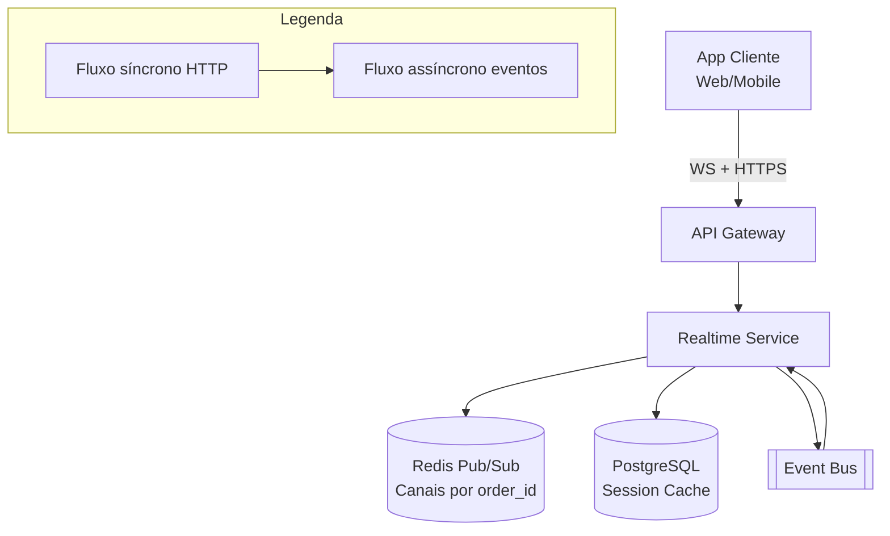

# System Design - Rastreamento em Tempo Real (Cliente)

> **Status:** Em progresso  
> **Fase:** 4  
> **Jornada:** Cliente  
> **Epico:** [Cliente §1.1 — Rastreamento](../../epic-ifood-clone.md#11-jornada-do-cliente-app-mobile--web)  
> **Dependencias:** [10-roteirizacao-localizacao](../10-roteirizacao-localizacao/system-design.md), [00-plataforma-transversal](../00-plataforma-transversal/system-design.md)

## 1. Objetivo

Prover uma experiencia de rastreamento em tempo real no app do cliente: mapa interativo mostrando o deslocamento do entregador do restaurante ate o endereco de entrega, com atualizacoes via WebSocket, ETA estimado, transicoes suaves de milestones e fallback resiliente para polling.

## 2. Escopo Funcional

### 2.1 MVP

- [ ] Tela de pedido em andamento com mapa interativo (Google Maps / Mapbox)
- [ ] Marcadores no mapa: restaurante (icone fixo), cliente (icone fixo), entregador (icone animado)
- [ ] Atualizacao de posicao do entregador em tempo quase real (< 5s de lag)
- [ ] Exibicao de milestone atual ("A caminho do restaurante", "A caminho de voce", "Entregador chegou!")
- [ ] ETA estimado baseado em distancia linear (MVP) ou traffic API (pos-MVP)
- [ ] Timeline da corrida: linha do tempo com milestones passados
- [ ] Fallback para polling REST se WebSocket desconectar
- [ ] Poligono de rota no mapa (polyline do restaurante ao cliente)

### 2.2 Pos-MVP

- [ ] Animacao suave de interpolacao de posicao entre pings (transicao de 3s)
- [ ] Compartilhar link de rastreamento com terceiros (token temporario)
- [ ] Mapa com atualizacao de trafego nas rotas
- [ ] Notificacao push quando entregador esta a 5min do destino

## 3. Requisitos Nao Funcionais

- Latencia visual: posicao do entregador no mapa com atraso maximo **< 5s** vs ping real no dispositivo do entregador
- Conexoes simultaneas: suportar **10k conexoes WebSocket** simultaneas (5k pedidos em andamento × 2 devices cada)
- Mensageria: throughput de **300 msg/s** de posicao encaminhadas para clientes
- Disponibilidade do dominio: **99.9%**
- Reconexao: cliente deve reconectar em **< 2s** apos queda de conexao
- Consumo de dados: cada atualizacao de posicao deve ser **< 1KB** (apenas lat, lon, milestone)

## 4. Contexto de Negocio

O rastreamento em tempo real e uma das features mais visiveis da experiencia do cliente:

- **Ansiedade do cliente:** "Onde esta meu pedido?" e a pergunta mais frequente em suporte. Um rastreamento preciso reduz chamados em ate 30%.
- **Confianca na plataforma:** Clientes que acompanham a entrega em tempo real tem 20% menos probabilidade de cancelar.
- **Milestone visibility:** Saber que o entregador esta a caminho reduz a sensacao de espera.

O Realtime Service funciona como uma camada de distribuicao: consome eventos do Tracking Service (design 10) e os encaminha para os clientes corretos via WebSocket, gerenciando conexoes, autorizacao e fallback.

## 5. Arquitetura de Alto Nivel



Diagrama detalhado: [`./architecture.mermaid`](./architecture.mermaid)

## 6. Componentes

### 6.1 Realtime Service

- Gerencia conexoes WebSocket com os apps dos clientes
- Mantem mapa de `order_id` → lista de `session_id` (conexoes ativas)
- Consome eventos `delivery.location.updated` e `delivery.milestone.reached` do Event Bus
- Publica atualizacoes no canal Redis Pub/Sub `tracking:{order_id}` para distribuicao horizontal
- Serve snapshot REST (`GET /v1/orders/{id}/tracking`) para estado inicial e fallback polling
- Aplica rate limit de mensagens por cliente (max 1 msg/s para evitar sobrecarga do app)
- Gerencia autenticacao: valida JWT e verifica se o cliente e dono do pedido

### 6.2 Redis Pub/Sub

- Canal: `tracking:{order_id}`
- Replicacao horizontal: todos os pods do Realtime Service se inscrevem nos canais dos pedidos que tem clientes conectados
- TTL dos canais: gerenciado dinamicamente (inscricao removida quando nao ha mais clientes no canal)

### 6.3 Session Manager

- Mantem registro das conexoes WebSocket ativas
- Mapeia `session_id` → `order_id`, `user_id`, `connected_at`, `last_activity`
- Permite broadcast para todas as sessoes de um pedido
- Job de cleanup remove sessoes inativas ha mais de 60s

## 7. Modelo de Dados

### 7.1 `tracking_sessions` (PG)

| Coluna | Tipo | Restricoes | Descricao |
|--------|------|------------|-----------|
| id | UUID | PK | |
| order_id | UUID | FK → orders.id, NOT NULL | |
| user_id | UUID | FK → users.id, NOT NULL | |
| device_id | VARCHAR(64) | NULL | Identificador do dispositivo |
| session_token | VARCHAR(512) | NOT NULL, UNIQUE | Token JWT da sessao WebSocket |
| status | VARCHAR(16) | NOT NULL, DEFAULT 'active' | `active`, `idle`, `closed` |
| connected_at | TIMESTAMP | NOT NULL, DEFAULT NOW() | |
| disconnected_at | TIMESTAMP | NULL | |
| last_activity_at | TIMESTAMP | NOT NULL, DEFAULT NOW() | Ultimo ping/pong |
| messages_sent | INT | NOT NULL, DEFAULT 0 | Contador de mensagens enviadas |
| ip_address | VARCHAR(45) | NULL | Endereco IP do cliente |
| user_agent | VARCHAR(256) | NULL | |

**Indices:**
- `(order_id, status)` — sessoes ativas de um pedido
- `(user_id, status)` — sessoes ativas de um usuario
- `(session_token)` — UNIQUE

### 7.2 `tracking_snapshots` (PG)

Cache do ultimo estado de tracking para resposta rapida via REST (fallback polling).

| Coluna | Tipo | Restricoes | Descricao |
|--------|------|------------|-----------|
| id | UUID | PK | |
| order_id | UUID | FK → orders.id, NOT NULL, UNIQUE | |
| courier_lat | DECIMAL(10,7) | NULL | |
| courier_lon | DECIMAL(10,7) | NULL | |
| courier_geohash | VARCHAR(12) | NULL | |
| milestone | VARCHAR(24) | NULL | |
| milestone_changed_at | TIMESTAMP | NULL | |
| estimated_eta | TIMESTAMP | NULL | |
| pickup_lat | DECIMAL(10,7) | NOT NULL | |
| pickup_lon | DECIMAL(10,7) | NOT NULL | |
| dropoff_lat | DECIMAL(10,7) | NOT NULL | |
| dropoff_lon | DECIMAL(10,7) | NOT NULL | |
| polyline_encoded | TEXT | NULL | Rota codificada |
| version | INT | NOT NULL, DEFAULT 1 | Incrementado a cada atualizacao |
| updated_at | TIMESTAMP | NOT NULL, DEFAULT NOW() | |

**Indices:**
- `(order_id)` — UNIQUE

### 7.3 Dados em Redis (tempo real)

#### Sessoes ativas por pedido

**Estrutura:** Set

- Chave: `tracking:sessions:{order_id}`
- Valor: set de `session_id`
- TTL: N/A (gerenciado pelo Session Manager)

#### Canal Pub/Sub

- Canal: `tracking:{order_id}`
- Mensagem: `{ "type": "position_update" | "milestone_reached" | "eta_update", "data": {...} }`
- Persistencia: N/A (pub/sub volatil)

#### Ultimo snapshot (cache para reconexao rapida)

Mesmo que `tracking_snapshots` no PG, mas em Redis para latencia < 10ms.

- Chave: `tracking:snapshot:{order_id}`
- Tipo: Hash
- Campos: `lat`, `lon`, `milestone`, `estimatedEta`, `version`
- TTL: 5min (atualizado a cada evento)

### 7.4 Dados no dispositivo (app cliente)

| Dado | Local | TTL | Descricao |
|------|-------|-----|-----------|
| Ultima posicao conhecida | Memoria (app state) | Sessao | Usado para exibicao imediata |
| Polyline da rota | Cache local | 1h | Polyline do restaurante ao cliente |
| Milestones do pedido | Cache local | Ate entrega | Timeline para exibicao |
| Ultimo ETA | Memoria | Sessao | Exibido enquanto conectado |

## 8. Fluxos Principais

### 8.1 Cliente abre tela de rastreamento

1. Cliente toca no pedido ativo e abre a tela de acompanhamento.
2. App do cliente faz `GET /v1/orders/{orderId}/tracking` para obter snapshot inicial:
   - Posicao atual do entregador (se disponivel)
   - Milestone atual
   - ETA estimado
   - Coordenadas de pickup e dropoff
   - Polyline da rota
3. App renderiza o mapa com:
   - Marcador do restaurante (icone fixo, cor primaria)
   - Marcador do cliente (icone fixo, cor de destaque)
   - Marcador do entregador (icone animado, cor secundaria)
   - Polyline da rota (linha tracejada)
   - Card com milestone e ETA
4. App abre conexao WebSocket: `WS /v1/orders/{orderId}/tracking/stream` com token JWT no header.
5. Realtime Service:
   a. Valida JWT e verifica se `user_id` do token e o dono do pedido.
   b. Cria `tracking_sessions` com `status = 'active'`.
   c. Adiciona `session_id` ao set `tracking:sessions:{order_id}` no Redis.
   d. Inscreve o pod no canal Redis Pub/Sub `tracking:{order_id}`.
   e. Envia mensagem inicial `type: "state"` com snapshot completo.
6. App inicia heartbeat: ping a cada 30s para manter conexao ativa.

### 8.2 Atualizacao de posicao (server → cliente)

1. Tracking Service (design 10) publica `delivery.location.updated` no Event Bus.
2. Realtime Service consome o evento.
3. Publica no Redis Pub/Sub `tracking:{order_id}`:
   ```json
   { "type": "position_update", "lat": -23.555, "lon": -46.640, "version": 42 }
   ```
4. Redis distribui para todos os pods inscritos no canal.
5. Cada pod com clientes conectados para este `order_id`:
   a. Atualiza `tracking:snapshot:{order_id}` no Redis.
   b. Para cada `session_id` em `tracking:sessions:{order_id}`:
      - Envia mensagem WebSocket com o payload.
      - Incrementa `messages_sent`.
      - Atualiza `last_activity_at`.
6. App do cliente recebe a mensagem e atualiza o marcador no mapa.
7. **No MVP:** reposiciona o marcador diretamente (salto).
8. **Pos-MVP:** interpola a posicao em 3s (transicao suave usando animation frames).

**Rate limiting:** Realtime Service limita o envio a **1 mensagem por segundo** por cliente para evitar sobrecarga do app e consumo excessivo de dados.

### 8.3 Milestone atualizado

1. Tracking Service publica `delivery.milestone.reached` no Event Bus.
2. Realtime Service consome e publica no canal Redis Pub/Sub.
3. Para cada cliente conectado:
   ```json
   {
     "type": "milestone_reached",
     "milestone": "at_restaurant",
     "label": "Entregador chegou ao restaurante",
     "icon": "restaurant",
     "changedAt": "2026-07-04T14:35:00.000Z"
   }
   ```
4. App do cliente:
   - Atualiza o milestone no card superior.
   - Adiciona entrada na timeline.
   - Se `milestone = 'arrived'`: exibe notificacao in-app "Entregador chegou!" e altera cor do marcador.
   - Se `milestone = 'heading_to_customer'`: inicia contagem regressiva do ETA.

### 8.4 WebSocket desconecta — fallback para polling

1. Cliente perde conectividade (rede instavel, timeout, pod reinicia).
2. **Lado do servidor:**
   a. Realtime Service detecta `onclose` do WebSocket.
   b. Atualiza `tracking_sessions.status = 'idle'` e `disconnected_at = NOW()`.
   c. Remove `session_id` de `tracking:sessions:{order_id}`.
   d. Se nao houver mais sessoes para o `order_id`, cancela inscricao no canal Pub/Sub.
3. **Lado do cliente (fallback):**
   a. Detecta `onclose` ou `onerror`.
   b. Inicia timer de reconexao: `1s, 2s, 4s, 8s` (backoff exponencial, max 15s).
   c. Simultaneamente, inicia **polling REST** a cada 5s via `GET /v1/orders/{orderId}/tracking`.
   d. Quando a reconexao do WebSocket e bem-sucedida, para o polling e retoma o fluxo normal.
4. **Reconexao:**
   a. Cliente tenta reconectar ao WebSocket.
   b. Servidor envia snapshot completo (ultima posicao + milestones).
   c. App atualiza o mapa com a posicao mais recente.

### 8.5 Heartbeat e deteccao de sessoes mortas

1. Cliente envia ping WebSocket a cada 30s.
2. Servidor responde com pong.
3. Se o servidor nao recebe ping por > 60s:
   a. Fecha a conexao.
   b. Marca `tracking_sessions.status = 'closed'`.
   c. Remove `session_id` do Redis.
4. Job `cleanup_stale_sessions` (cron 5min):
   a. Busca sessoes com `status = 'active'` e `last_activity_at < NOW() - 120s`.
   b. Fecha sessoes forcadamente.
   c. Atualiza estatisticas de sessoes mortas.

## 9. Contratos de API

### 9.1 Padrao de erro

Segue o [padrao global definido na Plataforma Transversal](../00-plataforma-transversal/system-design.md#91-padrao-de-erro-global).

### 9.2 Endpoints do dominio de rastreamento

#### `GET /v1/orders/{orderId}/tracking`

Snapshot REST da posicao atual do entregador. Usado para estado inicial e fallback polling.

**Ordem de fallback do snapshot:** Redis (latencia < 10ms) → PostgreSQL (fallback, latencia ~50ms). Se ambos falharem, retorna 503 com `DEPENDENCY_FAILURE`.

**Response (200):**
```json
{
  "orderId": "uuid",
  "status": "in_progress",
  "courier": {
    "name": "Carlos",
    "photo": "https://..."
  },
  "position": {
    "lat": -23.5550,
    "lon": -46.6400,
    "updatedAt": "2026-07-04T14:40:00.000Z"
  },
  "milestone": "heading_to_customer",
  "milestoneChangedAt": "2026-07-04T14:36:00.000Z",
  "milestoneLabel": "Entregador a caminho de voce",
  "estimatedArrival": "2026-07-04T14:50:00.000Z",
  "route": {
    "pickup": { "name": "Pizza Express", "address": "Rua Augusta, 500", "lat": -23.5505, "lon": -46.6333 },
    "dropoff": { "name": "Seu endereco", "address": "Av. Paulista, 1000", "lat": -23.5612, "lon": -46.6558 },
    "polylineEncoded": "abc123...",
    "distanceKm": 2.3
  },
  "timeline": [
    { "milestone": "heading_to_restaurant", "label": "Saindo para o restaurante", "at": "2026-07-04T14:30:00.000Z", "done": true },
    { "milestone": "at_restaurant", "label": "No restaurante", "at": "2026-07-04T14:35:00.000Z", "done": true },
    { "milestone": "heading_to_customer", "label": "A caminho de voce", "at": "2026-07-04T14:36:00.000Z", "done": true },
    { "milestone": "arrived", "label": "Entregador chegou!", "done": false }
  ],
  "version": 42
}
```

**Errors:**
- `403` — Usuario nao e o dono do pedido.
- `404` — Pedido nao encontrado ou sem tracking ativo.
- `410` — Pedido ja foi entregue.

#### `WS /v1/orders/{orderId}/tracking/stream`

Conexao WebSocket para receber atualizacoes em tempo real.

**Autenticacao:**

> **Nota:** A API WebSocket do navegador (`new WebSocket()`) nao suporta custom headers. Por isso, o token JWT e passado como query parameter na URL de conexao:
> ```
> ws://host/v1/orders/{orderId}/tracking/stream?token=<jwt_token>
> ```
> Para clients nativos (iOS/Android), o token pode ser enviado como custom header durante o upgrade da conexao, se o servidor suportar.
> O Realtime Service valida o token antes de aceitar a conexao. Se invalido, retorna HTTP 401 e fecha o socket.

**Mensagem inicial (servidor → cliente) — apos conexao bem-sucedida:**
```json
{
  "type": "state",
  "orderId": "uuid",
  "position": { "lat": -23.5550, "lon": -46.6400, "updatedAt": "2026-07-04T14:40:00.000Z" },
  "milestone": "heading_to_customer",
  "milestoneLabel": "Entregador a caminho de voce",
  "estimatedArrival": "2026-07-04T14:50:00.000Z",
  "route": {
    "pickup": { "lat": -23.5505, "lon": -46.6333 },
    "dropoff": { "lat": -23.5612, "lon": -46.6558 },
    "polylineEncoded": "abc123...",
    "distanceKm": 2.3
  },
  "timeline": [ ... ],
  "version": 42,
  "sessionId": "uuid",
  "heartbeatIntervalMs": 30000
}
```

**Mensagens de atualizacao (servidor → cliente):**

Atualizacao de posicao:
```json
{
  "type": "position_update",
  "lat": -23.5560,
  "lon": -46.6410,
  "version": 43,
  "updatedAt": "2026-07-04T14:40:05.000Z"
}
```

Milestone atingido:
```json
{
  "type": "milestone_reached",
  "milestone": "arrived",
  "label": "Entregador chegou!",
  "icon": "arrived",
  "changedAt": "2026-07-04T14:48:00.000Z"
}
```

ETA atualizado:
```json
{
  "type": "eta_update",
  "estimatedArrival": "2026-07-04T14:48:00.000Z",
  "reason": "traffic"
}
```

**Mensagens do cliente → servidor:**

Ping:
```json
{ "type": "ping" }
```

**Mensagens de erro (servidor → cliente):**
```json
{
  "type": "error",
  "code": "FORBIDDEN",
  "message": "Voce nao tem permissao para rastrear este pedido."
}
```

#### `GET /v1/orders/{orderId}/tracking/history`

Retorna o historico de posicoes do entregador para desenhar a rota percorrida.

**Query params:**
- `limit` (INT, opcional, default 50) — Numero maximo de pontos.

**Response (200):**
```json
{
  "orderId": "uuid",
  "positions": [
    { "lat": -23.5505, "lon": -46.6333, "recordedAt": "2026-07-04T14:30:05.000Z" },
    { "lat": -23.5510, "lon": -46.6340, "recordedAt": "2026-07-04T14:30:10.000Z" }
  ],
  "milestones": [
    { "milestone": "heading_to_restaurant", "at": "2026-07-04T14:30:00.000Z" },
    { "milestone": "at_restaurant", "at": "2026-07-04T14:35:00.000Z" },
    { "milestone": "heading_to_customer", "at": "2026-07-04T14:36:00.000Z" }
  ]
}
```

### 9.3 Health check

Segue o [padrao definido no documento 00](../00-plataforma-transversal/system-design.md#92-health-check).

## 10. Contratos de Eventos

> **Nota:** O envelope padrao dos eventos e definido pela **Plataforma Transversal** (documento 00). Consulte a [secao 10 do System Design 00](../00-plataforma-transversal/system-design.md#10-contratos-de-eventos) para o schema completo do envelope, politica de versionamento e topic naming.

### 10.1 Eventos consumidos pelo Realtime Service

| Evento | Produtor (dominio) | Acao no Realtime Service |
|--------|---------------------|--------------------------|
| `delivery.location.updated` | Tracking (10) | Atualizar snapshot Redis, broadcast para sessoes do `order_id` via WebSocket |
| `delivery.milestone.reached` | Tracking (10) | Broadcast do milestone para clientes + atualizar timeline |
| `order.status.changed` | Estados (08) | Se `toStatus = 'delivered'` ou `'cancelled'`, encerrar tracking e fechar sessoes |

### 10.2 Tabela de eventos do dominio

O Realtime Service **nao publica eventos** — ele e puramente um consumidor que distribui informacoes para clientes via WebSocket.

## 11. Seguranca

### 11.1 Autenticacao e autorizacao

- **WebSocket:** o token JWT e enviado no header `Authorization` durante o handshake. O Realtime Service valida o token e extrai `user_id` e `role`.
- **Autorizacao:** o cliente so pode rastrear **seus proprios pedidos**. O `user_id` do token deve corresponder ao `customer_id` do `order_id`.
- **Admin:** pode rastrear qualquer pedido via endpoint REST dedicado.
- **Compartilhamento (pos-MVP):** tokens temporarios com escopo `tracking:{order_id}` e expiracao de 1h.

### 11.2 Protecao de dados

- A posicao do entregador retornada para o cliente tem precisao reduzida (~100m, arredondado para 3 casas decimais), conforme politica LGPD do design 10.
- O nome do entregador e foto sao retornados apenas para o cliente do pedido.
- Sessoes WebSocket expiradas (mais de 60s sem atividade) sao automaticamente fechadas.
- Logs de acesso a tracking registram apenas `order_id` e `user_id`, nunca dados de localizacao.

### 11.3 Protecoes no Gateway

- Rate limit em `GET /v1/orders/{id}/tracking`: **60 requests/min** por cliente (polling).
- Rate limit em `GET /v1/orders/{id}/tracking/history`: **10 requests/min** por cliente.
- WebSocket connections: maximo **2 conexoes simultaneas** por `order_id` (evita conexoes duplicadas).
- Block IP apos N violacoes de autenticacao no WebSocket handshake.

## 12. Escalabilidade

### 12.1 Redis Pub/Sub para distribuicao horizontal

- Realtime Service escala horizontalmente (multiplos pods).
- Cada pod se inscreve nos canais Redis Pub/Sub dos pedidos que tem clientes conectados naquele pod.
- Quando um evento chega, o Tracking Service publica no Event Bus, e cada pod do Realtime Service que tem clientes para aquele `order_id` recebe a mensagem via Pub/Sub.
- **Problema conhecido:** Redis Pub/Sub nao persiste mensagens — se um pod cair e reiniciar, ele perde mensagens enquanto estava fora. Mas como o cliente usa polling de fallback, isso e aceitavel.

### 12.2 Cache e dados em tempo real

| Recurso | Estrategia | TTL |
|---------|------------|-----|
| Snapshot de tracking por pedido | Redis Hash `tracking:snapshot:{order_id}` | 5min |
| Sessoes ativas por pedido | Redis Set `tracking:sessions:{order_id}` | Enquanto ativo |
| Canal Pub/Sub | Redis `tracking:{order_id}` | Enquanto houver inscritos |
| Polyline da rota | Redis / PG `tracking_snapshots` | 1h |

### 12.3 Database

- `tracking_sessions`: volume moderado (~5k inserts/dia por entrega). Particionamento por mes.
- `tracking_snapshots`: uma linha por pedido ativo. Volume baixo.
- Nao ha alta frequencia de escrita no PG no Realtime Service — o foco e Redis + WebSocket.

### 12.4 Estrategia de broadcast

1. Evento chega via Event Bus.
2. Realtime Service publica no Redis Pub/Sub.
3. Cada pod inscrito recebe e verifica se tem sessoes para o `order_id`.
4. Se sim, itera sobre o set `tracking:sessions:{order_id}` e envia para cada sessao.
5. **Otimizacao:** para 10k sessoes, iterar sobre um set Redis de 10k membros e fazer broadcast sequencial pode ser lento. Solucao: usar Redis Stream com consumer groups (pos-MVP) ou particionar por `order_id` hash.

### 12.5 Estimativa de capacidade

| Recurso | Estimativa | Folga |
|---------|------------|-------|
| Conexoes WebSocket simultaneas | 5k (pico) | 2x (10k) |
| Mensagens de posicao por segundo | 300/s (5k sessoes / 3s rate limit + 300 eventos/s) | 2x (600/s) |
| Mensagens de milestone por entrega | 4 milestones (2 por entrega) | — |
| Redis Pub/Sub throughput | 600 msg/s | 3x (1.8k/s) |
| Sessoes ativas simultaneas no PG | 5k | 2x (10k) |

## 13. Observabilidade

### 13.1 Logs estruturados

Segue o [padrao do documento 00](../00-plataforma-transversal/system-design.md#131-logs-estruturados). Campos adicionais:

- `orderId` — ID do pedido sendo rastreado
- `sessionId` — ID da sessao WebSocket
- `userId` — ID do cliente
- `milestone` — milestone atual
- `wsLatencyMs` — latencia entre publicacao no Event Bus e envio ao cliente
- `reconnectionCount` — numero de reconexoes do cliente

### 13.2 Metricas especificas do dominio

| Metrica | Tipo | Descricao |
|---------|------|-----------|
| `realtime_ws_connections_active` | Gauge | Conexoes WebSocket ativas |
| `realtime_ws_connections_total` | Counter | Total de conexoes estabelecidas |
| `realtime_ws_disconnections_total` | Counter | Total de desconexoes (tag: `reason`) |
| `realtime_messages_sent_total` | Counter | Mensagens enviadas via WebSocket (tag: `type`) |
| `realtime_messages_sent_bytes` | Histogram | Tamanho das mensagens enviadas |
| `realtime_event_latency_ms` | Histogram | Latencia entre consumo do evento e envio ao cliente |
| `realtime_polling_requests_total` | Counter | Requests de polling REST |
| `realtime_sessions_per_order` | Histogram | Numero de sessoes por pedido |
| `realtime_heartbeat_timeout_total` | Counter | Sessoes fechadas por heartbeat timeout |
| `realtime_channel_subscriptions` | Gauge | Numero de canais Redis Pub/Sub ativos |

### 13.3 Dashboard (Grafana)

- **Conexoes WebSocket ativas** — gauge ao longo do tempo
- **Mensagens enviadas** — taxa por tipo (position vs milestone vs eta)
- **Latencia de entrega** — histograma p50/p95/p99 (evento recebido → enviado ao cliente)
- **Reconexoes** — taxa de reconexao por minuto
- **Sessoes por pedido** — distribuicao (1, 2, 3+)
- **Taxa de polling** — requests de fallback REST por segundo
- **Heartbeat timeouts** — sessoes fechadas por inatividade

### 13.4 Alertas especificos

| Alerta | Condicao | Severidade | Acao |
|--------|----------|------------|------|
| Queda de conexoes WebSocket | > 20% de desconexoes em 5min | P1 | Verificar Realtime Service, rede, Redis |
| Alta latencia de entrega | p95 event_latency > 3s em 5min | P2 | Verificar Redis Pub/Sub, broadcast loop |
| Sessoes ativas | > 2x do esperado em 5min | P2 | Possivel ataque ou bug no app |
| Polling elevado | > 50% dos clientes em polling em 5min | P2 | WebSocket pode estar com problemas |
| Heartbeat timeouts elevados | > 10% em 5min | P3 | Verificar clientes com connectivity issues |

## 14. Resiliencia

### 14.1 Timeouts

| Tipo de chamada | Timeout | Justificativa |
|-----------------|---------|---------------|
| Publicacao Redis Pub/Sub | 500ms | Operacao em memoria |
| Leitura de snapshot (Redis) | 200ms | Hash em memoria |
| Leitura de snapshot (PG) | 1s | Fallback quando Redis indisponivel |
| WebSocket send | 2s | Push para cliente |
| Heartbeat ping/pong | 30s / 60s | Intervalo de ping, timeout de pong |

### 14.2 Retries e reconexao

| Cenario | Tentativas | Intervalo | Jitter |
|---------|------------|-----------|--------|
| Reconexao WebSocket (cliente) | Ilimitado | 1s, 2s, 4s, 8s, max 15s | +/- 2s |
| Leitura de snapshot (PG fallback) | 2 | 200ms, 400ms | +/- 50ms |
| Publicacao Redis Pub/Sub | 3 | 100ms, 200ms, 400ms | +/- 20ms |

### 14.3 Graceful degradation

| Cenario | Acao |
|---------|------|
| Redis indisponivel | Snapshots lidos do PostgreSQL (mais lento, 1s vs 10ms). Pub/Sub nao funciona — eventos nao sao distribuidos entre pods. Cada pod so encaminha eventos que ele mesmo consumiu do Event Bus. |
| Event Bus indisponivel | Nenhum evento novo chega. Cliente mantem ultima posicao conhecida. Polling via REST retorna dado estatico (ultimo snapshot). |
| Pod do Realtime Service reinicia | Conexoes WebSocket daquele pod sao perdidas. Clientes reconectam em < 2s (backoff exponencial). Novo pod se inscreve nos canais Pub/Sub necessarios. |
| PG indisponivel | Sessoes nao sao persistidas (apenas Redis). Snapshots continuam via Redis. Fallback polling retorna dados do Redis. Sessoes offline sao perdidas se Redis falhar antes do PG ser restabelecido. |
| Cliente sem suporte a WebSocket | App usa polling REST a cada 5s como fallback (funciona em qualquer cliente HTTP). |

### 14.4 Garantia de entrega

- WebSocket e **best-effort**: se o cliente estiver desconectado, a mensagem e perdida.
- O cliente sempre pode recuperar o estado atual via `GET /v1/orders/{id}/tracking` (REST).
- O snapshot no Redis tem TTL de 5min — tempo suficiente para reconexao.
- Para garantia de entrega de milestones (que sao eventos unicos e importantes), o Realtime Service guarda o ultimo milestone no Redis e o reenvia na reconexao.

### 14.5 Idempotencia

- Mensagens WebSocket sao idempotentes por design: `position_update` com `version` permite que o cliente ignore versoes mais antigas que a atual.
- `milestone_reached` e idempotente: o cliente ignora milestones ja processados (baseado no `milestone` e `changedAt`).
- Polling REST sempre retorna o ultimo snapshot — chamadas repetidas retornam o mesmo resultado.

## 15. Decisoes Arquiteturais (ADRs)

### ADR-001: WebSocket vs SSE vs Polling

| Campo | Valor |
|-------|-------|
| **Decisao** | WebSocket como canal primario com polling REST como fallback. SSE (Server-Sent Events) descartado por limitacao de headers customizados e bidirecionalidade. |
| **Contexto** | Requisito de latencia < 5s entre ping do entregador e atualizacao no cliente. Polling puro a cada 3s geraria 60 requests/min/cliente → 300k requests/min no pico. |
| **Alternativas** | Polling puro (mais simples, mas custoso), SSE (unidirecional, sem heartbeat bidirecional), WebSocket + fallback (adotado) |
| **Consequencias** | Positivas: latencia < 1s para a maioria das mensagens, fallback funcional, heartbeat embutido. Negativas: complexidade de gerenciar 5k conexoes simultaneas, necessidade de sticky sessions ou Redis Pub/Sub para broadcast horizontal. |
| **Status** | Aprovado |

### ADR-002: Redis Pub/Sub para Broadcast Horizontal

| Campo | Valor |
|-------|-------|
| **Decisao** | Realtime Service usa Redis Pub/Sub para distribuir mensagens entre pods em vez de sticky sessions ou Kafka |
| **Contexto** | Multiplos pods do Realtime Service precisam receber eventos para clientes conectados em diferentes pods. Sticky sessions no load balancer seriam uma opcao, mas criam afinidade que dificulta escalamento e deploy. |
| **Alternativas** | Sticky sessions (afinidade de conexao, problemas em deploy), Kafka (overhead desnecessario para pub/sub simples), Redis Pub/Sub (adotado) |
| **Consequencias** | Positivas: simples, baixa latencia, sem afinidade de pod. Negativas: Redis Pub/Sub nao persiste mensagens (se um pod cai, perde mensagens), nao ha garantia de entrega. Aceitavel pois o cliente tem fallback polling. |
| **Status** | Aprovado |

### ADR-003: Snapshot em Redis + PG

| Campo | Valor |
|-------|-------|
| **Decisao** | Ultimo snapshot de tracking mantido em Redis (para latencia < 10ms) e espelhado no PG (para durabilidade e fallback) |
| **Contexto** | Cliente precisa receber o estado atual ao conectar (ou reconectar). Ler do PG a cada conexao seria lento (1-5ms vs 10ms). Manter apenas em Redis arrisca perda. |
| **Alternativas** | Apenas Redis (perda se Redis falhar), apenas PG (lento para reconexao em massa) |
| **Consequencias** | Positivas: reconexao rapida (< 10ms), durabilidade via PG. Negativas: escrita duplicada (Redis + PG), complexidade adicional. |
| **Status** | Aprovado |

### ADR-004: Rate Limit de Mensagens por Cliente

| Campo | Valor |
|-------|-------|
| **Decisao** | No maximo 1 mensagem de posicao por segundo por cliente WebSocket |
| **Contexto** | Tracking Service publica posicao a cada 3-5s. Se o cliente estiver com o app em foreground, receber updates mais frequentes que 1/s sobrecarrega o app (renderizacao do mapa) e consome dados moveis. |
| **Alternativas** | Sem rate limit (app recebe todas as mensagens, possivel lag de UI), rate limit de 2/s (mais responsivo, maior consumo) |
| **Consequencias** | Positivas: experiencia suave no mapa, consumo de dados previsivel (~3.6MB/hora). Negativas: cliente pode ver um pequeno salto na posicao em vez de transicao suave (mitigado por interpolacao no pos-MVP). |
| **Status** | Aprovado |

### ADR-005: Heartbeat para Deteccao de Sessoes Mortas

| Campo | Valor |
|-------|-------|
| **Decisao** | Cliente envia ping a cada 30s. Servidor fecha conexao apos 60s sem atividade. Job de cleanup a cada 5min para capturar sessoes orphan. |
| **Contexto** | Sessoes WebSocket podem ficar orphans (app fechou sem fechar conexao, rede caiu). Sem heartbeat, o servidor acumula conexoes mortas. |
| **Alternativas** | Apenas TCP keepalive (nao detecta app em background), apenas job de cleanup (janela de 5min de sessoes mortas) |
| **Consequencias** | Positivas: deteccao rapida de sessoes mortas (~60s), sem acumulo de conexoes. Negativas: trafego adicional de heartbeat (1 msg a cada 30s, insignificante). |
| **Status** | Aprovado |

## 16. Riscos e Mitigacoes

| Risco | Probabilidade | Impacto | Mitigacao |
|-------|---------------|---------|-----------|
| **Pico de conexoes WebSocket sobrecarrega o servidor** | Media | Alto | Escalabilidade horizontal com Redis Pub/Sub, HPA baseado em conexoes ativas, limite maximo de 10k por cluster |
| **Redis Pub/Sub falha e mensagens sao perdidas** | Baixa | Medio | Cliente tem fallback polling a cada 5s. Snapshots no PG garantem recuperacao. |
| **Cliente abre multiplas conexoes (abuso)** | Media | Baixo | Limite de 2 sessoes simultaneas por order_id |
| **App do cliente em background consome dados moveis** | Alta | Baixo | App reduz frequencia de WebSocket quando em background. Rate limit de 1 msg/s. |
| **WebSocket nao suportado por proxy corporativo** | Baixa | Medio | Fallback para polling REST automatico (o app detecta falha de conexao). |
| **Atraso na entrega de milestone critico (arrived)** | Baixa | Medio | Cliente pode usar polling para obter estado atual. Notificacao push como backup. |
| **Escalabilidade do Redis Pub/Sub com 10k canais** | Baixa | Medio | Canais sao criados/destruidos dinamicamente. Redis 7+ suporta > 100k canais. |

### 16.1 Matriz de probabilidade x impacto

```
Impacto:  Baixo      Medio       Alto        Critico
Probabilidade
Alta      | App backg.|            |            |
          | consome   |            |            |
          | dados     |            |            |
Media     | Conexoes  | Pub/Sub    | Pico       |
          | abusivas  | falha      | conexoes   |
Baixa     |           | Milestone  |            |
          |           | atrasado   |            |
```

---

> **Documentos relacionados:** [Template de system design](../../templates/system-design-template.md) | [Roadmap](../../roadmap/ordem-das-jornadas.md) | [Epico iFood Clone](../../epic-ifood-clone.md) | [Plataforma Transversal](../00-plataforma-transversal/system-design.md)
