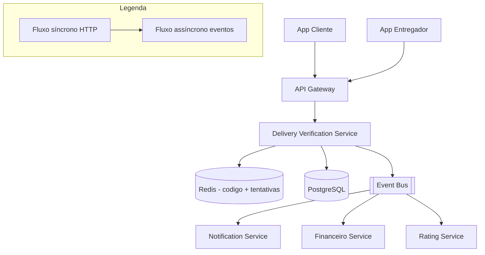

# System Design - Confirmacao Segura de Entrega

> **Status:** Em progresso  
> **Fase:** 4  
> **Jornada:** Entregador  
> **Epico:** [Entregador §1.3 — Confirmacao segura](../../epic-ifood-clone.md#13-jornada-do-entregador-app-mobile)  
> **Dependencias:** [10-roteirizacao-localizacao](../10-roteirizacao-localizacao/system-design.md), [11-rastreamento-tempo-real](../11-rastreamento-tempo-real/system-design.md), [00-plataforma-transversal](../00-plataforma-transversal/system-design.md)

## 1. Objetivo

Validar a entrega do pedido com um codigo numerico de 4-6 digitos gerado no servidor, exibido no app do cliente e digitado pelo entregador no momento da entrega — prevenindo fraudes do tipo "entregue sem entregar" e provendo auditoria confiavel para disputas.

## 2. Escopo Funcional

### 2.1 MVP

- [ ] Gerar codigo alfanumerico de 6 digitos ao entrar em `heading_to_customer`
- [ ] Exibir codigo no app do cliente (numeros grandes, destaque visual)
- [ ] Entregador informa codigo no app (campo numerico com 6 digitos)
- [ ] Validacao com limite de 5 tentativas incorretas
- [ ] Bloqueio temporario de 10min apos exceder tentativas
- [ ] Pedido transiciona para `delivered` apos confirmacao bem-sucedida
- [ ] Notificacao push para cliente: "Pedido entregue com sucesso!"
- [ ] Suporte manual: admin pode confirmar entrega em caso de disputa

### 2.2 Pos-MVP

- [ ] QR code como alternativa ao codigo numerico
- [ ] Foto de comprovante opcional (entregador tira foto do pedido na porta)
- [ ] Entrega sem contato (deixar na porta) com PIN ou foto
- [ ] Validacao por geofence (entregador precisa estar a < 100m do destino)
- [ ] Biometria (impressao digital do cliente no app) como confirmacao

## 3. Requisitos Nao Funcionais

- Codigo TTL: valido por **30 minutos** apos geracao (expirado apos esse periodo, novo codigo deve ser gerado)
- Rate limit: **5 tentativas** incorretas por entrega → bloqueio de 10min
- Codigo seguro: armazenado como **hash (SHA-256)** no Redis, nunca em plaintext
- Codigo exibido apenas no app do cliente (nunca em push notification, email ou SMS)
- Disponibilidade do dominio: **99.99%** (confirmacao de entrega e caminho critico)
- Offline: entregador deve poder confirmar entrega mesmo sem internet (codigo cacheado localmente)

## 4. Contexto de Negocio

A confirmacao de entrega e o ultimo ato da jornada do pedido — e tambem o mais sensivel:

- **Fraude:** Sem confirmacao, um entregador pode marcar "entregue" sem realmente entregar, causando prejuizo ao restaurante e ao cliente.
- **Disputa:** Cliente diz que nao recebeu, entregador diz que entregou. O codigo de confirmacao e a unica prova digital incontestavel.
- **Fluxo financeiro:** O pagamento ao restaurante e ao entregador so e liberado apos `delivery.completed`. Uma confirmacao fraudulenta ou perdida impacta diretamente o financeiro.
- **Experiencia:** Cliente quer confirmacao visual de que o pedido chegou. Entregador quer concluir rapido para proxima corrida.

## 5. Arquitetura de Alto Nivel



Diagrama detalhado: [`./architecture.mermaid`](./architecture.mermaid)

## 6. Componentes

### 6.1 Delivery Verification Service

- Gera codigo de confirmacao (6 digitos alfanumericos, seguros) no momento certo
- Armazena hash do codigo no Redis com TTL de 30min
- Expoe endpoints para cliente visualizar codigo e entregador submeter
- Valida hash, controla tentativas e bloqueios
- Publica eventos de `delivery.completed` e `delivery.confirmation.failed`
- Gerencia reemissao de codigo expirado

### 6.2 Rate Limit Manager

- Controla tentativas de confirmacao por `delivery_id`
- Armazena contador de tentativas no Redis com TTL de 10min (bloqueio)
- Apos 5 tentativas falhas, bloqueia por 10min
- Permite reset manual por admin

### 6.3 Dispute Handler

- Job cron e endpoint admin para gerenciar disputas de entrega
- Admin pode visualizar historico de tentativas, geolocalizacao no momento, e confirmar manualmente
- Registra auditoria de cada acao de admin

## 7. Modelo de Dados

### 7.1 `delivery_verification_codes` (PG)

| Coluna | Tipo | Restricoes | Descricao |
|--------|------|------------|-----------|
| id | UUID | PK | |
| delivery_id | UUID | FK → delivery_assignments.id, NOT NULL, UNIQUE | |
| order_id | UUID | FK → orders.id, NOT NULL | |
| code_hash | VARCHAR(64) | NOT NULL | SHA-256 do codigo gerado |
| code_prefix | VARCHAR(3) | NOT NULL | Primeiros 3 digitos (para confirmacao visual no app do entregador) |
| status | VARCHAR(16) | NOT NULL, DEFAULT 'active' | `active`, `used`, `expired`, `revoked` |
| generated_at | TIMESTAMP | NOT NULL, DEFAULT NOW() | |
| expires_at | TIMESTAMP | NOT NULL | generated_at + 30min |
| confirmed_at | TIMESTAMP | NULL | Quando a entrega foi confirmada |
| confirmed_by_courier_id | UUID | NULL, FK → users.id | |
| confirmed_by_admin_id | UUID | NULL, FK → users.id | Se foi confirmado manualmente por admin |
| revoked_at | TIMESTAMP | NULL | Se o codigo foi revogado (admin) |
| revocation_reason | VARCHAR(128) | NULL | |

**Indices:**
- `(delivery_id)` — UNIQUE
- `(order_id)` — para consulta
- `(status, expires_at)` — job de cleanup de codigos expirados

### 7.2 `delivery_verification_attempts` (PG)

| Coluna | Tipo | Restricoes | Descricao |
|--------|------|------------|-----------|
| id | UUID | PK | |
| delivery_id | UUID | FK → delivery_assignments.id, NOT NULL | |
| courier_id | UUID | FK → users.id, NOT NULL | |
| code_submitted | VARCHAR(64) | NOT NULL | Hash do codigo submetido (nunca plaintext em logs) |
| code_submitted_prefix | VARCHAR(3) | NOT NULL | Primeiros 3 digitos (para auditoria) |
| result | VARCHAR(16) | NOT NULL | `success`, `invalid_code`, `expired_code`, `blocked`, `wrong_order` |
| courier_lat | DECIMAL(10,7) | NULL | Localizacao no momento da tentativa |
| courier_lon | DECIMAL(10,7) | NULL | |
| geohash | VARCHAR(12) | NULL | |
| ip_address | VARCHAR(45) | NULL | |
| created_at | TIMESTAMP | NOT NULL, DEFAULT NOW() | |

**Indices:**
- `(delivery_id, created_at)` — historico de tentativas
- `(courier_id, created_at)` — historico por entregador
- `(result, created_at)` — metricas de fraude

### 7.3 `delivery_disputes` (PG)

| Coluna | Tipo | Restricoes | Descricao |
|--------|------|------------|-----------|
| id | UUID | PK | |
| delivery_id | UUID | FK → delivery_assignments.id, NOT NULL, UNIQUE | |
| order_id | UUID | FK → orders.id, NOT NULL | |
| opened_by | VARCHAR(16) | NOT NULL | `customer`, `courier`, `restaurant`, `system` |
| reason | VARCHAR(128) | NOT NULL | `customer_did_not_receive`, `wrong_items`, `courier_confirmed_incorrectly`, `system_error` |
| status | VARCHAR(16) | NOT NULL, DEFAULT 'open' | `open`, `under_review`, `resolved`, `dismissed` |
| resolution | VARCHAR(128) | NULL | Decisao do admin |
| resolved_by | UUID | NULL, FK → users.id | |
| resolved_at | TIMESTAMP | NULL | |
| evidence | JSONB | NULL | Dados de auditoria com schema definido (ver abaixo) |
| created_at | TIMESTAMP | NOT NULL, DEFAULT NOW() | |

**Indices:**
- `(delivery_id)` — UNIQUE
- `(status, created_at)` — fila de disputas abertas

**Schema esperado do JSONB `evidence`:**
```json
{
  "courierPosition": { "lat": -23.5612, "lon": -46.6558, "geohash": "6gyf8b", "recordedAt": "..." },
  "customerPosition": { "lat": -23.5613, "lon": -46.6559, "geohash": "6gyf8b" },
  "distanceMeters": 15,
  "codeStatus": "used",
  "attempts": [
    { "result": "invalid_code", "attemptedAt": "...", "distanceMeters": 20, "geohash": "6gyf8b" }
  ],
  "courierTrack": [
    { "geohash": "6gyf8b", "recordedAt": "..." }
  ],
  "milestoneHistory": [
    { "milestone": "heading_to_restaurant", "at": "..." },
    { "milestone": "at_restaurant", "at": "..." },
    { "milestone": "heading_to_customer", "at": "..." }
  ]
}
```

### 7.4 Dados em Redis

#### Codigo de confirmacao (hash)

- Chave: `delivery:code:{delivery_id}`
- Tipo: String
- Valor: SHA-256 do codigo de 6 digitos
- TTL: 30min (mesmo tempo de validade do codigo)

#### Prefixo do codigo (para confirmacao visual)

- Chave: `delivery:code:prefix:{delivery_id}`
- Tipo: String
- Valor: Primeiros 3 digitos do codigo (ex: "482")
- TTL: 30min

#### Contador de tentativas

- Chave: `delivery:attempts:{delivery_id}`
- Tipo: String (INT)
- Valor: numero de tentativas
- TTL: 10min (reset apos bloqueio)

#### Lock de bloqueio

- Chave: `delivery:blocked:{delivery_id}`
- Tipo: String
- Valor: `true`
- TTL: 10min

## 8. Fluxos Principais

### 8.1 Geracao do codigo de confirmacao

1. Tracking Service (design 10) publica `delivery.milestone.reached` com `milestone = 'heading_to_customer'`.
2. Delivery Verification Service consome o evento.
3. Gera codigo aleatorio de **6 digitos** (ex: `482913`) usando gerador criptograficamente seguro (`crypto.randomInt` / `SecureRandom`).
4. Calcula SHA-256 hash do codigo.
5. Armazena:
   - Redis: `delivery:code:{delivery_id}` = hash, TTL 30min.
   - Redis: `delivery:code:prefix:{delivery_id}` = primeiros 3 digitos ("482"), TTL 30min.
   - PG: `delivery_verification_codes` com `code_hash`, `code_prefix`, `expires_at`.
6. Publica `delivery.code.generated` (sem o codigo — apenas notificacao).
7. App do cliente recebe o codigo via WebSocket (design 11) e exibe em tela cheia com destaque.

### 8.2 Confirmacao bem-sucedida (online)

1. Entregador chega ao cliente, recebe o codigo de 6 digitos.
2. Entregador abre o app, navega ate a entrega ativa e digita o codigo.
3. App envia `POST /v1/deliveries/{deliveryId}/confirm` body: `{ "code": "482913" }`.
4. Delivery Verification Service:
   a. Verifica se `delivery:blocked:{delivery_id}` existe no Redis. Se sim → retorna 429.
   b. Calcula SHA-256 do codigo submetido.
   c. Compara com `delivery:code:{delivery_id}` no Redis (ou PG como fallback).
   d. Se coincidir:
      - Marca codigo como `used` no PG.
      - Remove chaves do Redis.
      - Atualiza `delivery_assignments.status = 'completed'` no PG.
      - Atualiza `delivery_tracking.completed_at` (design 10).
      - Publica `delivery.completed`.
      - Registra tentativa bem-sucedida em `delivery_verification_attempts`.
   e. Se nao coincidir:
      - Incrementa contador `delivery:attempts:{delivery_id}`.
      - Se `attempts >= 5`: cria `delivery:blocked:{delivery_id}` com TTL 10min.
      - Registra tentativa falha em `delivery_verification_attempts`.
      - Retorna erro 401 "Codigo invalido" (ou 429 se bloqueado).
5. Apos `delivery.completed`:
   - Notification Service envia push para cliente: "Pedido entregue com sucesso! :)"
   - Rating Service inicia janela de avaliacao (design 13).
   - Financeiro inicia processamento do pagamento do entregador.
6. App do entregador exibe tela de "Entrega Concluida" com opcao de "Proxima Corrida".

### 8.3 Confirmacao offline

1. Entregador esta sem internet no momento da entrega.
2. App do entregador:
   a. No momento em que recebeu a designacao (`delivery.offer.accepted`), o app baixou e armazenou localmente o prefixo do codigo: `delivery:code:prefix:{delivery_id}`.
   b. Entregador digita o codigo de 6 digitos.
   c. App nao consegue enviar `POST /v1/deliveries/{deliveryId}/confirm`.
   d. App calcula SHA-256 localmente e armazena em `pending_confirmations` no SQLite com o hash.
3. Quando a internet:
   a. App envia batch de confirmacoes pendentes para `POST /v1/deliveries/confirm/batch`.
   b. Body: `{ "confirmations": [{ "deliveryId": "uuid", "codeHash": "sha256...", "codePrefix": "482" }] }`.
   c. Delivery Verification Service valida cada hash contra o Redis/PG.
   d. Processa confirmacoes validas, rejeita invalidas.
   e. Retorna resultado por item: `{ "results": [{ "deliveryId": "uuid", "status": "confirmed" }, ...] }`.
4. **Seguranca:** O codigo nunca e armazenado em plaintext no dispositivo — apenas o hash SHA-256.

### 8.4 Disputa de entrega

1. Cliente nao recebe o pedido mas o sistema marca como entregue.
2. Cliente abre disputa no app: "Nao recebi meu pedido".
3. `POST /v1/disputes` body: `{ "orderId": "uuid", "reason": "customer_did_not_receive" }`.
4. Delivery Verification Service:
   a. Cria `delivery_disputes` com `status = 'open'`.
   b. Congela o `delivery_verification_codes` (impede reutilizacao).
   c. Coleta evidencias automaticamente:
      - Geolocalizacao do entregador no momento da confirmacao.
      - Geolocalizacao do cliente.
      - Distancia entre ambos no momento.
      - Historico de tentativas de confirmacao.
      - Logs de localizacao do entregador nos 10min anteriores.
   d. Notifica admin via painel.
5. Admin analisa evidencias:
   - Se distancia < 50m e codigo valido: `resolution = 'valid_delivery'`, disputa `dismissed`.
   - Se distancia > 200m ou suspeita de fraude: `resolution = 'refund_customer'`, `delivery_assignments.status = 'disputed'`, aciona reembolso.
6. Admin registra resolucao e fecha disputa.
7. Publica `dispute.resolved` para acionar reembolso se necessario.

### 8.5 Reemissao de codigo expirado

1. Entregador chega ao cliente mas o codigo expirou (30min desde a geracao).
2. Entregador tenta confirmar → recebe erro "Codigo expirado".
3. App exibe botao "Solicitar novo codigo".
4. `POST /v1/deliveries/{deliveryId}/code/reissue`:
   a. Verifica se `delivery_assignments.status` ainda esta ativo.
   b. Gera novo codigo de 6 digitos.
   c. Marca codigo anterior como `expired` no PG.
   d. Armazena novo hash no Redis com novo TTL de 30min.
   e. Publica `delivery.code.generated` (novamente).
   f. Cliente recebe novo codigo via WebSocket.
5. Limite maximo de 3 reemissoes por entrega (evita abuso).

## 9. Contratos de API

### 9.1 Padrao de erro

Segue o [padrao global definido na Plataforma Transversal](../00-plataforma-transversal/system-design.md#91-padrao-de-erro-global).

### 9.2 Endpoints do dominio de confirmacao

#### `GET /v1/clients/orders/{orderId}/delivery-code`

Retorna o codigo de confirmacao para o cliente (apenas o dono do pedido).

**Response (200):**
```json
{
  "orderId": "uuid",
  "code": "482913",
  "expiresAt": "2026-07-04T15:06:00.000Z",
  "generatedAt": "2026-07-04T14:36:00.000Z"
}
```

**Errors:**
- `403` — Cliente nao e o dono do pedido.
- `404` — Pedido nao encontrado ou codigo nao gerado.
- `410` — Pedido ja foi entregue ou codigo expirou.

> **Nota de seguranca:** O codigo e retornado apenas para o cliente autenticado (dono do pedido). Nunca e enviado por push, email ou SMS. O app exibe o codigo em tela cheia com protecao contra screenshot (flag `FLAG_SECURE` no Android, prevencao no iOS).

#### `POST /v1/deliveries/{deliveryId}/confirm`

Submete o codigo de confirmacao digitado pelo entregador.

**Request body:**
```json
{
  "code": "482913",
  "lat": -23.5612,
  "lon": -46.6558
}
```

**Response (200) — confirmacao bem-sucedida:**
```json
{
  "deliveryId": "uuid",
  "orderId": "uuid",
  "status": "delivered",
  "confirmedAt": "2026-07-04T14:50:00.000Z"
}
```

**Response (401) — codigo invalido:**
```json
{
  "error": {
    "code": "UNAUTHORIZED",
    "message": "Codigo de confirmacao invalido.",
    "details": [{ "reason": "invalid_code", "attemptsRemaining": 4 }],
    "correlationId": "...",
    "timestamp": "..."
  }
}
```

**Response (429) — bloqueado por excesso de tentativas:**
```json
{
  "error": {
    "code": "RATE_LIMITED",
    "message": "Muitas tentativas incorretas. Tente novamente em 10 minutos.",
    "details": [{ "reason": "too_many_attempts", "blockedUntil": "2026-07-04T15:00:00.000Z" }],
    "correlationId": "...",
    "timestamp": "..."
  }
}
```

**Response (410) — codigo expirado:**
```json
{
  "error": {
    "code": "GONE",
    "message": "Codigo de confirmacao expirou. Solicite um novo codigo.",
    "correlationId": "...",
    "timestamp": "..."
  }
}
```

#### `POST /v1/deliveries/confirm/batch`

Batch de confirmacoes offline enviado pelo app do entregador ao recuperar conexao.

**Request body:**
```json
{
  "confirmations": [
    { "deliveryId": "uuid", "codeHash": "sha256...", "codePrefix": "482", "lat": -23.5612, "lon": -46.6558, "confirmedAt": "2026-07-04T14:50:00.000Z" },
    { "deliveryId": "uuid2", "codeHash": "sha256...", "codePrefix": "731", "lat": -23.5700, "lon": -46.6600, "confirmedAt": "2026-07-04T14:55:00.000Z" }
  ]
}
```

**Response (200):**
```json
{
  "results": [
    { "deliveryId": "uuid", "status": "confirmed", "confirmedAt": "2026-07-04T14:50:00.000Z" },
    { "deliveryId": "uuid2", "status": "invalid_code", "reason": "code_expired" }
  ]
}
```

> **Nota sobre TTL do Redis e batch offline:** O hash do codigo no Redis tem TTL de 35min (5min a mais que o `expires_at` de 30min no PG) para garantir que o Redis sobreviva ao periodo de validade do codigo. Se mesmo assim o hash expirou no Redis, o servidor faz fallback para o PostgreSQL (`delivery_verification_codes.code_hash`), que verifica `status = 'active'` e `expires_at > NOW()`.

#### `POST /v1/deliveries/{deliveryId}/code/reissue`

Solicita reemissao do codigo de confirmacao (apos expiracao).

**Response (200):**
```json
{
  "deliveryId": "uuid",
  "newCodeGenerated": true,
  "expiresAt": "2026-07-04T15:20:00.000Z",
  "reissueCount": 1,
  "maxReissues": 3
}
```

**Errors:**
- `429` — Limite de reemissoes excedido (max 3).

#### `GET /v1/admin/disputes`

Lista disputas abertas (admin).

**Query params:**
- `status` (STRING, opcional) — `open`, `under_review`, `resolved`, `dismissed`

**Response (200):**
```json
{
  "disputes": [
    {
      "disputeId": "uuid",
      "orderId": "uuid",
      "deliveryId": "uuid",
      "openedBy": "customer",
      "reason": "customer_did_not_receive",
      "status": "open",
      "createdAt": "2026-07-04T15:00:00.000Z",
      "evidence": {
        "courierLat": -23.5612,
        "courierLon": -46.6558,
        "customerLat": -23.5612,
        "customerLon": -46.6559,
        "distanceMeters": 15,
        "attempts": 1,
        "codeStatus": "used",
        "milestoneHistory": [ ... ]
      }
    }
  ],
  "total": 3,
  "page": 1
}
```

#### `POST /v1/admin/disputes/{disputeId}/resolve`

Resolve uma disputa (admin).

**Request body:**
```json
{
  "resolution": "valid_delivery",
  "notes": "Geolocalizacao confirma entrega no local correto."
}
```

**Response (200):**
```json
{
  "disputeId": "uuid",
  "status": "dismissed",
  "resolvedBy": "admin-uuid",
  "resolvedAt": "2026-07-04T15:10:00.000Z"
}
```

### 9.3 Health check

Segue o [padrao definido no documento 00](../00-plataforma-transversal/system-design.md#92-health-check).

## 10. Contratos de Eventos

> **Nota:** O envelope padrao dos eventos e definido pela **Plataforma Transversal** (documento 00). Consulte a [secao 10 do System Design 00](../00-plataforma-transversal/system-design.md#10-contratos-de-eventos) para o schema completo do envelope, politica de versionamento e topic naming.

### 10.1 Eventos publicados pelo Delivery Verification Service

#### `delivery.code.generated`

Publicado quando um novo codigo de confirmacao e gerado (ou reemitido).

**Payload:**
```json
{
  "deliveryId": "a1b2c3d4-...",
  "orderId": "e5f6a7b8-...",
  "codePrefix": "482",
  "generatedAt": "2026-07-04T14:36:00.000Z",
  "expiresAt": "2026-07-04T15:06:00.000Z",
  "isReissue": false
}
```

**Consumidores:** Realtime Service (notificar cliente que codigo foi gerado), Analytics.

> **Nota sobre entrega do codigo ao cliente:** O evento `delivery.code.generated` nunca carrega o codigo em plaintext. O fluxo de exibicao do codigo funciona assim:
> 1. Realtime Service consome `delivery.code.generated` e envia uma mensagem `type: "code_available"` para o cliente.
> 2. App do cliente, ao receber `code_available`, faz `GET /v1/clients/orders/{orderId}/delivery-code` para obter o codigo.
> 3. Como fallback, se o cliente perdeu a notificacao em tempo real, ele pode buscar o codigo ativamente no app (botao "Ver codigo de confirmacao") que chama o mesmo endpoint REST.

#### `delivery.completed`

Publicado quando a entrega e confirmada com sucesso.

**Payload:**
```json
{
  "deliveryId": "a1b2c3d4-...",
  "orderId": "e5f6a7b8-...",
  "courierId": "b2c3d4e5-...",
  "confirmedAt": "2026-07-04T14:50:00.000Z",
  "confirmedBy": "courier",
  "confirmationMethod": "code",
  "totalDurationSeconds": 1200
}
```

**Consumidores:** Notification (push para cliente), Rating (iniciar janela de avaliacao), Finance (liberar pagamento), Analytics.

#### `delivery.confirmation.failed`

Publicado quando uma tentativa de confirmacao falha.

**Payload:**
```json
{
  "deliveryId": "a1b2c3d4-...",
  "orderId": "e5f6a7b8-...",
  "courierId": "b2c3d4e5-...",
  "reason": "invalid_code",
  "attemptsRemaining": 4,
  "failedAt": "2026-07-04T14:49:00.000Z"
}
```

**Consumidores:** Analytics (metricas de fraude), Admin (alerta se tentativas > 3).

#### `dispute.resolved`

Publicado quando uma disputa e resolvida pelo admin.

**Payload:**
```json
{
  "disputeId": "d1e2f3a4-...",
  "deliveryId": "a1b2c3d4-...",
  "orderId": "e5f6a7b8-...",
  "resolution": "valid_delivery",
  "resolvedBy": "admin-uuid",
  "resolvedAt": "2026-07-04T15:10:00.000Z"
}
```

**Consumidores:** Order Service, Finance (reembolso se necessario).

### 10.2 Eventos consumidos de outros dominios

| Evento | Produtor (dominio) | Acao no Delivery Verification Service |
|--------|---------------------|---------------------------------------|
| `delivery.milestone.reached` | Tracking (10) | Se `milestone = 'heading_to_customer'`, gerar codigo de confirmacao |
| `order.status.changed` | Estados (08) | Se `toStatus = 'cancelled'`, revogar codigo se existir |

### 10.3 Tabela de eventos publicados do dominio

| Evento | Produtor | Consumidores | Schema Version |
|--------|----------|--------------|----------------|
| `delivery.code.generated` | Delivery Verification | Realtime, Analytics | 1.0 |
| `delivery.completed` | Delivery Verification | Order, Notification, Rating, Finance, Analytics | 1.0 |
| `delivery.confirmation.failed` | Delivery Verification | Analytics, Admin | 1.0 |
| `dispute.resolved` | Delivery Verification | Order, Finance | 1.0 |

## 11. Seguranca

### 11.1 Protecao do codigo de confirmacao

- Codigo gerado com gerador criptograficamente seguro (`crypto.randomInt`).
- Armazenado apenas como **SHA-256 hash** no Redis e PG — nunca em plaintext.
- Prefixo de 3 digitos armazenado separadamente para confirmacao visual no app do entregador (nunca o codigo completo).
- App do cliente exibe codigo com protecao contra screenshot (`FLAG_SECURE` no Android).
- Codigo nunca enviado por push, email ou SMS.
- Rate limit de 5 tentativas por entrega com bloqueio de 10min.
- Limite de 3 reemissoes por entrega.

### 11.2 Validacao de geolocalizacao

- A localizacao do entregador no momento da confirmacao e enviada e armazenada.
- Para disputas, a distancia entre entregador e cliente no momento e calculada e usada como evidencia.
- Se a distancia > 200m no momento da confirmacao, a disputa automaticamente favorece o cliente.

### 11.3 RBAC especifico

| Role | Acoes permitidas |
|------|------------------|
| `customer` | Visualizar codigo de confirmacao do proprio pedido |
| `courier` | Submeter codigo de confirmacao da entrega atribuida |
| `admin` | Visualizar disputas, resolver disputas, confirmar entrega manualmente, reemitir codigo |

- `POST /v1/deliveries/{deliveryId}/confirm`: valida que o entregador esta atribuido a essa entrega.
- `GET /v1/clients/orders/{orderId}/delivery-code`: valida que o cliente e dono do pedido.

### 11.4 Auditoria

- Toda tentativa de confirmacao (sucesso ou falha) registrada em `delivery_verification_attempts`.
- Toda disputa registrada com evidencias coletadas automaticamente.
- Admin actions registradas com `admin_id` e timestamp.
- Logs nunca contem codigos em plaintext — apenas hashes e prefixos.

### 11.5 Protecoes no Gateway

- Rate limit em `POST /v1/deliveries/{deliveryId}/confirm`: **10 requests/min** por entregador.
- Rate limit em `POST /v1/deliveries/{deliveryId}/code/reissue`: **3 requests/hora** por entrega.
- Rate limit em `GET /v1/clients/orders/{orderId}/delivery-code`: **10 requests/min** por cliente.

## 12. Escalabilidade

### 12.1 Cache e dados em tempo real

| Recurso | Estrategia | TTL |
|---------|------------|-----|
| Hash do codigo de confirmacao | Redis String `delivery:code:{delivery_id}` | 30min |
| Prefixo do codigo | Redis String `delivery:code:prefix:{delivery_id}` | 30min |
| Contador de tentativas | Redis String `delivery:attempts:{delivery_id}` | 10min |
| Lock de bloqueio | Redis String `delivery:blocked:{delivery_id}` | 10min |

### 12.2 Database

- `delivery_verification_codes`: uma linha por entrega. Volume baixo (~50k/dia).
- `delivery_verification_attempts`: ate 5x o numero de entregas (~250k/dia). Particionamento por mes.
- `delivery_disputes`: volume muito baixo (< 1% das entregas).
- PG e suficiente — sem necessidade de cache adicional para historico.

### 12.3 Estimativa de capacidade

| Recurso | Estimativa | Folga |
|---------|------------|-------|
| Codigos gerados por dia | 50k | 2x (100k) |
| Tentativas de confirmacao por dia | 200k (media de 4 por entrega) | 2x (400k) |
| Disputas abertas por dia | 500 (1% das entregas) | 2x (1k) |
| Chaves Redis ativas simultaneas | 5k (entregas em andamento) | 2x (10k) |

## 13. Observabilidade

### 13.1 Logs estruturados

Segue o [padrao do documento 00](../00-plataforma-transversal/system-design.md#131-logs-estruturados). Campos adicionais:

- `deliveryId` — ID da entrega
- `orderId` — ID do pedido
- `courierId` — ID do entregador
- `attemptResult` — `success`, `invalid_code`, `expired_code`, `blocked`
- `codePrefix` — primeiros 3 digitos (nunca o codigo completo)
- `distanceMeters` — distancia do entregador ao cliente no momento

### 13.2 Metricas especificas do dominio

| Metrica | Tipo | Descricao |
|---------|------|-----------|
| `delivery_confirmations_total` | Counter | Confirmacoes de entrega (tag: `result`) |
| `delivery_confirmation_attempts` | Counter | Tentativas de confirmacao (tag: `result`) |
| `delivery_confirmation_rate` | Gauge | Taxa de sucesso na primeira tentativa |
| `delivery_code_reissues_total` | Counter | Codigos reemitidos |
| `delivery_disputes_total` | Counter | Disputas abertas (tag: `reason`) |
| `delivery_dispute_resolution_time_hours` | Histogram | Tempo ate resolucao da disputa |
| `delivery_offline_confirmations` | Counter | Confirmacoes feitas via batch offline |

### 13.3 Dashboard (Grafana)

- **Confirmacoes** — taxa de sucesso vs falha ao longo do tempo
- **Tentativas por entrega** — distribuicao (1, 2, 3, 4, 5+)
- **Reemissoes de codigo** — contagem por hora
- **Disputas abertas** — fila de disputas por motivo
- **Tempo medio de resolucao** — histograma
- **Confirmacoes offline** — proporcao de confirmacoes via batch

### 13.4 Alertas especificos

| Alerta | Condicao | Severidade | Acao |
|--------|----------|------------|------|
| Alta taxa de falha na confirmacao | > 20% de falhas em 30min | P2 | Investigar possivel bug ou fraude |
| Disputas acumulando | > 10 disputas abertas ha mais de 24h | P2 | Revisar fila de suporte |
| Reemissoes elevadas | > 5% das entregas com reemissao | P3 | Verificar TTL do codigo (30min pode ser curto) |
| Tentativas de confirmação anormais | > 100 tentativas falhas/hora para mesma delivery | P1 | Possivel ataque de forca bruta, bloquear |

## 14. Resiliencia

### 14.1 Timeouts

| Tipo de chamada | Timeout | Justificativa |
|-----------------|---------|---------------|
| Validacao de hash no Redis | 200ms | Operacao em memoria |
| Escrita de tentativa (PG) | 1s | Insert simples |
| Publicacao de evento | 3s | Event Bus |

### 14.2 Retries com jitter

| Cenario | Tentativas | Intervalo | Jitter |
|---------|------------|-----------|--------|
| Publicacao de evento | 3 | 200ms, 400ms, 800ms | +/- 50ms |
| Escrita de tentativa no PG | 2 | 100ms, 200ms | +/- 20ms |

### 14.3 Graceful degradation

| Cenario | Acao |
|---------|------|
| Redis indisponivel | Validacao de codigo usa fallback para PostgreSQL (hash no PG, mais lento ~50ms). Contador de tentativas e bloqueio perdidos (reset apos restaurar Redis). |
| PostgreSQL indisponivel | Codigo pode ser validado via Redis apenas. Tentativas registradas apenas em Redis. Após a recuperação da PG, dados sao sincronizados. |
| Event Bus indisponivel | Confirmacao funciona normalmente (apenas validacao + persistencia). Eventos de `delivery.completed` enfileirados para publicacao posterior. |
| App do entregador offline | Confirmacao armazenada localmente (hash SHA-256) e enviada em batch ao reconectar. Codigo nunca armazenado em plaintext. |

### 14.4 Consistencia de confirmacao

1. Confirmacao e validada no Redis primeiro (hash match).
2. Se valida, persiste no PG (source of truth).
3. Apenas apos PG confirmar, evento e publicado.
4. Se a publicacao do evento falhar, a entrega ja esta confirmada no PG — job de reconciliação detecta e republica eventos.

### 14.5 Idempotencia

- `POST /v1/deliveries/{deliveryId}/confirm`: protegido por idempotencia baseada em `delivery_id` + `code_hash`. Uma vez que o codigo e marcado como `used`, chamadas subsequentes retornam 200 com o registro existente.
- `POST /v1/deliveries/confirm/batch`: processado com base no `codeHash`. Se o mesmo hash ja foi processado, retorna resultado em cache.
- `delivery.completed` event: consumidores processam com base no `eventId`.

## 15. Decisoes Arquiteturais (ADRs)

### ADR-001: Codigo de 6 Digitos vs QR Code

| Campo | Valor |
|-------|-------|
| **Decisao** | Codigo numerico de 6 digitos como metodo primario de confirmacao no MVP. QR code como alternativa no pos-MVP. |
| **Contexto** | Codigo numerico e universal (qualquer celular com tela exibe, qualquer pessoa sabe digitar). QR code requer camera, iluminacao e pode falhar em condicoes adversas. |
| **Alternativas** | QR Code (mais rapido, mas requer camera), NFC (requer hardware especifico), Biometria do cliente (requer presenca e disposicao) |
| **Consequencias** | Positivas: universal, simples, baixa barreira tecnica. Negativas: requer digitar 6 digitos (fricao), possivel erro de digitacao. |
| **Status** | Aprovado |

### ADR-002: Hash SHA-256 no Redis vs Criptografia Reversivel

| Campo | Valor |
|-------|-------|
| **Decisao** | Codigo armazenado como SHA-256 hash (irreversivel) no Redis, nunca em plaintext. Prefixo de 3 digitos armazenado separadamente para confirmacao visual no app do entregador. |
| **Contexto** | Se o Redis for comprometido, codigos em plaintext permitiriam que um atacante confirmasse entregas fraudulentamente. Hash impede que o codigo original seja recuperado mesmo com acesso ao Redis. |
| **Alternativas** | Criptografia AES (reversivel, requer gerenciamento de chave), Plaintext (risco de seguranca alto), Hash + salt (adotado) |
| **Consequencias** | Positivas: mesmo com acesso ao Redis, codigo nao pode ser recuperado. Negativas: nao e possivel exibir o codigo novamente ao cliente (apenas o prefixo). O cliente so ve o codigo uma vez, no momento da geracao. |
| **Status** | Aprovado |

### ADR-003: Confirmacao Online com Fallback Offline

| Campo | Valor |
|-------|-------|
| **Decisao** | Confirmacao feita online (validacao no servidor) com fallback offline (hash calculado no dispositivo, enviado em batch). |
| **Contexto** | Entregadores podem perder sinal no momento da entrega (subsolo, area remota). Confirmacao offline e essencial para nao travar o fluxo. |
| **Alternativas** | Apenas online (trava se sem internet), codigo exibido no app do entregador (menos seguro), confirmacao por SMS (custo e latencia) |
| **Consequencias** | Positivas: entregador confirma mesmo offline, sem comprometer seguranca (hash local, nao plaintext). Negativas: complexidade adicional de sync e reconciliacao. |
| **Status** | Aprovado |

### ADR-004: Bloqueio por Tentativas no Redis

| Campo | Valor |
|-------|-------|
| **Decisao** | Contador de tentativas e bloqueio gerenciados no Redis com TTL, em vez de PG. |
| **Contexto** | 5 tentativas incorretas → bloqueio de 10min. O contador e consultado em todo `POST /confirm` (caminho critico). Redis oferece latencia < 5ms vs PG ~50ms. |
| **Alternativas** | PG com `updated_at` (mais lento, carga desnecessária), Apenas Redis com risco de perda (aceitavel — bloqueio expira em 10min) |
| **Consequencias** | Positivas: validacao ultra-rapida (< 5ms). Negativas: se Redis falhar, contador e resetado. Aceitavel pois o bloqueio e de curta duracao. |
| **Status** | Aprovado |

### ADR-005: Evidencias Automaticas em Disputas

| Campo | Valor |
|-------|-------|
| **Decisao** | Ao abrir disputa, o sistema coleta automaticamente evidencias (geolocalizacao, tentativas, logs) e as apresenta ao admin. |
| **Contexto** | Disputas de entrega sao emocionais e sensiveis. Ter evidencias automaticas reduz o tempo de resolucao e remove o trabalho manual de buscar dados. |
| **Alternativas** | Admin busca dados manualmente (lento, propenso a erro), apenas depoimento das partes (sem prova tecnica) |
| **Consequencias** | Positivas: resolucao rapida (< 24h), baseada em dados, reduz custo de suporte. Negativas: armazenamento de evidencias (JSONB), complexidade de coleta. |
| **Status** | Aprovado |

## 16. Riscos e Mitigacoes

| Risco | Probabilidade | Impacto | Mitigacao |
|-------|---------------|---------|-----------|
| **Entregador tenta forca bruta no codigo** | Media | Alto | Rate limit de 5 tentativas, bloqueio de 10min, alerta apos 3 falhas |
| **Cliente nao ve o codigo (app fechou, notificacao perdida)** | Media | Medio | Codigo disponivel no app do cliente a qualquer momento via `GET /v1/clients/orders/{orderId}/delivery-code`. Reemissao se expirar. |
| **Redis cai e bloqueio de tentativas e perdido** | Baixa | Baixo | Bloqueio expira em 10min. Sem bloqueio, entregador pode tentar mais vezes — aceitavel para raridade da falha. |
| **Disputa frequente por cliente fraudulento** | Baixa | Alto | Sistema detecta padrao de disputas por cliente e sinaliza para revisao. Geolocalizacao como evidencia. |
| **Entregador confirma entrega de local distante** | Media | Alto | Geolocalizacao registrada na confirmacao. Se distancia > 200m, disputa favorece cliente automaticamente. |
| **Codigo expira antes do entregador chegar** | Media | Baixo | Reemissao automatica com limite de 3 tentativas. TTL de 30min e suficiente para ~95% das entregas. |
| **Offline batch perdido (app crash antes do sync)** | Baixa | Medio | Job de reconciliacao detecta entregas sem confirmacao ha mais de 1h e notifica admin. |

### 16.1 Matriz de probabilidade x impacto

```
Impacto:  Baixo      Medio       Alto        Critico
Probabilidade
Alta      |            |            |            |
          |            |            |            |
Media     | Codigo     | Cliente    | Forca      |
          | expira     | sem codigo | bruta      |
          |            |            | Dist.      |
          |            |            | longe      |
Baixa     | Redis cai  | Offline    | Fraude     |
          |            | batch      | cliente    |
```

---

> **Documentos relacionados:** [Template de system design](../../templates/system-design-template.md) | [Roadmap](../../roadmap/ordem-das-jornadas.md) | [Epico iFood Clone](../../epic-ifood-clone.md) | [Plataforma Transversal](../00-plataforma-transversal/system-design.md)
