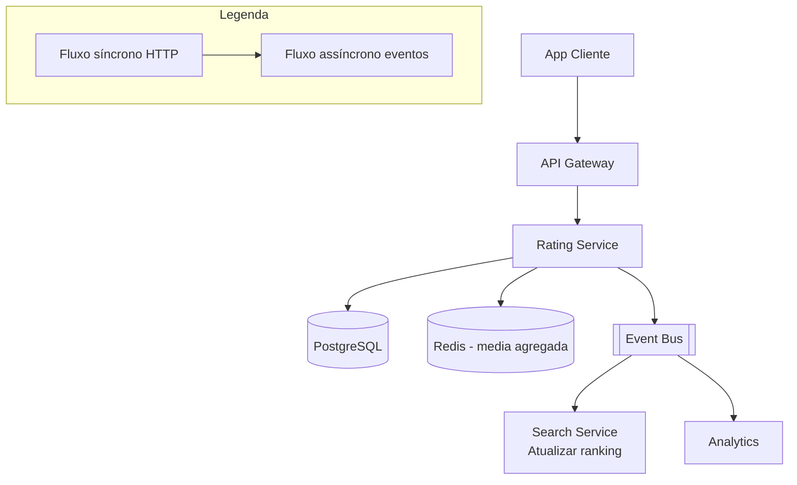

# System Design - Avaliacoes e Feedback

> **Status:** Em progresso  
> **Fase:** 5  
> **Jornada:** Cliente  
> **Epico:** [Cliente §1.1 — Avaliacao e feedback](../../epic-ifood-clone.md#11-jornada-do-cliente-app-mobile--web)  
> **Dependencias:** [12-confirmacao-entrega](../12-confirmacao-entrega/system-design.md), [00-plataforma-transversal](../00-plataforma-transversal/system-design.md)

## 1. Objetivo

Coletar nota (1-5) e comentarios **separados** para restaurante e entregador apos cada entrega concluida, calcular medias agregadas em tempo real (< 1min) e alimentar o ranking de busca e metricas de qualidade da plataforma.

## 2. Escopo Funcional

### 2.1 MVP

- [ ] Prompt pos-entrega (push notification e tela in-app)
- [ ] Duas avaliacoes independentes por pedido: restaurante + entregador
- [ ] Nota de 1 a 5 (estrelas) obrigatoria
- [ ] Comentario opcional com moderacao basica (filtro de palavras ofensivas)
- [ ] Calculo de media agregada por restaurante e entregador (atualizada em < 1min)
- [ ] Janela de 7 dias para avaliar (apos expirar, nao permite nova avaliacao)
- [ ] Uma avaliacao por ator por pedido (idempotente)
- [ ] Evento publicado para Search Service atualizar media no indice

### 2.2 Pos-MVP

- [ ] Tags rapidas pre-definidas ("entrega rapida", "comida fria", "bem embalado")
- [ ] Resposta do restaurante a avaliacao
- [ ] Moderacao de reviews com ML para deteccao de fake reviews
- [ ] Ajudar a avaliacao foi util? (avaliacao de avaliacao)
- [ ] Avaliacao com foto do pedido

## 3. Requisitos Nao Funcionais

- Agregacao de media: atualizada em **< 1 minuto** apos submissao
- Uma avaliacao por ator por pedido (UNIQUE constraint + idempotencia)
- Leitura de media agregada: **< 50ms** p95 (cache Redis)
- Comentarios moderados: filtro de palavras ofensivas em < 100ms
- Disponibilidade do dominio: **99.9%**

## 4. Contexto de Negocio

Avaliacoes sao o principal mecanismo de controle de qualidade da plataforma:

- **Restaurantes:** Nota media determina posicao nos resultados de busca, visibilidade e confianca do cliente. Um restaurante com nota baixa (< 4.0) perde prominencia.
- **Entregadores:** Nota media impacta prioridade no matching (design 09), bonus de performance e permanencia na plataforma.
- **Clientes:** Avaliacoes ajudam outros clientes a decidir onde pedir. Comentarios com fotos geram 3x mais engajamento.
- **Plataforma:** Dados de avaliacao alimentam metricas de SLA, deteccao de problemas operacionais e programa de qualidade.

## 5. Arquitetura de Alto Nivel



Diagrama detalhado: [`./architecture.mermaid`](./architecture.mermaid)

## 6. Componentes

### 6.1 Rating Service

- Recebe avaliacoes, valida unicidade e janela de 7 dias
- Aplica filtro de moderacao basica em comentarios
- Atualiza media agregada no Redis (atomicamente)
- Persiste avaliacao e agrega nova media no PG
- Publica `restaurant.rating.updated` e `courier.rating.updated` para Search Service

### 6.2 Moderation Engine

- Filtro de palavras ofensivas (lista negra + regex patterns em portugues)
- Bloqueia comentarios com linguagem ofensiva → retorna erro 422
- Marca comentarios suspeitos para revisao manual (admin)
- Pos-MVP: integracao com API de moderacao (Google Perspective / OpenAI)

### 6.3 Rating Aggregator

- Mantem media agregada no Redis para leitura rapida (< 50ms)
- Atualiza media a cada nova avaliacao (media movel otimista)
- Job de reconciliacao recalcula medias a partir do PG a cada 1h (garante consistencia)

## 7. Modelo de Dados

### 7.1 `order_ratings`

| Coluna | Tipo | Restricoes | Descricao |
|--------|------|------------|-----------|
| id | UUID | PK | |
| order_id | UUID | FK → orders.id, NOT NULL | |
| user_id | UUID | FK → users.id, NOT NULL | Cliente que avaliou |
| target_type | VARCHAR(16) | NOT NULL | `restaurant` ou `courier` |
| target_id | UUID | NOT NULL | FK → restaurant_profiles.id ou users.id (courier) |
| score | SMALLINT | NOT NULL, CHECK (1 <= score <= 5) | Nota de 1 a 5 |
| comment | VARCHAR(500) | NULL | Comentario opcional |
| comment_status | VARCHAR(16) | NOT NULL, DEFAULT 'approved' | `approved`, `pending_review`, `blocked` |
| moderation_result | JSONB | NULL | Resultado da moderacao (palavras bloqueadas, score) |
| is_edited | BOOLEAN | NOT NULL, DEFAULT false | Se o cliente editou o comentario |
| edited_at | TIMESTAMP | NULL | |
| created_at | TIMESTAMP | NOT NULL, DEFAULT NOW() | |

**Indices:**
- `(order_id, target_type)` — UNIQUE (uma avaliacao por ator por pedido)
- `(target_type, target_id, created_at)` — historico de avaliacoes de um restaurante/entregador
- `(target_type, target_id, score)` — distribuicao de notas
- `(comment_status, created_at)` — fila de moderacao

### 7.2 `rating_aggregates`

| Coluna | Tipo | Restricoes | Descricao |
|--------|------|------------|-----------|
| id | UUID | PK | |
| target_type | VARCHAR(16) | NOT NULL | `restaurant` ou `courier` |
| target_id | UUID | NOT NULL | |
| avg_score | DECIMAL(3,2) | NOT NULL, DEFAULT 0.00 | Media calculada (0.00 a 5.00) |
| total_ratings | INT | NOT NULL, DEFAULT 0 | Total de avaliacoes |
| distribution | JSONB | NOT NULL | Distribuicao de notas: `{ \"1\": 0, \"2\": 0, \"3\": 0, \"4\": 0, \"5\": 0 }` |
| last_rating_at | TIMESTAMP | NULL | Data da ultima avaliacao |
| updated_at | TIMESTAMP | NOT NULL, DEFAULT NOW() | |

**Indices:**
- `(target_type, target_id)` — UNIQUE

### 7.3 `moderation_blocklist`

| Coluna | Tipo | Restricoes | Descricao |
|--------|------|------------|-----------|
| id | UUID | PK | |
| word | VARCHAR(64) | NOT NULL, UNIQUE | Palavra ou expressao bloqueada |
| category | VARCHAR(32) | NOT NULL | `offensive`, `spam`, `promotion` |
| is_regex | BOOLEAN | NOT NULL, DEFAULT false | Se e uma expressao regular |
| severity | VARCHAR(16) | NOT NULL, DEFAULT 'block' | `block` (rejeitar comentario), `flag` (marcar para revisao) |
| created_at | TIMESTAMP | NOT NULL, DEFAULT NOW() | |

**Indices:**
- `(word)` — UNIQUE

### 7.4 Dados em Redis

#### Media agregada por target

**Estrutura:** Hash

- Chave: `rating:aggregate:{target_type}:{target_id}`
- Campos: `avg_score` (DECIMAL), `total_ratings` (INT), `distribution` (JSON string)
- TTL: N/A (atualizado a cada nova avaliacao, persistido no PG)

#### Lock de atualizacao de media

- Chave: `rating:lock:{target_type}:{target_id}`
- TTL: 5s (impede condicao de corrida na atualizacao da media)

## 8. Fluxos Principais

### 8.1 Submissao de avaliacao

1. Cliente recebe pedido (`delivery.completed`).
2. App exibe prompt de avaliacao (push notification ou tela in-app).
3. Cliente avalia:
   - Restaurante: nota 1-5 (obrigatorio) + comentario opcional.
   - Entregador: nota 1-5 (obrigatorio) + comentario opcional.
4. App envia `POST /v1/orders/{orderId}/ratings`:
   ```json
   {
     "restaurant": { "score": 5, "comment": "Pizza deliciosa!" },
     "courier": { "score": 4, "comment": "Entregador educado" }
   }
   ```
5. Rating Service:
   a. Valida JWT: `user_id` do token deve ser o dono do pedido.
   b. Verifica UNIQUE `(order_id, target_type)` — se ja existe avaliacao para este ator, retorna 409.
   c. Verifica janela de 7 dias: `delivery.completed_at + 7 dias > NOW()`.
   d. Aplica moderacao no comentario:
      - Filtra palavras ofensivas (lista negra + regex).
      - Se `severity = 'block'`: retorna 422 com `reason: 'blocked_content'`.
      - Se `severity = 'flag'`: marca `comment_status = 'pending_review'`.
   e. Persiste `order_ratings` com `comment_status` adequado.
   f. Adquire lock Redis `rating:lock:{target_type}:{target_id}`.
   g. Atualiza agregado no Redis:
      - Incrementa `total_ratings`.
      - Recalcula `avg_score` com media movel.
      - Atualiza `distribution`.
   h. Atualiza `rating_aggregates` no PG.
   i. Libera lock Redis.
   j. Publica evento de rating (`restaurant.rating.updated` ou `courier.rating.updated`).
6. Search Service consome o evento e atualiza `avg_rating` no indice Elasticsearch.
7. Cliente ve confirmacao: "Avaliacao enviada com sucesso!"

### 8.2 Atualizacao da media agregada

1. A cada nova avaliacao, a media no Redis e atualizada atomicamente via Lua script:
   ```
   local key = KEYS[1]
   local score = tonumber(ARGV[1])
   local current = redis.call('HGETALL', key)
   
   local total = tonumber(current.total_ratings or 0) + 1
   local avg = ((tonumber(current.avg_score or 0) * (total - 1)) + score) / total
   
   local dist = cjson.decode(current.distribution or '{}')
   dist[tostring(score)] = (dist[tostring(score)] or 0) + 1
   
   redis.call('HSET', key,
     'avg_score', avg,
     'total_ratings', total,
     'distribution', cjson.encode(dist),
     'last_rating_at', ARGV[2]
   )
   return { avg_score = avg, total_ratings = total }
   ```
2. Este script garante consistencia mesmo sob alta concorrencia (multiplas avaliacoes simultaneas para o mesmo restaurante).
3. Job `reconcile_ratings` (cron 1h) recalcula todas as medias a partir dos dados brutos do PG e corrige inconsistencias.

### 8.3 Moderacao de comentarios

1. Comentario enviado pelo cliente.
2. Rating Service aplica filtros:
   a. Verifica cada palavra do comentario contra `moderation_blocklist`.
   b. Palavras bloqueadas (`severity = 'block'`): rejeita comentario com erro 422.
   c. Palavras sinalizadas (`severity = 'flag'`): marca como `pending_review`.
3. Comentarios `pending_review` aparecem no painel admin.
4. Admin pode: `approve` (aprovar mesmo assim), `block` (bloquear), `edit` (editar).
5. Comentarios `blocked` tem o campo `comment` substituido por "[Comentario removido pela moderacao]" na exibicao publica, mas a nota permanece valida.

### 8.4 Edicao de avaliacao

1. Cliente pode editar o comentario (mas nao a nota) dentro da janela de 7 dias.
2. `PUT /v1/orders/{orderId}/ratings/{ratingId}` body: `{ "comment": "Novo comentario" }`.
3. Rating Service:
   a. Verifica se `created_at + 7 dias > NOW()`.
   b. Aplica moderacao novamente.
   c. Atualiza `comment`, marca `is_edited = true`, `edited_at = NOW()`.
4. Nota nao pode ser alterada apos submissao (evita manipulacao de media).

### 8.5 Exclusao de avaliacao (LGPD)

1. Cliente solicita exclusao dos seus dados de avaliacao.
2. Admin executa exclusao no PG:
   - `order_ratings` tem `user_id` anonimizado (substituido por UUID descartavel).
   - `comment` e substituido por "[Avaliacao removida a pedido do usuario]".
   - Nota permanece no agregado (dado estatistico, nao pessoal).
3. Media agregada e recalculada apos anonimizacao.

## 9. Contratos de API

### 9.1 Padrao de erro

Segue o [padrao global definido na Plataforma Transversal](../00-plataforma-transversal/system-design.md#91-padrao-de-erro-global).

### 9.2 Endpoints do dominio de avaliacoes

#### `POST /v1/orders/{orderId}/ratings`

Submete avaliacao para restaurante e/ou entregador.

**Request body:**
```json
{
  "restaurant": {
    "score": 5,
    "comment": "Pizza deliciosa e muito bem embalada!"
  },
  "courier": {
    "score": 4,
    "comment": "Entregador educado, chegou rapido."
  }
}
```

**Response (201):**
```json
{
  "orderId": "uuid",
  "ratings": [
    { "ratingId": "uuid1", "targetType": "restaurant", "score": 5, "commentStatus": "approved" },
    { "ratingId": "uuid2", "targetType": "courier", "score": 4, "commentStatus": "approved" }
  ],
  "createdAt": "2026-07-04T15:00:00.000Z"
}
```

**Response (409) — avaliacao ja existe:**
```json
{
  "error": {
    "code": "CONFLICT",
    "message": "Voce ja avaliou este pedido.",
    "details": [{ "reason": "rating_already_exists", "existingRatings": ["restaurant", "courier"] }],
    "correlationId": "...",
    "timestamp": "..."
  }
}
```

**Response (422) — comentario bloqueado:**
```json
{
  "error": {
    "code": "VALIDATION_ERROR",
    "message": "Comentario contem conteudo nao permitido.",
    "details": [{ "field": "restaurant.comment", "reason": "blocked_content" }],
    "correlationId": "...",
    "timestamp": "..."
  }
}
```

#### `GET /v1/orders/{orderId}/ratings`

Retorna as avaliacoes do pedido (para o cliente que avaliou).

**Response (200):**
```json
{
  "orderId": "uuid",
  "ratings": [
    {
      "ratingId": "uuid1",
      "targetType": "restaurant",
      "targetName": "Pizza Express",
      "score": 5,
      "comment": "Pizza deliciosa e muito bem embalada!",
      "commentStatus": "approved",
      "createdAt": "2026-07-04T15:00:00.000Z"
    },
    {
      "ratingId": "uuid2",
      "targetType": "courier",
      "targetName": "Carlos",
      "score": 4,
      "comment": "Entregador educado, chegou rapido.",
      "commentStatus": "approved",
      "createdAt": "2026-07-04T15:00:00.000Z"
    }
  ]
}
```

#### `GET /v1/ratings/{targetType}/{targetId}`

Retorna o agregado de avaliacoes de um restaurante ou entregador. Endpoint publico (nao requer autenticacao para leitura).

**Response (200):**
```json
{
  "targetType": "restaurant",
  "targetId": "uuid",
  "avgScore": 4.7,
  "totalRatings": 523,
  "distribution": { "1": 5, "2": 8, "3": 25, "4": 120, "5": 365 },
  "lastRatingAt": "2026-07-04T15:00:00.000Z",
  "recentComments": [
    { "comment": "Pizza deliciosa!", "score": 5, "createdAt": "2026-07-04T15:00:00.000Z" },
    { "comment": "Demorou um pouco mas valeu a pena.", "score": 4, "createdAt": "2026-07-04T14:00:00.000Z" }
  ]
}
```

**Cache:** Resposta em Redis (leitura < 50ms). Atualizada a cada nova avaliacao.

#### `PUT /v1/orders/{orderId}/ratings/{ratingId}`

Edita o comentario de uma avaliacao (apenas dentro da janela de 7 dias, nota nao pode ser alterada).

**Request body:**
```json
{
  "comment": "Comentario atualizado apos contato com o restaurante."
}
```

**Response (200):**
```json
{
  "ratingId": "uuid",
  "score": 5,
  "comment": "Comentario atualizado apos contato com o restaurante.",
  "isEdited": true,
  "editedAt": "2026-07-04T16:00:00.000Z"
}
```

#### `GET /v1/admin/moderation/queue`

Lista comentarios pendentes de moderacao (admin).

**Query params:**
- `status` (STRING, opcional) — `pending_review`, `approved`, `blocked`

**Response (200):**
```json
{
  "queue": [
    {
      "ratingId": "uuid",
      "orderId": "uuid",
      "comment": "Pedido horrivel...",
      "score": 1,
      "targetType": "restaurant",
      "targetName": "Pizza Express",
      "moderationResult": { "flaggedWords": ["horrivel"], "severity": "flag" },
      "createdAt": "2026-07-04T15:00:00.000Z"
    }
  ],
  "total": 5,
  "page": 1
}
```

#### `POST /v1/admin/moderation/queue/{ratingId}/review`

Admin revisa um comentario sinalizado.

**Request body:**
```json
{
  "action": "approve",
  "notes": "Comentário dentro dos limites aceitáveis."
}
```

**Response (200):**
```json
{
  "ratingId": "uuid",
  "commentStatus": "approved",
  "reviewedBy": "admin-uuid",
  "reviewedAt": "2026-07-04T15:30:00.000Z"
}
```

### 9.3 Health check

Segue o [padrao definido no documento 00](../00-plataforma-transversal/system-design.md#92-health-check).

## 10. Contratos de Eventos

> **Nota:** O envelope padrao dos eventos e definido pela **Plataforma Transversal** (documento 00). Consulte a [secao 10 do System Design 00](../00-plataforma-transversal/system-design.md#10-contratos-de-eventos) para o schema completo do envelope, politica de versionamento e topic naming.

### 10.1 Eventos publicados pelo Rating Service

#### `restaurant.rating.updated`

Publicado quando a media de um restaurante e atualizada.

**Payload:**
```json
{
  "restaurantId": "a1b2c3d4-...",
  "orderId": "e5f6a7b8-...",
  "avgScore": 4.72,
  "totalRatings": 524,
  "newScore": 5,
  "updatedAt": "2026-07-04T15:00:00.000Z"
}
```

**Consumidores:** Search Service (atualizar `avg_rating` no indice ES — consulte o [Design 05](../05-busca-filtros/system-design.md#72-documento-do-elasticsearch) para detalhes de como o `avg_rating` impacta o boosting no ranking de busca).

#### `courier.rating.updated`

Publicado quando a media de um entregador e atualizada.

**Payload:**
```json
{
  "courierId": "b2c3d4e5-...",
  "orderId": "e5f6a7b8-...",
  "avgScore": 4.50,
  "totalRatings": 120,
  "newScore": 4,
  "updatedAt": "2026-07-04T15:00:00.000Z"
}
```

**Consumidores:** Search Service, Dispatch Service (prioridade no matching).

### 10.2 Eventos consumidos de outros dominios

| Evento | Produtor (dominio) | Acao no Rating Service |
|--------|---------------------|------------------------|
| `delivery.completed` | Confirmacao (12) | Iniciar janela de avaliacao de 7 dias para o cliente. O Rating Service faz query interna ao Order Service com o `orderId` para resolver o `customerId` e notificar o cliente, ja que o evento `delivery.completed` nao carrega `customerId` diretamente. |

### 10.3 Tabela de eventos publicados do dominio

| Evento | Produtor | Consumidores | Schema Version |
|--------|----------|--------------|----------------|
| `restaurant.rating.updated` | Rating Service | Search, Analytics | 1.0 |
| `courier.rating.updated` | Rating Service | Search, Dispatch, Analytics | 1.0 |

## 11. Seguranca

### 11.1 RBAC especifico

| Role | Acoes permitidas |
|------|------------------|
| `customer` | Submeter avaliacao do proprio pedido, editar comentario, visualizar proprias avaliacoes |
| `admin` | Moderar comentarios, visualizar fila de moderacao, anonimizar avaliacoes (LGPD) |
| `public` | Visualizar agregado de avaliacoes de restaurantes e entregadores |

- `POST /v1/orders/{orderId}/ratings`: valida que `user_id` do token corresponde ao `customer_id` do pedido.
- `GET /v1/ratings/{targetType}/{targetId}`: endpoint publico (sem autenticacao).

### 11.2 Protecao de comentarios (LGPD)

- Comentarios sao dados pessoais do cliente. Cliente pode solicitar anonimizacao.
- `order_ratings.user_id` e anonimizado na exclusao (substituido por UUID descartavel).
- `comment` substituido por "[Avaliacao removida a pedido do usuario]".
- Nota permanece no agregado estatistico (dado anonimizado).
- Recent comments (secao 9.2) mostram apenas os 5 comentarios mais recentes aprovados.
- Comentarios `blocked` nunca sao exibidos publicamente.

### 11.3 Protecoes no Gateway

- Rate limit em `POST /v1/orders/{orderId}/ratings`: **5 requests/min** por cliente.
- Rate limit em `GET /v1/ratings/{targetType}/{targetId}`: **120 requests/min** por IP (publico).
- Rate limit em `PUT /v1/orders/{orderId}/ratings/{ratingId}`: **3 requests/min** por cliente.

## 12. Escalabilidade

### 12.1 Cache

| Recurso | Estrategia | TTL |
|---------|------------|-----|
| Media agregada por target | Redis Hash `rating:aggregate:{target_type}:{target_id}` | Indeterminado (atualizado a cada rating) |
| Recent comments (5 ultimos) | Redis List `rating:recent:{target_type}:{target_id}` | 1h |
| Lock de atualizacao | Redis String `rating:lock:{target_type}:{target_id}` | 5s |

### 12.2 Database

- `order_ratings`: volume moderado (~50k inserts/dia). Indices para queries de agregacao.
- `rating_aggregates`: uma linha por restaurante/entregador. Atualizada a cada rating.
- `moderation_blocklist`: volume muito baixo (< 100 palavras). Cache local no Rating Service.

### 12.3 Estimativa de capacidade

| Recurso | Estimativa | Folga |
|---------|------------|-------|
| Avaliacoes por dia | 50k (media de 2 por pedido × 25k pedidos) | 2x (100k) |
| Leitura de agregado por segundo | 200/s (paginas de restaurante + busca) | 2x (400/s) |
| Comentarios para moderacao por dia | 500 (1% sinalizados) | 2x (1k) |

## 13. Observabilidade

### 13.1 Logs estruturados

Segue o [padrao do documento 00](../00-plataforma-transversal/system-design.md#131-logs-estruturados). Campos adicionais:

- `orderId` — ID do pedido
- `targetType` — `restaurant` ou `courier`
- `score` — nota atribuida
- `commentStatus` — `approved`, `pending_review`, `blocked`
- `moderationAction` — `auto_approved`, `auto_blocked`, `flagged`

### 13.2 Metricas especificas do dominio

| Metrica | Tipo | Descricao |
|---------|------|-----------|
| `ratings_submitted_total` | Counter | Avaliacoes submetidas (tag: `target_type`) |
| `ratings_score_distribution` | Histogram | Distribuicao de notas (1-5) |
| `ratings_with_comment_ratio` | Gauge | Proporcao de avaliacoes com comentario |
| `ratings_moderation_flagged_total` | Counter | Comentarios sinalizados para moderacao |
| `ratings_moderation_blocked_total` | Counter | Comentarios bloqueados |
| `ratings_aggregate_update_lag_ms` | Histogram | Tempo entre submissao e atualizacao do agregado |
| `ratings_avg_score_per_target` | Gauge | Media geral por restaurante/entregador |

### 13.3 Dashboard (Grafana)

- **Avaliacoes submetidas** — taxa por hora (restaurante vs entregador)
- **Distribuicao de notas** — histograma (1-5)
- **Media geral** — evolucao ao longo do tempo
- **Taxa de comentarios** — % com comentario vs apenas nota
- **Fila de moderacao** — pendentes, aprovados, bloqueados
- **Lag de atualizacao** — tempo ate agregado refletir nova avaliacao

### 13.4 Alertas especificos

| Alerta | Condicao | Severidade | Acao |
|--------|----------|------------|------|
| Alta taxa de bloqueio na moderacao | > 5% dos comentarios bloqueados em 1h | P3 | Revisar lista de palavras bloqueadas |
| Fila de moderacao acumulando | > 50 comentarios pendentes ha mais de 24h | P3 | Revisar fila de moderacao |
| Lag de agregacao elevado | p95 aggregate_update_lag > 5min | P2 | Verificar Redis, job de reconciliação |
| Queda brusca na media de um restaurante | avg_score cai > 0.5 em 1h | P3 | Possivel ataque de review bombing |

## 14. Resiliencia

### 14.1 Timeouts

| Tipo de chamada | Timeout | Justificativa |
|-----------------|---------|---------------|
| Escrita de avaliacao (PG) | 1s | Insert simples |
| Atualizacao de agregado (Redis) | 200ms | Lua script em memoria |
| Leitura de agregado (Redis) | 100ms | Hash em memoria |
| Publicacao de evento | 3s | Event Bus |
| Moderacao de comentario | 200ms | Filtro local (lista em memoria) |

### 14.2 Retries com jitter

| Cenario | Tentativas | Intervalo | Jitter |
|---------|------------|-----------|--------|
| Publicacao de evento | 3 | 200ms, 400ms, 800ms | +/- 50ms |
| Atualizacao de agregado no PG | 2 | 100ms, 200ms | +/- 20ms |

### 14.3 Graceful degradation

| Cenario | Acao |
|---------|------|
| Redis indisponivel | Agregado lido do PostgreSQL (mais lento ~50ms vs 10ms). Atualizacao do agregado e feita diretamente no PG. |
| PostgreSQL indisponivel | Avaliacao e armazenada em buffer no Redis até o PG ser restabelecido. Agregado continua no Redis. |
| Event Bus indisponivel | Avaliacao e processada normalmente. Eventos de `rating.updated` enfileirados para publicacao posterior. Search Service atualiza ranking via job de reconciliacao (cron 1h). |
| Moderation blocklist corrompida | Cache local recarregado do PG a cada 5min. Se falhar, comentarios sao aprovados sem filtro (fallback seguro). |

### 14.4 Consistencia do agregado

1. Nova avaliacao e persistida no PG primeiro (source of truth).
2. Agregado no Redis e atualizado via Lua script atomico.
3. Apenas apos sucesso no Redis, evento e publicado.
4. Job `reconcile_ratings` (cron 1h) recalcula todos os agregados a partir do PG e corrige inconsistencias.
5. Se o Redis falhar entre os passos 1 e 2, o job de reconciliacao corrige em ate 1h.

### 14.5 Idempotencia

- `POST /v1/orders/{orderId}/ratings`: protegido por UNIQUE `(order_id, target_type)` no PG. Segunda submissao retorna 409.
- Eventos `restaurant.rating.updated` e `courier.rating.updated`: consumidores processam com base no `eventId` (duplicate detection).

## 15. Decisoes Arquiteturais (ADRs)

### ADR-001: Agregado em Redis com Lua Script vs Recalculo a Cada Leitura

| Campo | Valor |
|-------|-------|
| **Decisao** | Media agregada mantida em Redis (Hash) e atualizada atomicamente via Lua script a cada nova avaliacao. PG como source of truth para reconciliação. |
| **Contexto** | Leitura de agregado e frequente (200/s em paginas de restaurante). Recalcular a media a cada leitura via PG seria lento (50ms vs 10ms no Redis) e escalaria mal. |
| **Alternativas** | Recalculo via PG a cada leitura (lento para o volume), Materialized view no PG (atualizacao pesada), Apenas Redis sem PG (risco de perda) |
| **Consequencias** | Positivas: leitura < 10ms, escrita atomica. Negativas: complexidade de manter consistencia Redis ↔ PG (job de reconciliacao a cada 1h). |
| **Status** | Aprovado |

### ADR-002: Avaliacoes Separadas para Restaurante e Entregador

| Campo | Valor |
|-------|-------|
| **Decisao** | Duas avaliacoes independentes por pedido (restaurante + entregador), cada uma com nota e comentario proprios |
| **Contexto** | Restaurante e entregador sao atores diferentes com metricas de qualidade diferentes. Misturar as notas prejudicaria a precisao dos rankings e bonus. |
| **Alternativas** | Avaliacao unica para o pedido todo (perde granularidade), Avaliacao automatica baseada em metricas de SLA (remove o feedback humano) |
| **Consequencias** | Positivas: feedback especifico para cada ator, rankings precisos. Negativas: cliente precisa dar duas notas (pequena fricao, mas aceitavel). |
| **Status** | Aprovado |

### ADR-003: Moderacao Basica com Blocklist vs ML

| Campo | Valor |
|-------|-------|
| **Decisao** | Moderacao basica com lista de palavras bloqueadas + regex para MVP. ML (Google Perspective / OpenAI) para pos-MVP. |
| **Contexto** | Comentarios ofensivos precisam ser filtrados. Uma lista de ~100 palavras em portugues e suficiente para bloquear ~95% dos casos. ML seria overkill e adicionaria latencia (200ms vs 5ms). |
| **Alternativas** | Apenas denuncia do usuario (lento e reativo), ML desde o inicio (custo, latencia, complexidade), Blocklist + flag para revisao manual (adotado) |
| **Consequencias** | Positivas: rapido (< 5ms), simples, zero custo de API. Negativas: falsos positivos (palavras bloqueadas em contexto inofensivo), nao detecta sarcasmo ou ofensas disfarcadas. |
| **Status** | Aprovado |

### ADR-004: Janela de 7 Dias para Avaliacao

| Campo | Valor |
|-------|-------|
| **Decisao** | Cliente pode avaliar o pedido por ate 7 dias apos a entrega. Apos esse periodo, a avaliacao nao e mais permitida. |
| **Contexto** | Avaliacoes muito tardias perdem relevancia (cliente ja nao lembra dos detalhes). Janela de 7 dias equilibra conveniencia do cliente com precisao do feedback. |
| **Alternativas** | Sem janela (avaliacoes meses depois perdem relevancia), 3 dias (pressiona o cliente), 30 dias (muito longa para feedback operacional) |
| **Consequencias** | Positivas: feedback na memoria recente do cliente, medias refletem qualidade atual. Negativas: cliente que viaja ou demora a abrir o app perde a janela. |
| **Status** | Aprovado |

### ADR-005: Nota Imutavel, Comentario Editavel

| Campo | Valor |
|-------|-------|
| **Decisao** | Apos submetida, a nota nao pode ser alterada. O comentario pode ser editado dentro da janela de 7 dias, com nova moderacao. |
| **Contexto** | Permitir alteracao de nota permitiria manipulacao da media (cliente pode ser influenciado por reembolso ou promocao). Comentario editavel permite correcao de erros ou atualizacao apos resposta do restaurante. |
| **Alternativas** | Nota e comentario editaveis (risco de manipulacao), Nem nota nem comentario editaveis (cliente nao pode corrigir erro) |
| **Consequencias** | Positivas: media confiavel, cliente pode corrigir comentario. Negativas: cliente frustrado se digitou nota errada (raro). |
| **Status** | Aprovado |

## 16. Riscos e Mitigacoes

| Risco | Probabilidade | Impacto | Mitigacao |
|-------|---------------|---------|-----------|
| **Review bombing (ataque de notas baixas)** | Baixa | Alto | Alerta de queda brusca de media > 0.5 em 1h. Admin pode investigar e remover avaliacoes suspeitas. |
| **Comentario ofensivo publicado antes da moderacao** | Media | Medio | Moderacao sincrona (bloqueio na hora). Comentarios flagged sao marcados e removidos da exibicao ate revisao. |
| **Condicao de corrida na atualizacao da media** | Baixa | Medio | Lua script atomico no Redis garante consistencia. Job de reconciliacao corrige inconsistencias. |
| **Cliente avalia o ator errado (nota do restaurante no entregador)** | Baixa | Baixo | UI do app separa claramente as duas avaliacoes. Nao e possivel trocar apos submissao. |
| **Vazamento de dados de avaliacao (LGPD)** | Baixa | Alto | Comentarios sao PII. Anonimizacao na exclusao. Recent comments limitados a 5. |
| **Cliente avalia antes de receber o pedido** | Baixa | Medio | Avaliacao so e permitida apos `delivery.completed`. Push notification e enviado apenas apos confirmacao. |

### 16.1 Matriz de probabilidade x impacto

```
Impacto:  Baixo      Medio       Alto        Critico
Probabilidade
Alta      |            |            |            |
          |            |            |            |
Media     | Ator       | Coment.    |            |
          | errado     | ofensivo   |            |
Baixa     |            | Corrida    | Review     |
          |            | avaliacao  | bombing    |
          |            | pre-entrega| Vazamento  |
```

---

> **Documentos relacionados:** [Template de system design](../../templates/system-design-template.md) | [Roadmap](../../roadmap/ordem-das-jornadas.md) | [Epico iFood Clone](../../epic-ifood-clone.md) | [Plataforma Transversal](../00-plataforma-transversal/system-design.md)
