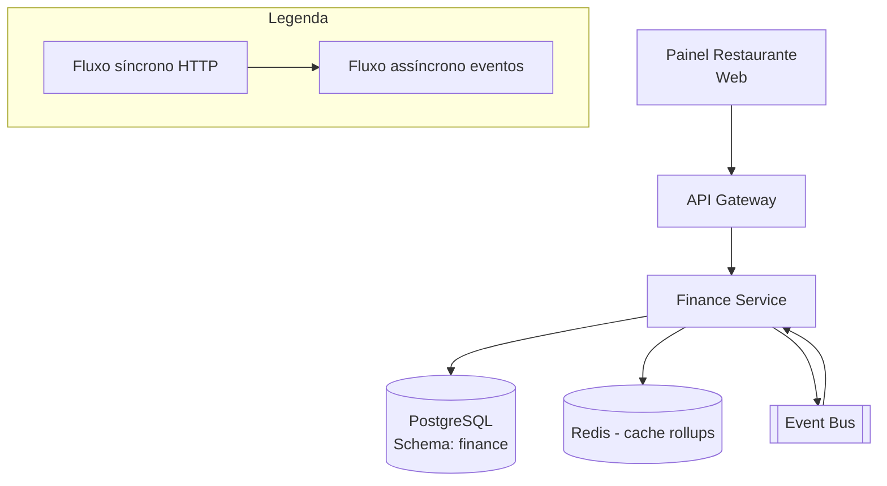

# System Design - Painel Financeiro do Restaurante

> **Status:** Em progresso  
> **Fase:** 5  
> **Jornada:** Restaurante  
> **Epico:** [Restaurante §1.2 — Painel financeiro](../../epic-ifood-clone.md#12-jornada-do-restaurante-painel-web--gestor-de-pedidos)  
> **Dependencias:** [07-pagamentos](../07-pagamentos/system-design.md), [08-estados-pedido-restaurante](../08-estados-pedido-restaurante/system-design.md), [12-confirmacao-entrega](../12-confirmacao-entrega/system-design.md), [00-plataforma-transversal](../00-plataforma-transversal/system-design.md)

## 1. Objetivo

Prover ao restaurante um painel financeiro completo com relatorios de vendas diarias, semanais e mensais, detalhamento de taxas da plataforma, valores a receber (repasse), extrato por pedido e exportacao CSV — tudo com precisao decimal e auditoria financeira.

## 2. Escopo Funcional

### 2.1 MVP

- [ ] Dashboard financeiro: vendas brutas, taxas da plataforma, liquido a receber
- [ ] Filtro por periodo (dia / semana / mes / custom)
- [ ] Extrato por pedido individual (valor do pedido, taxa, liquido)
- [ ] Ciclo de repasse (D+7, configuravel por restaurante)
- [ ] Historico de repasses realizados
- [ ] Exportacao CSV do periodo selecionado
- [ ] Pre-agregacao diaria para consultas rapidas

### 2.2 Pos-MVP

- [ ] Antecipacao de recebiveis (com taxa de desconto)
- [ ] Nota fiscal integrada (emissao automatica)
- [ ] Multi-loja (franquias com consolidacao)
- [ ] Conciliação bancaria automatica (OFX)
- [ ] Relatorio de impostos (ISS, PIS, COFINS)

## 3. Requisitos Nao Funcionais

- Relatorios historicos: consulta **< 500ms** p95 com pre-agregacao
- Numeros financeiros: precisao com **2 casas decimais**, armazenados como centavos (INT), nunca float
- Rollups diarios atualizados em **< 5min** apos o evento
- Auditoria: toda movimentacao registrada em `ledger_entries` (append-only)
- Disponibilidade do dominio: **99.99%**

## 4. Contexto de Negocio

O painel financeiro e a ferramenta mais critica para o restaurante depois do gerenciamento de pedidos:

- **Transparencia:** Restaurante precisa entender quanto pagou de taxa, quanto vai receber e quando.
- **Fluxo de caixa:** Saber o calendario de repasses (D+7) e essencial para o planejamento financeiro do restaurante.
- **Disputas:** Valores incorretos geram chamados de suporte e desconfianca na plataforma.
- **Auditoria:** A plataforma precisa auditar cada centavo movimentado para conformidade fiscal e regulatoria.

## 5. Arquitetura de Alto Nivel



Diagrama detalhado: [`./architecture.mermaid`](./architecture.mermaid)

## 6. Componentes

### 6.1 Finance Service

- Consome eventos de pagamento e entrega para registrar lancamentos contabeis
- Mantem ledger (append-only) de todas as transacoes
- Atualiza rollups diarios (pre-agregacao para consultas rapidas)
- Gerencia ciclos de repasse e historico de pagamentos
- Expoe endpoints do painel financeiro com dados pre-agregados
- Job de reconciliação com gateway de pagamento

### 6.2 Rollup Engine

- Atualiza `daily_restaurant_rollups` apos cada novo lancamento
- Operacao atomica: le valor atual, soma novo valor, escreve
- Fallback: se o rollup falhar, o ledger ainda tem os dados brutos
- Job de reprocessamento (cron 1h) recalcula rollups do dia anterior

### 6.3 Payout Scheduler

- Job cron diario que processa repasses para restaurantes
- Busca restaurantes com saldo disponivel (pedidos entregues ha D+7 dias)
- Agrupa lancamentos do periodo, calcula valor liquido, cria `payouts`
- Publica `payout.processed` (para notificacao e conciliacao)

## 7. Modelo de Dados

> **Nota:** Todos os valores financeiros sao armazenados em **centavos** (INT), nunca float, para evitar erros de arredondamento.

### 7.1 `ledger_entries` (append-only)

| Coluna | Tipo | Restricoes | Descricao |
|--------|------|------------|-----------|
| id | UUID | PK | |
| restaurant_id | UUID | FK → restaurant_profiles.id, NOT NULL | |
| order_id | UUID | FK → orders.id, NULL | Pode ser NULL para lancamentos nao vinculados a pedido |
| entry_type | VARCHAR(24) | NOT NULL | `sale`, `platform_fee`, `delivery_fee`, `refund`, `adjustment`, `payout`, `anticipation` |
| amount_cents | INT | NOT NULL | Valor em centavos (positivo = credito, negativo = debito) |
| description | VARCHAR(256) | NOT NULL | Descricao legivel do lancamento |
| reference_id | UUID | NULL | ID de referencia (ex: payment_id, refund_id) |
| reference_type | VARCHAR(24) | NULL | `payment`, `refund`, `payout` |
| status | VARCHAR(16) | NOT NULL, DEFAULT 'pending' | `pending`, `settled`, `cancelled` |
| settled_at | TIMESTAMP | NULL | Quando o valor foi liquidado (ex: repasse realizado) |
| created_at | TIMESTAMP | NOT NULL, DEFAULT NOW() | |

**Indices:**
- `(restaurant_id, created_at)` — extrato do restaurante
- `(restaurant_id, order_id)` — lancamentos por pedido
- `(order_id, entry_type)` — consulta por pedido
- `(entry_type, status)` — job de payout
- `(created_at)` — particionamento por mes

### 7.2 `daily_restaurant_rollups`

| Coluna | Tipo | Restricoes | Descricao |
|--------|------|------------|-----------|
| id | UUID | PK | |
| restaurant_id | UUID | FK → restaurant_profiles.id, NOT NULL | |
| date | DATE | NOT NULL | |
| gross_cents | INT | NOT NULL, DEFAULT 0 | Vendas brutas do dia |
| platform_fees_cents | INT | NOT NULL, DEFAULT 0 | Taxas da plataforma |
| delivery_fees_cents | INT | NOT NULL, DEFAULT 0 | Taxas de entrega |
| net_cents | INT | NOT NULL, DEFAULT 0 | Liquido (gross - fees) |
| refunds_cents | INT | NOT NULL, DEFAULT 0 | Reembolsos do dia |
| adjustments_cents | INT | NOT NULL, DEFAULT 0 | Ajustes manuais |
| order_count | INT | NOT NULL, DEFAULT 0 | Numero de pedidos no dia |
| payout_status | VARCHAR(16) | NOT NULL, DEFAULT 'pending' | `pending` (aguardando repasse), `included` (incluido em payout), `paid` (ja repassado) |
| payout_id | UUID | NULL, FK → payouts.id | Referencia ao payout que incluiu este dia |
| updated_at | TIMESTAMP | NOT NULL, DEFAULT NOW() | |

**Indices:**
- `(restaurant_id, date)` — UNIQUE

### 7.3 `payouts`

| Coluna | Tipo | Restricoes | Descricao |
|--------|------|------------|-----------|
| id | UUID | PK | |
| restaurant_id | UUID | FK → restaurant_profiles.id, NOT NULL | |
| period_start | DATE | NOT NULL | Inicio do periodo de repasse |
| period_end | DATE | NOT NULL | Fim do periodo de repasse |
| gross_cents | INT | NOT NULL | Total bruto do periodo |
| fees_cents | INT | NOT NULL | Total de taxas do periodo |
| net_cents | INT | NOT NULL | Valor liquido a transferir |
| status | VARCHAR(16) | NOT NULL, DEFAULT 'pending' | `pending`, `processing`, `completed`, `failed`, `cancelled` |
| payment_method | VARCHAR(24) | NULL | `bank_transfer`, `pix` |
| bank_account_id | UUID | NULL, FK → bank_accounts.id | Conta bancaria de destino |
| transfer_id | VARCHAR(128) | NULL | ID da transferencia no provedor (Stripe/Pix) |
| transferred_at | TIMESTAMP | NULL | Quando o repasse foi concluido |
| failure_reason | VARCHAR(128) | NULL | Motivo da falha, se aplicavel |
| created_at | TIMESTAMP | NOT NULL, DEFAULT NOW() | |

**Indices:**
- `(restaurant_id, status)` — repasses pendentes por restaurante
- `(restaurant_id, period_start)` — historico de repasses
- `(status, created_at)` — job de processamento de repasses

### 7.4 `bank_accounts`

| Coluna | Tipo | Restricoes | Descricao |
|--------|------|------------|-----------|
| id | UUID | PK | |
| restaurant_id | UUID | FK → restaurant_profiles.id, NOT NULL, UNIQUE | |
| bank_code | VARCHAR(4) | NOT NULL | Codigo do banco (ex: 341) |
| agency | VARCHAR(10) | NOT NULL | |
| account | VARCHAR(16) | NOT NULL | |
| account_digit | VARCHAR(2) | NOT NULL | |
| account_type | VARCHAR(16) | NOT NULL | `checking`, `savings` |
| pix_key | VARCHAR(64) | NULL | Chave Pix (se disponivel) |
| holder_name | VARCHAR(128) | NOT NULL | |
| holder_document | VARCHAR(14) | NOT NULL | CPF ou CNPJ |
| holder_type | VARCHAR(8) | NOT NULL | `individual`, `company` |
| is_active | BOOLEAN | NOT NULL, DEFAULT true | |
| created_at | TIMESTAMP | NOT NULL, DEFAULT NOW() | |
| updated_at | TIMESTAMP | NOT NULL, DEFAULT NOW() | |

**Indices:**
- `(restaurant_id)` — UNIQUE
- `(pix_key)` — para consulta por Pix

### 7.5 `reconciliation_log`

| Coluna | Tipo | Restricoes | Descricao |
|--------|------|------------|-----------|
| id | UUID | PK | |
| date | DATE | NOT NULL | Data da reconciliação |
| total_ledger_cents | INT | NOT NULL | Total no ledger da plataforma |
| total_gateway_cents | INT | NOT NULL | Total no gateway de pagamento |
| difference_cents | INT | NOT NULL | Diferenca (ledger - gateway) |
| status | VARCHAR(16) | NOT NULL | `matched`, `unmatched`, `investigating` |
| details | JSONB | NULL | Detalhes das discrepancias |
| created_at | TIMESTAMP | NOT NULL, DEFAULT NOW() | |

**Indices:**
- `(date)` — UNIQUE
- `(status, date)` — discrepancias nao resolvidas

### 7.6 `payout_config`

| Coluna | Tipo | Restricoes | Descricao |
|--------|------|------------|-----------|
| id | UUID | PK | |
| restaurant_id | UUID | FK → restaurant_profiles.id, NOT NULL, UNIQUE | |
| cycle_days | SMALLINT | NOT NULL, DEFAULT 7 | Ciclo de repasse em dias (7, 14, 30) |
| next_payout_date | DATE | NULL | Proxima data de repasse calculada |
| min_payout_cents | INT | NOT NULL, DEFAULT 0 | Valor minimo para processar repasse (ex: R$ 10,00) |
| auto_payout | BOOLEAN | NOT NULL, DEFAULT true | Se repasses sao automaticos ou manuais |
| default_bank_account_id | UUID | NULL, FK → bank_accounts.id | Conta padrao para receber repasses |
| created_at | TIMESTAMP | NOT NULL, DEFAULT NOW() | |
| updated_at | TIMESTAMP | NOT NULL, DEFAULT NOW() | |

**Indices:**
- `(restaurant_id)` — UNIQUE
- `(next_payout_date, auto_payout)` — job de payout

### 7.7 Dados em Redis

#### Rollup do dia atual

- Chave: `finance:rollup:{restaurant_id}:{YYYY-MM-DD}`
- Tipo: Hash
- Campos: `gross_cents`, `fees_cents`, `net_cents`, `order_count`
- TTL: 48h (2 dias para tolerar atrasos)

#### Saldo disponivel (para painel)

- Chave: `finance:balance:{restaurant_id}`
- Tipo: Hash
- Campos: `available_cents` (pedidos D+7 ja processados), `pending_cents` (ainda dentro do ciclo), `next_payout_date`
- TTL: 1h (atualizado por job)

## 8. Fluxos Principais

### 8.1 Pedido entregue gera lancamentos

1. Payment Service publica `payment.paid`.
2. Order Service atualiza status e publica `order.status.changed` → `delivered`.
3. Ou: Delivery Verification (12) publica `delivery.completed`.
4. Finance Service consome `delivery.completed`.
5. Para cada pedido entregue:
   a. Busca detalhes do pedido (Order Service ou evento) — valor total, taxa da plataforma, taxa de entrega.
   b. Registra `ledger_entries`:
      - `sale`: amount_cents = +valor_total_do_pedido (credito para o restaurante)
      - `platform_fee`: amount_cents = -taxa_da_plataforma (debito)
      - `delivery_fee`: amount_cents = -taxa_de_entrega (debito)
   c. Atualiza `daily_restaurant_rollups` para a data atual:
      - `gross_cents += valor_total`
      - `platform_fees_cents += taxa_plataforma`
      - `delivery_fees_cents += taxa_entrega`
      - `net_cents += (valor_total - taxa_plataforma - taxa_entrega)`
      - `order_count += 1`
   d. Atualiza Redis `finance:rollup:{restaurant_id}:{today}`.
   e. Publica `ledger.entry.created` (para auditoria e notificacao).

### 8.2 Reembolso gera estorno

1. Payment Service publica `payment.refunded`.
2. Finance Service consome o evento.
3. Registra `ledger_entries`:
   - `refund`: amount_cents = -valor_do_reembolso (debito)
4. Atualiza rollup diario:
   - `gross_cents -= valor_reembolsado`
   - `net_cents -= valor_reembolsado`
   - `refunds_cents += valor_reembolsado`
5. Publica `ledger.entry.created`.

### 8.3 Ciclo de repasse (D+7)

1. Job `process_payouts` executa diariamente as 03:00 (horario de baixa atividade).
2. Para cada restaurante com `payout_config.cycle_days = 7`:
   a. Busca pedidos entregues ha exatos 7 dias (`delivery.completed_at < NOW() - 7 days AND delivery.completed_at > NOW() - 8 days`).
   b. Calcula total:
      - `gross_cents = SUM(sale.amount_cents)`
      - `fees_cents = SUM(platform_fee.amount_cents + delivery_fee.amount_cents)`
      - `net_cents = gross_cents + fees_cents` (fees sao negativos)
   c. Se `net_cents <= 0`: pula (nada a repassar).
   d. Marca lancamentos como `settled`.
   e. Atualiza `daily_restaurant_rollups.payout_status = 'paid'` e vincula `payout_id` para os dias incluidos no periodo.
   f. Cria `payouts` com `status = 'pending'`.
   f. Inicia transferencia bancaria via gateway (Stripe/Pix):
      - Se sucesso: `status = 'completed'`, `transferred_at = NOW()`.
      - Se falha: `status = 'failed'`, `failure_reason = "..."`.
   g. Publica `payout.processed`.
3. Notification Service envia push para o restaurante: "Repasse de R$ 1.234,56 realizado!"
4. Em caso de falha, retenta a cada 1h por ate 3 tentativas. Depois, escalona para admin.

### 8.4 Consulta ao painel financeiro

1. Restaurante abre o painel financeiro.
2. `GET /v1/restaurants/me/finance/summary?period=week`:
   a. Busca rollups dos ultimos 7 dias no Redis (cache, < 10ms).
   b. Se nao estiver em cache, busca no PG (rollups, < 100ms).
   c. Calcula totais: gross, fees, net, order_count.
   d. Retorna dados para o painel.
3. `GET /v1/restaurants/me/finance/orders?from=&to=`:
   a. Busca `ledger_entries` agrupadas por `order_id`.
   b. Retorna lista de pedidos com valores.
4. `GET /v1/restaurants/me/finance/payouts`:
   a. Busca `payouts` ordenados por data.
   b. Retorna historico de repasses.

### 8.5 Reconciliação com gateway

1. Job `reconcile_finance` executa diariamente as 04:00.
2. Para cada dia anterior:
   a. Soma `amount_cents` do ledger (apenas `sale` e `refund`).
   b. Consulta gateway de pagamento (Stripe API) para obter total processado no dia.
   c. Compara valores:
      - Se iguais: `reconciliation_log.status = 'matched'`.
      - Se diferentes: `reconciliation_log.status = 'unmatched'`, `details` contem a lista de pedidos com diferenca.
3. Se `unmatched`:
   a. Alerta operacional (P2).
   b. Admin investiga e corrige manualmente.
   c. Job de reconciliação não altera dados — apenas registra discrepancias.

## 9. Contratos de API

### 9.1 Padrao de erro

Segue o [padrao global definido na Plataforma Transversal](../00-plataforma-transversal/system-design.md#91-padrao-de-erro-global).

### 9.2 Endpoints do dominio financeiro

#### `GET /v1/restaurants/me/finance/summary?period=`

Resumo financeiro do restaurante autenticado.

**Query params:**
- `period` (STRING, opcional, default `week`) — `today`, `yesterday`, `week`, `month`, `custom`
- `from` (DATE, opcional) — obrigatorio se `period=custom`
- `to` (DATE, opcional) — obrigatorio se `period=custom`

**Response (200):**
```json
{
  "period": { "from": "2026-06-27", "to": "2026-07-04" },
  "summary": {
    "grossCents": 1543200,
    "grossFormatted": "R$ 15.432,00",
    "platformFeesCents": 154320,
    "platformFeesFormatted": "R$ 1.543,20",
    "deliveryFeesCents": 308640,
    "deliveryFeesFormatted": "R$ 3.086,40",
    "netCents": 1080240,
    "netFormatted": "R$ 10.802,40",
    "orderCount": 45,
    "avgOrderCents": 34293,
    "avgOrderFormatted": "R$ 342,93"
  },
  "dailyBreakdown": [
    { "date": "2026-07-04", "grossCents": 256000, "feesCents": 76800, "netCents": 179200, "orderCount": 7 },
    { "date": "2026-07-03", "grossCents": 312000, "feesCents": 93600, "netCents": 218400, "orderCount": 9 }
  ]
}
```

#### `GET /v1/restaurants/me/finance/orders?from=&to=&page=`

Extrato detalhado por pedido.

**Query params:**
- `from` (DATE, obrigatorio)
- `to` (DATE, obrigatorio)
- `page` (INT, opcional, default 1)
- `pageSize` (INT, opcional, default 20)

**Response (200):**
```json
{
  "orders": [
    {
      "orderId": "uuid",
      "orderDate": "2026-07-04T14:50:00.000Z",
      "customerName": "Ana S.",
      "items": 3,
      "grossCents": 52000,
      "grossFormatted": "R$ 520,00",
      "platformFeeCents": 5200,
      "platformFeeFormatted": "R$ 52,00",
      "deliveryFeeCents": 10400,
      "deliveryFeeFormatted": "R$ 104,00",
      "netCents": 36400,
      "netFormatted": "R$ 364,00",
      "status": "settled"
    }
  ],
  "total": 45,
  "page": 1,
  "pageSize": 20,
  "summary": {
    "totalGrossCents": 1543200,
    "totalFeesCents": 462960,
    "totalNetCents": 1080240
  }
}
```

#### `GET /v1/restaurants/me/finance/payouts?page=`

Historico de repasses recebidos.

**Query params:**
- `page` (INT, opcional, default 1)
- `status` (STRING, opcional) — `completed`, `pending`, `failed`

**Response (200):**
```json
{
  "payouts": [
    {
      "payoutId": "uuid",
      "period": { "from": "2026-06-27", "to": "2026-07-03" },
      "grossCents": 1200000,
      "feesCents": 360000,
      "netCents": 840000,
      "netFormatted": "R$ 8.400,00",
      "status": "completed",
      "transferredAt": "2026-07-04T03:15:00.000Z",
      "paymentMethod": "pix"
    }
  ],
  "total": 12,
  "page": 1,
  "pageSize": 20
}
```

#### `GET /v1/restaurants/me/finance/payouts/next`

Proximo repasse previsto.

**Response (200):**
```json
{
  "nextPayoutDate": "2026-07-11",
  "estimatedNetCents": 1080240,
  "estimatedNetFormatted": "R$ 10.802,40",
  "period": { "from": "2026-07-04", "to": "2026-07-10" },
  "pendingOrders": 38
}
```

#### `GET /v1/restaurants/me/finance/reports/export?from=&to=&format=csv`

Exporta relatorio financeiro em CSV.

**Query params:**
- `from` (DATE, obrigatorio)
- `to` (DATE, obrigatorio)
- `format` (STRING, opcional, default `csv`)

**Response (200):** Arquivo CSV com headers:
```csv
order_id,date,gross_cents,platform_fee_cents,delivery_fee_cents,net_cents,status
uuid,2026-07-04,52000,5200,10400,36400,settled
```

**Headers de resposta:** `Content-Type: text/csv`, `Content-Disposition: attachment; filename="relatorio_financeiro_2026-07-04.csv"`

#### `POST /v1/admin/finance/restaurants/{restaurantId}/adjustments`

Registra um ajuste manual no ledger de um restaurante (admin).

**Request body:**
```json
{
  "orderId": "uuid",
  "amountCents": -5000,
  "description": "Estorno de taxa por atraso na entrega - Pedido #12345",
  "entryType": "adjustment"
}
```

**Response (201):**
```json
{
  "ledgerEntryId": "uuid",
  "restaurantId": "uuid",
  "amountCents": -5000,
  "amountFormatted": "-R$ 50,00",
  "entryType": "adjustment",
  "description": "Estorno de taxa por atraso na entrega - Pedido #12345",
  "createdAt": "2026-07-04T15:00:00.000Z"
}
```

**Errors:**
- `422` — Valor de ajuste invalido ou `entryType` invalido.

#### `GET /v1/admin/finance/reconciliation`

Status da reconciliação financeira (admin).

**Query params:**
- `date` (DATE, opcional) — default: ontem

**Response (200):**
```json
{
  "date": "2026-07-03",
  "ledgerTotalCents": 1543200,
  "gatewayTotalCents": 1543200,
  "differenceCents": 0,
  "status": "matched",
  "details": null
}
```

### 9.3 Health check

Segue o [padrao definido no documento 00](../00-plataforma-transversal/system-design.md#92-health-check).

## 10. Contratos de Eventos

> **Nota:** O envelope padrao dos eventos e definido pela **Plataforma Transversal** (documento 00). Consulte a [secao 10 do System Design 00](../00-plataforma-transversal/system-design.md#10-contratos-de-eventos) para o schema completo do envelope, politica de versionamento e topic naming.

### 10.1 Eventos publicados pelo Finance Service

#### `ledger.entry.created`

Publicado para cada lancamento contabil registrado.

**Payload:**
```json
{
  "ledgerEntryId": "a1b2c3d4-...",
  "restaurantId": "b2c3d4e5-...",
  "orderId": "e5f6a7b8-...",
  "entryType": "sale",
  "amountCents": 52000,
  "description": "Venda #12345",
  "createdAt": "2026-07-04T15:00:00.000Z"
}
```

**Consumidores:** Auditoria, Analytics.

#### `payout.processed`

Publicado quando um repasse e processado (sucesso ou falha).

**Payload:**
```json
{
  "payoutId": "d1e2f3a4-...",
  "restaurantId": "b2c3d4e5-...",
  "periodStart": "2026-06-27",
  "periodEnd": "2026-07-03",
  "netCents": 840000,
  "status": "completed",
  "transferredAt": "2026-07-04T03:15:00.000Z"
}
```

**Consumidores:** Notification (push para restaurante), Analytics.

### 10.2 Eventos consumidos de outros dominios

| Evento | Produtor (dominio) | Acao no Finance Service |
|--------|---------------------|--------------------------|
| `delivery.completed` | Confirmacao (12) | Registrar sale + fees, atualizar rollup |
| `payment.refunded` | Pagamentos (07) | Registrar refund, atualizar rollup |
| `order.cancelled` | Estados (08) | Registrar estorno se aplicavel |
| `coupon.redeemed` | Cupons (15) | Registrar subsidio de cupom como despesa de marketing no ledger (`entry_type = 'coupon_subsidy'`) |

### 10.3 Tabela de eventos publicados do dominio

| Evento | Produtor | Consumidores | Schema Version |
|--------|----------|--------------|----------------|
| `ledger.entry.created` | Finance Service | Auditoria, Analytics | 1.0 |
| `payout.processed` | Finance Service | Notification, Analytics | 1.0 |

## 11. Seguranca

### 11.1 RBAC especifico

| Role | Acoes permitidas |
|------|------------------|
| `restaurant_owner` | Visualizar proprio financeiro, exportar CSV, gerenciar conta bancaria |
| `admin` | Visualizar financeiro de qualquer restaurante, ajustar lancamentos, ver reconciliação |

- Toda rota `/v1/restaurants/me/finance/*` valida que `restaurant_id` do token corresponde ao restaurante.
- Export CSV requer autenticacao (nao disponivel publicamente).

### 11.2 Dados financeiros

- Dados financeiros sao sensiveis — toda consulta via API e logada com `restaurant_id` e `admin_id`.
- Conta bancaria (`bank_accounts`) armazenada com criptografia em repouso (AES-256).
- Chave Pix e campo sensivel — armazenada com criptografia.
- Apenas os ultimos 4 digitos da conta sao exibidos no painel (`****-1234`).
- Export CSV e temporario (arquivo gerado sob demanda, deletado apos 1h).

### 11.3 Protecoes no Gateway

- Rate limit em `GET /v1/restaurants/me/finance/*`: **60 requests/min** por restaurante.
- Rate limit em `GET /v1/restaurants/me/finance/reports/export`: **5 requests/hora** por restaurante.
- Rate limit em `GET /v1/admin/finance/*`: **120 requests/min** por admin.

## 12. Escalabilidade

### 12.1 Cache

| Recurso | Estrategia | TTL |
|---------|------------|-----|
| Rollup do dia atual | Redis Hash `finance:rollup:{restaurant_id}:{date}` | 48h |
| Saldo disponivel | Redis Hash `finance:balance:{restaurant_id}` | 1h |
| Export CSV | Arquivo temporario em disco / S3 | 1h |

### 12.2 Database

- `ledger_entries`: tabela de maior volume (~100k inserts/dia). Particionamento por mes.
- `daily_restaurant_rollups`: uma linha por restaurante/dia. Volume baixo (~5k linhas/dia).
- `payouts`: uma linha por ciclo de repasse. Volume muito baixo.
- `reconciliation_log`: uma linha por dia. Volume insignificante.

### 12.3 Job de processamento

- `process_payouts`: executa uma vez por dia (03:00). Processa ~5k restaurantes em lote.
- `reconcile_finance`: executa uma vez por dia (04:00). Leve.
- `recalculate_rollups`: executa a cada 1h para corrigir inconsistencias.

### 12.4 Estimativa de capacidade

| Recurso | Estimativa | Folga |
|---------|------------|-------|
| Lancamentos por dia | 150k (3 lancamentos × 50k pedidos) | 2x (300k) |
| Rollups por dia | 5k (um por restaurante ativo) | 2x (10k) |
| Repasses por dia | 5k (um por restaurante a cada 7 dias) | 2x (10k) |
| Leituras de painel por segundo (pico) | 50/s | 2x (100/s) |

## 13. Observabilidade

### 13.1 Logs estruturados

Segue o [padrao do documento 00](../00-plataforma-transversal/system-design.md#131-logs-estruturados). Campos adicionais:

- `restaurantId` — ID do restaurante
- `orderId` — ID do pedido (se aplicavel)
- `entryType` — tipo de lancamento (`sale`, `fee`, `refund`, `payout`)
- `amountCents` — valor em centavos
- `reconciliationStatus` — `matched`, `unmatched`, `investigating`

### 13.2 Metricas especificas do dominio

| Metrica | Tipo | Descricao |
|---------|------|-----------|
| `finance_ledger_entries_total` | Counter | Lancamentos registrados (tag: `entry_type`) |
| `finance_rollups_updated_total` | Counter | Rollups atualizados |
| `finance_payouts_processed_total` | Counter | Repasses processados (tag: `status`) |
| `finance_payout_amount_cents` | Histogram | Valor dos repasses |
| `finance_reconciliation_status` | Gauge | Status da reconciliação (1 = matched, 0 = unmatched) |
| `finance_reconciliation_difference_cents` | Gauge | Diferenca total nao reconciliada |
| `finance_ledger_processing_lag_ms` | Histogram | Tempo entre evento e registro no ledger |

### 13.3 Dashboard (Grafana)

- **Lancamentos por tipo** — stacked area chart (sale, fee, refund, payout)
- **Volume financeiro** — grafico de barras (gross, fees, net por dia)
- **Repasses processados** — contagem e valor por dia
- **Status da reconciliação** — gauge (matched vs unmatched)
- **Top restaurantes por volume** — tabela
- **Lag de processamento** — histograma p50/p95

### 13.4 Alertas especificos

| Alerta | Condicao | Severidade | Acao |
|--------|----------|------------|------|
| Reconciliação com diferenca | `difference_cents != 0` no dia anterior | P2 | Investigar discrepancias no ledger vs gateway |
| Falha em lote de repasses | > 5% dos payouts com `status = failed` | P1 | Verificar gateway de pagamento, notificar financeiro |
| Rollup desatualizado | rollup de ontem nao atualizado apos 1h do fechamento do dia | P2 | Verificar job de rollup |
| Ledger processing lag elevado | p95 lag > 5min | P3 | Verificar consumo de eventos |

## 14. Resiliencia

### 14.1 Timeouts

| Tipo de chamada | Timeout | Justificativa |
|-----------------|---------|---------------|
| Escrita de lancamento (PG) | 1s | Insert simples |
| Atualizacao de rollup (PG) | 1s | Update com indices |
| Leitura de rollup (Redis) | 100ms | Hash em memoria |
| Publicacao de evento | 3s | Event Bus |
| Chamada ao gateway de pagamento (payout) | 10s | Rede externa |

### 14.2 Retries com jitter

| Cenario | Tentativas | Intervalo | Jitter |
|---------|------------|-----------|--------|
| Publicacao de evento | 3 | 200ms, 400ms, 800ms | +/- 50ms |
| Transferencia bancaria (payout) | 3 | 1h, 1h, 1h | +/- 5min |
| Escrita de lancamento | 2 | 100ms, 200ms | +/- 20ms |

### 14.3 Graceful degradation

| Cenario | Acao |
|---------|------|
| Redis indisponivel | Rollups lidos do PG (mais lento ~100ms). Painel ainda funciona com dados do dia anterior. |
| PostgreSQL indisponivel | Escrita de lancamentos falha com erro. Eventos enfileirados para processamento posterior. Rollups em Redis ainda servem leituras. |
| Event Bus indisponivel | Lancamentos registrados no PG normalmente. Eventos `ledger.entry.created` enfileirados. |
| Gateway de pagamento (Stripe/Pix) indisponivel | Repasses marcados como `failed` e retentados a cada 1h por ate 3x. Admin notificado. |

### 14.4 Consistencia de lancamentos

1. Lancamento e persistido no PG primeiro (append-only).
2. Rollup e atualizado no PG.
3. Redis e atualizado (cache).
4. Evento e publicado.
5. Se o Redis falhar no passo 3, o rollup no PG ainda esta correto.
6. Job `recalculate_rollups` (cron 1h) corrige inconsistencias entre PG e Redis.

### 14.5 Idempotencia

- Eventos `delivery.completed` e `payment.refunded`: processados com base no `eventId`. Mesmo evento processado duas vezes nao duplica lancamentos.
- `GET /v1/restaurants/me/finance/*`: idempotente (leitura pura).
- Export CSV: idempotente (mesmo periodo gera mesmo arquivo).

## 15. Decisoes Arquiteturais (ADRs)

### ADR-001: Ledger Append-Only com Rollups Pre-Agregados

| Campo | Valor |
|-------|-------|
| **Decisao** | Todos os lancamentos registrados em `ledger_entries` (append-only). Rollups diarios pre-agregados em `daily_restaurant_rollups` para consultas rapidas. |
| **Contexto** | Ledger e a fonte da verdade (source of truth). Rollups sao cache materializado para performance. Job de reconciliacao garante consistencia. |
| **Alternativas** | Apenas ledger (consultas lentas para somar milhares de lancamentos), Apenas rollups (perde detalhes por pedido) |
| **Consequencias** | Positivas: auditoria completa, consultas rapidas. Negativas: duplicacao de dados, complexidade de manter consistencia. |
| **Status** | Aprovado |

### ADR-002: Valores em Centavos (INT) vs Float

| Campo | Valor |
|-------|-------|
| **Decisao** | Todos os valores financeiros armazenados em centavos (INT), nunca float ou DECIMAL. |
| **Contexto** | Erros de arredondamento com float (0.1 + 0.2 = 0.30000000000000004) sao inaceitaveis em financas. INT em centavos elimina esse problema. |
| **Alternativas** | DECIMAL(10,2) no PG (funciona, mas mais lento para soma), FLOAT (problemas de arredondamento), BIGINT centavos (adotado) |
| **Consequencias** | Positivas: precisao exata, operacoes aritmeticas simples e rapidas. Negativas: necessidade de converter para exibicao (dividir por 100), risco de overflow (BIGINT mitiga). |
| **Status** | Aprovado |

### ADR-003: Ciclo de Repasse D+7 com Job Diario

| Campo | Valor |
|-------|-------|
| **Decisao** | Repasses processados em lote diario (job cron 03:00) com ciclo D+7 (configuravel por restaurante). |
| **Contexto** | Restaurante precisa de fluxo de caixa previsivel. D+7 e o padrao do mercado (iFood, Uber Eats). Processamento em lote reduz custo de transferencia. |
| **Alternativas** | Tempo real (cada pedido gera transferencia — centenas de transferencias/dia, custo alto), D+14 (muito longo), D+1 (muito rapido para reserva de garantia) |
| **Consequencias** | Positivas: previsivel, custo de transferencia baixo, reserva de garantia contra chargebacks. Negativas: restaurante espera 7 dias para receber. |
| **Status** | Aprovado |

### ADR-004: Conciliacao com Gateway via Job vs Tempo Real

| Campo | Valor |
|-------|-------|
| **Decisao** | Conciliacao financeira executada em job diario (04:00) comparando ledger interno com dados do gateway de pagamento. |
| **Contexto** | Discrepancias entre o que a plataforma registrou e o que o gateway processou precisam ser detectadas e corrigidas. Conciliacao em tempo real seria cara e desnecessaria. |
| **Alternativas** | Tempo real (cada evento compara com gateway — lento e custoso), Sem conciliacao (risco de discrepancias nao detectadas) |
| **Consequencias** | Positivas: deteccao diaria de discrepancias, baixo custo operacional. Negativas: janela de 24h para detectar problemas. |
| **Status** | Aprovado |

## 16. Riscos e Mitigacoes

| Risco | Probabilidade | Impacto | Mitigacao |
|-------|---------------|---------|-----------|
| **Discrepancia entre ledger e gateway (valores divergentes)** | Baixa | Critico | Conciliacao diaria automatica. Alerta P2 se detectar diferenca. Admin investiga e corrige. |
| **Falha no processamento de repasse (transferencia nao realizada)** | Media | Alto | Retry a cada 1h por 3 tentativas. Escalonamento para admin apos 3 falhas. Notificacao para restaurante. |
| **Rollup inconsistente (ledger e rollup divergem)** | Media | Medio | Job de recálculo a cada 1h corrige inconsistencias. Ledger e source of truth. |
| **Vazamento de dados bancarios** | Baixa | Critico | Criptografia AES-256 em repouso. Apenas ultimos 4 digitos exibidos. Auditoria de acesso. |
| **Atraso no processamento de lancamentos** | Media | Medio | Eventos enfileirados. Lag monitorado por alerta P3. Escalabilidade horizontal do consumidor. |

### 16.1 Matriz de probabilidade x impacto

```
Impacto:  Baixo      Medio       Alto        Critico
Probabilidade
Alta      |            |            |            |
          |            |            |            |
Media     |            | Rollup     | Repasse    |
          |            | inconsist.| falha      |
          |            | Atraso     |            |
Baixa     |            |            |            | Discrep.,
          |            |            |            | Vazamento
```

---

> **Documentos relacionados:** [Template de system design](../../templates/system-design-template.md) | [Roadmap](../../roadmap/ordem-das-jornadas.md) | [Epico iFood Clone](../../epic-ifood-clone.md) | [Plataforma Transversal](../00-plataforma-transversal/system-design.md)
