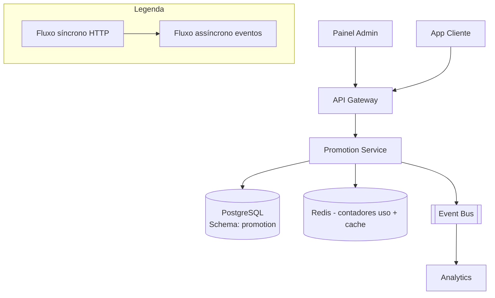

# System Design - Cupons e Campanhas (Admin)

> **Status:** Em progresso  
> **Fase:** 5  
> **Jornada:** Admin  
> **Epico:** [Admin §1.4 — Gestao de cupons](../../epic-ifood-clone.md#14-painel-administrativo-interno-da-plataforma)  
> **Dependencias:** [06-carrinho-pedido](../06-carrinho-pedido/system-design.md), [04-geolocalizacao-cobertura](../04-geolocalizacao-cobertura/system-design.md), [00-plataforma-transversal](../00-plataforma-transversal/system-design.md)

## 1. Objetivo

Prover ao admin ferramentas para criar e gerenciar campanhas de marketing, cupons de desconto (percentual, fixo, frete gratis), regras de elegibilidade (validade, uso maximo, valor minimo, escopo por restaurante/regiao) e taxas de entrega dinamicas por poligono — tudo com validacao atomica no checkout e prevencao de fraude.

## 2. Escopo Funcional

### 2.1 MVP

- [ ] CRUD de cupons: `percent`, `fixed`, `free_delivery`
- [ ] Regras: validade (data inicio/fim), uso maximo total, uso maximo por usuario, valor minimo do pedido, restaurantes elegiveis, regioes elegiveis
- [ ] Aplicacao no checkout com validacao atomica (< 50ms)
- [ ] Contador atomico de uso (Redis) para prevenir estouro
- [ ] Frete dinamico por poligono/regiao
- [ ] Relatorio de uso de campanha (redencoes, valor descontado, ROI)
- [ ] Cupons gerados por codigo unico ou batch (codigo fixo para campanha)

### 2.2 Pos-MVP

- [ ] Segmentacao por cohort de usuarios (primeira compra, frequencia)
- [ ] A/B test de campanhas
- [ ] Cashback e fidelidade (pontos que viram descontos)
- [ ] Cupons compartilhaveis com link unico

## 3. Requisitos Nao Funcionais

- Validacao de cupom no checkout: **< 50ms** p95 (Redis + validacao local)
- Prevencao de uso duplo: contador atomico no Redis (decremento seguro)
- Fraude: um codigo nao pode ser usado mais vezes que o permitido, mesmo sob concorrencia
- Disponibilidade do dominio: **99.9%**

## 4. Contexto de Negocio

Cupons e campanhas sao a principal ferramenta de crescimento da plataforma:

- **Aquisicao:** Cupons de primeira compra atraem novos clientes.
- **Retencao:** Campanhas sazonais (sexta a noite, dia dos namorados) aumentam frequencia.
- **Frete:** Frete gratis e o cupom mais usado — impacta diretamente a decisao de compra.
- **Subsidio:** Parte do desconto pode ser subsididado pela plataforma ou pelo restaurante.
- **Fraude:** Um cupom mal configurado ou sem protecao de concorrencia pode gerar prejuizo significativo.

## 5. Arquitetura de Alto Nivel



Diagrama detalhado: [`./architecture.mermaid`](./architecture.mermaid)

## 6. Componentes

### 6.1 Promotion Service

- CRUD de cupons, campanhas e regras de frete
- Validacao de cupom no checkout: regras + saldo de uso + calculo do desconto
- Mantem contadores atomicos de uso no Redis
- Gerencia frete dinamico por poligono (integrado com design 04)
- Publica eventos de resgate para analytics

### 6.2 Coupon Validator

- Motor de validacao de regras
- Verifica: validade, uso maximo, minimo do pedido, restaurante elegivel, regiao, segmento
- Cache local das regras de cupons ativos (recarregado a cada 5min)
- Valida em < 5ms para regras simples, < 50ms para regras complexas (geolocalizacao)

### 6.3 Rate Limiter de Cupons

- Contador atomico de uso por cupom (Redis INCR com TTL)
- Impede que N usuarios usem o mesmo cupom simultaneamente (estouro)

## 7. Modelo de Dados

### 7.1 `coupons`

| Coluna | Tipo | Restricoes | Descricao |
|--------|------|------------|-----------|
| id | UUID | PK | |
| code | VARCHAR(32) | NOT NULL, UNIQUE | Codigo do cupom (ex: `PIZZA10`, gerado ou custom) |
| campaign_id | UUID | NULL, FK → campaigns.id | Campanha associada (opcional) |
| type | VARCHAR(16) | NOT NULL | `percent`, `fixed`, `free_delivery` |
| value_cents | INT | NULL | Valor do desconto em centavos (para `fixed`) |
| value_percent | DECIMAL(5,2) | NULL | Percentual de desconto (para `percent`, ex: 10.00 = 10%) |
| max_discount_cents | INT | NULL | Desconto maximo em centavos (para `percent`, evita abuso) |
| min_order_cents | INT | NOT NULL, DEFAULT 0 | Valor minimo do pedido para usar o cupom |
| max_redemptions | INT | NULL | Uso maximo total (NULL = ilimitado) |
| max_per_user | INT | NULL, DEFAULT 1 | Uso maximo por usuario |
| starts_at | TIMESTAMP | NOT NULL | Data de inicio da validade |
| ends_at | TIMESTAMP | NOT NULL | Data de termino da validade |
| restaurant_scope | VARCHAR(16) | NOT NULL, DEFAULT 'all' | `all`, `specific`, `exclude` |
| restaurant_ids | UUID[] | NULL | Lista de restaurantes elegiveis ou excluidos |
| region_scope | VARCHAR(16) | NOT NULL, DEFAULT 'all' | `all`, `specific`, `exclude` |
| region_geohashes | VARCHAR(12)[] | NULL | Lista de geohashes para escopo regional |
| first_purchase_only | BOOLEAN | NOT NULL, DEFAULT false | Apenas para primeira compra do cliente |
| subsidy_type | VARCHAR(16) | NOT NULL, DEFAULT 'platform' | `platform` (plataforma paga), `restaurant` (restaurante absorve), `split` (dividido) |
| subsidy_platform_percent | DECIMAL(5,2) | NULL | Se `split`, % que a plataforma paga |
| is_active | BOOLEAN | NOT NULL, DEFAULT true | Se o cupom esta ativo (permite desativar sem deletar) |
| created_by | UUID | FK → users.id, NOT NULL | Admin que criou |
| created_at | TIMESTAMP | NOT NULL, DEFAULT NOW() | |
| updated_at | TIMESTAMP | NOT NULL, DEFAULT NOW() | |

**Indices:**
- `(code)` — UNIQUE (busca por codigo no checkout)
- `(starts_at, ends_at, is_active)` — cupons ativos em um periodo
- `(campaign_id)` — para relatorios

### 7.2 `coupon_redemptions`

| Coluna | Tipo | Restricoes | Descricao |
|--------|------|------------|-----------|
| id | UUID | PK | |
| coupon_id | UUID | FK → coupons.id, NOT NULL | |
| user_id | UUID | FK → users.id, NOT NULL | |
| order_id | UUID | FK → orders.id, NOT NULL, UNIQUE | Um resgate por pedido |
| discount_cents | INT | NOT NULL | Valor do desconto aplicado (calculado no momento) |
| original_total_cents | INT | NOT NULL | Valor original do pedido antes do desconto |
| final_total_cents | INT | NOT NULL | Valor apos desconto |
| rules_snapshot | JSONB | NOT NULL | Snapshot das regras do cupom no momento do resgate (para auditoria) |
| subsidy_platform_cents | INT | NOT NULL, DEFAULT 0 | Quanto a plataforma subsidiu |
| subsidy_restaurant_cents | INT | NOT NULL, DEFAULT 0 | Quanto o restaurante subsidiu |
| created_at | TIMESTAMP | NOT NULL, DEFAULT NOW() | |

**Indices:**
- `(order_id)` — UNIQUE
- `(coupon_id, created_at)` — historico de uso do cupom
- `(user_id, coupon_id)` — controle de uso por usuario
- `(coupon_id, user_id)` — UNIQUE (garante max_per_user mesmo sob concorrencia)

### 7.3 `campaigns`

| Coluna | Tipo | Restricoes | Descricao |
|--------|------|------------|-----------|
| id | UUID | PK | |
| name | VARCHAR(128) | NOT NULL | Nome da campanha (ex: "Sexta Pizza") |
| description | TEXT | NULL | Descricao interna |
| type | VARCHAR(24) | NOT NULL | `coupon_based`, `fee_discount`, `seasonal` |
| budget_cents | INT | NULL | Orcamento total da campanha |
| budget_spent_cents | INT | NOT NULL, DEFAULT 0 | Quanto ja foi gasto |
| starts_at | TIMESTAMP | NOT NULL | |
| ends_at | TIMESTAMP | NOT NULL | |
| status | VARCHAR(16) | NOT NULL, DEFAULT 'draft' | `draft`, `active`, `paused`, `ended`, `cancelled` |
| target_metric | VARCHAR(32) | NULL | `new_users`, `order_frequency`, `region_coverage` |
| roi_goal_percent | DECIMAL(5,2) | NULL | Meta de ROI (ex: 300% = 3x o investimento) |
| created_by | UUID | FK → users.id, NOT NULL | |
| created_at | TIMESTAMP | NOT NULL, DEFAULT NOW() | |
| updated_at | TIMESTAMP | NOT NULL, DEFAULT NOW() | |

**Indices:**
- `(status, starts_at)` — campanhas ativas
- `(type, status)` — segmentacao

### 7.4 `delivery_fee_rules`

| Coluna | Tipo | Restricoes | Descricao |
|--------|------|------------|-----------|
| id | UUID | PK | |
| zone_id | UUID | FK → delivery_zones.id, NULL | Zona de entrega associada (design 04) |
| region_geometry | JSONB | NOT NULL | Poligono da regiao (GeoJSON) |
| fee_cents | INT | NOT NULL | Taxa de entrega para esta regiao |
| min_order_cents | INT | NOT NULL, DEFAULT 0 | Pedido minimo para esta tarifa |
| free_delivery_above_cents | INT | NULL | Acima deste valor, frete gratis |
| valid_from | TIMESTAMP | NOT NULL | |
| valid_to | TIMESTAMP | NOT NULL | |
| priority | INT | NOT NULL, DEFAULT 0 | Maior prioridade vence em caso de sobreposicao |
| is_active | BOOLEAN | NOT NULL, DEFAULT true | |
| created_at | TIMESTAMP | NOT NULL, DEFAULT NOW() | |
| updated_at | TIMESTAMP | NOT NULL, DEFAULT NOW() | |

**Indices:**
- `(zone_id, valid_from, valid_to)` — regras de uma zona
- `(is_active)` — regras ativas para busca espacial

### 7.5 `campaign_daily_stats`

| Coluna | Tipo | Restricoes | Descricao |
|--------|------|------------|-----------|
| id | UUID | PK | |
| campaign_id | UUID | FK → campaigns.id, NOT NULL | |
| date | DATE | NOT NULL | |
| redemptions | INT | NOT NULL, DEFAULT 0 | Resgates no dia |
| discount_cents | INT | NOT NULL, DEFAULT 0 | Desconto total concedido |
| gross_order_cents | INT | NOT NULL, DEFAULT 0 | Valor bruto dos pedidos com o cupom |
| new_users | INT | NOT NULL, DEFAULT 0 | Novos usuarios que usaram o cupom |
| created_at | TIMESTAMP | NOT NULL, DEFAULT NOW() | |

**Indices:**
- `(campaign_id, date)` — UNIQUE

### 7.6 Dados em Redis

#### Contador de uso do cupom

- Chave: `coupon:redemptions:{coupon_id}`
- Tipo: String (INT)
- Valor: numero de resgates realizados
- TTL: N/A (persistente ate expiracao do cupom)

#### Contador de uso por usuario

- Chave: `coupon:user:{coupon_id}:{user_id}`
- Tipo: String (INT)
- Valor: numero de vezes que o usuario usou o cupom
- TTL: ate `ends_at` do cupom

#### Cache de cupons ativos

- Chave: `coupon:active:{code}`
- Tipo: Hash
- Campos: todas as regras do cupom (serializadas)
- TTL: 5min (recarregado do PG)

## 8. Fluxos Principais

### 8.1 Criacao de cupom pelo admin

1. Admin acessa painel de campanhas e clica "Criar cupom".
2. Preenche: codigo (`PIZZA10`), tipo (`percent`), valor (`10%`), validade, regras.
3. `POST /v1/admin/coupons` com todos os parametros.
4. Promotion Service:
   a. Valida dados: codigo unico, datas validas, valores consistentes.
   b. Se `type = percent` e `max_discount_cents` nao definido, define como teto padrao (ex: R$ 30,00).
   c. Se `first_purchase_only = true`, valida que `max_per_user = 1`.
   d. Cria `coupons` no PG.
   e. Se `campaign_id` definido, vincula a campanha.
   f. Prepara cache Redis: `coupon:active:{code}` com TTL de 5min.
5. Retorna cupom criado com status `active`.

### 8.2 Aplicar cupom no checkout

1. Cliente adiciona codigo do cupom no carrinho.
2. Cart Service envia `POST /v1/cart/apply-coupon` body: `{ "code": "PIZZA10" }`.
3. Promotion Service valida o cupom:
   a. Busca cupom ativo: Redis `coupon:active:{code}` (cache, < 5ms) → PG (fallback, < 20ms).
   b. Se nao encontrado ou `is_active = false`: retorna `COUPON_NOT_FOUND` (404).
   c. Verifica validade: `starts_at < NOW() < ends_at`.
   d. Verifica `min_order_cents`: valor do carrinho >= minimo.
   e. Verifica `restaurant_scope`: se `specific`, carrinho contem apenas restaurantes na lista.
   f. Verifica `first_purchase_only`: usuario ja fez pedidos anteriores? Se sim, rejeita.
   g. Verifica contador de uso: `GET coupon:redemptions:{coupon_id}` < `max_redemptions`.
   h. Verifica uso por usuario: `GET coupon:user:{coupon_id}:{user_id}` < `max_per_user`.
4. Calcula desconto:
   - `percent`: `min(order_total * value_percent / 100, max_discount_cents)`
   - `fixed`: `min(value_cents, order_total)` (nao pode ser maior que o pedido)
   - `free_delivery`: `delivery_fee_cents` (calculado pelas regras de frete)
5. Retorna desconto calculado:
   ```json
   { "code": "PIZZA10", "discountCents": 1500, "discountFormatted": "R$ 15,00", "description": "10% de desconto (limite R$ 30,00)" }
   ```
6. Se o cliente finalizar o pedido:
   a. Order Service chama `POST /v1/coupons/{couponId}/redeem` (ou inline no fluxo de checkout).
   b. Promotion Service executa **redeencao atomica**:
      - Redis: `INCR coupon:redemptions:{coupon_id}` e verifica se <= `max_redemptions`.
      - Redis: `INCR coupon:user:{coupon_id}:{user_id}` e verifica se <= `max_per_user`.
      - Se estourou: reverte INCR (DECR) e retorna erro (raro, mas protege contra concorrencia).
   c. Cria `coupon_redemptions` no PG com snapshot das regras e valores de subsidio.
   d. Atualiza `campaign_daily_stats`.
   e. Se `campaign_id` estiver preenchido, atualiza `campaigns.budget_spent_cents = budget_spent_cents + subsidy_platform_cents`.
   f. Publica `coupon.redeemed`.
   g. Order Service persiste o desconto no snapshot do pedido.
7. Se o checkout falhar ou o pedido for cancelado:
   a. Promotion Service reverte o resgate: DECR contadores, marca redemption como `cancelled`.
   b. Isso e acionado por `order.cancelled` event.

### 8.3 Validacao atomica de concorrencia

1. **Problema:** 100 usuarios tentam usar o mesmo cupom com `max_redemptions = 50` simultaneamente.
2. **Solucao com Redis:**
   a. `INCR coupon:redemptions:{coupon_id}` retorna o novo valor.
   b. Se `new_value > max_redemptions`: DECR (reverte) e retorna erro.
   c. `INCR` e atomico — nao ha condicao de corrida.
3. **Problema 2:** Usuario tenta usar o mesmo cupom em 2 abas simultaneamente.
4. **Solucao com UNIQUE constraint:**
   a. `(order_id)` e UNIQUE em `coupon_redemptions`.
   b. `(coupon_id, user_id)` pode ter UNIQUE se `max_per_user = 1`.

### 8.4 Frete dinamico por regiao

1. Admin define regras de frete em `delivery_fee_rules` com poligono GeoJSON.
2. No checkout, Coverage Service (design 04) determina a zona de entrega do cliente.
3. Cart Service consulta Promotion Service para calcular o frete:
   a. Busca `delivery_fee_rules` ativas para a `zone_id`.
   b. Se multiplas regras, usa a de maior `priority`.
   c. Se `order_total >= free_delivery_above_cents`, frete = 0.
   d. Retorna `deliveryFeeCents` para o carrinho.
4. Cupom `free_delivery` zera a taxa de entrega independentemente do valor do pedido.

### 8.5 Relatorio de campanha

1. Admin abre relatorio de uma campanha: `GET /v1/admin/campaigns/{id}/stats`.
2. Promotion Service:
   a. Busca `campaign_daily_stats` agregado por periodo.
   b. Busca total de `coupon_redemptions` para cupons da campanha.
   c. Calcula metricas:
      - `totalRedemptions`, `totalDiscountCents`, `totalGrossOrderCents`
      - `avgDiscountPerOrder`, `avgOrderValue`
      - `newUsersAcquired`, `subsidyPlatformCents`, `subsidyRestaurantCents`
      - `roi`: `(totalGrossOrderCents - totalDiscountCents) / totalDiscountCents * 100`
   d. Retorna dados para o dashboard.

## 9. Contratos de API

### 9.1 Padrao de erro

Segue o [padrao global definido na Plataforma Transversal](../00-plataforma-transversal/system-design.md#91-padrao-de-erro-global).

### 9.2 Endpoints do dominio de promocoes

#### `POST /v1/admin/coupons`

Cria um novo cupom (admin).

**Request body:**
```json
{
  "code": "PIZZA10",
  "type": "percent",
  "valuePercent": 10.00,
  "maxDiscountCents": 3000,
  "minOrderCents": 5000,
  "maxRedemptions": 1000,
  "maxPerUser": 1,
  "startsAt": "2026-07-04T00:00:00.000Z",
  "endsAt": "2026-08-04T00:00:00.000Z",
  "restaurantScope": "all",
  "firstPurchaseOnly": false,
  "subsidyType": "platform"
}
```

**Response (201):**
```json
{
  "couponId": "uuid",
  "code": "PIZZA10",
  "type": "percent",
  "status": "active",
  "createdAt": "2026-07-04T15:00:00.000Z"
}
```

#### `GET /v1/admin/coupons?page=&status=`

Lista cupons com filtros (admin).

**Query params:**
- `status` (STRING, opcional) — `active`, `expired`, `draft`
- `page` (INT, opcional, default 1)

**Response (200):**
```json
{
  "coupons": [
    {
      "couponId": "uuid",
      "code": "PIZZA10",
      "type": "percent",
      "valuePercent": 10.00,
      "redemptions": 45,
      "maxRedemptions": 1000,
      "status": "active",
      "startsAt": "2026-07-04T00:00:00.000Z",
      "endsAt": "2026-08-04T00:00:00.000Z"
    }
  ],
  "total": 15,
  "page": 1
}
```

#### `POST /v1/admin/campaigns`

Cria uma nova campanha (admin).

**Request body:**
```json
{
  "name": "Sexta Pizza",
  "description": "Campanha de pizza todo sabado",
  "type": "coupon_based",
  "budgetCents": 5000000,
  "startsAt": "2026-07-01T00:00:00.000Z",
  "endsAt": "2026-12-31T23:59:59.000Z",
  "targetMetric": "order_frequency",
  "roiGoalPercent": 300.00
}
```

**Response (201):**
```json
{
  "campaignId": "uuid",
  "name": "Sexta Pizza",
  "status": "draft",
  "createdAt": "2026-07-04T15:00:00.000Z"
}
```

#### `POST /v1/cart/apply-coupon`

Aplica um cupom ao carrinho atual (cliente autenticado). Validacao + calculo do desconto.

**Request body:**
```json
{
  "code": "PIZZA10"
}
```

**Response (200):**
```json
{
  "code": "PIZZA10",
  "valid": true,
  "discountCents": 1500,
  "discountFormatted": "R$ 15,00",
  "description": "10% de desconto (limite R$ 30,00)",
  "couponId": "uuid"
}
```

**Response (422) — cupom invalido:**
```json
{
  "error": {
    "code": "VALIDATION_ERROR",
    "message": "Cupom invalido para este pedido.",
    "details": [{ "reason": "min_order_not_reached", "minOrderCents": 5000, "currentCents": 3200 }],
    "correlationId": "...",
    "timestamp": "..."
  }
}
```

#### `POST /v1/coupons/{couponId}/redeem`

Resgata um cupom (chamado pelo Order Service no fechamento do pedido). Operacao atomica.

> O subsidio (`subsidyPlatformCents`, `subsidyRestaurantCents`) e **calculado pelo Promotion Service** com base no `subsidy_type` e `subsidy_platform_percent` do cupom, nao recebido do chamador.

**Request body:**
```json
{
  "orderId": "uuid",
  "userId": "uuid",
  "originalTotalCents": 15000,
  "discountCents": 1500
}
```

**Response (201):**
```json
{
  "redemptionId": "uuid",
  "couponId": "uuid",
  "discountCents": 1500,
  "remainingRedemptions": 954
}
```

**Response (409) — cupom esgotado:**
```json
{
  "error": {
    "code": "CONFLICT",
    "message": "Cupom esgotou o numero de usos.",
    "details": [{ "reason": "max_redemptions_reached" }],
    "correlationId": "...",
    "timestamp": "..."
  }
}
```

#### `GET /v1/admin/campaigns/{campaignId}/stats`

Relatorio de performance de uma campanha.

**Response (200):**
```json
{
  "campaignId": "uuid",
  "name": "Sexta Pizza",
  "status": "active",
  "period": { "from": "2026-07-01", "to": "2026-07-04" },
  "budgetCents": 5000000,
  "budgetSpentCents": 325000,
  "budgetUsagePercent": 6.5,
  "metrics": {
    "totalRedemptions": 325,
    "totalDiscountCents": 325000,
    "totalGrossOrderCents": 1625000,
    "avgDiscountPerOrderCents": 1000,
    "avgOrderValueCents": 5000,
    "newUsersAcquired": 45,
    "subsidyPlatformCents": 325000,
    "subsidyRestaurantCents": 0,
    "roiPercent": 400
  },
  "dailyBreakdown": [
    { "date": "2026-07-04", "redemptions": 85, "discountCents": 85000, "grossCents": 425000, "newUsers": 12 },
    { "date": "2026-07-03", "redemptions": 120, "discountCents": 120000, "grossCents": 600000, "newUsers": 18 }
  ]
}
```

#### `GET /v1/delivery/fee`

Calcula a taxa de entrega para uma localizacao (chamado pelo Cart Service).

**Query params:**
- `lat` (DECIMAL, obrigatorio)
- `lon` (DECIMAL, obrigatorio)
- `restaurantId` (UUID, obrigatorio)

**Response (200):**
```json
{
  "zoneId": "uuid",
  "feeCents": 700,
  "feeFormatted": "R$ 7,00",
  "freeDeliveryAboveCents": 50000,
  "estimatedMinutes": 35
}
```

#### `POST /v1/admin/delivery/fee-rules`

Cria regra de frete para uma regiao (admin).

**Request body:**
```json
{
  "zoneId": "uuid",
  "feeCents": 700,
  "minOrderCents": 0,
  "freeDeliveryAboveCents": 50000,
  "validFrom": "2026-07-01T00:00:00.000Z",
  "validTo": "2026-12-31T23:59:59.000Z",
  "priority": 1
}
```

**Response (201):** `{ "feeRuleId": "uuid", "feeCents": 700, "createdAt": "..." }`

### 9.3 Health check

Segue o [padrao definido no documento 00](../00-plataforma-transversal/system-design.md#92-health-check).

## 10. Contratos de Eventos

> **Nota:** O envelope padrao dos eventos e definido pela **Plataforma Transversal** (documento 00). Consulte a [secao 10 do System Design 00](../00-plataforma-transversal/system-design.md#10-contratos-de-eventos) para o schema completo do envelope, politica de versionamento e topic naming.

### 10.1 Eventos publicados pelo Promotion Service

#### `coupon.redeemed`

Publicado quando um cupom e resgatado com sucesso.

**Payload:**
```json
{
  "redemptionId": "a1b2c3d4-...",
  "couponId": "b2c3d4e5-...",
  "campaignId": "c3d4e5f6-...",
  "orderId": "d4e5f6a7-...",
  "userId": "e5f6a7b8-...",
  "discountCents": 1500,
  "subsidyPlatformCents": 1500,
  "redeemedAt": "2026-07-04T15:00:00.000Z"
}
```

**Consumidores:** Analytics, Finance (subsidio).

### 10.2 Eventos consumidos de outros dominios

| Evento | Produtor (dominio) | Acao no Promotion Service |
|--------|---------------------|----------------------------|
| `order.cancelled` | Estados (08) | Reverter resgate de cupom (DECR contadores, marcar redemption como cancelled) |

### 10.3 Tabela de eventos publicados do dominio

| Evento | Produtor | Consumidores | Schema Version |
|--------|----------|--------------|----------------|
| `coupon.redeemed` | Promotion Service | Analytics, Finance | 1.0 |

## 11. Seguranca

### 11.1 RBAC especifico

| Role | Acoes permitidas |
|------|------------------|
| `admin` | CRUD de cupons, campanhas e regras de frete, relatorios |
| `customer` | Aplicar cupom no carrinho, resgatar cupom no checkout |

- `POST /v1/admin/*`: restrito a role `admin`.
- `POST /v1/cart/apply-coupon`: valida JWT do cliente.
- `POST /v1/coupons/{couponId}/redeem`: chamada interna (autenticacao entre servicos), nao exposta publicamente.

### 11.2 Prevencao de fraude

- Contador atomico no Redis (`INCR`) para uso do cupom — previne estouro.
- UNIQUE `(order_id)` em `coupon_redemptions` — um pedido nao pode resgatar dois cupons.
- UNIQUE `(coupon_id, user_id)` se `max_per_user = 1` — previste uso duplicado pelo mesmo usuario.
- Snapshot das regras no momento do resgate (`rules_snapshot`) — previne que alteracoes posteriores invalidem resgates passados.
- Cupom com `first_purchase_only = true` verifica historico de pedidos do usuario.

### 11.3 Protecoes no Gateway

- Rate limit em `POST /v1/cart/apply-coupon`: **30 requests/min** por cliente.
- Rate limit em `POST /v1/admin/coupons`: **10 requests/min** por admin.
- Rate limit em `POST /v1/coupons/{couponId}/redeem`: **60 requests/min** (protegido por token interno).

## 12. Escalabilidade

### 12.1 Cache

| Recurso | Estrategia | TTL |
|---------|------------|-----|
| Cupons ativos por codigo | Redis Hash `coupon:active:{code}` | 5min |
| Contador de uso do cupom | Redis String `coupon:redemptions:{coupon_id}` | Ate expiracao |
| Contador de uso por usuario | Redis String `coupon:user:{coupon_id}:{user_id}` | Ate expiracao |
| Regras de frete ativas | Cache local no Promotion Service | 5min |

### 12.2 Database

- `coupons`: volume baixo (~100/dia). Indices para busca por codigo.
- `coupon_redemptions`: volume moderado (~50k/dia). Particionamento por mes.
- `campaigns`: volume muito baixo.
- `delivery_fee_rules`: volume baixo.
- `campaign_daily_stats`: uma linha por campanha/dia.

### 12.3 Jobs agendados

| Job | Cron | Descricao |
|-----|------|-----------|
| `reconcile_coupon_counts` | `0 * * * *` (a cada 1h) | Reconciliar contadores Redis com PG. Corrige inconsistencias quando PG falha apos INCR. |
| `expire_coupons` | `0 0 * * *` (diario 00:00) | Marcar cupons com `ends_at < NOW()` como inativos. |

### 12.4 Estimativa de capacidade

| Recurso | Estimativa | Folga |
|---------|------------|-------|
| Cupons ativos simultaneos | 200 | 2x (400) |
| Resgates por dia | 50k | 2x (100k) |
| Validacoes de cupom por segundo (pico) | 100/s | 2x (200/s) |
| Chaves Redis ativas | 50k (code + redemptions + user) | 2x (100k) |

## 13. Observabilidade

### 13.1 Logs estruturados

Segue o [padrao do documento 00](../00-plataforma-transversal/system-design.md#131-logs-estruturados). Campos adicionais:

- `couponCode` — codigo do cupom
- `couponId` — ID do cupom
- `campaignId` — ID da campanha
- `validationResult` — `valid`, `expired`, `max_redemptions`, `min_order`, `first_purchase`
- `discountCents` — valor do desconto

### 13.2 Metricas especificas do dominio

| Metrica | Tipo | Descricao |
|---------|------|-----------|
| `promo_coupon_validations_total` | Counter | Validacoe s de cupom (tag: `result`) |
| `promo_coupon_redemptions_total` | Counter | Resgates de cupom (tag: `type`) |
| `promo_coupon_redemption_amount_cents` | Histogram | Valor dos descontos concedidos |
| `promo_campaign_budget_usage` | Gauge | % do orcamento gasto por campanha |
| `promo_coupon_validation_duration_ms` | Histogram | Tempo de validacao (p50/p95) |
| `promo_coupon_concurrent_contention` | Counter | Vezes que houve contencao no INCR (estouro) |
| `promo_delivery_fee_calculated` | Histogram | Taxas de entrega calculadas |

### 13.3 Dashboard (Grafana)

- **Resgates por hora** — taxa de uso de cupons ao longo do tempo
- **Validacoe s** — distribuicao por resultado (valido, expirado, esgotado)
- **Top cupons** — tabela dos cupons mais usados
- **Orcamento de campanhas** — gauge de budget gasto vs total
- **Desconto medio** — valor medio do desconto por tipo
- **Taxas de entrega** — distribuicao de fees por regiao

### 13.4 Alertas especificos

| Alerta | Condicao | Severidade | Acao |
|--------|----------|------------|------|
| Cupom proximo do limite | `redemptions / max_redemptions > 0.9` | P3 | Notificar admin para avaliar renovacao |
| Orcamento de campanha quase esgotado | `budget_spent / budget > 0.9` | P3 | Notificar admin |
| Alta taxa de validacao rejeitada | > 30% de rejeicoes em 5min | P2 | Possivel bug ou ataque, investigar |
| Contencao de concorrencia elevada | > 10 estouros de INCR por minuto | P3 | Cupom muito popular, avaliar aumento de limite |

## 14. Resiliencia

### 14.1 Timeouts

| Tipo de chamada | Timeout | Justificativa |
|-----------------|---------|---------------|
| Validacao de cupom (Redis) | 100ms | Cache hit < 5ms |
| INCR contador (Redis) | 100ms | Operacao atomica |
| Escrita de redemption (PG) | 1s | Insert simples |
| Calculo de frete | 200ms | Consulta regras + geometria |

### 14.2 Retries com jitter

| Cenario | Tentativas | Intervalo | Jitter |
|---------|------------|-----------|--------|
| INCR contador (se Redis falhar) | 3 | 50ms, 100ms, 200ms | +/- 10ms |
| Publicacao de evento | 3 | 200ms, 400ms, 800ms | +/- 50ms |

### 14.3 Graceful degradation

| Cenario | Acao |
|---------|------|
| Redis indisponivel | Contadores de uso lidos do PG (mais lento, mas funcional). `INCR` nao disponivel — risco de estouro em alta concorrencia (aceitavel para raridade). Cache de cupons usa PG diretamente. |
| PostgreSQL indisponivel | Cupons ativos continuam via Redis cache. Escrita de redemptions falha. Resgates sao rejeitados até o PG ser restabelecido. |
| Event Bus indisponivel | Resgate funciona normalmente. Evento `coupon.redeemed` enfileirado para publicacao posterior. Analytics e Finance atualizados via job. |

### 14.4 Consistencia de resgate

1. `INCR` no Redis e feito primeiro (contador atomico).
2. Se `INCR` ultrapassar limite, DECR e retorna erro.
3. Se `INCR` valido, persiste `coupon_redemptions` no PG.
4. Apenas apos PG confirmar, evento e publicado.
5. Se o PG falhar apos o Redis INCR (raro):
   - O contador no Redis fica inflado (1 a mais que o real).
   - Job `reconcile_coupon_counts` (cron 1h) corrige: compara `coupon_redemptions` count com Redis e ajusta.
   - Isso significa que o cupom pode perder 1 uso, mas nunca ganhar usos extras — seguro para o negocios.

### 14.5 Idempotencia

- `POST /v1/coupons/{couponId}/redeem`: protegido por UNIQUE `(order_id)` em `coupon_redemptions`. Segunda chamada com mesmo `orderId` retorna 200 com registro existente.
- `INCR` no Redis e idempotente apenas no sentido de que o estouro e detectado e revertido.

## 15. Decisoes Arquiteturais (ADRs)

### ADR-001: Contador de Uso no Redis vs PG

| Campo | Valor |
|-------|-------|
| **Decisao** | Contador de uso do cupom mantido no Redis (`INCR` atomico) com fallback para PG |
| **Contexto** | Validacao de cupom precisa ser < 50ms. `INCR` no Redis e atomico e < 5ms. UPDATE no PG levaria ~20ms e teria risco de lock de linha em alta concorrencia. |
| **Alternativas** | PG com `SELECT ... FOR UPDATE` (lento, lock), PG com UPDATE `SET count = count + 1 WHERE count < max` (mais rapido mas nao atomico em alta concorrencia) |
| **Consequencias** | Positivas: < 5ms, atomico, sem lock. Negativas: risco de inconsitencia se PG falhar apos INCR (corrigido por job de reconciliacao). |
| **Status** | Aprovado |

### ADR-002: Snapshot de Regras no Resgate

| Campo | Valor |
|-------|-------|
| **Decisao** | No momento do resgate, um snapshot das regras do cupom e armazenado em `coupon_redemptions.rules_snapshot` |
| **Contexto** | Regras do cupom podem mudar apos a criacao (admin pode estender validade, aumentar limite). O valor do desconto e a elegibilidade devem ser calculados com base nas regras vigentes no momento do resgate, nao nas regras atuais. |
| **Alternativas** | Sem snapshot (resgate fica vinculado a regras atuais — pode mudar retroativamente), Apenas valor do desconto (perde detalhes das regras) |
| **Consequencias** | Positivas: auditoria precisa, disputas resolvidas com base nas regras originais. Negativa: armazenamento extra (JSONB, insignificante). |
| **Status** | Aprovado |

### ADR-003: Validacao no Cart vs Validacao no Order

| Campo | Valor |
|-------|-------|
| **Decisao** | Validacao dupla: `POST /v1/cart/apply-coupon` (validacao + calculo) e `POST /v1/coupons/{id}/redeem` no fechamento (resgate atomico) |
| **Contexto** | Cliente pode aplicar o cupom no carrinho e so finalizar minutos depois. Nesse intervalo, o cupom pode esgotar. A validacao no carrinho e informativa (mostra o desconto), o resgate no fechamento e a operacao definitiva. |
| **Alternativas** | Apenas validacao no carrinho (risco de prometer desconto que nao existe mais), Apenas resgate no fechamento (cliente nao sabe o desconto antes de finalizar) |
| **Consequencias** | Positivas: experiencia do cliente (ve o desconto antes), seguranca (resgate atomico no fechamento). Negativa: dupla chamada, mas aceitavel. |
| **Status** | Aprovado |

### ADR-004: Subsidio Plataforma vs Restaurante

| Campo | Valor |
|-------|-------|
| **Decisao** | Cupom pode ser subsidiado pela plataforma, pelo restaurante ou dividido (percentual configurado na criacao) |
| **Contexto** | Campanhas podem ser custeadas totalmente pela plataforma (marketing) ou compartilhadas com restaurantes. O valor do subsidio impacta o ledger financeiro e o relatorio do restaurante. |
| **Alternativas** | Apenas plataforma paga (custo alto para plataforma), Apenas restaurante paga (restaurante pode nao aderir) |
| **Consequencias** | Positivas: flexibilidade de negocios, modelos de campanha variados. Negativa: complexidade contabil (precisa calcular e registrar subsidio separadamente). |
| **Status** | Aprovado |

## 16. Riscos e Mitigacoes

| Risco | Probabilidade | Impacto | Mitigacao |
|-------|---------------|---------|-----------|
| **Estouro de cupom em promocao viral (mais usos que o limite)** | Media | Alto | Contador atomico Redis INCR + verificacao. UNIQUE (order_id) no PG. Job de reconciliacao. |
| **Usuario aplica cupom em 2 pedidos simultaneos** | Baixa | Medio | UNIQUE `(coupon_id, user_id)` se max_per_user = 1. Contador Redis por usuario. |
| **Cupom com configuracao errada (ex: 100% desconto sem teto)** | Baixa | Critico | Validacao de criacao: `percent` requer `max_discount_cents`. Aprovacao de admin para cupons > R$ 100. |
| **Fraude de first_purchase_only (usuario existente tenta usar)** | Media | Medio | Verificacao no User Service (historico de pedidos) no momento do resgate. |
| **Regra de frete desatualizada (cliente ve frete errado no checkout)** | Baixa | Medio | Cache de regras com TTL de 5min. Job de recarga. Frete recalculado no fechamento. |

### 16.1 Matriz de probabilidade x impacto

```
Impacto:  Baixo      Medio       Alto        Critico
Probabilidade
Alta      |            |            |            |
          |            |            |            |
Media     | Fraude     | 2 pedidos  | Estouro    |
          | first_purch| simultaneos| cupom      |
Baixa     | Frete      |            |            | Config.
          | desatual.  |            |            | errada
```

---

> **Documentos relacionados:** [Template de system design](../../templates/system-design-template.md) | [Roadmap](../../roadmap/ordem-das-jornadas.md) | [Epico iFood Clone](../../epic-ifood-clone.md) | [Plataforma Transversal](../00-plataforma-transversal/system-design.md)
