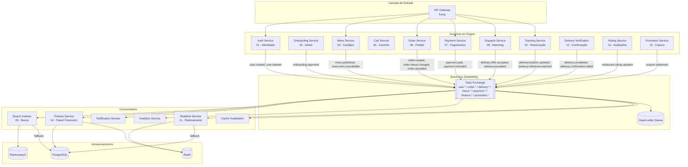
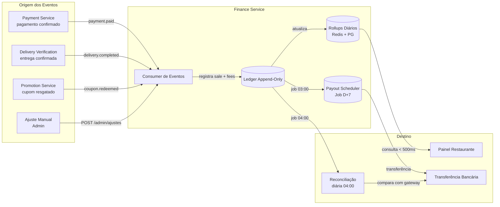
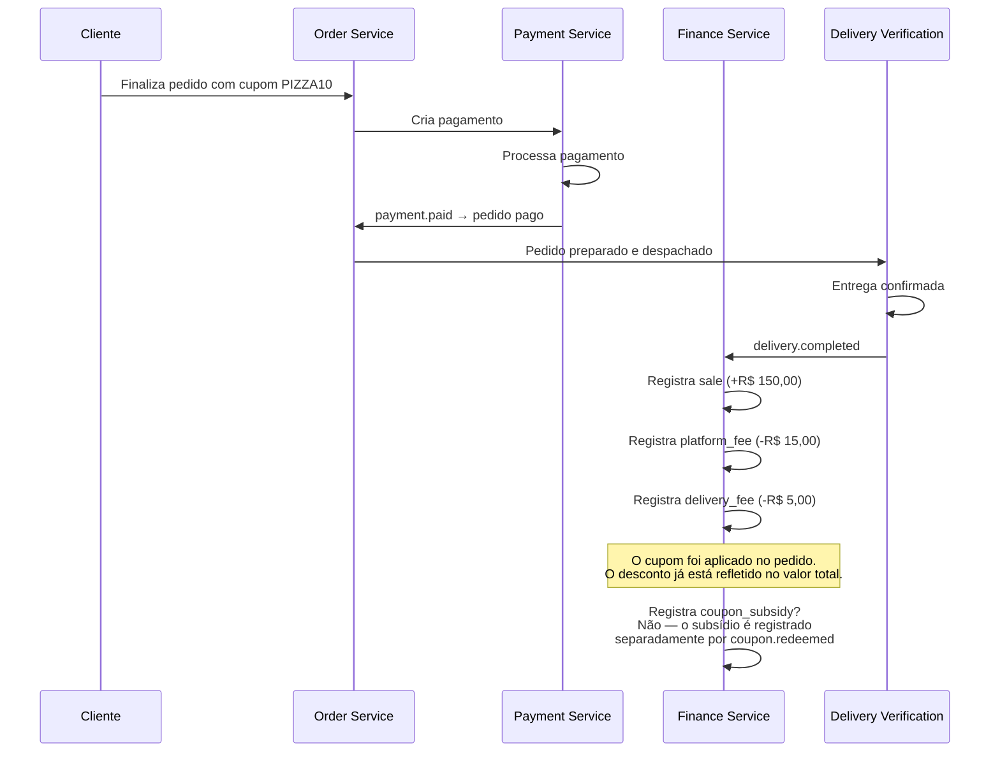
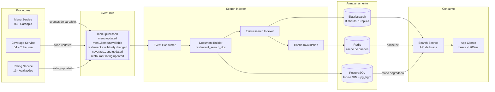
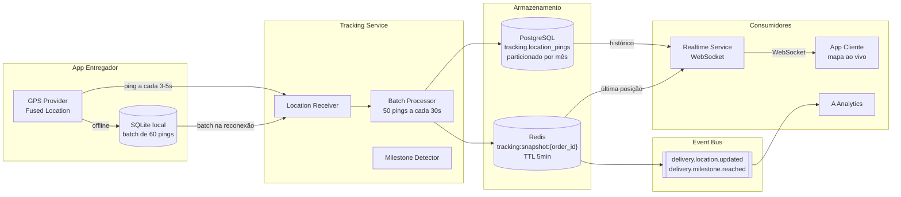
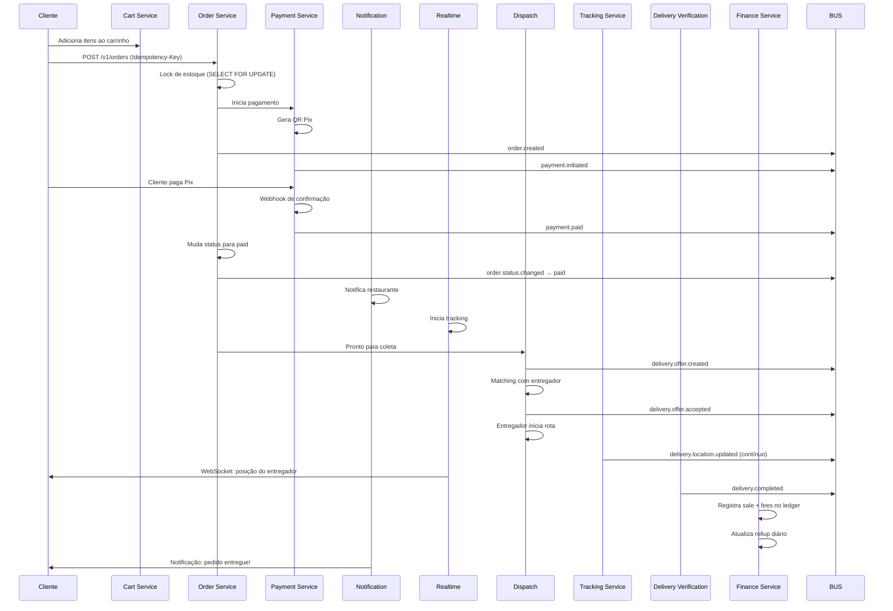

# Arquitetura de Dados — FastFoodDelivery

> **Status:** Completo
> **Propósito:** Documentar como os dados fluem entre os serviços da plataforma: eventos, pipelines, ledger financeiro, indexação de busca e consistência.
> **Documentos relacionados:** [`data-model/domain-dependencies.md`](./data-model/domain-dependencies.md) | [`data-model/schema.dbml`](./data-model/schema.dbml) | [`architecture/00-plataforma-transversal/system-design.md`](./architecture/00-plataforma-transversal/system-design.md)
> **Última atualização:** Julho 2026

---

## Sumário

1. [Visão Geral dos Fluxos de Dados](#1-visão-geral-dos-fluxos-de-dados)
2. [Event Bus — Camada de Transporte](#2-event-bus--camada-de-transporte)
3. [Pipeline Financeiro](#3-pipeline-financeiro)
4. [Pipeline de Indexação de Busca](#4-pipeline-de-indexação-de-busca)
5. [Pipeline de Rastreamento em Tempo Real](#5-pipeline-de-rastreamento-em-tempo-real)
6. [Fluxo do Pedido (Orquestração)](#6-fluxo-do-pedido-orquestração)
7. [Padrões de Consistência de Dados](#7-padrões-de-consistência-de-dados)
8. [Cache e Invalidação](#8-cache-e-invalidação)
9. [Pipelines de Recomeciliação e Auditoria](#9-pipelines-de-reconciliação-e-auditoria)

---

## 1. Visão Geral dos Fluxos de Dados

A plataforma FastFoodDelivery utiliza **Arquitetura Orientada a Eventos (EDA)** como espinha dorsal da comunicação entre serviços. Cada serviço de domínio publica eventos assincronamente no **Event Bus (RabbitMQ)** e consome eventos de outros domínios para reagir a mudanças de estado.

### 1.1 Diagrama de Fluxo de Dados de Alto Nível



### 1.2 Matriz de Fluxo de Dados por Serviço

| Serviço | Publica | Consome | Armazenamento Primário |
|---------|---------|---------|----------------------|
| Auth Service | `user.*` | `onboarding.approved` | PostgreSQL (auth) |
| Onboarding Service | `onboarding.*` | — | PostgreSQL (onboarding) |
| Menu Service | `menu.*` | — | PostgreSQL (menu) + Redis (cache) |
| Cart Service | `cart.abandoned` | `menu.item.unavailable` | Redis (carrinho) |
| Order Service | `order.*` | `payment.paid`, `delivery.completed` | PostgreSQL (order) |
| Payment Service | `payment.*` | `order.created` | PostgreSQL (payment) |
| Dispatch Service | `delivery.offer.*` | `order.pickup.ready` | Redis (sessões) + PostgreSQL |
| Tracking Service | `delivery.location.*` | `delivery.offer.accepted` | PostgreSQL (tracking) + SQLite (offline) |
| Delivery Verification | `delivery.completed`, `delivery.code.*` | `delivery.milestone.reached` | PostgreSQL (verification) |
| Rating Service | `restaurant.rating.*` | `delivery.completed` | PostgreSQL (rating) + Redis (agregado) |
| Finance Service | `ledger.*`, `payout.*` | `delivery.completed`, `payment.refunded`, `coupon.redeemed` | PostgreSQL (finance) + Redis (rollup) |
| Promotion Service | `coupon.redeemed` | `order.cancelled` | PostgreSQL (promotion) + Redis (contadores) |
| Search Indexer | — | `menu.*`, `restaurant.rating.*`, `coverage.zone.*` | Elasticsearch + PostgreSQL (fallback) |
| Realtime Service | — | `delivery.location.*`, `order.status.changed` | Redis (snapshots) + PostgreSQL (fallback) |

---

## 2. Event Bus — Camada de Transporte

### 2.1 Envelope Padrão

> **Fonte oficial:** [docs/architecture/00-plataforma-transversal/system-design.md#10-contratos-de-eventos](./architecture/00-plataforma-transversal/system-design.md#10-contratos-de-eventos)

Todo evento publicado no Event Bus segue este schema:

```json
{
  "eventId": "b1d6f3a5-3b92-4b84-bf3c-5d87f6a2f0d8",
  "eventType": "user.created",
  "schemaVersion": "1.0",
  "source": "auth-service",
  "occurredAt": "2026-07-04T14:30:00.000Z",
  "correlationId": "a8f4d9d1-6ce0-4c2b-9f2a-1d5d0e6f7f11",
  "idempotencyKey": "req_abc123",
  "payload": {}
}
```

### 2.2 Tópicos e Particionamento

| Exchange | Routing Keys | Consumidores | Throughput Estimado |
|----------|-------------|--------------|---------------------|
| `user.*` | `user.created`, `user.deleted`, etc. | Notification, Analytics, Search | ~100 msg/s |
| `onboarding.*` | `onboarding.approved`, `onboarding.rejected` | Auth, Menu, Notification | ~10 msg/s |
| `menu.*` | `menu.published`, `menu.item.unavailable` | Search, Cache, Cart | ~50 msg/s |
| `order.*` | `order.created`, `order.status.changed`, `order.cancelled` | Payment, Notification, Realtime, Dispatch, Promotion | ~500 msg/s |
| `coverage.*` | `coverage.checked`, `coverage.zone.updated` | Cache, Search | ~10 msg/s |
| `payment.*` | `payment.paid`, `payment.failed`, `payment.refunded` | Order, Notification, Finance | ~500 msg/s |
| `delivery.*` | `delivery.offer.*`, `delivery.location.updated`, `delivery.completed` | Realtime, Notification, Finance, Rating | ~1000 msg/s |
| `rating.*` | `restaurant.rating.updated`, `courier.rating.updated` | Search, Dispatch | ~50 msg/s |
| `finance.*` | `ledger.entry.created`, `payout.processed` | Auditoria, Analytics | ~100 msg/s |
| `promotion.*` | `coupon.redeemed` | Analytics, Finance | ~50 msg/s |

### 2.3 Garantia de Entrega

- **At-least-once delivery:** Produtor aguarda *publisher confirm* do RabbitMQ antes de considerar a mensagem como enviada.
- **Consumidores idempotentes:** Processamento baseado em `eventId` — mesmo evento recebido duas vezes não gera efeito duplicado.
- **Retry com backoff exponencial:** 5 tentativas: 1s, 2s, 4s, 8s, 16s (jitter de ±25%).
- **DLQ:** Mensagens que esgotam retries vão para a Dead-Letter Queue. Job de reprocessamento a cada 30min. Após 3 reprocessamentos sem sucesso, alerta operacional.

---

## 3. Pipeline Financeiro

O pipeline financeiro é o fluxo de dados mais crítico da plataforma em termos de **precisão e auditabilidade**. Cada centavo movimentado precisa ser rastreável do pedido ao repasse.

### 3.1 Fluxo Completo do Ledger



### 3.2 Lançamentos Contábeis por Evento

Cada evento de domínio gera um ou mais lançamentos no ledger (`ledger_entries`):

| Evento | Lançamentos Gerados | Descrição |
|--------|-------------------|-----------|
| `delivery.completed` | `+sale` (pedido), `-platform_fee`, `-delivery_fee` | Receita do pedido menos taxas |
| `payment.refunded` | `-refund` | Estorno do valor reembolsado |
| `coupon.redeemed` | `-coupon_subsidy` (se plataforma paga) | Subsídio do cupom como despesa de marketing |
| `order.cancelled` | `-sale` (se já havia sido lançado) | Reversão de lançamento |
| Ajuste manual | `+adjustment` ou `-adjustment` | Correções feitas por admin |

### 3.3 Cálculo de Repasse (D+7)

```
Valor Líquido = Gross (sale) - Platform Fee - Delivery Fee - Coupon Subsidy
```

O job `process_payouts` (diário às 03:00):
1. Busca pedidos entregues há exatos 7 dias (`delivery.completed_at < NOW() - 7d`)
2. Agrupa por restaurante e soma: `gross_cents`, `fees_cents`, `net_cents`
3. Se `net_cents > 0`: cria `payouts` e inicia transferência bancária
4. Publica `payout.processed`

### 3.4 Fluxo de Dados do Cupom no Ledger



> **Nota:** O subsídio de cupom (`coupon_subsidy`) é registrado como despesa de marketing separada no ledger, não como ajuste no valor do pedido. Isso permite que o restaurante veja o valor bruto correto e a plataforma rastreie o custo da campanha.

---

## 4. Pipeline de Indexação de Busca

### 4.1 Fluxo de Indexação



### 4.2 Documento de Busca (restaurant_search_doc)

O Search Indexer constrói um documento **denormalizado** por restaurante contendo:

```json
{
  "restaurant_id": "uuid",
  "name": "Pizza Prime",
  "description": "A melhor pizza da região",
  "cuisine_type": "pizzaria",
  "avg_rating": 4.5,
  "review_count": 328,
  "delivery_fee_cents": 0,
  "is_open": true,
  "is_accepting_orders": true,
  "location": { "lat": -23.5505, "lon": -46.6333 },
  "last_menu_version": 6,
  "categories": [
    {
      "id": "uuid",
      "name": "Pizzas",
      "items": [
        { "id": "uuid", "name": "Pizza Margherita", "price_cents": 2990, "is_available": true },
        { "id": "uuid", "name": "Pizza Calabresa", "price_cents": 3290, "is_available": true }
      ]
    }
  ]
}
```

### 4.3 Pipeline de Indexação Incremental

| Evento | Ação no Indexer | SLA |
|--------|----------------|-----|
| `menu.published` | Reindexar restaurante completo | < 30s |
| `menu.updated` | Atualizar campos alterados | < 30s |
| `menu.item.unavailable` | Atualizar `is_available` do item | < 5s |
| `restaurant.availability.changed` | Atualizar `is_open` | < 5s |
| `coverage.zone.updated` | Reindexar restaurantes afetados | < 60s |
| `restaurant.rating.updated` | Atualizar `avg_rating` e `review_count` | < 30s |

### 4.4 Degradação Graceful

Se o Elasticsearch estiver indisponível:
1. **Circuit breaker** abre após 5 falhas em 30s
2. Search Service ativa **modo degradado**: consulta PostgreSQL com índice GIN full-text
3. Sem `geo_distance` — filtro geográfico feito em aplicação
4. Cache Redis continua operacional
5. Quando ES recuperar, Indexer repopula índices e volta ao normal

---

## 5. Pipeline de Rastreamento em Tempo Real

### 5.1 Fluxo de Localização



### 5.2 Priorização de Dados Offline

Quando o entregador perde sinal:
1. App grava pings localmente em **SQLite**
2. Prioriza **milestones** (eventos de estado) sobre pings de localização
3. Na reconexão, envia batch de até 60 pings
4. Tracking Service processa batch, registra no PG e atualiza Redis
5. Cliente recebe atualização via WebSocket com snapshot completo

---

## 6. Fluxo do Pedido (Orquestração)

### 6.1 Sequência Completa de Eventos



### 6.2 Estados do Pedido e Eventos Associados

```
draft → pending_payment → paid → preparing → ready_for_pickup → dispatched → delivered
  │                         │                                          │
  └── cancelled ←───────────┘                                          |
                              └── cancelled (se restaurante não aceitar)
```

| Transição | Evento Publicado | Consumidores | Ação no Consumidor |
|-----------|-----------------|-------------|-------------------|
| `draft → pending_payment` | `order.created` | Payment Service | Iniciar fluxo de pagamento |
| `pending_payment → paid` | `payment.paid` | Order Service | Mudar status para `paid` |
| `pending_payment → paid` | `order.status.changed` | Notification | Notificar restaurante |
| `paid → preparing` | `order.status.changed` | Realtime | Iniciar tracking |
| `preparing → ready_for_pickup` | `order.pickup.ready` | Dispatch | Iniciar matching |
| `ready_for_pickup → dispatched` | `delivery.offer.accepted` | Tracking | Iniciar roteirização |
| `dispatched → delivered` | `delivery.completed` | Finance | Registrar ledger |
| `dispatched → delivered` | `delivery.completed` | Rating | Liberar avaliação |
| `* → cancelled` | `order.cancelled` | Promotion | Reverter resgate de cupom |
| `* → cancelled` | `order.cancelled` | Payment | Estornar se pago |

---

## 7. Padrões de Consistência de Dados

### 7.1 Idempotência

| Padrão | Onde é Usado | Mecanismo |
|--------|-------------|-----------|
| **HTTP Idempotency-Key** | `POST /orders`, `POST /register`, `POST /payments` | Header `Idempotency-Key` → cache Redis 24h. Se mesma chave + mesmo body → retorna resposta original |
| **eventId no Event Bus** | Todos os consumidores de eventos | Processamento baseado em `eventId`. Se mesmo `eventId` já processado → ignora |
| **UNIQUE constraint** | `payment_webhooks.idempotency_key`, `coupon_redemptions.order_id` | Garantia de banco contra duplicatas |

### 7.2 Compensação (Saga Pattern)

| Operação | Ação Compensatória | Gatilho |
|----------|-------------------|---------|
| Reserva de estoque | Liberar reserva (status → `released`) | `order.cancelled` ou TTL de 30min |
| Resgate de cupom | DECR contadores Redis + marcar redemption como `cancelled` | `order.cancelled` |
| Pagamento | Estorno via gateway | `order.cancelled` + admin |

### 7.3 Consistência Eventual vs Imediata

| Tipo de Dado | Consistência | Mecanismo | Tolerância |
|-------------|-------------|-----------|------------|
| Estoque de itens | **Imediata** | `SELECT FOR UPDATE` + transação PG | Zero — dois clientes não podem comprar o último item |
| Preço no checkout | **Imediata** | Validação contra Menu Service no momento do fechamento | Zero — snapshot correto |
| Carrinho do usuário | **Imediata** | Redis, operações atômicas | Zero — usuário vê o estado atual |
| Busca de restaurantes | **Eventual** | Evento assíncrono + indexação | < 30s para cardápio, < 5s para pausa |
| Ledger financeiro | **Eventual** | Evento `delivery.completed` + processamento | < 1 min após entrega |
| Saldo do restaurante | **Eventual** | Rollup atualizado a cada lançamento | < 5 min |
| Repasse (payout) | **Batch diário** | Job cron 03:00 | D+7 (ciclo configurável) |

---

## 8. Cache e Invalidação

### 8.1 Padrão de Cache: Cache-Aside com Invalidação por Evento

A plataforma utiliza o padrão **cache-aside** para todos os caches Redis:

```
1. Leitura: verificar Redis → se hit, retorna (< 5ms)
2. Se miss: consultar PostgreSQL → popular Redis com TTL → retorna
3. Escrita: persistir no PostgreSQL → publicar evento → consumidor invalida cache
```

### 8.2 Tabela de Caches

| Cache | Chave | Tipo | TTL | Invalidação |
|-------|-------|------|-----|-------------|
| Cardápio publicado | `menu:{restaurant_id}` | Hash (JSON) | 5min | `menu.published`, `menu.updated` |
| Queries de busca | `search:query:{hash}` | String (JSON) | 2min | `menu.published`, `menu.updated` |
| Cupom ativo | `coupon:active:{code}` | Hash (regras) | 5min | Atualização do cupom |
| Rollup financeiro | `finance:rollup:{rest_id}:{date}` | Hash | 48h | Novo lançamento |
| Última posição | `tracking:snapshot:{order_id}` | Hash (lat/lon) | 5min | Novo ping de localização |
| Saldo do restaurante | `finance:balance:{rest_id}` | Hash | 1h | Job de recálculo |
| Sessão do entregador | `courier:session:{courier_id}` | String (status) | Sessão ativa | Logout / timeout |
| Contador de cupom | `coupon:redemptions:{coupon_id}` | String (INT) | Até expirar | INCR atômico |
| JWT public key | Cache local no Gateway | Chave pública | 1h | Job de rotação |

### 8.3 Cache Warming

Após operações de escrita, alguns caches são aquecidos proativamente:

- **Cardápio:** após `menu.published`, snapshot é carregado no Redis automaticamente
- **Busca:** após indexação, primeiras páginas das queries mais comuns são pré-calculadas

### 8.4 Job de Reconciliação de Cache

Para garantir consistência, jobs de reconciliação comparam cache e banco:

| Job | Frequência | Escopo |
|-----|-----------|--------|
| `reconciliate_menu_cache` | A cada 10min | Compara versões entre cache Redis e `menu_snapshots` |
| `reconciliate_coupon_counts` | A cada 1h | Compara contadores Redis com `coupon_redemptions` count |
| `recalculate_rollups` | A cada 1h | Recalcula rollups do dia anterior comparando Redis e ledger |

---

## 9. Pipelines de Reconciliação e Auditoria

### 9.1 Reconciliação Financeira

O job `reconcile_finance` executa diariamente às 04:00:

1. Soma `amount_cents` do ledger para o dia anterior (apenas `sale` e `refund`)
2. Consulta gateway de pagamento (Stripe API) para obter total processado no dia
3. Compara valores:
   - **Iguais** → `reconciliation_log.status = 'matched'`
   - **Diferentes** → `reconciliation_log.status = 'unmatched'`, detalhes registrados
4. Discrepâncias geram alerta P2 e são investigadas manualmente

### 9.2 Consistência do Cardápio

1. Menu Service publica `menu.published`
2. Search Indexer indexa no Elasticsearch
3. Job de reconciliação (10min) compara `last_menu_version` no ES com a versão atual
4. Discrepâncias são reindexadas automaticamente

### 9.3 Auditoria de Transições de Pedido

Toda transição de estado do pedido é registrada em `order_status_history` (append-only):

```json
{
  "orderId": "uuid",
  "fromStatus": "pending_payment",
  "toStatus": "paid",
  "changedBy": "system",
  "changedByRole": "payment_service",
  "elapsedSeconds": 340,
  "createdAt": "2026-07-04T14:35:00.000Z"
}
```

---

## Apêndice: Referência Rápida de Eventos por Domínio

### Eventos Publicados

| Domínio | Evento | Para Onde Flui |
|---------|--------|---------------|
| 01 Identidade | `user.created`, `user.deleted`, `user.profile.updated` | Analytics, Search, Auth |
| 02 Onboarding | `onboarding.approved`, `onboarding.rejected` | Auth, Menu, Analytics |
| 03 Cardápio | `menu.published`, `menu.updated`, `menu.item.unavailable` | Search, Cache, Cart |
| 04 Cobertura | `coverage.checked`, `coverage.zone.updated` | Cache, Search |
| 06 Carrinho/Pedido | `order.created`, `order.status.changed`, `order.cancelled`, `cart.abandoned` | Payment, Realtime, Notification, Dispatch, Promotion |
| 07 Pagamentos | `payment.paid`, `payment.failed`, `payment.refunded` | Order, Notification, Finance |
| 09 Matching | `delivery.offer.created`, `delivery.offer.accepted`, `delivery.offer.rejected`, `delivery.escalated` | Tracking, Notification, Analytics |
| 10 Roteirização | `delivery.location.updated`, `delivery.milestone.reached` | Realtime, Analytics |
| 12 Confirmação | `delivery.completed`, `delivery.confirmation.failed`, `dispute.resolved` | Finance, Rating, Notification |
| 13 Avaliações | `restaurant.rating.updated`, `courier.rating.updated` | Search, Dispatch |
| 14 Financeiro | `ledger.entry.created`, `payout.processed` | Auditoria, Analytics |
| 15 Cupons | `coupon.redeemed` | Analytics, Finance |

### Eventos Consumidos (Cross-Domain)

| Consumidor | Eventos que Consome | Origem |
|-----------|-------------------|--------|
| **Search Indexer** | `menu.*`, `restaurant.rating.*`, `coverage.zone.*` | 03, 13, 04 |
| **Finance Service** | `delivery.completed`, `payment.refunded`, `coupon.redeemed` | 12, 07, 15 |
| **Cart Service** | `menu.item.unavailable` | 03 |
| **Order Service** | `payment.paid` | 07 |
| **Promotion Service** | `order.cancelled` | 08 |
| **Cache Invalidation** | `menu.published`, `menu.updated` | 03 |

---

> **Documentos relacionados:** [`data-model/domain-dependencies.md`](./data-model/domain-dependencies.md) | [`data-model/schema.dbml`](./data-model/schema.dbml) | [`data-model/cache-redis.md`](./data-model/cache-redis.md) | [`architecture/00-plataforma-transversal/system-design.md`](./architecture/00-plataforma-transversal/system-design.md)
