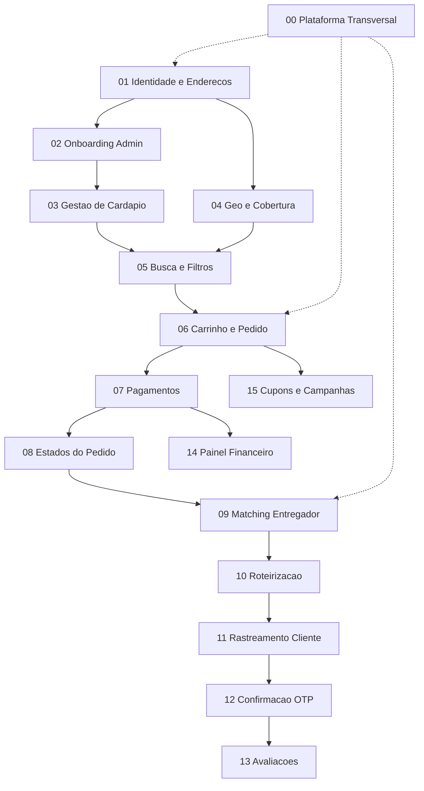

# Ordem das Jornadas — System Design

Este documento define **em que ordem desenhar** cada dominio. A ordem das secoes no [epic](../epic-ifood-clone.md) (1.1 Cliente → 1.4 Admin) nao e a ordem de implementacao.

## Principio

Desenhe na ordem das **dependencias tecnicas**, nao na ordem do documento de produto:

1. Fundacao que todos consomem
2. Supply side (restaurantes e entregadores existem no sistema)
3. Demand side (cliente descobre e compra)
4. Transacao e ciclo do pedido
5. Logistica em tempo real
6. Pos-entrega, finanças e growth

## Diagrama de dependencias

## Fases

### Fase 0 — Fundacao

| # | Documento | Cobre no epico | Entregavel do design |
|---|-----------|----------------|----------------------|
| 00 | [Plataforma transversal](../architecture/00-plataforma-transversal/system-design.md) | RNF §2 | Gateway, Event Bus, observabilidade, padroes de deploy |
| 01 | [Identidade e usuarios](../architecture/01-identidade-usuarios/system-design.md) | Cliente: auth, 2FA, endereco | Auth, User, Address, JWT, LGPD |

**Gate:** usuario autenticado com endereco persistido e geocodificado.

---

### Fase 1 — Existir no ecossistema

| # | Documento | Cobre no epico | Entregavel do design |
|---|-----------|----------------|----------------------|
| 02 | [Onboarding admin](../architecture/02-onboarding-admin/system-design.md) | Admin: moderação | KYC restaurante/entregador, RBAC, aprovacao |
| 03 | [Gestao de cardapio](../architecture/03-gestao-cardapio/system-design.md) | Restaurante: cardapio | Produtos, categorias, adicionais, pausa em tempo real |

**Gate:** restaurante aprovado com cardapio publicado e indexavel.

---

### Fase 2 — Descoberta e conversao

| # | Documento | Cobre no epico | Entregavel do design |
|---|-----------|----------------|----------------------|
| 04 | [Geolocalizacao e cobertura](../architecture/04-geolocalizacao-cobertura/system-design.md) | Cliente: GPS, Places | Zonas de entrega, raio, frete base por regiao |
| 05 | [Busca e filtros](../architecture/05-busca-filtros/system-design.md) | Cliente: busca | Indice de restaurantes/pratos, filtros, SLA < 200ms |
| 06 | [Carrinho e pedido](../architecture/06-carrinho-pedido/system-design.md) | Cliente: carrinho | 1 restaurante/carrinho, adicionais, lock de estoque |

**Gate:** cliente encontra restaurante e cria pedido valido com itens e totais corretos.

---

### Fase 3 — Transacao

| # | Documento | Cobre no epico | Entregavel do design |
|---|-----------|----------------|----------------------|
| 07 | [Pagamentos](../architecture/07-pagamentos/system-design.md) | Cliente: checkout | Pix, cartao tokenizado, vale-refeicao, PCI-DSS |
| 08 | [Estados do pedido](../architecture/08-estados-pedido-restaurante/system-design.md) | Restaurante: pedidos | Maquina de estados, notificacoes, SLA de preparo |

**Gate:** pedido pago e visivel no painel do restaurante com transicoes validas.

---

### Fase 4 — Logistica

| # | Documento | Cobre no epico | Entregavel do design |
|---|-----------|----------------|----------------------|
| 09 | [Matching entregador](../architecture/09-matching-entregador/system-design.md) | Entregador: aceite | Oferta por proximidade, timeout de aceite |
| 10 | [Roteirizacao](../architecture/10-roteirizacao-localizacao/system-design.md) | Entregador: rotas + RNF offline | Maps, ping 3-5s, cache local SQLite/Room |
| 11 | [Rastreamento](../architecture/11-rastreamento-tempo-real/system-design.md) | Cliente: mapa ao vivo | WebSocket/SSE, posicao do entregador |
| 12 | [Confirmacao entrega](../architecture/12-confirmacao-entrega/system-design.md) | Entregador: codigo OTP | Codigo no app cliente, validacao no entregador |

**Gate:** pedido rastreado do restaurante ate o cliente com entrega confirmada.

---

### Fase 5 — Pos-entrega e growth

| # | Documento | Cobre no epico | Entregavel do design |
|---|-----------|----------------|----------------------|
| 13 | [Avaliacoes](../architecture/13-avaliacoes/system-design.md) | Cliente: feedback | Nota 1-5 separada restaurante vs entregador |
| 14 | [Painel financeiro](../architecture/14-painel-financeiro-restaurante/system-design.md) | Restaurante: financeiro | Vendas, taxas plataforma, repasse |
| 15 | [Cupons e campanhas](../architecture/15-cupons-campanhas/system-design.md) | Admin: cupons | Desconto, frete dinamico por regiao |

**Gate:** ciclo completo fechado com reputacao e monetizacao da plataforma.

---

## Checklist por documento

Ao evoluir um esboço para **Completo**, cada `system-design.md` deve ter:

- [ ] Objetivo e escopo MVP/pos-MVP
- [ ] RNFs do dominio (nao so os globais)
- [ ] Diagrama Mermaid de alto nivel
- [ ] Modelo de dados com tabelas e indices
- [ ] Pelo menos 2 fluxos sequenciais documentados
- [ ] Contratos de API resumidos
- [ ] Eventos publicados/consumidos no Event Bus
- [ ] Decisoes arquiteturais e riscos

## Mapeamento epico → documentos

| Secao do epico | Documentos relacionados |
|----------------|-------------------------|
| 1.1 Jornada do Cliente | 01, 04, 05, 06, 07, 11, 13 |
| 1.2 Jornada do Restaurante | 03, 08, 14 |
| 1.3 Jornada do Entregador | 09, 10, 12 |
| 1.4 Painel Administrativo | 02, 15 |
| 2. RNF | 00 (+ validacao em cada dominio) |
