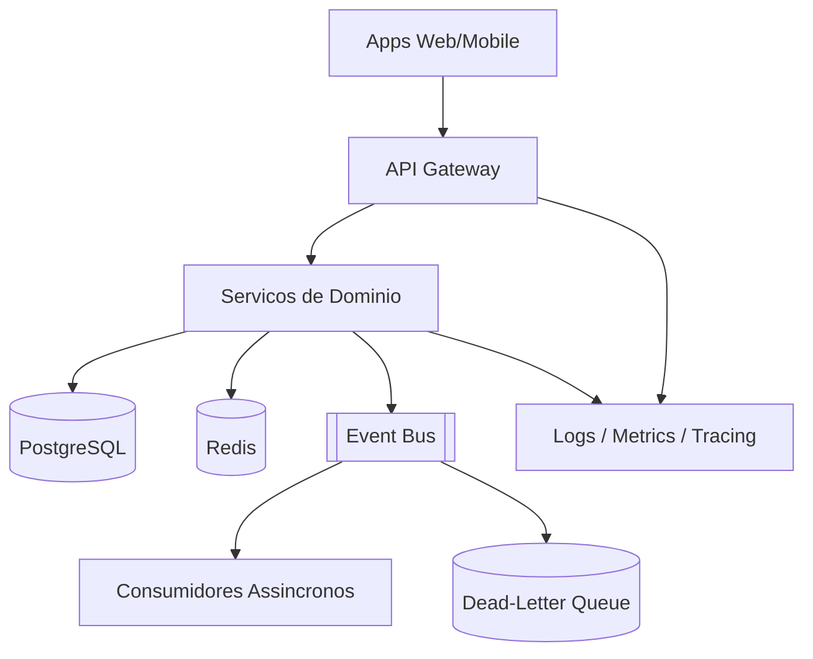

# System Design - Plataforma Transversal

> **Status:** Esboço  
> **Fase:** 0  
> **Jornada:** Transversal  
> **Epico:** [RNF §2](../../epic-ifood-clone.md#2-requisitos-não-funcionais-rnf)  
> **Dependencias:** nenhuma (define padroes para todos os dominios)

## 1. Objetivo

Definir os padroes compartilhados da plataforma: API Gateway, mensageria (EDA), observabilidade, deploy e politicas de seguranca que todos os servicos seguem.

## 2. Escopo Funcional

### 2.1 MVP

- [ ] API Gateway com roteamento por dominio e validacao JWT local
- [ ] Event Bus (RabbitMQ ou Kafka) com schema versionado
- [ ] Dead-letter queue e politica de retry
- [ ] Correlation-id ponta a ponta
- [ ] Health checks e metricas basicas por servico
- [ ] RBAC base: `customer`, `restaurant_owner`, `courier`, `admin`

### 2.2 Pos-MVP

- [ ] Service mesh / mTLS entre servicos
- [ ] Feature flags centralizados
- [ ] Auto-scaling por metrica customizada
- [ ] Multi-region active-passive

## 3. Requisitos Nao Funcionais

- Disponibilidade alvo global: **99.99%** (Four Nines)
- Latencia de gateway: **< 20ms** overhead p95
- Busca/listagem (delegada ao dominio): **< 200ms** p95
- Mensageria: at-least-once com consumidores idempotentes

## 4. Contexto de Negocio

Sem padroes transversais, cada jornada reinventa autenticacao, eventos e monitoramento — aumentando custo de operacao e risco em picos (sexta a noite).

## 5. Arquitetura de Alto Nivel

## 6. Componentes

### 6.1 API Gateway

- [ ] Roteamento `/v1/{dominio}/...`
- [ ] Rate limit por IP, deviceId, userId
- [ ] Validacao JWT por chave publica (sem round-trip ao Auth)

### 6.2 Event Bus

- [ ] Envelope padrao: `eventId`, `eventType`, `schemaVersion`, `correlationId`
- [ ] Topicos por agregado: `user.*`, `order.*`, `delivery.*`

### 6.3 Observabilidade

- [ ] Logs estruturados JSON
- [ ] Tracing OpenTelemetry
- [ ] Alertas: 5xx, fila atrasada, latencia p95

## 7. Modelo de Dados

N/A — dominio de infraestrutura. Documentar apenas configuracoes e contratos de evento globais.

## 8. Fluxos Principais

### 8.1 Publicacao de evento com falha

1. Servico publica evento.
2. Consumidor falha apos N retries.
3. Mensagem vai para DLQ.
4. Job de reprocessamento ou alerta operacional.

## 9. Contratos de API

- Padrao de erro: `{ code, message, correlationId }`
- Versionamento: prefixo `/v1`

## 10. Contratos de Eventos

Ver envelope em [01-identidade-usuarios](../01-identidade-usuarios/system-design.md#11-contrato-de-evento-no-event-bus).

## 11. Seguranca

- [ ] TLS fim a fim
- [ ] Secrets em KMS / vault
- [ ] Politica de menor privilegio por servico

## 12. Escalabilidade

- [ ] Servicos stateless com HPA
- [ ] Particionamento de topicos por volume

## 13. Observabilidade

- [ ] Dashboard unico: RPS, erro, latencia, lag de fila

## 14. Resiliencia

- [ ] Circuit breaker em integracoes externas
- [ ] Timeouts padrao por tipo de chamada

## 15. Decisoes Arquiteturais

| Decisao | Escolha provisoria | Motivo |
|---------|-------------------|--------|
| Mensageria | RabbitMQ (MVP) → Kafka (escala) | Simplicidade inicial |
| Gateway | Kong / AWS API GW / custom | TBD |

## 16. Riscos e Mitigacoes

| Risco | Mitigacao |
|-------|-----------|
| Event storm em pico | Backpressure + rate limit no produtor |
| Falta de padrao entre times | Template obrigatorio + revisao de ADR |
