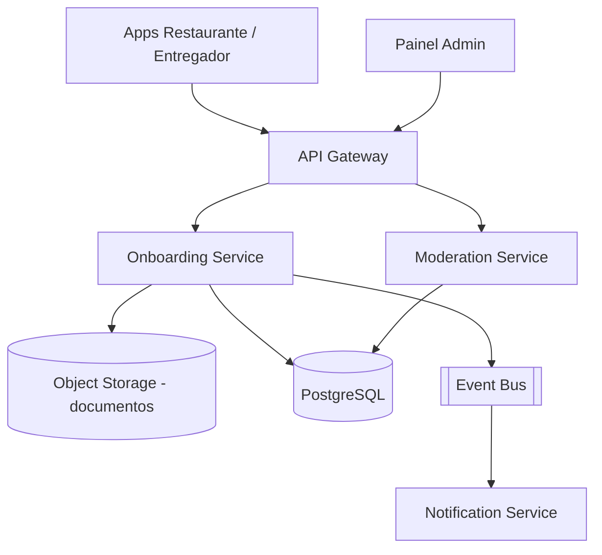

# System Design - Onboarding e Moderacao (Admin)

> **Status:** Esboço  
> **Fase:** 1  
> **Jornada:** Admin  
> **Epico:** [Admin §1.4](../../epic-ifood-clone.md#14-painel-administrativo-interno-da-plataforma)  
> **Dependencias:** [01-identidade-usuarios](../01-identidade-usuarios/system-design.md), [00-plataforma-transversal](../00-plataforma-transversal/system-design.md)

## 1. Objetivo

Projetar o fluxo de entrada de **restaurantes** e **entregadores** na plataforma: envio de documentos, analise manual/automatica, aprovacao e atribuicao de papeis (RBAC).

## 2. Escopo Funcional

### 2.1 MVP

- [ ] Cadastro de solicitacao de restaurante (CNPJ, endereco, responsavel)
- [ ] Upload de documentos (contrato social, alvara, identidade)
- [ ] Fila de moderacao para analistas admin
- [ ] Estados: `pending` → `under_review` → `approved` | `rejected`
- [ ] Cadastro de entregador com CNH e veiculo
- [ ] Vinculo usuario ↔ papel (`restaurant_owner`, `courier`)
- [ ] Notificacao de resultado por email/push

### 2.2 Pos-MVP

- [ ] OCR/validacao automatica de documentos
- [ ] Score de risco e bloqueio preventivo
- [ ] Revalidacao periodica de documentos
- [ ] Onboarding self-service com video e checklist

## 3. Requisitos Nao Funcionais

- SLA de primeira analise: **< 48h** (negocio)
- Upload: arquivos ate **10MB**, armazenamento criptografado
- Auditoria: trilha imutavel de quem aprovou/rejeitou

## 4. Contexto de Negocio

Gate de qualidade do marketplace. Restaurante so publica cardapio apos `approved`. Entregador so recebe corridas apos `approved`.

## 5. Arquitetura de Alto Nivel

## 6. Componentes

### 6.1 Onboarding Service

- CRUD de solicitacoes
- Upload presigned URL
- Publica `onboarding.submitted`, `onboarding.approved`

### 6.2 Moderation Service

- Fila de trabalho para admins
- Comentarios internos e motivo de rejeicao
- Atualiza RBAC no Identity/Auth

## 7. Modelo de Dados (esboço)

### 7.1 `onboarding_applications`

- id, type (`restaurant` | `courier`), user_id, status, submitted_at, reviewed_at, reviewer_id

### 7.2 `application_documents`

- id, application_id, doc_type, storage_key, checksum, uploaded_at

### 7.3 `restaurant_profiles` (pos-aprovacao)

- id, application_id, legal_name, cnpj, address_id, operating_hours_json

### 7.4 `courier_profiles`

- id, application_id, vehicle_type, license_number, license_expiry

## 8. Fluxos Principais

### 8.1 Restaurante solicita entrada

1. Usuario autenticado envia dados + documentos.
2. Onboarding Service persiste e publica `onboarding.submitted`.
3. Moderation Service coloca na fila `under_review`.
4. Admin aprova → cria `restaurant_profile`, atribui role, publica `onboarding.approved`.
5. Notification Service avisa restaurante.

### 8.2 Rejeicao com motivo

1. Admin registra motivo padronizado + nota livre.
2. Status `rejected`, documentos retidos por politica de retencao.
3. Usuario pode reenviar nova solicitacao.

## 9. Contratos de API (esboço)

- `POST /v1/onboarding/restaurants`
- `POST /v1/onboarding/couriers`
- `POST /v1/onboarding/applications/{id}/documents`
- `GET /v1/admin/moderation/queue`
- `POST /v1/admin/moderation/applications/{id}/approve`
- `POST /v1/admin/moderation/applications/{id}/reject`

## 10. Contratos de Eventos

- `onboarding.submitted`
- `onboarding.approved`
- `onboarding.rejected`

## 11. Seguranca

- Documentos em bucket privado com URL temporaria
- Acesso admin com MFA obrigatorio
- LGPD: retencao e exclusao de documentos

## 12. Escalabilidade

- Fila de moderacao paginada com filtros por tipo e SLA

## 13. Observabilidade

- Tempo medio de aprovacao, taxa de rejeicao, backlog da fila

## 14. Resiliencia

- Upload idempotente por `document_type + application_id`
- Reprocessamento de eventos de aprovacao via DLQ

## 15. Decisoes Arquiteturais

- Separar Onboarding (self-service) de Moderation (operacao interna)
- Aprovacao dispara evento; Cardapio Service escuta `onboarding.approved`

## 16. Riscos e Mitigacoes

| Risco | Mitigacao |
|-------|-----------|
| Fraude documental | Checklist manual + validacao CNPJ em API publica |
| Gargalo humano na moderacao | Metricas de backlog + priorizacao por regiao |
