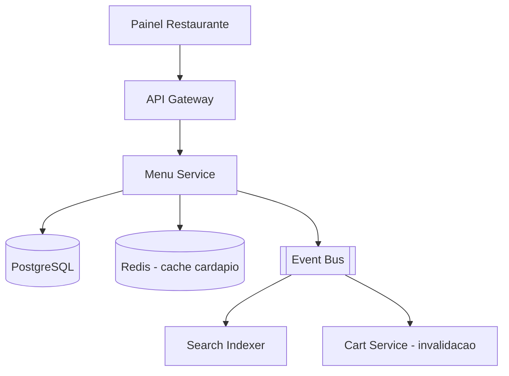

# System Design - Gestao de Cardapio (Restaurante)

> **Status:** Esboço  
> **Fase:** 1  
> **Jornada:** Restaurante  
> **Epico:** [Restaurante §1.2 — Gestao de cardapio](../../epic-ifood-clone.md#12-jornada-do-restaurante-painel-web--gestor-de-pedidos)  
> **Dependencias:** [02-onboarding-admin](../02-onboarding-admin/system-design.md)

## 1. Objetivo

Permitir que restaurantes aprovados criem, editem e pausem produtos, categorias, precos e horarios — com propagacao em tempo real para busca e carrinho.

## 2. Escopo Funcional

### 2.1 MVP

- [ ] CRUD de categorias e produtos
- [ ] Adicionais/opcoes (ex: ponto da carne, borda recheada) com precos
- [ ] Pausa de item ou categoria (indisponivel)
- [ ] Horario de funcionamento por dia da semana
- [ ] Publicacao de cardapio (`published` / `draft`)
- [ ] Evento `menu.updated` para reindexacao

### 2.2 Pos-MVP

- [ ] Cardapio sazonal e combos
- [ ] Importacao em lote (CSV)
- [ ] Preview do cardapio no app cliente
- [ ] Controle de estoque por item

## 3. Requisitos Nao Funcionais

- Propagacao de pausa: **< 5s** ate refletir na busca
- Consistencia: produto pausado nao pode ser adicionado ao carrinho

## 4. Contexto de Negocio

Cardapio e a vitrine do restaurante. Erros de preco ou item fantasma geram churn e chargeback.

## 5. Arquitetura de Alto Nivel

## 6. Componentes

- **Menu Service** — fonte da verdade do cardapio
- **Search Indexer** — consumidor de `menu.updated`
- **Cache** — cardapio ativo por `restaurant_id`

## 7. Modelo de Dados (esboço)

- `menu_categories` — restaurant_id, name, sort_order, is_active
- `menu_items` — category_id, name, description, price_cents, image_url, is_available
- `menu_modifiers` — item_id, name, min/max selections
- `menu_modifier_options` — modifier_id, name, price_delta_cents
- `restaurant_schedules` — day_of_week, open_time, close_time

## 8. Fluxos Principais

### 8.1 Pausar produto em tempo real

1. Restaurante marca item `is_available = false`.
2. Menu Service persiste e invalida cache.
3. Publica `menu.item.unavailable`.
4. Search e Cart atualizam visibilidade.

## 9. Contratos de API (esboço)

- `GET /v1/restaurants/{id}/menu`
- `POST /v1/restaurants/me/menu/categories`
- `POST /v1/restaurants/me/menu/items`
- `PATCH /v1/restaurants/me/menu/items/{itemId}`
- `POST /v1/restaurants/me/menu/items/{itemId}/pause`

## 10. Contratos de Eventos

- `menu.published`
- `menu.updated`
- `menu.item.unavailable`

## 11–16. Secoes pendentes

Seguranca (somente `restaurant_owner` do proprio restaurante), escalabilidade (cache + CDN de imagens), observabilidade, resiliencia, ADRs e riscos — detalhar na evolucao do esboço.
