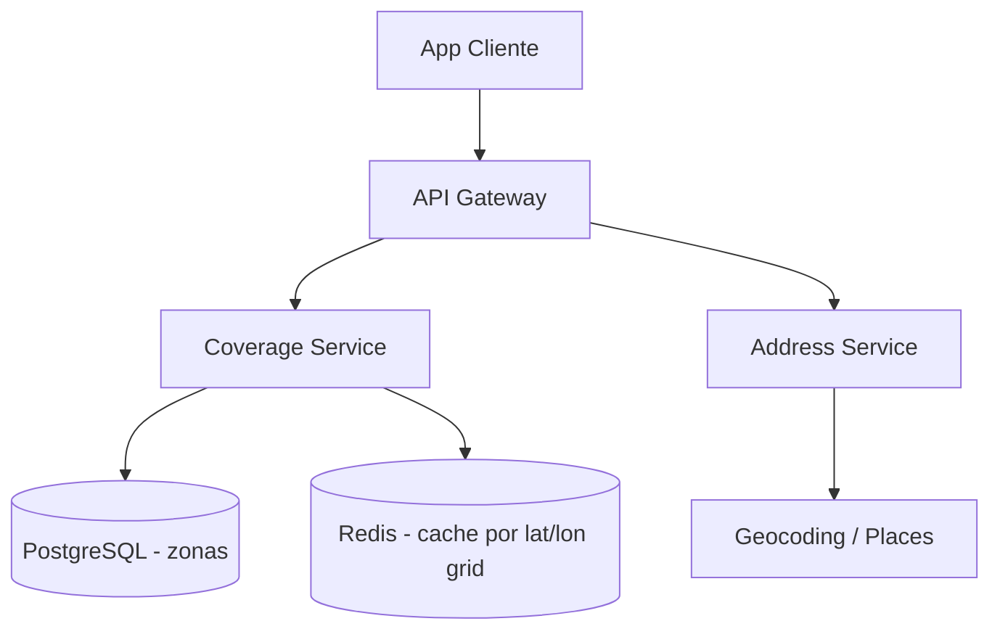

# System Design - Geolocalizacao e Cobertura de Entrega

> **Status:** Esboço  
> **Fase:** 2  
> **Jornada:** Cliente  
> **Epico:** [Cliente §1.1 — Geolocalizacao](../../epic-ifood-clone.md#11-jornada-do-cliente-app-mobile--web)  
> **Dependencias:** [01-identidade-usuarios](../01-identidade-usuarios/system-design.md), [02-onboarding-admin](../02-onboarding-admin/system-design.md)

## 1. Objetivo

Determinar onde o cliente pode pedir: GPS automatico, busca preditiva (Google Places), zonas de cobertura e calculo de distancia para frete.

## 2. Escopo Funcional

### 2.1 MVP

- [ ] Leitura de GPS com fallback manual
- [ ] Autocomplete de endereco (Places API)
- [ ] Geocodificacao e persistencia (reuso Address Service)
- [ ] Verificacao: restaurante atende o endereco? (raio ou poligono)
- [ ] Lista de restaurantes disponiveis por coordenada

### 2.2 Pos-MVP

- [ ] Multiplos enderecos com deteccao de mudanca de local
- [ ] Cobertura dinamica por demanda (surge zones)
- [ ] Cache de reverse geocoding

## 3. Requisitos Nao Funcionais

- Resposta de cobertura: **< 200ms** p95
- Atualizacao de localizacao entregador: **3-5s** (dominio 10)

## 4. Arquitetura de Alto Nivel

## 5. Modelo de Dados (esboço)

- `delivery_zones` — restaurant_id ou platform_region, geometry (polygon), max_radius_km
- `coverage_cache` — geohash, restaurant_ids[]

## 6. Fluxos Principais

### 6.1 Cliente abre app com GPS

1. App envia lat/lon.
2. Coverage Service resolve zona e retorna restaurantes elegiveis.
3. Se fora de cobertura, sugere endereco manual.

## 7. Contratos de API (esboço)

- `GET /v1/coverage/restaurants?lat=&lon=`
- `GET /v1/places/autocomplete?q=`
- `POST /v1/users/me/addresses` (delegado ao Address Service)

## 8. Eventos

- `coverage.checked` (analytics)

## 9–16. Secoes pendentes

Detalhar RNFs, seguranca de localizacao (LGPD), observabilidade e riscos de dependencia do Google.
