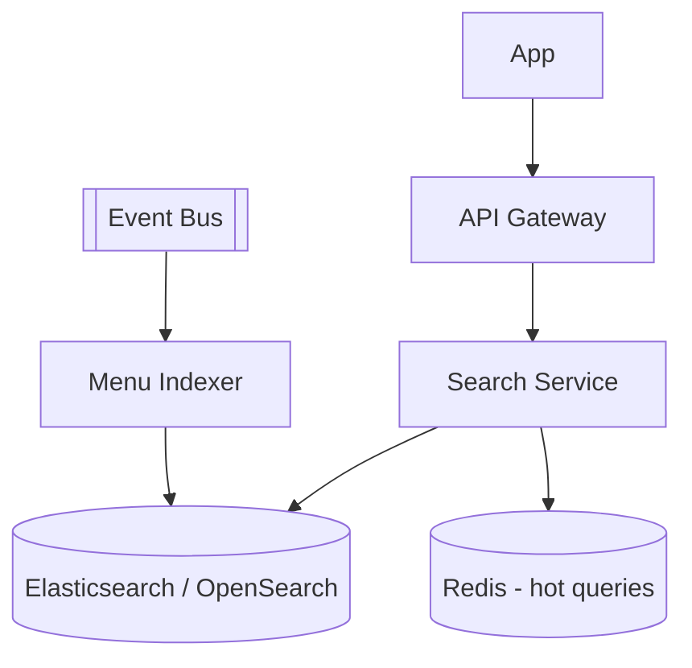

# System Design - Busca e Filtros

> **Status:** Esboço  
> **Fase:** 2  
> **Jornada:** Cliente  
> **Epico:** [Cliente §1.1 — Busca e filtros](../../epic-ifood-clone.md#11-jornada-do-cliente-app-mobile--web)  
> **Dependencias:** [03-gestao-cardapio](../03-gestao-cardapio/system-design.md), [04-geolocalizacao-cobertura](../04-geolocalizacao-cobertura/system-design.md)

## 1. Objetivo

Busca por nome de prato, restaurante e categoria com filtros (taxa de entrega, tempo estimado, frete gratis) em **< 200ms** p95.

## 2. Escopo Funcional

### 2.1 MVP

- [ ] Busca full-text: restaurante, item, categoria
- [ ] Filtros: categoria culinaria, frete gratis, tempo estimado, nota media
- [ ] Ordenacao: relevancia, distancia, avaliacao, tempo
- [ ] Paginacao cursor-based
- [ ] Indexacao assincrona via `menu.updated`

### 2.2 Pos-MVP

- [ ] Busca fonetica e sinonimos
- [ ] Personalizacao por historico
- [ ] Autocomplete instantaneo

## 3. Requisitos Nao Funcionais

- Latencia p95: **< 200ms** (requisito global do epico)
- Indexacao apos mudanca de cardapio: **< 30s**

## 4. Arquitetura de Alto Nivel

## 5. Modelo de Dados (indice)

Documento `restaurant_search_doc`:
- restaurant_id, name, categories[], items[], avg_rating, delivery_fee, eta_minutes, location, is_open

## 6. Fluxos Principais

### 6.1 Busca "pizza" com filtro frete gratis

1. Cliente envia query + lat/lon + filtros.
2. Search aplica cobertura geografica primeiro.
3. Query no indice com filtros e ranking.
4. Retorna pagina com metadados de facetas.

## 7. Contratos de API (esboço)

- `GET /v1/search/restaurants?q=&lat=&lon=&filters=`
- `GET /v1/search/suggestions?q=`

## 8. Eventos consumidos

- `menu.updated`, `menu.item.unavailable`, `restaurant.rating.updated`

## 9–16. Secoes pendentes

Estrategia de ranking, degradacao se ES indisponivel, observabilidade de latencia por query.
