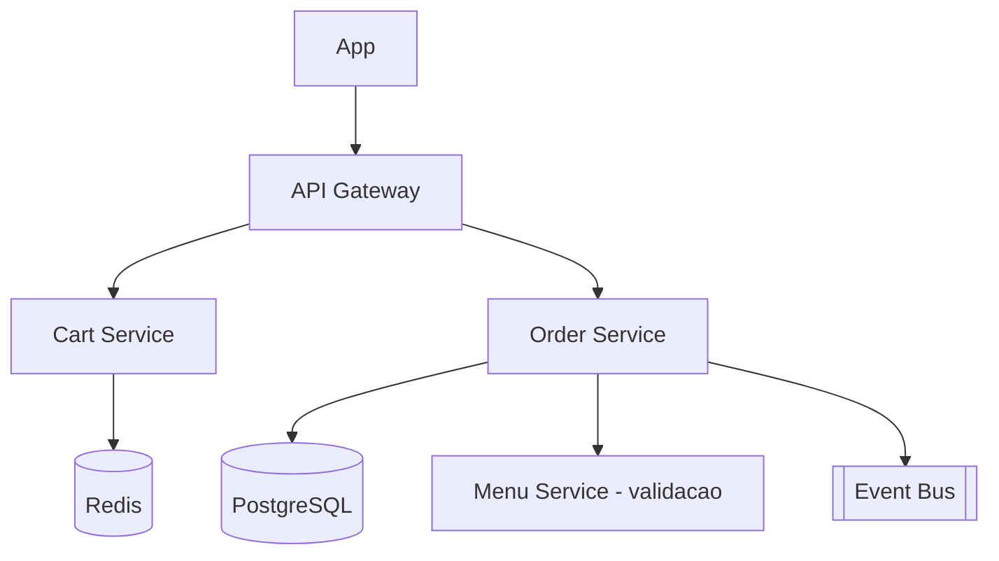

# System Design - Carrinho e Criacao de Pedido

> **Status:** Esboço  
> **Fase:** 2  
> **Jornada:** Cliente  
> **Epico:** [Cliente §1.1 — Carrinho dinamico](../../epic-ifood-clone.md#11-jornada-do-cliente-app-mobile--web)  
> **Dependencias:** [03-gestao-cardapio](../03-gestao-cardapio/system-design.md), [04-geolocalizacao-cobertura](../04-geolocalizacao-cobertura/system-design.md)

## 1. Objetivo

Carrinho com **um restaurante por vez**, personalizacao de adicionais, calculo de subtotal/frete e criacao atomica do pedido com lock de estoque.

## 2. Escopo Funcional

### 2.1 MVP

- [ ] Carrinho por usuario (Redis ou DB)
- [ ] Regra: trocar restaurante limpa carrinho (ou bloqueia)
- [ ] Validacao de adicionais (min/max, obrigatorios)
- [ ] Snapshot de precos no momento do pedido
- [ ] Lock de estoque atomico (RNF consistencia)
- [ ] Criacao de pedido `draft` → `pending_payment`

### 2.2 Pos-MVP

- [ ] Carrinho abandonado e remarketing
- [ ] Split de pedido (nao previsto no epico — avaliar)

## 3. Requisitos Nao Funcionais

- Isolamento transacional no ultimo item em estoque
- Idempotencia em `POST /orders` com `Idempotency-Key`

## 4. Arquitetura de Alto Nivel

## 5. Modelo de Dados (esboço)

- `carts` — user_id, restaurant_id, expires_at
- `cart_items` — item_id, quantity, modifiers_json, unit_price_cents
- `orders` — user_id, restaurant_id, status, subtotal, delivery_fee, total
- `order_items` — snapshot de nome, preco, modifiers
- `inventory_reservations` — item_id, order_id, qty, expires_at

## 6. Fluxos Principais

### 6.1 Checkout com lock de estoque

1. Order Service valida cardapio e precos atuais.
2. Inicia transacao: reserva estoque + cria pedido.
3. Se falha estoque, rollback e retorna 409.
4. Publica `order.created`.

## 7. Contratos de API (esboço)

- `GET /v1/cart`
- `POST /v1/cart/items`
- `DELETE /v1/cart/items/{id}`
- `POST /v1/orders` (com Idempotency-Key)

## 8. Eventos

- `order.created`
- `order.stock.reservation.failed`

## 9–16. Secoes pendentes

TTL do carrinho, compensacao se pagamento falhar, observabilidade de conversao carrinho→pedido.
