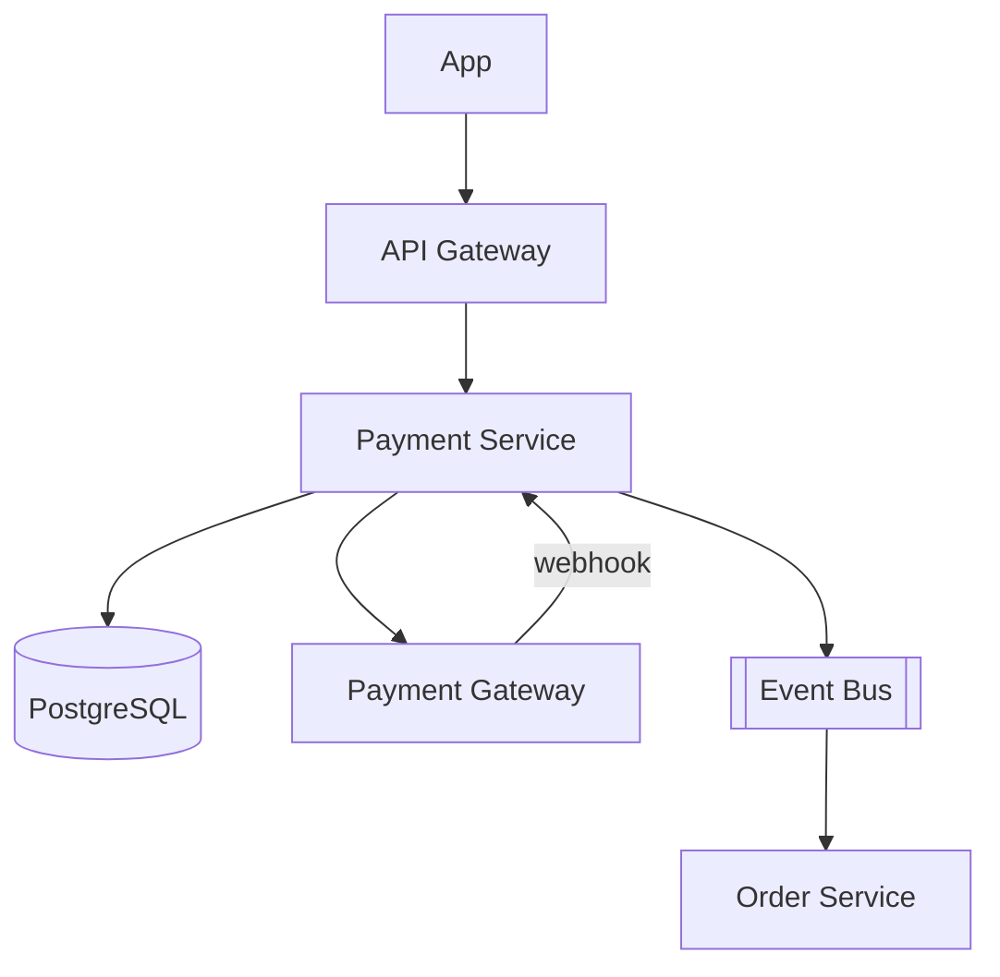

# System Design - Pagamentos e Checkout

> **Status:** Esboço  
> **Fase:** 3  
> **Jornada:** Cliente  
> **Epico:** [Cliente §1.1 — Checkout e pagamento](../../epic-ifood-clone.md#11-jornada-do-cliente-app-mobile--web)  
> **Dependencias:** [06-carrinho-pedido](../06-carrinho-pedido/system-design.md), [00-plataforma-transversal](../00-plataforma-transversal/system-design.md)

## 1. Objetivo

Integrar Pix, cartao tokenizado e vale-refeicao com conformidade PCI-DSS; confirmar pagamento e liberar pedido para o restaurante.

## 2. Escopo Funcional

### 2.1 MVP

- [ ] Pix com QR dinamico e webhook de confirmacao
- [ ] Cartao com tokenizacao no gateway (sem PAN no backend)
- [ ] Vale-refeicao via parceiro autorizado
- [ ] Estados: `pending_payment` → `paid` | `failed` | `expired`
- [ ] Reembolso parcial/total (admin)

### 2.2 Pos-MVP

- [ ] Carteira interna / cashback
- [ ] Split de pagamento marketplace
- [ ] Antifraude com score

## 3. Requisitos Nao Funcionais

- PCI-DSS: nunca persistir PAN/CVV
- Webhook de gateway: processamento idempotente
- Timeout Pix: expirar pedido e liberar estoque

## 4. Arquitetura de Alto Nivel

## 5. Modelo de Dados (esboço)

- `payments` — order_id, method, amount_cents, status, gateway_ref
- `payment_tokens` — user_id, gateway, token_ref, brand, last4
- `payment_webhooks` — idempotency_key, payload_hash, processed_at

## 6. Fluxos Principais

### 6.1 Pix

1. Cliente confirma checkout.
2. Payment Service cria cobranca no gateway.
3. Retorna QR + `expires_at`.
4. Webhook confirma → `payment.paid` → Order vai para `pending` (restaurante).

## 7. Contratos de API (esboço)

- `POST /v1/orders/{id}/payments`
- `GET /v1/orders/{id}/payments/status`
- `POST /v1/webhooks/payments/{provider}`

## 8. Eventos

- `payment.initiated`, `payment.paid`, `payment.failed`, `payment.refunded`

## 9–16. Secoes pendentes

Matriz de reconciliacao, chargeback, LGPD em dados de pagamento, circuit breaker no gateway.
