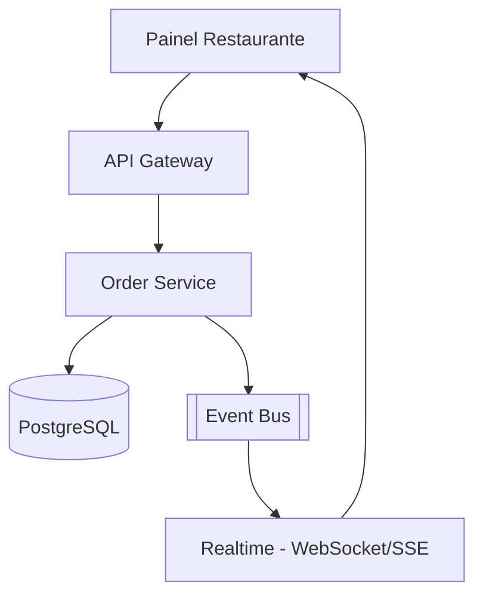

# System Design - Gerenciamento de Pedidos (Restaurante)

> **Status:** Esboço  
> **Fase:** 3  
> **Jornada:** Restaurante  
> **Epico:** [Restaurante §1.2 — Gerenciamento de pedidos](../../epic-ifood-clone.md#12-jornada-do-restaurante-painel-web--gestor-de-pedidos)  
> **Dependencias:** [07-pagamentos](../07-pagamentos/system-design.md)

## 1. Objetivo

Maquina de estados do pedido no painel do restaurante: **Pendente → Em Preparo → Pronto para Coleta → Despachado**, com notificacoes em tempo real.

## 2. Escopo Funcional

### 2.1 MVP

- [ ] Lista de pedidos ativos por restaurante
- [ ] Transicoes validadas por role `restaurant_owner`
- [ ] Timer de SLA por estado
- [ ] Push/som no painel ao novo pedido
- [ ] Cancelamento com politica (antes do preparo)

### 2.2 Pos-MVP

- [ ] Impressao automatica (integracao POS)
- [ ] Preparo em paralelo por estacao (cozinha/bar)

## 3. Requisitos Nao Funcionais

- Notificacao de novo pedido: **< 3s** apos `payment.paid`
- Consistencia: transicoes invalidas retornam 409

## 4. Arquitetura de Alto Nivel

## 5. Maquina de estados

| De | Para | Ator |
|----|------|------|
| pending | preparing | restaurante |
| preparing | ready_for_pickup | restaurante |
| ready_for_pickup | dispatched | sistema (apos matching) |
| * | cancelled | restaurante/admin (regras) |

## 6. Fluxos Principais

### 6.1 Novo pedido pago

1. Order Service recebe `payment.paid`.
2. Status → `pending`, notifica painel via WebSocket.
3. Restaurante aceita preparo → `preparing`.

## 7. Contratos de API (esboço)

- `GET /v1/restaurants/me/orders?status=active`
- `POST /v1/orders/{id}/transitions` body: `{ "to": "preparing" }`

## 8. Eventos

- `order.status.changed`
- `order.ready_for_pickup` (dispara matching)

## 9–16. Secoes pendentes

Auditoria de transicoes, timeout automatico, observabilidade de tempo medio de preparo.
