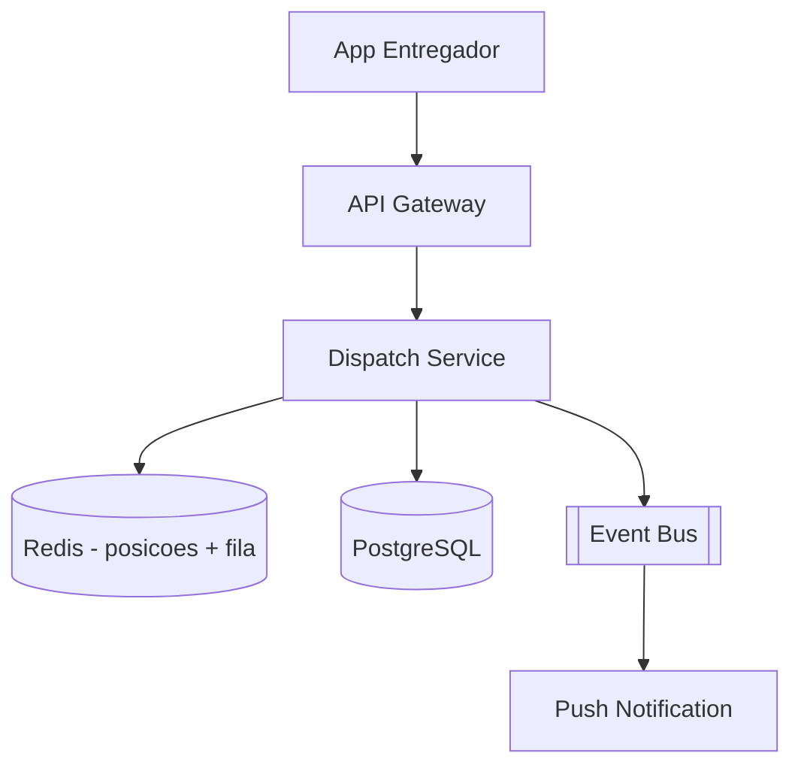

# System Design - Matching e Aceite de Corridas

> **Status:** Esboço  
> **Fase:** 4  
> **Jornada:** Entregador  
> **Epico:** [Entregador §1.3 — Aceite de corridas](../../epic-ifood-clone.md#13-jornada-do-entregador-app-mobile)  
> **Dependencias:** [08-estados-pedido-restaurante](../08-estados-pedido-restaurante/system-design.md), [04-geolocalizacao-cobertura](../04-geolocalizacao-cobertura/system-design.md)

## 1. Objetivo

Ofertar pedidos `ready_for_pickup` a entregadores proximos com janela de aceite/rejeicao em segundos.

## 2. Escopo Funcional

### 2.1 MVP

- [ ] Entregador online/offline
- [ ] Matching por proximidade (haversine ou geohash)
- [ ] Oferta com timeout (ex: 30s)
- [ ] Aceitar → vincula `courier_id` ao pedido
- [ ] Rejeitar → oferta proximo candidato
- [ ] Escalonamento se ninguem aceita

### 2.2 Pos-MVP

- [ ] Batch de entregas na mesma regiao
- [ ] Prioridade por rating do entregador
- [ ] Surge pricing para entregadores

## 3. Requisitos Nao Funcionais

- Tempo ate primeira oferta: **< 10s** apos `ready_for_pickup`
- Localizacao do entregador atualizada a cada **3-5s**

## 4. Arquitetura de Alto Nivel

## 5. Modelo de Dados (esboço)

- `courier_sessions` — courier_id, is_online, last_lat, last_lon, updated_at
- `delivery_offers` — order_id, courier_id, status, expires_at

## 6. Fluxos Principais

### 6.1 Oferta por proximidade

1. Evento `order.ready_for_pickup`.
2. Dispatch busca entregadores online num raio.
3. Cria oferta e envia push.
4. Aceite atomico — primeiro que confirmar ganha.

## 7. Contratos de API (esboço)

- `POST /v1/couriers/me/status` `{ "online": true }`
- `POST /v1/couriers/me/location` `{ "lat", "lon" }`
- `POST /v1/delivery-offers/{id}/accept`
- `POST /v1/delivery-offers/{id}/reject`

## 8. Eventos

- `delivery.offer.created`, `delivery.offer.accepted`, `delivery.offer.expired`

## 9–16. Secoes pendentes

Concorrencia no aceite (compare-and-swap), fallback operacional, metricas de taxa de aceite.
