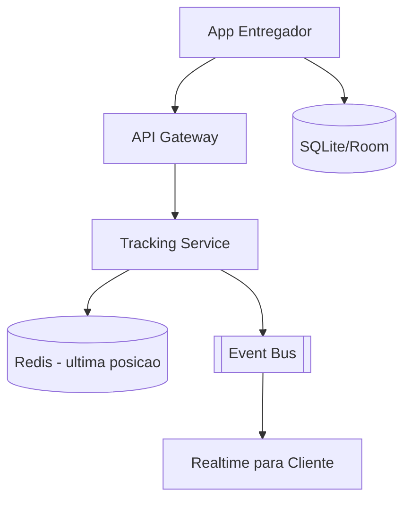

# System Design - Roteirizacao e Localizacao do Entregador

> **Status:** Esboço  
> **Fase:** 4  
> **Jornada:** Entregador  
> **Epico:** [Entregador §1.3 — Roteirizacao](../../epic-ifood-clone.md#13-jornada-do-entregador-app-mobile) + [RNF offline-first](../../epic-ifood-clone.md#2-requisitos-não-funcionais-rnf)  
> **Dependencias:** [09-matching-entregador](../09-matching-entregador/system-design.md)

## 1. Objetivo

Traçar rota restaurante → cliente via Maps/Waze, transmitir posicao a cada 3-5s e manter dados essenciais offline (SQLite/Room).

## 2. Escopo Funcional

### 2.1 MVP

- [ ] Deep link para Google Maps / Waze
- [ ] Ingestao de pings de localizacao
- [ ] Estados da corrida: `heading_to_restaurant` → `at_restaurant` → `heading_to_customer` → `arrived`
- [ ] Cache local: enderecos, rota, codigo de entrega
- [ ] Sync ao reconectar

### 2.2 Pos-MVP

- [ ] ETA dinamico com traffic API
- [ ] Geofence automatico de chegada

## 3. Requisitos Nao Funcionais

- Ping interval: **3-5s** quando em corrida ativa
- Offline: app funcional para ver rota e confirmar entrega sem rede (fila de sync)

## 4. Arquitetura de Alto Nivel

## 5. Fluxos Principais

### 5.1 Perda de sinal

1. App continua gravando pings em fila local.
2. Ao reconectar, envia batch com timestamps.
3. Tracking Service reconcilia e publica posicoes atrasadas.

## 6. Contratos de API (esboço)

- `POST /v1/deliveries/{id}/location` (batch suportado)
- `POST /v1/deliveries/{id}/milestones` (`picked_up`, `arrived`)

## 7. Eventos

- `delivery.location.updated`
- `delivery.milestone.reached`

## 8–16. Secoes pendentes

Privacidade de trajeto, retencao de historico GPS, bateria do dispositivo, ADRs.
