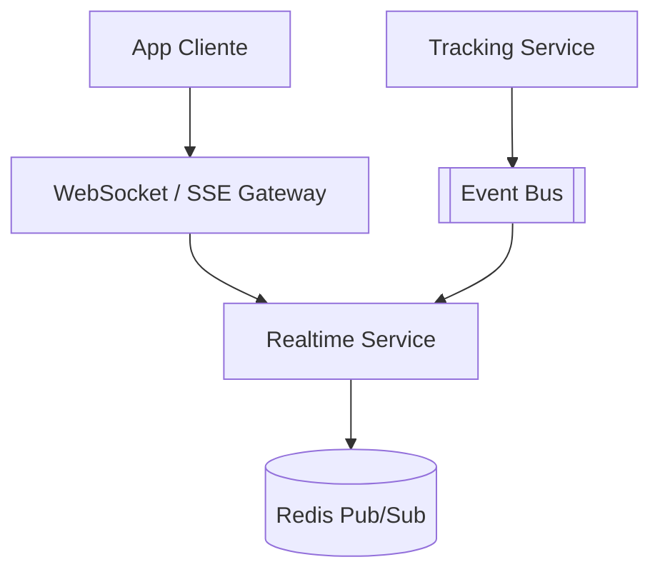

# System Design - Rastreamento em Tempo Real (Cliente)

> **Status:** Esboço  
> **Fase:** 4  
> **Jornada:** Cliente  
> **Epico:** [Cliente §1.1 — Rastreamento](../../epic-ifood-clone.md#11-jornada-do-cliente-app-mobile--web)  
> **Dependencias:** [10-roteirizacao-localizacao](../10-roteirizacao-localizacao/system-design.md)

## 1. Objetivo

Mapa interativo no app do cliente mostrando deslocamento do entregador da coleta ate a entrega via WebSocket ou SSE.

## 2. Escopo Funcional

### 2.1 MVP

- [ ] Tela de pedido em andamento com mapa
- [ ] Marcadores: restaurante, cliente, entregador
- [ ] Atualizacao de posicao em tempo quase real
- [ ] ETA estimado
- [ ] Fallback polling se WebSocket cair

### 2.2 Pos-MVP

- [ ] Animacao suave de interpolacao
- [ ] Compartilhar link de rastreamento

## 3. Requisitos Nao Funcionais

- Latencia visual: posicao com atraso max **< 5s** vs ping real
- Conexoes simultaneas: escalar Realtime layer horizontalmente

## 4. Arquitetura de Alto Nivel

## 5. Fluxos Principais

### 5.1 Cliente abre tela de rastreamento

1. App abre canal autenticado `order/{orderId}`.
2. Realtime Service envia ultima posicao + snapshot.
3. Cada `delivery.location.updated` empurra update ao cliente.

## 6. Contratos de API (esboço)

- `GET /v1/orders/{id}/tracking` (snapshot REST)
- `WS /v1/orders/{id}/tracking/stream`

## 7. Eventos consumidos

- `delivery.location.updated`, `order.status.changed`

## 8–16. Secoes pendentes

Autorizacao (so o dono do pedido), custo de conexoes abertas, degradacao graceful.
