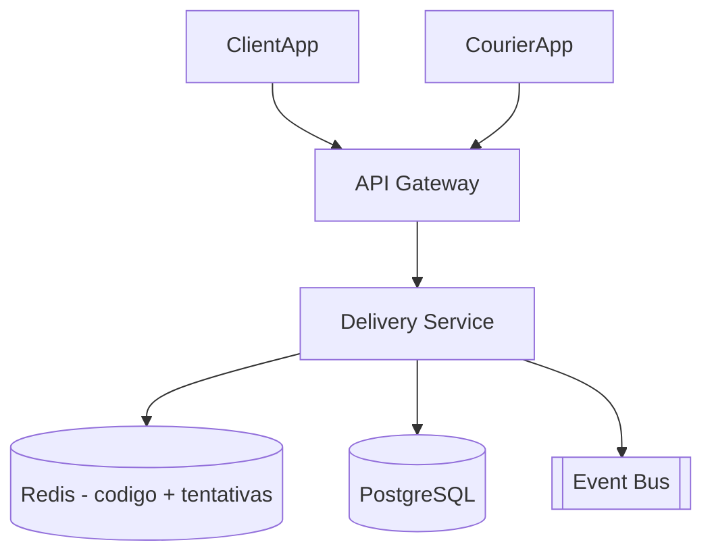

# System Design - Confirmacao Segura de Entrega

> **Status:** Esboço  
> **Fase:** 4  
> **Jornada:** Entregador  
> **Epico:** [Entregador §1.3 — Confirmacao segura](../../epic-ifood-clone.md#13-jornada-do-entregador-app-mobile)  
> **Dependencias:** [10-roteirizacao-localizacao](../10-roteirizacao-localizacao/system-design.md), [11-rastreamento-tempo-real](../11-rastreamento-tempo-real/system-design.md)

## 1. Objetivo

Validar entrega com codigo numerico exibido no app do cliente e digitado pelo entregador — evita fraude de "entregue sem entregar".

## 2. Escopo Funcional

### 2.1 MVP

- [ ] Gerar codigo 4-6 digitos ao entrar em `heading_to_customer`
- [ ] Exibir codigo no app cliente
- [ ] Entregador informa codigo no app
- [ ] Validacao com limite de tentativas
- [ ] Pedido → `delivered` apos sucesso

### 2.2 Pos-MVP

- [ ] QR code como alternativa
- [ ] Foto de comprovante opcional
- [ ] Entrega sem contato (deixar na porta) com politica

## 3. Requisitos Nao Funcionais

- Codigo TTL: valido ate **30 min** apos geracao
- Rate limit: **5 tentativas** incorretas → bloqueio temporario

## 4. Arquitetura de Alto Nivel

## 5. Fluxos Principais

### 5.1 Confirmacao bem-sucedida

1. Cliente ve codigo `482913`.
2. Entregador submete codigo.
3. Delivery Service valida hash no Redis.
4. Marca `delivered`, publica `delivery.completed`.

## 6. Contratos de API (esboço)

- `GET /v1/orders/{id}/delivery-code` (cliente)
- `POST /v1/deliveries/{id}/confirm` body: `{ "code": "482913" }`

## 7. Eventos

- `delivery.code.generated`, `delivery.completed`, `delivery.confirmation.failed`

## 8–16. Secoes pendentes

Disputas, suporte manual, sincronizacao offline do entregador na confirmacao.
