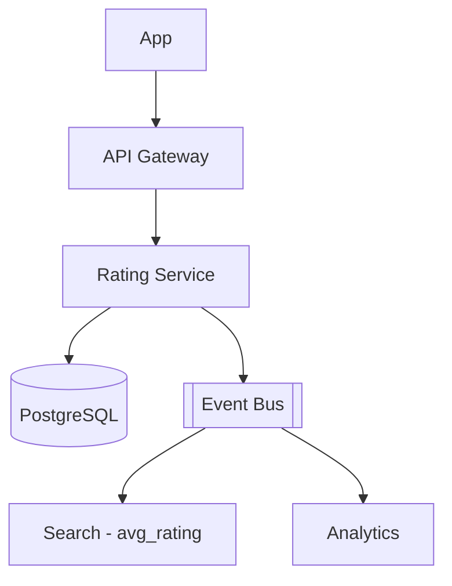

# System Design - Avaliacoes e Feedback

> **Status:** Esboço  
> **Fase:** 5  
> **Jornada:** Cliente  
> **Epico:** [Cliente §1.1 — Avaliacao e feedback](../../epic-ifood-clone.md#11-jornada-do-cliente-app-mobile--web)  
> **Dependencias:** [12-confirmacao-entrega](../12-confirmacao-entrega/system-design.md)

## 1. Objetivo

Coletar nota (1-5) e comentarios **separados** para restaurante e entregador apos entrega concluida.

## 2. Escopo Funcional

### 2.1 MVP

- [ ] Prompt pos-entrega (push/in-app)
- [ ] Duas avaliacoes independentes por pedido
- [ ] Comentario opcional com moderacao basica
- [ ] Atualizacao de media agregada (restaurante e entregador)
- [ ] Janela de 7 dias para avaliar

### 2.2 Pos-MVP

- [ ] Tags rapidas ("entrega rapida", "comida fria")
- [ ] Resposta do restaurante
- [ ] Deteccao de review fake

## 3. Requisitos Nao Funcionais

- Uma avaliacao por ator por pedido (idempotente)
- Agregacao de media: eventual, **< 1 min**

## 4. Arquitetura de Alto Nivel

## 5. Modelo de Dados (esboço)

- `order_ratings` — order_id, user_id, target_type (`restaurant`|`courier`), target_id, score, comment, created_at
- `rating_aggregates` — target_type, target_id, avg_score, count

## 6. Contratos de API (esboço)

- `POST /v1/orders/{id}/ratings` body: `{ "restaurant": { "score": 5 }, "courier": { "score": 4 } }`

## 7. Eventos

- `rating.submitted`, `restaurant.rating.updated`, `courier.rating.updated`

## 8–16. Secoes pendentes

LGPD em comentarios, politica de conteudo ofensivo, impacto no ranking de busca.
