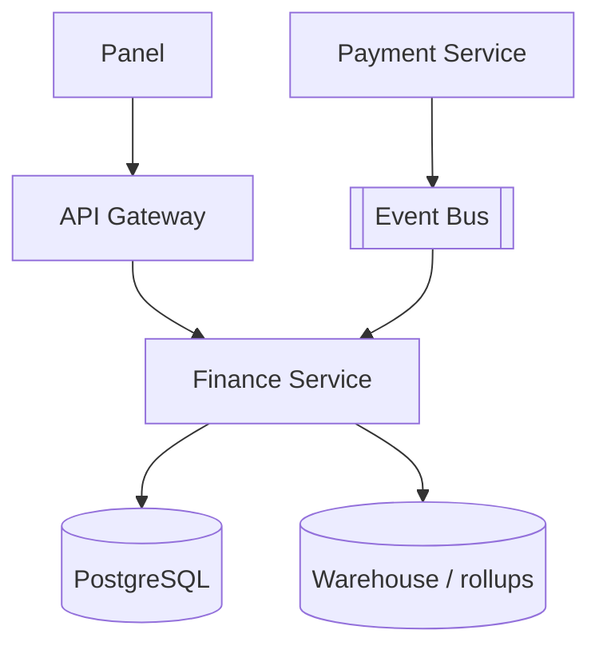

# System Design - Painel Financeiro do Restaurante

> **Status:** Esboço  
> **Fase:** 5  
> **Jornada:** Restaurante  
> **Epico:** [Restaurante §1.2 — Painel financeiro](../../epic-ifood-clone.md#12-jornada-do-restaurante-painel-web--gestor-de-pedidos)  
> **Dependencias:** [07-pagamentos](../07-pagamentos/system-design.md), [08-estados-pedido-restaurante](../08-estados-pedido-restaurante/system-design.md)

## 1. Objetivo

Relatorios de vendas diarias, semanais e mensais com detalhamento de taxas da plataforma e valores a receber (repasse).

## 2. Escopo Funcional

### 2.1 MVP

- [ ] Dashboard: vendas brutas, taxas, liquido a receber
- [ ] Filtro por periodo (dia/semana/mes)
- [ ] Extrato por pedido
- [ ] Ciclo de repasse (D+7 ou configuravel)
- [ ] Export CSV

### 2.2 Pos-MVP

- [ ] Antecipacao de recebiveis
- [ ] Nota fiscal integrada
- [ ] Multi-loja (franquias)

## 3. Requisitos Nao Funcionais

- Relatorios historicos: consulta **< 500ms** p95 com pre-agregacao
- Numeros financeiros: precisao decimal, nunca float

## 4. Arquitetura de Alto Nivel

## 5. Modelo de Dados (esboço)

- `ledger_entries` — restaurant_id, order_id, type (`sale`|`platform_fee`|`payout`), amount_cents
- `daily_restaurant_rollups` — restaurant_id, date, gross, fees, net
- `payouts` — restaurant_id, period, status, transferred_at

## 6. Fluxos Principais

### 6.1 Pedido entregue gera lancamento

1. Consumidor de `delivery.completed`.
2. Finance registra venda bruta e taxa da plataforma.
3. Atualiza rollup diario assincronamente.

## 7. Contratos de API (esboço)

- `GET /v1/restaurants/me/finance/summary?period=week`
- `GET /v1/restaurants/me/finance/orders?from=&to=`
- `GET /v1/restaurants/me/finance/payouts`

## 8. Eventos consumidos

- `payment.paid`, `delivery.completed`, `payment.refunded`

## 9–16. Secoes pendentes

Reconciliacao com gateway, disputas, compliance fiscal.
