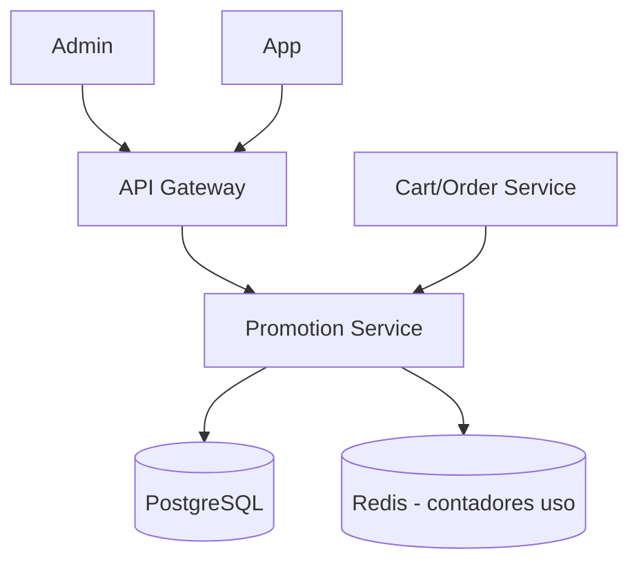

# System Design - Cupons e Campanhas (Admin)

> **Status:** Esboço  
> **Fase:** 5  
> **Jornada:** Admin  
> **Epico:** [Admin §1.4 — Gestao de cupons](../../epic-ifood-clone.md#14-painel-administrativo-interno-da-plataforma)  
> **Dependencias:** [06-carrinho-pedido](../06-carrinho-pedido/system-design.md), [04-geolocalizacao-cobertura](../04-geolocalizacao-cobertura/system-design.md)

## 1. Objetivo

Criar campanhas de marketing, cupons de desconto e taxas de entrega dinamicas por regiao.

## 2. Escopo Funcional

### 2.1 MVP

- [ ] CRUD de cupons (`percent`, `fixed`, frete gratis)
- [ ] Regras: validade, uso maximo, minimo de pedido, restaurante/regiao
- [ ] Aplicacao no checkout com validacao atomica
- [ ] Frete dinamico por poligono/regiao
- [ ] Relatorio de uso de campanha

### 2.2 Pos-MVP

- [ ] Segmentacao por cohort de usuarios
- [ ] A/B test de campanhas
- [ ] Cashback e fidelidade

## 3. Requisitos Nao Funcionais

- Validacao de cupom no checkout: **< 50ms**
- Prevencao de uso duplo: lock ou contador atomico

## 4. Arquitetura de Alto Nivel

## 5. Modelo de Dados (esboço)

- `coupons` — code, type, value, rules_json, starts_at, ends_at, max_redemptions
- `coupon_redemptions` — coupon_id, user_id, order_id, discount_cents
- `delivery_fee_rules` — region_geometry, fee_cents, valid_from, valid_to

## 6. Fluxos Principais

### 6.1 Aplicar cupom no checkout

1. Cliente envia codigo.
2. Promotion valida regras + saldo de uso.
3. Retorna desconto calculado; Order persiste snapshot no pedido.

## 7. Contratos de API (esboço)

- `POST /v1/admin/coupons`
- `POST /v1/cart/apply-coupon` body: `{ "code": "PIZZA10" }`
- `GET /v1/admin/campaigns/{id}/stats`

## 8. Eventos

- `coupon.redeemed`, `campaign.created`

## 9–16. Secoes pendentes

Fraude de cupom, subsidio plataforma vs restaurante, observabilidade de ROI.
